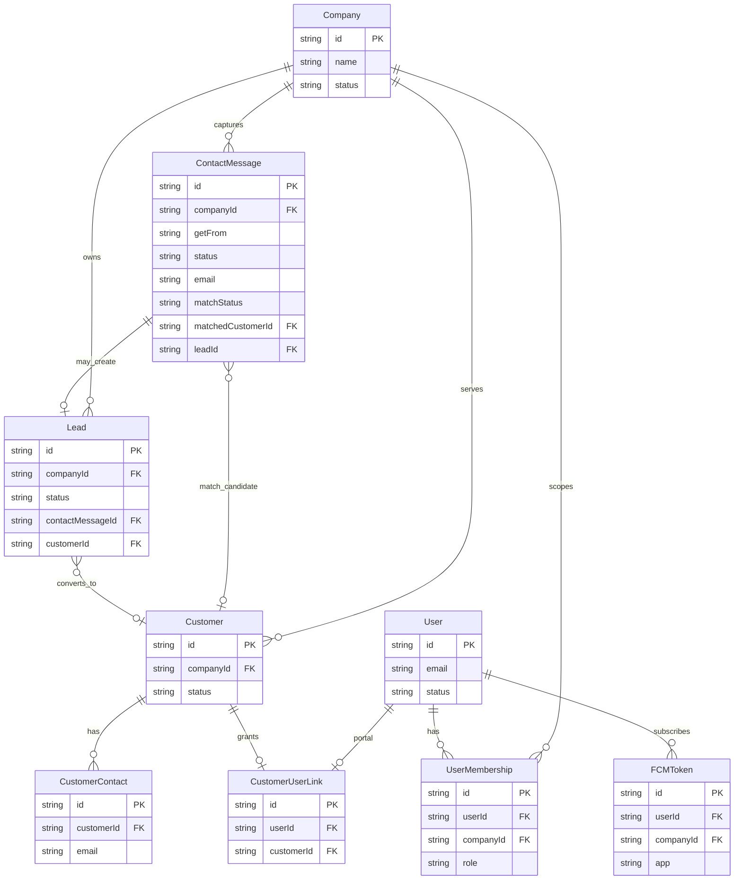
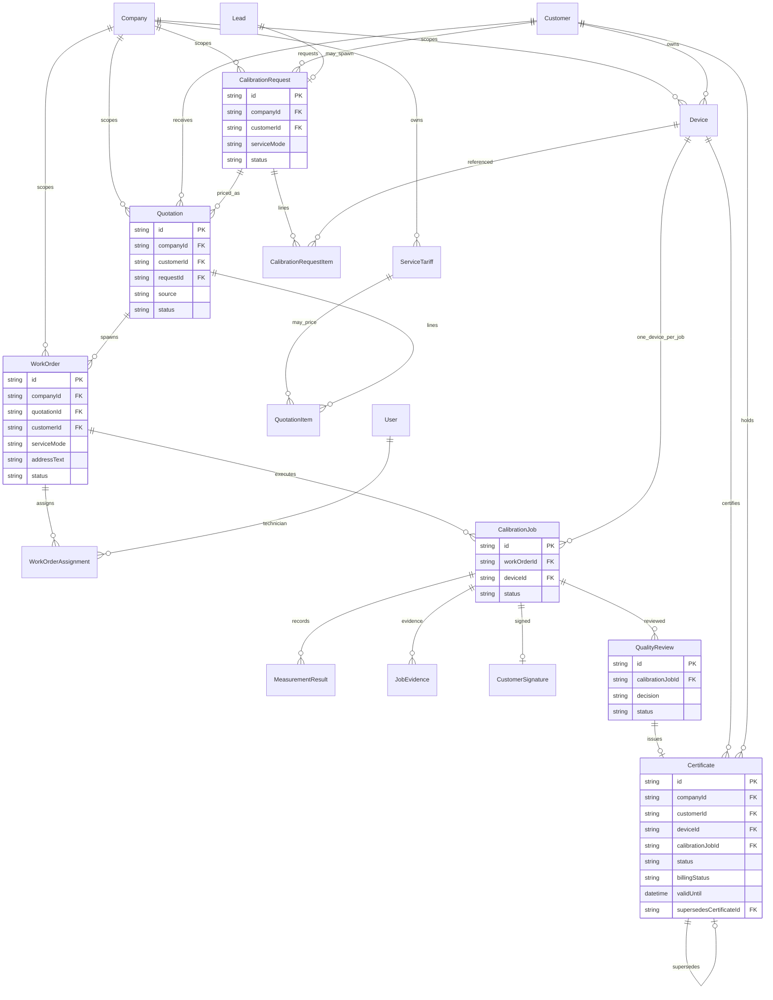
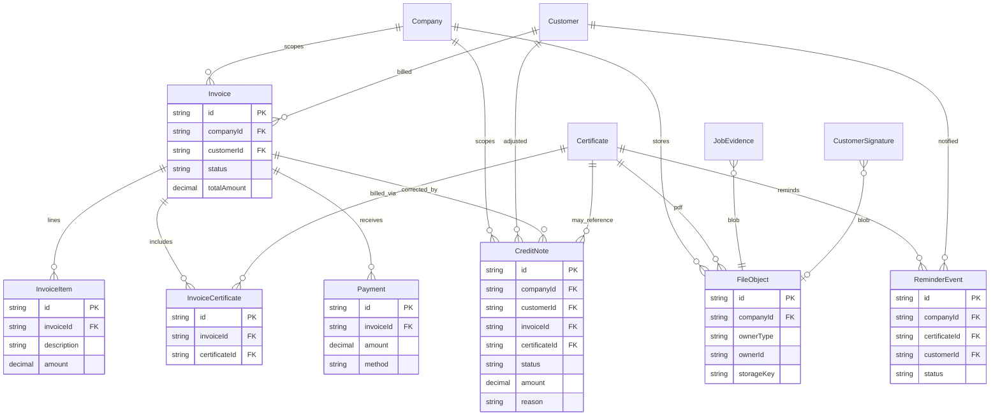

# ERD Overview — medcal MVP

Conceptual entity-relationship diagrams. Attribute detail: [`attributes.md`](./attributes.md).

---

## 1. Acquisition (Website → ContactMessage → Lead → Customer)

**Notes**
- Pola intake = **bi-erp `ContactMessage` + `GetMessageFrom`** (`CONTACTFORM` \| `WHATSAPP` \| `CHAT_AI` \| `CHAT_PERSON` \| `EMAIL`)
- Public website → Express edge → Nest creates `ContactMessage` with `companyId` from **server env**
- `matchStatus` (medcal): none | exact_email | domain_candidate | confirmed_existing | dismissed
- Domain match excludes public email blocklist
- New prospect → `Lead`; confirmed existing → skip Lead, go to Request
- `ChatSession` / `ChatMessage` / `ChatSessionToken` are **MVP** (human-only, see Adoption Matrix) — only the full mailbox `Email` stack remains a later port from bi-erp

---

## 2. Delivery spine (Request → Certificate)

**Notes**
- Quotation **approved** required before WorkOrder
- Quotation → WorkOrder **1:N**
- CalibrationJob → **exactly one Device**
- Certificate `issued` ⇒ `billingStatus = billable` (auto)
- `supersedesCertificateId` for replacement certificates

---

## 3. Billing & retain (Invoice → Payment / CreditNote → Reminder)

**Notes**
- Billable path = Certificate only (`InvoiceCertificate`)
- No WO billable join in MVP
- CreditNote corrects after revoke/supersede **without** auto-voiding Invoice
- `Certificate.billingStatus` stays `invoiced` when already invoiced even if status → revoked/superseded

---

## 4. Cross-cutting invariants (ERD-level)

1. Every table above (except pure join keys) is scoped by `companyId` matching parent Company.
2. Invoice lines / certificates / credit notes for one Invoice share the **same customerId**.
3. `InvoiceCertificate` unique on `certificateId` for non-void invoices (a certificate not double-invoiced while active).
4. WorkOrder.quotationId required; Quotation.status must be `approved` at WO creation time (enforced in Nest, not DB trigger required for MVP).
5. CalibrationJob unique recommendation: (`workOrderId`, `deviceId`) active uniqueness.
6. Better Auth may add its own user/session tables; `User` / `Session` here are domain-facing names — map at Prisma phase.

---

## 5. Intentionally absent from MVP ERD

| Absent | Why |
| ------ | --- |
| Branch | ADR-000 |
| DebitNote, Refund entity | Later |
| InvoiceWorkOrderRef | Optional later |
| StandardInstrument | Later |
| Folder / ShareLink | Path on FileObject first |
| NewsletterSubscriber | Later |
| ReminderPolicy table | Settings/defaults first |

---

## 6. Validation

Confirm before Prisma:

1. Diagrams match locked funnel (Acquisition → Delivery → Collect)?  
2. CreditNote placement (optional FK to Invoice + Certificate) acceptable?  
3. MeasurementResult / JobEvidence as separate entities (vs JSON-only on Job) — catalog says entities + JSON payload on MeasurementResult OK  

If approved → Prisma in `packages/db`.
