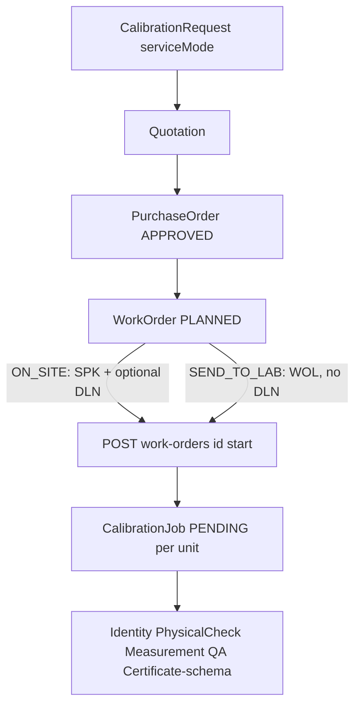
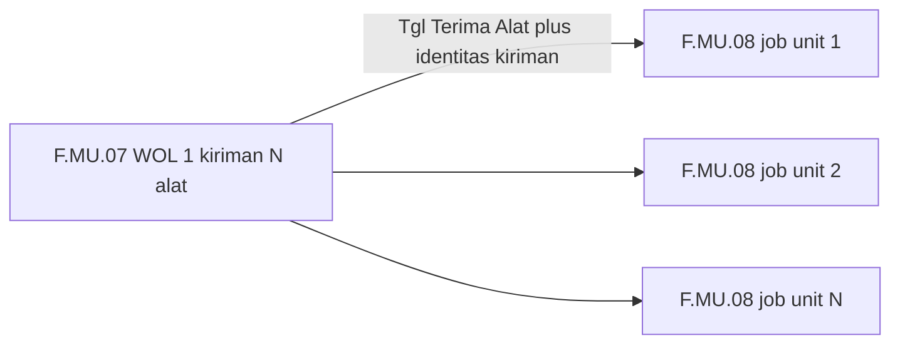
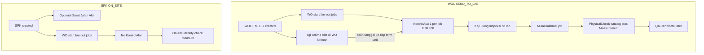

# Kontrol Alat — Implementation Impact Review

**Status:** Read-only audit (no code changes)  
**Date:** 2026-09-11  
**Form authority (paper):** PKM F.MU.08 *Kontrol Alat*; paired with F.MU.07 *Formulir Work Order* (In Lab / WOL)  
**Code authority:** current MedCal repository (`packages/db/prisma/schema.prisma` and related modules)

---

## 1. Current implementation

Sumber kebenaran kode: `packages/db/prisma/schema.prisma`. Tidak ada model, menu, permission, PDF, atau string `Kontrol Alat` / `KontrolAlat`.

Alur yang hidup hari ini:

| Area | Lokasi | Status |
| --- | --- | --- |
| Mode layanan | Enum `ServiceMode`: `ON_SITE` \| `SEND_TO_LAB` (bukan `IN_LAB`) | Label UI "In Lab" |
| SPK / WOL | Prefix `DocumentType.WORK_ORDER` / `WORK_ORDER_SEND_TO_LAB` | Immutable setelah create WO |
| Create WO | `apps/api/src/modules/work-orders/work-orders.service.ts` `create()` | `serviceMode` dari Requisition, bukan body |
| Create job | Sama file, `start()` → `fanOutCalibrationJobs()` | Tidak ada `POST /calibration-jobs` create |
| Job lifecycle | `apps/api/src/modules/calibration-jobs/calibration-jobs.service.ts` | PENDING → IN_PROGRESS → SUBMITTED → ACCEPTED_BY_QA; REWORK |
| Portal job | `apps/portal/src/app/management/calibration-jobs/[id]/page.tsx` | Accordion: identitas, BA, alat acuan, pengukuran, QA |
| Tech PWA | `apps/tech-pwa/src/app/jobs/[id]/page.tsx` | Start, identitas, physical check, measurement, submit |
| Physical inspection | `DevicePhysicalCheckItem` + `PhysicalCheckResult` | Katalog per DeviceType (bukan form F.MU.08) |
| Hasil kalibrasi | `MeasurementResult` + `QualityReview` | Bukan "CalibrationResult" tunggal |
| Sertifikat pelanggan | Model `Certificate` | Schema/prefix CER only; runtime issue/PDF belum ada |
| PDF | SPK, WOL F.MU.07, DLN, QUO, PO, BAI | Tidak ada F.MU.08 |
| Goods-in / tgl terima | WOL PDF mencetak "Tanggal Terima Alat" sebagai `—` | Field domain tidak ada |
| Menu | Group Calibration Management → Work Order, Calibration Job | Tidak ada item Kontrol Alat |
| Auth | `packages/auth/src/access-control.ts` `calibrationJob:*` | Tidak ada action dokumen intake |

Payload job portal/API (`calibrationJobInclude`) **tidak** mengembalikan `workOrder.serviceMode` — UI belum bisa membedakan SPK vs WOL tanpa perluasan select.

---

## 2. Confirmed domain rule

- **WOL / `SEND_TO_LAB` (In Lab)** → Calibration Job → **punya** Kontrol Alat (F.MU.08, "Permintaan Pekerjaan In Lab").
- **SPK / `ON_SITE`** → Calibration Job → **tidak punya** Kontrol Alat.
- Bukan: "setiap Calibration Job punya Kontrol Alat".
- 1 Calibration Job = 1 unit/alat. Form kertas yang dilampirkan adalah **per unit** (beda No. Sertifikat dan No. Seri pada nomor order yang sama).
- Jangan mengubah keputusan yang sudah ada: SPK = ON_SITE, WOL = SEND_TO_LAB, `serviceMode` immutable, nomor SPK/WOL independen, Surat Jalan Alat tetap hanya ON_SITE.

### Pasangan dokumen kertas In Lab (bukti PKM)

Dua form yang dilampirkan **bukan** dokumen yang sama. Keduanya In Lab; cardinality dan tanda tangan berbeda.

**F.MU.07 Work Order (halaman 2 dari 2)** — milik **Work Order / WOL**:

- Satu form untuk **seluruh kiriman**: 4 centrifuge, 4 nomor seri (BCF1-VII260004 … 007).
- Identitas pengirim (PIC), instansi, alamat, No. PO `65-SPH-PKM-2026`.
- **Tanggal Terima PO** 30 Juli 2026 dan **Tanggal Terima Alat** 31 Juli 2026 — **satu tanggal terima untuk shipment**.
- Perlengkapan **per baris** sebagai teks; **Kerusakan Alat** di header WO (`-`).
- Tanda tangan **Mengetahui** (pengirim / customer), plus catatan: form dilengkapi saat **mengirim barang ke laboratorium**.
- MedCal sudah merender PDF ini (`work-order-pdf-wol.ts`), tetapi `Tanggal Terima Alat`, perlengkapan, dan kerusakan saat ini dicetak `—`.

**F.MU.08 Kontrol Alat** — milik **Calibration Job** (contoh = baris 4 WOL, seri `BCF1-VII260007`):

- Satu form **satu unit**: nama/merk/tipe/seri + **No. Sertifikat** `S.642`.
- **No. Order** `65.SPH-PKM-2026` = nomor PO/order pelanggan yang sama dengan F.MU.07 (bukan seri `WOL/YYYY/MM/NNNNN`).
  - **Terkunci (keputusan bisnis 2026-09-11):** cetak `PurchaseOrder.customerPoNumber` (fallback `PurchaseOrder.number`), bukan `WorkOrder.number`.
- **Tgl. Terima Alat** `31/7/2026` = **tanggal yang sama** dengan F.MU.07 (disalin ke form unit, bukan tanggal terima terpisah).
- Hanya di sini: Permintaan Pekerjaan In Lab, kaji ulang, uji visual/fungsi, checklist perlengkapan 1–6, ttd **Administrasi + Petugas Teknis**.
- Tidak ada PIC customer, tidak ada tabel multi-alat, tidak ada Kerusakan Alat, tidak ada "Mengetahui".

Implikasi yang sekarang **terkunci dari kertas** (bukan asumsi):

- Jangan menggabungkan field F.MU.07 ke model Kontrol Alat.
- Jangan membuat satu Kontrol Alat per WOL.
- **Tgl. Terima Alat** sumbernya di **WOL / penerimaan kiriman**; F.MU.08 menampilkannya per unit.
  - Rekomendasi implementasi: field tanggal terima di `WorkOrder` (SEND_TO_LAB), disalin/dicetak ke setiap Kontrol Alat.
  - Override per unit hanya jika bisnis nanti mengizinkan kedatangan terpisah — belum terlihat di paket contoh (keempat unit tanggal yang sama).

---

## 3. Current data model

Rantai: `CalibrationRequest` → `Quotation` → `PurchaseOrder` → `WorkOrder` 1→N `CalibrationJob`.

Anak job yang sudah ada (semua berlaku ON_SITE dan SEND_TO_LAB kecuali yang dicatat):

- `PhysicalCheckResult[]`, `MeasurementResult[]`, `JobEvidence[]`, `JobReferenceEquipmentUsed[]`, `CustomerSignature?`, `QualityReview[]`, `Certificate?`, `IdentityCorrection[]`
- `EquipmentDeliveryNote` 1:1 **WorkOrder**, **ON_SITE only** (pola analog paling dekat: artefak dokumen yang **tidak** dibuat untuk mode lain)

`CalibrationJob` tidak menyimpan `serviceMode`; mode hanya di `WorkOrder`.

---

## 4. Gap analysis

Yang belum didukung:

1. Entitas/relasi Kontrol Alat.
2. Cabang `serviceMode` di fan-out job (hari ini identik kecuali equipment/DLN di WO).
3. Tanggal terima alat: **gap di WOL** (F.MU.07 kertas terisi; PDF MedCal `—`). Kontrol Alat hanya menampilkan ulang tanggal itu.
4. Kaji ulang permintaan (metode/peralatan/personil/konfirmasi).
5. Keputusan "dilaksanakan / tidak" + alasan + tgl kalibrasi/selesai pada form F.MU.08.
6. Inspeksi intake generik (visual kabel/display/tombol, fungsi awal/akhir, perlengkapan 1–6) — **bukan** katalog `DevicePhysicalCheckItem`.
7. Tanda tangan Administrasi + Petugas Teknis (bukan `CustomerSignature`).
8. Kapasitas alat (tidak ada di `Device`).
9. Nomor sertifikat pada saat intake (modul Certificate belum mengeluarkan nomor).
10. PDF F.MU.08.
11. UI portal/PWA yang menampilkan Kontrol Alat hanya untuk WOL.
12. Permission khusus menulis form ini.
13. Import historis kalibrasi: tidak ada di repo (hanya import Requisition Excel).

Yang **tidak** boleh disamakan:

- Kontrol Alat ≠ `PhysicalCheckResult` (katalog LK per tipe vs checklist intake F.MU.08).
- Kontrol Alat ≠ `MeasurementResult` / Quality Review.
- Kontrol Alat ≠ WOL F.MU.07 (1 WO : N baris alat vs 1 job : 1 form). PIC, No. PO, Tgl Terima PO, tabel N alat, kerusakan, ttd Mengetahui = WOL.
- Kontrol Alat ≠ Surat Jalan Alat (DLN = ON_SITE membawa alat *ke customer*; F.MU.07 = In Lab, customer mengirim alat *ke lab*).

---

## 5. Recommended data model

Model baru **`KontrolAlat`** (nama implementasi bisa `LabEquipmentControl` / `EquipmentControlRecord` — Needs business confirmation untuk nama English/DB).

| Aspek | Rekomendasi |
| --- | --- |
| Cardinality | `CalibrationJob` 1 : 0..1 `KontrolAlat` (`calibrationJobId @unique`) |
| Required | Wajib ada setelah job di-fan-out jika WO `SEND_TO_LAB`. **Dilarang** jika WO `ON_SITE` |
| Ownership | Milik job; `onDelete: Cascade` bersama job |
| Lifecycle | Baris dibuat kosong/parsial saat job lahir; diisi sepanjang intake → eksekusi → tanda tangan. Bukan status baru job |
| Audit | `createdAt`, `updatedAt`, `createdByUserId?`, stempel isi/tanda tangan (siapa/kapan) |
| Numbering | Form kertas **tidak** punya nomor dokumen sendiri (hanya F.MU.08 + No. Order + No. Sertifikat). **Jangan** menambah `DocumentType` baru kecuali bisnis meminta seri terpisah |
| Provenance | Relasi ke job; No. Order dicetak dari PO pelanggan; spesifikasi alat dari job/Device; Tgl Terima dari WO |

**Kolom yang layak milik Kontrol Alat** (bukan copy identitas master): kaji ulang; dilaksanakan ya/tidak + alasan; tgl kalibrasi/selesai form; visual/fungsi; checklist perlengkapan unit; ttd admin + petugas teknis; teks konfirmasi "lain-lain". **Tgl. Terima Alat** dicetak dari WO, bukan field master terpisah kecuali ada override per job.

**Kolom yang layak milik WOL / WorkOrder (F.MU.07, In Lab saja):** `equipmentReceivedAt` (atau nama setara); perlengkapan per baris WO/item; kerusakan alat; sudah ada di PDF template tetapi belum ada di schema. Slice Kontrol Alat **tidak wajib** mengisi gap F.MU.07 sekaligus, tetapi tanggal terima WO adalah prasyarat agar F.MU.08 tidak mengarang tanggal.

**Jangan** menaruh measurement points atau physical-check katalog di model ini.

**Invariant ON_SITE = no row:**

- **Application (wajib):** create hanya di `fanOutCalibrationJobs` ketika `workOrder.serviceMode === "SEND_TO_LAB"`; semua write/GET PDF menolak jika parent WO `ON_SITE`.
- **Database (praktis, opsional pelengkap):** unique `calibrationJobId`. Postgres CHECK tidak bisa melihat `WorkOrder.serviceMode` tanpa trigger atau denormalisasi. Pelengkap yang masuk akal: kolom snapshot `workOrderServiceMode` + `CHECK (workOrderServiceMode = 'SEND_TO_LAB')`, atau trigger insert. Tanpa itu, invariant hanya di aplikasi — cukup untuk MVP jika tes menutupi fan-out ON_SITE.

Tidak menambah field Kontrol Alat ke `CalibrationJob` itu sendiri (hindari nullable “section” yang muncul di SPK).

---

## 6. Recommended workflow

**Kapan baris Kontrol Alat dibuat** (dari workflow yang ada + makna form kertas):

- Bukan saat WOL dibuat: job belum ada; form kertas adalah per unit/job.
- Bukan hanya saat "Mulai Kalibrasi": form memuat Tgl. Terima Alat dan kaji ulang **sebelum** eksekusi; `CalibrationJob.start` terlalu terlambat sebagai satu-satunya momen create.
- **Rekomendasi:** buat baris saat **Calibration Job di-fan-out** (`WorkOrdersService.start` / `fanOutCalibrationJobs`) **hanya jika** `SEND_TO_LAB`. Pengisian field terjadi setelahnya (admin lab / teknisi).

**Penerimaan vs fan-out job:** kertas F.MU.07 mencatat Tgl Terima Alat di WO (bisa sebelum teknisi “Mulai Kalibrasi”). Job MedCal baru ada saat WO `start`. Tanggal terima tetap di WO; baris Kontrol Alat tetap dibuat saat fan-out `SEND_TO_LAB`, lalu mencetak tanggal WO. Jika penerimaan harus di-capture sebelum job ada, UI-nya di **Work Order WOL**, bukan di job.

SPK: tidak ada create, tidak ada PDF, tidak ada section UI.

---

## 7. Recommended UI

**Portal job detail** (`apps/portal/src/app/management/calibration-jobs/[id]/page.tsx`): accordion **Kontrol Alat** hanya jika `workOrder.serviceMode === "SEND_TO_LAB"` (perlu expose `serviceMode` di API). Letakkan **sebelum** pengukuran / setelah identitas — sesuai urutan kertas (intake dulu). ON_SITE: **jangan** render section kosong.

**Portal job list:** tidak wajib kolom baru; jika ada indikator, hanya pada grup WOL. Komentar kode list masih menyebut "SPK rows" — grouping aktual adalah per Work Order (SPK atau WOL).

**Tech PWA job detail:** section inspeksi/intake F.MU.08 hanya untuk In Lab; jangan campur dengan halaman Physical Check katalog.

**Work Order detail:** boleh tautan "N Kontrol Alat" untuk WOL setelah start; dokumen tetap dibuka per job.

**Menu:** tidak perlu item sidebar baru pada langkah awal (konsisten: DLN tidak punya menu sendiri).

**Download PDF** F.MU.08 dari job WOL, pola sama BAI/WOL.

---

## 8. Field mapping

### F.MU.07 Work Order (bukti kertas vs MedCal)

| Field F.MU.07 | Sumber MedCal hari ini | Catatan |
| --- | --- | --- |
| PIC, instansi, alamat | Customer / contact | Sudah di `renderWolPdf` |
| No. PO | `PurchaseOrder.customerPoNumber` / `number` | Kertas: `65-SPH-PKM-2026` |
| Tanggal Terima PO | `PurchaseOrder.customerPoDate` | Kertas: 30 Juli 2026 |
| Tanggal Terima Alat | **Tidak ada** — PDF mencetak `—` | Kertas: 31 Juli 2026; **tambah di WorkOrder In Lab** |
| Tabel N alat + seri | `WorkOrderItem` → device/requisition | Sudah; identitas sering belum lengkap sampai job |
| Perlengkapan per baris | PDF `—` | Gap WOL, bukan field Kontrol Alat |
| Kerusakan Alat | PDF `—` | Hanya F.MU.07 |
| Mengetahui | Tidak dimodelkan | Ttd pengirim; bukan ttd F.MU.08 |

### F.MU.08 Kontrol Alat vs MedCal

| Field form | Sumber yang sudah ada | Milik Kontrol Alat | Generated / dokumen saja |
| --- | --- | --- | --- |
| Header F.MU.08, edisi, halaman | — | — | Statis seperti WOL F.MU.07 |
| No. Order | Kertas = No. PO `65-SPH-PKM-2026` | Tidak | **Terkunci:** `PurchaseOrder.customerPoNumber` (fallback `number`), bukan WOL |
| No. Sertifikat | `Certificate.number` **belum di-issue** | Jangan mengarang CER di sini | Needs confirmation: pre-allocate di intake vs isi setelah Certificate |
| Tgl. Terima Alat | Tidak ada di schema; di kertas **sama dengan F.MU.07** | Tampilkan dari WO | Jangan jadi tanggal terima kedua kecuali override per unit dikonfirmasi |
| I. Dilaksanakan / tidak, alasan | Tidak ada | Ya | — |
| Tgl. Kalibrasi | Mendekati `CalibrationJob.startedAt` | Boleh tampil dari job **atau** tanggal form terpisah | Needs confirmation apakah sama dengan `startedAt` |
| Tgl. Selesai | Mendekati `submittedAt` / complete | Sama: jangan duplikasi tanpa keputusan | Needs confirmation |
| II. Kaji ulang metode/peralatan/personil | Tidak ada | Ya (boolean sesuai/tidak) | — |
| Konfirmasi Setuju / Email / Surat / Lain-lain | Tidak ada | Ya + teks lain-lain | — |
| III. Nama alat | `customerDeclaredDeviceName` / DeviceType / Device | Sumber job/device | Cetak |
| Merk / Tipe / No. Seri | `Device.brand/model/serialNumber`; job `technicianObservedSerial`; PO/quotation opsional | Sumber identitas job/device | Cetak; serial sering masih null sampai BA identitas |
| Kapasitas | Tidak ada di Device | Hanya jika bisnis mengonfirmasi field baru — jangan asumsikan | Needs confirmation |
| IV. Uji visual (kabel, display, tombol) | Bukan physical-check katalog | Ya, checklist intake generik | — |
| Uji fungsi Kondisi Awal / Akhir | Bukan `PhysicalCheckResult` | Ya, dua verdict kasar | — |
| Perlengkapan 1–6 | WOL punya daftar teks per baris; F.MU.08 checklist unit | Ya (verifikasi lab per job) | Needs confirmation apakah 6 slot generik atau mengikuti teks WOL |
| Ttd Administrasi / Petugas Teknis | Bukan `CustomerSignature` | Ya (nama + file/ttd + tanggal) | — |
| Nama petugas | Bisa dari assignment WO / user teknisi | Boleh default dari assignment, tetap tersimpan di form | — |

---

## 9. Lifecycle / status implications

**Tidak wajib** menambah `CalibrationJobStatus`. Kontrol Alat orthogonal, seperti identity gate dan physical check.

Gate opsional kemudian (Needs business confirmation): apakah `job.start` In Lab boleh terjadi sebelum Tgl. Terima + kaji ulang terisi? Rekomendasi tahap 1: **jangan** mengunci status job; isi form paralel. Hindari memaksa SPK melewati gate yang tidak relevan.

Section I "Tidak Dilaksanakan" tidak otomatis = `CANCELLED` WO atau `REJECTED` AKD/AKL tanpa keputusan bisnis.

REWORK/attempt: form kertas tidak menunjukkan revisi. Rekomendasi: **satu** Kontrol Alat per job (bukan per attempt), berbeda dari `PhysicalCheckResult.attemptNumber`.

Job historis ON_SITE yang sudah ada: tetap 0 baris. Job SEND_TO_LAB yang sudah di-fan-out: perlu backfill baris kosong jika fitur diaktifkan.

---

## 10. Authorization implications

Permission sekarang **tidak cukup spesifik**. `calibrationJob:update` ada di katalog tetapi **tidak** di-seed untuk ADMIN/teknisi (ADMIN hanya `read`; tulis eksekusi pakai action terpisah).

Pola yang konsisten: action baru misalnya `calibrationJob:recordKontrolAlat` (atau `recordEquipmentControl`), jangan reuse `recordPhysicalCheck` / `recordMeasurement`.

Peran di kertas (Needs confirmation):

- Administrasi: mungkin ADMIN / CUSTOMER_SERVICE — CS seed **tidak** punya `calibrationJob:read`.
- Petugas teknis: TECHNICIAN (isi inspeksi + ttd teknis).
- Manager: read/review.

Seed hari ini: SUPERVISOR/FINANCE tidak melihat job. Jangan diam-diam memberi CS akses job hanya untuk form ini tanpa konfirmasi.

---

## 11. Historical data implications

Tidak ada import riwayat kalibrasi/UUT/Certificate di repo. Diskusi sebelumnya tidak mengubah fakta implementasi.

Jika import historis dibangun nanti:

- Baris historis **ON_SITE/SPK**: jangan membuat Kontrol Alat dummy.
- Baris historis **WOL/SEND_TO_LAB**: Kontrol Alat boleh diimpor (tanggal terima, no. sertifikat kertas, checklist, scan PDF) atau dibiarkan kosong dengan flag "legacy missing" — Needs confirmation.
- Nomor sertifikat di form kertas (S.642 dst.) kemungkinan identitas sertifikat lama; model `Certificate` belum punya alur issue — import nomor harus menunggu desain Certificate, atau disimpan sebagai string pada Kontrol Alat **tanpa** mengklaim itu `Certificate.number` yang sudah di-issue.
- Scan form kertas cocok sebagai `FileObject` (perlu `FileOwnerType` baru), terpisah dari data terstruktur.

Backfill operasional (job WOL yang sudah ada di DB, bukan import kertas): create `KontrolAlat` kosong 1:1 agar invariant "WOL job selalu punya baris" berlaku ke depan.

---

## 12. Implementation plan

Langkah kecil, **belum dieksekusi**:

1. Kontrak field + nama model (hanya kolom yang dikonfirmasi dari §8/§13).
2. Schema: `KontrolAlat` 1:1 optional; unique job; cascade; audit; **tanpa** `DocumentType` baru kecuali diminta.
3. Fan-out: create baris hanya `SEND_TO_LAB`; tes bahwa `ON_SITE` start tidak membuat baris.
4. Backfill job WOL existing.
5. API GET/PATCH/PDF; tolak ON_SITE dengan kode jelas.
6. Expose `workOrder.serviceMode` pada job DTO.
7. Permission baru + seed.
8. Portal: accordion + PDF hanya WOL.
9. Tech PWA: subset inspeksi/intake hanya In Lab.
10. Jangan ubah SPK, DLN, physical-check katalog, measurement, menu group, atau Certificate issue pada slice pertama.
11. Import historis: fase terpisah setelah Certificate/intake rules dikunci.

Prasyarat terkait F.MU.07 (boleh paralel, bukan di dalam model Kontrol Alat): field `equipmentReceivedAt` (atau setara) pada Work Order In Lab agar F.MU.08 tidak mengarang tanggal.

---

## 13. Risks / unresolved questions

Hanya yang benar-benar butuh konfirmasi bisnis:

1. **Tgl. Terima Alat:** dari paket kertas ini **terselesaikan** — sumber WOL (satu tanggal kiriman), F.MU.08 menyalin. Override per unit belum terlihat. Tetap perlu field WO In Lab di MedCal.
2. **No. Order** di F.MU.08: **terkunci** = nomor PO/order pelanggan (`customerPoNumber`, fallback `PurchaseOrder.number`), bukan seri WOL MedCal.
3. Apakah **No. Sertifikat** di F.MU.08 diisi saat intake (pre-allocate) atau setelah Certificate di-issue? Modul Certificate belum hidup.
4. Apakah **Tgl. Kalibrasi / Tgl. Selesai** = `startedAt` / `submittedAt`, atau tanggal form terpisah?
5. Apakah **kaji ulang** identik untuk semua job dalam satu WOL, atau diulang per unit? (Kertas mengulang per form unit.)
6. Apakah checklist **perlengkapan** dan **uji visual** generik untuk semua DeviceType, atau mengikuti baris F.MU.07?
7. Ke mana **Kapasitas** disimpan (kosong di kedua form contoh ini)?
8. Siapa role **Administrasi** vs teknisi, dan apakah CS harus melihat job In Lab?
9. Apakah intake Kontrol Alat **mengunci** `job.start` untuk WOL?
10. Apa arti operasional **"Tidak Dilaksanakan"** vs cancel job / reject identity?
11. Nama model/API Inggris vs tetap "Kontrol Alat" di UI.
12. Import historis: wajibkan form terstruktur, cukup scan, atau izinkan job WOL tanpa Kontrol Alat?

**Slice 1 yang aman:** field terima di WOL + model F.MU.08 per job (kaji ulang, inspeksi, ttd lab), tanpa nomor sertifikat dan tanpa gate status. Jangan mengisi gap Kerusakan/Perlengkapan F.MU.07 di dalam model Kontrol Alat.

---

## Appendix — Domain constraints (do not change)

1. ON_SITE = SPK.
2. IN_LAB (label bisnis) = `SEND_TO_LAB` = WOL.
3. CalibrationJob = 1 device/unit being calibrated.
4. `serviceMode` is immutable after Work Order creation.
5. SPK/WOL numbering remains independent.
6. Do not introduce WOS or WORK_ORDER_ON_SITE.
7. "Surat Jalan Alat" remains associated with the ON_SITE/SPK workflow for equipment carried to customer location.
