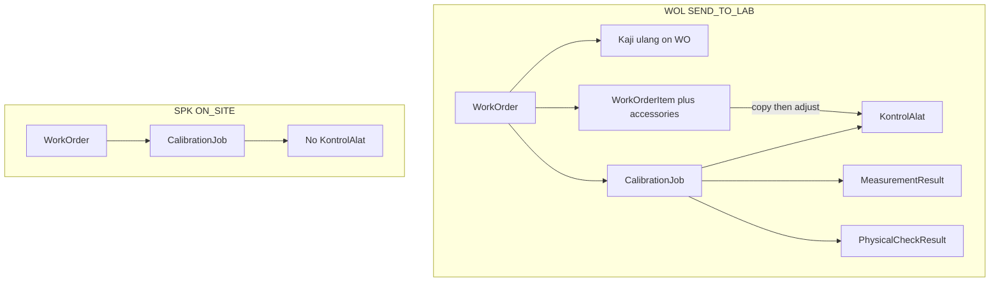

# Kontrol Alat — Implementation Plan

**Status:** Planning only (no code changes)  
**Date:** 2026-09-11  
**Form authority:** PKM F.MU.08 *Kontrol Alat – Permintaan Pekerjaan In Lab*  
**Code authority:** current MedCal repository  
**Related audit:** [`kontrol-alat-implementation-impact-review.md`](./kontrol-alat-implementation-impact-review.md)

---

## Locked business baseline

Treat the following as locked. Do not reopen or reinterpret them.

1. **Scope:** Kontrol Alat only for Calibration Jobs from WOL / `SEND_TO_LAB` / In Lab. SPK / `ON_SITE` jobs have **no** Kontrol Alat.
2. **Cardinality:** 1 CalibrationJob = 1 unit; 1 WOL → N jobs; **exactly one Kontrol Alat per WOL job**. Not a WOL-level document.
3. **No. Order:** customer PO/order number (e.g. `65-SPH-PKM-2026`) = `PurchaseOrder.customerPoNumber` — **not** MedCal WOL number.
4. **No. Sertifikat:** entered **manually after** MT approval of that job’s calibration results. No automatic certificate numbering for Kontrol Alat.
5. **Dates:**
   - Tgl. Terima Alat = `CalibrationJob.startedAt`
   - Tgl. Kalibrasi = `CalibrationJob.startedAt`
   - Tgl. Selesai = MT approval date if present, else `CalibrationJob.submittedAt`  
     (approval = `QualityReview.reviewedAt` when decision is APPROVE)  
     Do **not** create duplicate date columns merely to mirror the paper form.
6. **Kaji Ulang Permintaan Pelanggan:** “setiap pelanggan dalam satu waktu” — **not** once per Calibration Job.
7. **Equipment checklist:** initial list from Work Order; then checked/completed/adjusted on Kontrol Alat (not read-only copy).
8. **Capacity:** optional; never mandatory.
9. **Administrasi:** staff/admin handling the job — **do not** create a dedicated Membership role solely for Kontrol Alat unless auth technically requires it.
10. **Gate (hard):** Kontrol Alat must be completed/signed **before** `CalibrationJob.start()` for WOL/In Lab. SPK/ON_SITE must **not** be blocked.
11. **Not calibration result:** keep Kontrol Alat separate from measurement / physical-check catalog results.
12. **Modes:** `ON_SITE` = SPK; In Lab = WOL / `SEND_TO_LAB`; `serviceMode` immutable; no WOS; Surat Jalan Alat remains ON_SITE only.

---

## Answers A–G (before new models)

| | Decision from repo + locked baseline |
|---|---|
| **A. Kaji ulang owner** | **`WorkOrder`** (WOL). One customer shipment event = one WO → many jobs. Not per job; not bare `Customer` (too coarse across visits); not `CalibrationRequest` alone (commercial, pre-lab). |
| **B. Job ↔ Kontrol Alat** | `CalibrationJob` **1 : 1** `KontrolAlat`; required after fan-out when `SEND_TO_LAB`; **forbidden** when `ON_SITE`. |
| **C. Equipment list** | `WorkOrderEquipment` is **not** the source (PKM reference gear for ON_SITE). Source = accessories list on **`WorkOrderItem`** (F.MU.07 gap today). Copy into Kontrol Alat rows, then check/adjust. |
| **D. Gate** | In `CalibrationJobsService.start()`: if WO `SEND_TO_LAB` and Kontrol Alat not complete/signed → reject; `ON_SITE` → do not check. |
| **E. Tgl. Selesai** | Latest APPROVED `QualityReview.reviewedAt` if present; else `CalibrationJob.submittedAt`. **Derived**, not a new column. |
| **F. No. Sertifikat (pre Certificate module)** | Optional string on **`KontrolAlat`**, writable only after MT APPROVE. Do not allocate `DocumentType.CERTIFICATE`. |
| **G. Paper fields from existing data** | Dates, No. Order, device identity, In Lab mode: existing entities. Intake/inspection/signatures/certificate string: Kontrol Alat. Kaji ulang: Work Order. |

---

## 1. Current architecture relevant to Kontrol Alat

| Layer | Relevant today |
|---|---|
| Schema | `WorkOrder.serviceMode`, `WorkOrderItem` (`description` + `qty` only), `WorkOrderEquipment` = ON_SITE reference gear, `CalibrationJob` (`startedAt`, `submittedAt`, fan-out on WO `start`), `QualityReview.reviewedAt`, `Certificate` schema-only, `PhysicalCheckResult` / `MeasurementResult` separate |
| WO create | `serviceMode` from Requisition; SPK vs WOL numbering; `equipmentConfirmedAt` ON_SITE only |
| Job create | `POST /work-orders/:id/start` → `fanOutCalibrationJobs()`; jobs `PENDING` |
| Job start | `POST /calibration-jobs/:id/start` — **no** Kontrol Alat precondition |
| Submit / MT | `submitForReview` → `submittedAt`; `decideQualityReview` APPROVE → `QualityReview` + `reviewedAt`; job stays `SUBMITTED` |
| Portal | `calibration-jobs/[id]/page.tsx` — identity, BA, ref equipment, measurements, QA; **does not** expose `workOrder.serviceMode` |
| Tech PWA | `jobs/[id]` — start, catalog physical check, measurement |
| PDF | WOL F.MU.07 exists; Tanggal Terima Alat / perlengkapan / kerusakan print as `—` |
| Auth | ADMIN: `calibrationJob:read` only. TECHNICIAN: `start`, measurement, physical check. MT: `decideQualityReview`. No Kontrol Alat action |
| Artifact | **No** F.MU.08 model / API / UI / PDF |

Confirmed No. Order source: `WorkOrder.purchaseOrder.customerPoNumber`.

---

## 2. Target domain model

```text
WorkOrder (SEND_TO_LAB / WOL)
  ├── customer request review (once per WO / customer work event)
  ├── WorkOrderItem[]  (line identity + initial accessory list)
  └── CalibrationJob[]     (1 unit)
        ├── KontrolAlat?   (required 1:1 for WOL; absent for SPK)
        │     ├── accessory check/adjust rows
        │     ├── visual & functional inspection
        │     ├── optional capacity
        │     ├── manual No. Sertifikat (after MT)
        │     └── Administration + Technical Officer signatures
        ├── PhysicalCheckResult[]   (catalog LK — NOT F.MU.08)
        └── MeasurementResult[]     (calibration result — NOT Kontrol Alat)
```

SPK / `ON_SITE`: `WorkOrder` → `CalibrationJob` → **no** `KontrolAlat`. DLN remains ON_SITE only.

Do **not** reuse `WorkOrderEquipment` for UUT accessories.



---

## 3. Schema changes

Model names below are technical proposals (UI label remains “Kontrol Alat”). English/DB name is a soft open item; business rules are not.

### 3.1 `WorkOrder` — customer request review

Owned on WO so **one customer, one time** applies to all sibling jobs.

| Field | Type | Null | Reason |
|---|---|---|---|
| `requestReviewMethodOk` | Boolean? | OPTIONAL | F.MU.08 II.a Metode |
| `requestReviewEquipmentOk` | Boolean? | OPTIONAL | II.b Peralatan |
| `requestReviewPersonnelOk` | Boolean? | OPTIONAL | II.c Personil |
| `requestReviewConfirmAgree` | Boolean | default false | Setuju |
| `requestReviewConfirmEmail` | Boolean | default false | Email |
| `requestReviewConfirmLetter` | Boolean | default false | Surat |
| `requestReviewConfirmOther` | Boolean | default false | Lain-lain |
| `requestReviewConfirmOtherText` | String? | OPTIONAL | other text |
| `requestReviewCompletedAt` | DateTime? | OPTIONAL | when filled; may participate in gate |
| `requestReviewCompletedByUserId` | String? | OPTIONAL | audit |

Meaningful only for `SEND_TO_LAB`. ON_SITE stays null; API rejects writes.

**Do not** add receive/calibration dates on WO: Tgl. Terima Alat and Tgl. Kalibrasi are locked to `CalibrationJob.startedAt` (derived).

### 3.2 `WorkOrderItem` — initial accessory list

Today there is no accessory field (`work-order-pdf-wol.ts` documents the gap).

**Minimum recommended:** child table (not free-form JSON only).

**`WorkOrderItemAccessory`** (new)

| Field | Type | Null | Relation / constraint |
|---|---|---|---|
| `id` | String | REQUIRED | PK |
| `workOrderItemId` | String | REQUIRED | FK cascade |
| `label` | String | REQUIRED | e.g. "Unit", "Kabel Power" |
| `sortOrder` | Int | REQUIRED | |
| `createdAt` | DateTime | REQUIRED | |

`@@index([workOrderItemId])`.

Optional later on item/header: `damageNote String?` for F.MU.07 “Kerusakan Alat” (not a Kontrol Alat field; separate slice if WOL PDF completeness is desired).

### 3.3 `KontrolAlat` (new) — 1:1 job

| Field | Type | Null | Category | Reason |
|---|---|---|---|---|
| `id` | String | REQUIRED | | |
| `companyId` | String | REQUIRED | | |
| `calibrationJobId` | String | REQUIRED | unique | ownership |
| `workExecuted` | Boolean? | OPTIONAL | | I.a vs I.b |
| `notExecutedReason` | String? | OPTIONAL | | I.b Alasan |
| `capacity` | String? | OPTIONAL | | never mandatory |
| `visualPowerCable` | Boolean? | OPTIONAL | | visual |
| `visualDisplay` | Boolean? | OPTIONAL | | |
| `visualButtons` | Boolean? | OPTIONAL | | |
| `functionInitialOk` | Boolean? | OPTIONAL | | Kondisi Awal |
| `functionFinalOk` | Boolean? | OPTIONAL | | Kondisi Akhir (may be filled later; not required for start gate) |
| `certificateNumber` | String? | OPTIONAL | | manual No. Sertifikat after MT |
| `completedAt` | DateTime? | OPTIONAL | | gate predicate when both signatures present |
| `createdAt` / `updatedAt` | DateTime | REQUIRED | audit | |
| `createdByUserId` | String? | OPTIONAL | audit | |

**Do not** store `startedAt` / `submittedAt` / `reviewedAt` / No. Order / device name on this model.

Practical constraint: `calibrationJobId @unique`. ON_SITE invariant: application (+ tests). Optional: denormalized `workOrderServiceMode` + CHECK `SEND_TO_LAB`.

`onDelete: Cascade` from job.

### 3.4 `KontrolAlatAccessory` (new)

| Field | Type | Null | Reason |
|---|---|---|---|
| `kontrolAlatId` | FK | REQUIRED | cascade |
| `label` | String | REQUIRED | snapshot from WO **or** added in lab |
| `sortOrder` | Int | REQUIRED | |
| `present` | Boolean? | OPTIONAL | lab check; null = not yet checked |
| `sourceWorkOrderItemAccessoryId` | String? | OPTIONAL | provenance; soft link if WO list changes |

Add/remove/relabel after copy is allowed (baseline rule 7).

### 3.5 Signatures

Pattern like `IdentityCorrectionSignature`: two rows **ADMINISTRATION** / **TECHNICAL_OFFICER** (signer kinds — not new Membership roles).

| Field | Type | Null |
|---|---|---|
| `signerUserId` | String? | signed-in user |
| `signerName` | String | printed name |
| `signedAt` | DateTime? | |
| `fileObjectId` | String? | OPTIONAL image; new `FileOwnerType` e.g. `KONTROL_ALAT` |

`@@unique([kontrolAlatId, signerKind])`.

### GENERATED / DERIVED (not Kontrol Alat columns)

| Concept | Source |
|---|---|
| No. Order | `PurchaseOrder.customerPoNumber` |
| Tgl. Terima Alat | `CalibrationJob.startedAt` |
| Tgl. Kalibrasi | `CalibrationJob.startedAt` |
| Tgl. Selesai | APPROVED `QualityReview.reviewedAt` ?? `submittedAt` |
| Nama/merk/tipe/seri | job / Device / request item |
| Kaji ulang on PDF | WorkOrder request-review fields |

**No** new `DocumentType`. **No** auto CER allocation for Kontrol Alat.

---

## 4. Customer Request Review design

**Owner: `WorkOrder`.**

Why:

- PKM: one customer, one time, many devices.
- In MedCal, devices sent together to the lab = **one WOL** → N `CalibrationJob`.
- Bare `Customer` mixes different visits/WOs.
- `CalibrationRequest` is commercial requisition; not the operational lab event.
- Storing an independent review on every job would violate “not per Calibration Job”.

UI: section on **WOL Work Order detail**. Each F.MU.08 PDF **reprints** the same WO values.

Start gate for WOL jobs: besides Kontrol Alat signatures, require `WorkOrder.requestReviewCompletedAt` (once for all sibling jobs) — subject to soft open question in §14 if product wants signatures-only gate first.

---

## 5. Equipment checklist design

```text
WorkOrderItemAccessory[]     (initial list on WO / F.MU.07)
        ↓ copy when KontrolAlat is created (fan-out)
KontrolAlatAccessory[]       (label + present; may add/change)
        ↓
print F.MU.08 perlengkapan 1..n
```

**Snapshot/copy is required:** planner may edit the WO list; the lab form must record what was **verified for that unit** without silently rewriting after signature.

`WorkOrderEquipment` is **out of scope** (reference gear to customer site).

If `WorkOrderItem.qty > 1` → multiple jobs from one item: copy the **same** accessory list into each Kontrol Alat; per-unit adjustments live on the job.

---

## 6. Lifecycle

```text
WOL created (PLANNED)
  → (optional) fill WO accessories + customer request review
WO start
  → fan-out CalibrationJob PENDING
  → create empty KontrolAlat + copy accessories (SEND_TO_LAB only)
Fill inspection + Administration + Technical Officer signatures
  → completedAt
POST /calibration-jobs/:id/start
  → WOL: require Kontrol Alat complete (+ WO request review complete if required)
  → SPK: do not check Kontrol Alat
  → IN_PROGRESS, startedAt  (= printed Tgl Terima Alat & Tgl Kalibrasi)
Catalog physical check + measurements (not F.MU.08)
submitForReview → submittedAt
MT decideQualityReview APPROVE → reviewedAt
  → allow PATCH certificateNumber on KontrolAlat
(REJECT → REWORK; KontrolAlat remains 1 per job, not reset)
```

**Complete/signed predicate for gate:** both signature `signedAt` values set. For executed work: `workExecuted === true`. If `workExecuted === false` + reason → do not start (or treat as non-start path). Do **not** require `functionFinalOk` before start (final condition is after work).

SPK: no create, no PDF, no UI, `start()` not blocked by Kontrol Alat.

---

## 7. API changes

**New**

- `GET/PATCH /calibration-jobs/:id/kontrol-alat`
- accessory add/adjust endpoints under Kontrol Alat
- `POST .../kontrol-alat/signatures` (administration | technical)
- `GET .../kontrol-alat/pdf`
- `PATCH /work-orders/:id/request-review` (`SEND_TO_LAB` only)
- `PUT /work-orders/:id/items/:itemId/accessories` (initial list)

**Change**

- `fanOutCalibrationJobs`: create Kontrol Alat + copy accessories when `SEND_TO_LAB`
- `CalibrationJobsService.start`: WOL vs SPK gate
- `calibrationJobInclude`: `serviceMode`, Kontrol Alat summary, `purchaseOrder.customerPoNumber`
- Reject all Kontrol Alat writes when WO is `ON_SITE` (explicit code, e.g. `KONTROL_ALAT_NOT_APPLICABLE`)
- `certificateNumber`: reject unless APPROVED `QualityReview` exists

Do not change `submitForReview` / `decideQualityReview` semantics beyond the certificate-number write rule.

---

## 8. UI changes

**Portal WO (WOL only):** customer request review; per-item accessory editor.

**Portal job detail:** Kontrol Alat accordion **only** if `serviceMode === SEND_TO_LAB`. ON_SITE: do not render an empty section. Gate failure messaging on start.

**Tech PWA:** inspection + technical (and admin if permitted) signatures; disable Mulai Kalibrasi with reason when incomplete.

**After MT approve:** No. Sertifikat field (not at start).

**No** new sidebar menu item required (same pattern as DLN).

**Administrasi:** existing user with permission; UI label “Administrasi”; **no** new Membership role.

---

## 9. PDF F.MU.08

| F.MU.08 field | Source | New field? | Rule |
|---|---|---|---|
| Header F.MU.08 | static | no | like F.MU.07 |
| No. Order | `PurchaseOrder.customerPoNumber` | no | not `WorkOrder.number` |
| No. Sertifikat | `KontrolAlat.certificateNumber` | yes (string) | empty until MT approve + manual entry |
| Tgl. Terima Alat | `CalibrationJob.startedAt` | no | derived; `—` before start |
| Tgl. Kalibrasi | `CalibrationJob.startedAt` | no | same |
| Tgl. Selesai | APPROVED `QualityReview.reviewedAt` ?? `submittedAt` | no | derived |
| I. Dilaksanakan / alasan | `workExecuted` / `notExecutedReason` | yes | |
| II. Kaji ulang | WorkOrder request-review fields | yes on WO | same for all jobs on that WO |
| III. Nama/merk/tipe/seri | job / Device / request item | no | |
| III. Kapasitas | `KontrolAlat.capacity` | yes | OPTIONAL |
| IV. Uji visual | Kontrol Alat booleans | yes | |
| Uji fungsi awal/akhir | Kontrol Alat booleans | yes | final may be null on early PDF |
| Perlengkapan | `KontrolAlatAccessory` | yes (from WO copy) | |
| Ttd Administrasi / Petugas Teknis | signature rows | yes | existing users |
| Permintaan In Lab | `serviceMode === SEND_TO_LAB` | no | document not printed for SPK |

---

## 10. Permissions

Do not create an Administrasi Membership role.

| New action | Suggested seed |
|---|---|
| `calibrationJob:recordKontrolAlat` | TECHNICIAN, TECHNICIAN_MANAGER; consider ADMIN (portal staff — today ADMIN only has `calibrationJob:read`) |
| `workOrder:update` | already on ADMIN — sufficient for WO request review + accessories |

Signatures = calling user (`User.name`). Read via `calibrationJob:read`.

Do **not** reuse `recordPhysicalCheck` / `recordMeasurement`.

Do not silently grant CS job access.

---

## 11. Historical data

Do **not** invent fake Requisition / Quotation / PO / WO for legacy imports.

Later (not this plan’s coding phases): historical In Lab jobs may attach `KontrolAlat` + string `certificateNumber` + scan `FileObject`; use known `startedAt` / `submittedAt` / `reviewedAt` when available; historical ON_SITE jobs get **no** Kontrol Alat row.

Operational backfill for **existing WOL jobs in DB**: create empty `KontrolAlat` 1:1 so the invariant holds; start gate only affects jobs still `PENDING`.

---

## 12. Implementation phases

1. **Schema** — WO request review fields + `WorkOrderItemAccessory` + `KontrolAlat` + accessories + signatures + `FileOwnerType`; migration; backfill empty rows for existing WOL jobs.
2. **API / domain** — CRUD, copy on fan-out, expose `serviceMode`, reject ON_SITE.
3. **Lifecycle gate** — `start()` WOL vs SPK; tests.
4. **UI** — portal WO + job accordion; PWA; No. Sertifikat after MT; gate messaging.
5. **PDF** F.MU.08 with derived dates + PO number.
6. **Tests** — ON_SITE fan-out creates no Kontrol Alat; WOL creates 1:1; start reject/allow; `certificateNumber` rejected before APPROVE; request review shared across sibling jobs.

**Out of scope for these phases:** Device Management, SPK/DLN behavior, catalog physical check, measurement results, Certificate issue module.

---

## 13. Risks

- Start gate changes WOL behavior that today allows `start` without a form — existing `PENDING` jobs need backfill and may need manual complete before start.
- Incorrectly requiring `functionFinalOk` before start.
- Confusing `WorkOrderEquipment` with UUT accessories.
- Duplicating request review per job if UI is only on job detail.
- Future `Certificate.number` vs Kontrol Alat string — sync not designed; intentionally separate for now.
- ADMIN without `recordKontrolAlat` cannot act as “Administrasi” in portal.

---

## 14. Open questions

Only items **not** closed by the locked baseline + repository:

1. English/DB model name (`KontrolAlat` vs `LabEquipmentControl`) — UI remains “Kontrol Alat”.
2. Must `WorkOrder.requestReviewCompletedAt` block `job.start`, or is Kontrol Alat dual signature enough for the gate (with review still required operationally)?
3. Is signature **image** required, or are name + `signedAt` enough for “signed”?
4. Grant `recordKontrolAlat` to ADMIN (portal administration) or only lab technicians?
5. Default accessory templates (e.g. centrifuge 6 slots) vs free-text per WO — baseline only says “from WO then adjust”.

**Not** open questions: WOL-only scope, 1:1 job, No. Order = PO, manual No. Sertifikat after MT, both paper receive/calibration dates = `startedAt`, Tgl. Selesai = approve ?? submit, request review not per job, optional capacity, no dedicated Administrasi role, gate before start, do not merge with calibration results, SPK/DLN unchanged.

---

## Strict rule (this document)

This file is an **implementation plan**. It does not authorize schema/API/UI coding by itself. Execute only after explicit implementation go-ahead.
