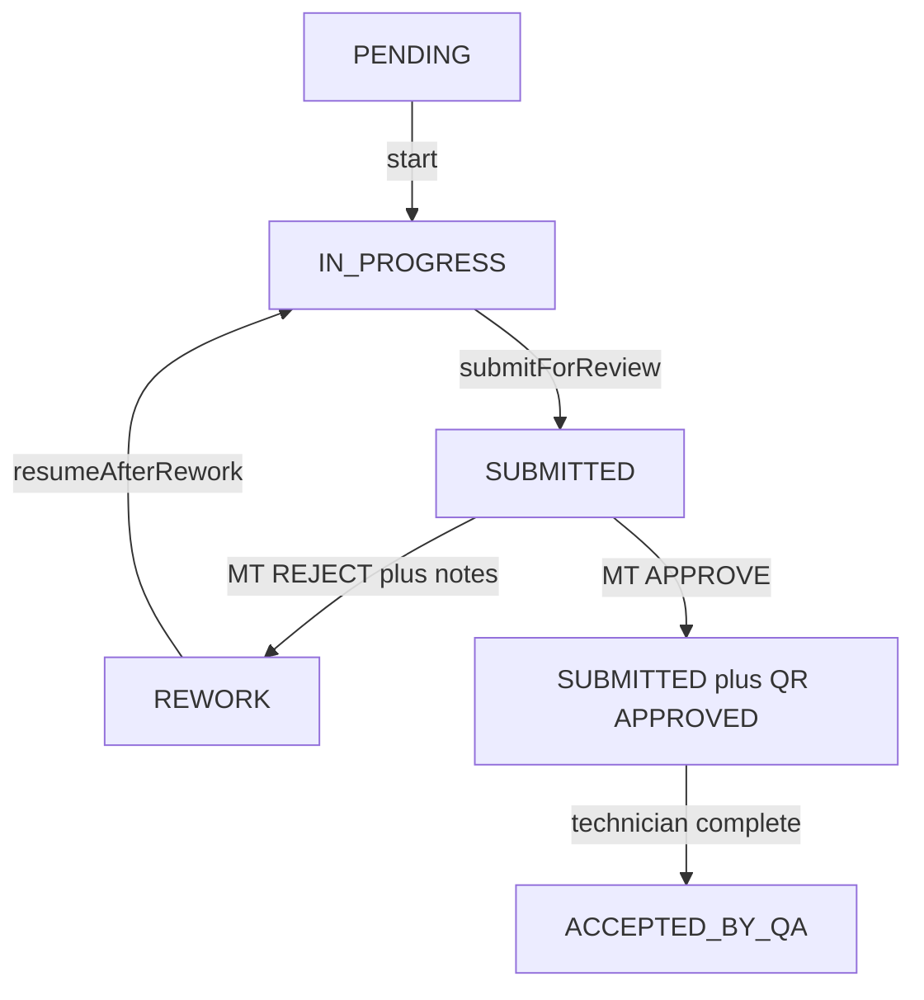

# Calibration Result Review — Lifecycle Design (LOCKED)

**Date:** 2026-09-09
**Mode:** Stage 1 — laporan desain. Tidak ada kode, migrasi, atau perubahan Prisma.
**HARD STOP:** jangan implementasi sebelum laporan ini disetujui eksplisit.
**Sumber audit:** percakapan audit Identity Correction vs Calibration Result Review (2026-09-09).
**Sumber transisi attempt:** [attempt-increment-diagnosis.md](../../Calibration-management/measurement-results/attempt-increment-diagnosis.md).

---

## 0. Status dokumen

| Bagian | Status |
|---|---|
| A. Kesimpulan audit Identity Correction | **DISETUJUI** (kunci desain) |
| B–F. Mapping status, QualityReview, izin, kontrak transisi | **DIKUNCI di laporan ini** — menunggu persetujuan sebelum kode |
| UI detail MT / teknisi, signature, notifikasi, PDF, PASS/FAIL | **Di luar scope** (brief asli §9) |

---

## A. Kesimpulan audit yang dikunci

Tidak membuat kerangka koreksi kedua. Tidak memakai tabel `IdentityCorrection` untuk hasil pengukuran.

| Keputusan | Isi |
|---|---|
| Reuse | **Pola perilaku** Identity Correction: split izin submit vs decide, feedback terpisah dari payload, histori append-only, satu pending per subjek, lock setelah submit, ADMIN bukan approver. |
| Aktifkan yang sudah ada | `CalibrationJobStatus` (`IN_PROGRESS` / `SUBMITTED` / `REWORK` / `ACCEPTED_BY_QA`), `submittedAt`, `currentAttempt`, lock `MeasurementResult`, model `QualityReview`. |
| Jangan | Tabel `MeasurementCorrection`, `CorrectionFramework` generik, `AuditLog` baru, enum `DRAFT` / `REVISION_REQUIRED` / `CLOSED`, memaksa review hasil lewat BA identitas. |
| MT vs data | MT adalah reviewer. MT **tidak** menulis `MeasurementResult`. Feedback hanya di `QualityReview.notes`. |
| Polaritas | Identity Correction = teknisi usul ubah, MT apply/tolak. Review hasil = teknisi kirim data, MT minta koreksi, teknisi yang mengubah nilai. Domain tetap terpisah. |

Identity Correction **tidak diubah** agar mendukung review pengukuran. Keterbatasan BA (tidak ada DRAFT, apply-on-approve, nomor BAI, tanda tangan pelanggan) tepat untuk identitas, salah untuk hasil.

---

## B. Mapping status (terkunci)

Label bisnis di kolom kiri **konseptual**. Nama enum di kode **tidak diganti**.

| Konsep bisnis | Konsep existing | Arti operasional |
|---|---|---|
| (sebelum mulai) | `PENDING` | Fan-out; belum `startedAt`. |
| DRAFT (isi hasil) | `IN_PROGRESS` + `startedAt` | Teknisi CRUD `MeasurementResult` attempt berjalan. |
| SUBMITTED / antrean MT | `SUBMITTED` + `submittedAt` terisi | Hasil terkunci. Menunggu keputusan MT **atau** (setelah approve) menunggu close teknisi. |
| MT REVIEW | Job `SUBMITTED` + belum ada `QualityReview` APPROVED/REJECTED untuk siklus submit ini | Portal: antrian review. |
| REVISION_REQUIRED | `REWORK` + `QualityReview` `REJECTED` + `notes` | Attempt baru sudah di-increment; entry UI masih kunci sampai resume. |
| Technician correction | `IN_PROGRESS` setelah resume, `currentAttempt = N+1` | Hanya teknisi yang menulis hasil. Baris attempt lama immutable. |
| Resubmit | `IN_PROGRESS` → `SUBMITTED` lagi | Endpoint submit yang sama. |
| APPROVED / SIGNED (keputusan MT) | `QualityReview` `APPROVED` ; job **tetap** `SUBMITTED` | Tanda tangan MT **ditunda** (brief §9). Job belum terminal. |
| Technician Close / CLOSED | `ACCEPTED_BY_QA` via `complete` | Terminal job. Tidak menambah enum `CLOSED`. |

`ACCEPTED_BY_QA` **semantiknya** = hasil sudah disetujui MT **dan** ditutup teknisi. Label “QA” di enum/UI **tidak diganti di fase ini**. Aktor runtime = `TECHNICIAN_MANAGER` (MT). Enum `MT` / `TECHNICAL_MANAGER`: tidak ada, jangan diciptakan.



### B.1 Mengapa approve MT tidak langsung `ACCEPTED_BY_QA`

Alur bisnis terkunci: MT approve/sign **lalu** teknisi boleh close. Enum `CLOSED` tidak ada dan tidak ditambah.

Pemisahan yang memakai status existing:

- `SUBMITTED` tanpa QR APPROVED pada siklus ini = menunggu MT.
- `SUBMITTED` + QR terbaru `APPROVED` = MT sudah setuju, teknisi belum close.
- `ACCEPTED_BY_QA` = closed.

Pengukuran tetap terkunci di kedua sub-keadaan `SUBMITTED` (guard existing).

**Catatan UI (bukan implementasi sekarang):** [`isJobDone`](../../../../apps/tech-pwa/src/lib/calibration/job-display.ts) hari ini menganggap `SUBMITTED` = selesai. Setelah lifecycle ini hidup, `SUBMITTED` menunggu MT **bukan** selesai. Perlu dibedakan lewat QR, bukan lewat enum baru.

---

## C. QualityReview sebagai wadah feedback (terkunci)

### C.1 Peran

`QualityReview` = catatan keputusan MT, analog `decisionNote` + `decidedBy` + `decidedAt` pada Identity Correction.

`MeasurementResult` = nilai terukur. Feedback MT **tidak** boleh ditulis ke `measuredValue` / `note` pengukuran / kolom evaluasi.

### C.2 Kapan baris dibuat

`QualityReview.reviewerUserId` **wajib** di schema. Membuat baris `PENDING` saat teknisi submit akan memaksa reviewer palsu atau migrasi.

**Terkunci:** baris `QualityReview` dibuat **saat MT decide**, bukan saat submit.

- `decision = REJECT`, `status = REJECTED`, `notes` wajib, `reviewerUserId` = MT, `reviewedAt = now()`.
- `decision = APPROVE`, `status = APPROVED`, `notes` opsional, stamps sama.

`QualityReviewStatus.PENDING` **tidak dipakai di v1**. Sinyal “menunggu review” = `CalibrationJob.status === SUBMITTED` dan belum ada QR APPROVED/REJECTED untuk siklus submit berjalan (QR terbaru, jika ada, berasal dari siklus sebelumnya yang sudah REJECTED).

Ini **bukan** tabel baru. Ini aktivasi model yang sudah ada, dengan waktu create yang menyesuaikan schema tanpa migrasi.

### C.3 Histori

Satu job boleh banyak `QualityReview` (relasi 1:N existing), append-only seperti banyak BA per job.

Korelasi ke attempt: **urutan `createdAt`**. Tidak menambah `attemptNumber` di QR pada fase ini.

Satu keputusan per periode `SUBMITTED`:

- Job bukan `SUBMITTED` → decide ditolak.
- QR terbaru untuk periode ini sudah APPROVED → decide kedua ditolak (tinggal `complete`).
- REJECT memindahkan job ke `REWORK` → decide tidak lagi valid sampai submit berikutnya.

### C.4 Mapping keputusan QR

`ReviewDecision` hanya `APPROVE` | `REJECT`. **Tidak** menambah `REQUEST_CHANGES`.

| MT | Efek job | Efek QR |
|---|---|---|
| REJECT | `returnForRework` (lihat D) | `REJECTED` + `notes` wajib |
| APPROVE | job tetap `SUBMITTED`, `submittedAt` tetap | `APPROVED` |

Mirror Zod Identity Correction: note wajib jika REJECT ([`identityCorrectionDecisionSchema`](../../../../packages/shared/src/schemas/index.ts)).

### C.5 Yang tidak disentuh

- Scoring Telaah Teknis / `QualityReviewScoreLine` (G4) — tetap terbuka, di luar lifecycle.
- `Certificate.qualityReviewId` — tidak di-wire sekarang; approve+close nanti bisa jadi prasyarat issue sertifikat.
- Teknologi tanda tangan MT — ditunda.

---

## D. Kontrak transisi + `submittedAt` + `currentAttempt` (terkunci)

Tempat handler: `CalibrationJobsService` (sama dengan `start()`), **bukan** `MeasurementResultsService`.

Aturan lock pengukuran **tidak diubah**:

- `status ∈ {SUBMITTED, ACCEPTED_BY_QA}` **atau** `submittedAt !== null` → `MEASUREMENT_JOB_SUBMITTED`.
- `attemptNumber < currentAttempt` → `MEASUREMENT_ATTEMPT_SUPERSEDED`.
- Tidak ada bypass role, termasuk MT.

`REWORK` sengaja **tidak** masuk set lock. Write API pada `REWORK` + `submittedAt = null` secara teori terbuka; **UI tech-pwa tetap mengunci** sampai `IN_PROGRESS` (`canRecordMeasurement`). Resume adalah gerbang produk.

### D.1 `submitForReview` — teknisi

| | |
|---|---|
| Dari | `IN_PROGRESS` |
| Ke | `SUBMITTED` |
| `submittedAt` | `now()` |
| `currentAttempt` | tidak berubah |
| QR | tidak dibuat |
| Efek | semua write MeasurementResult terkunci |

Resubmit setelah koreksi = method yang sama.

Optimistic: `update` dengan `where: { id, status: "IN_PROGRESS" }` (atau cek-lalu-update dalam transaksi) agar double-submit tidak lolos.

### D.2 `decideQualityReview` REJECT → `returnForRework` — MT, satu transaksi

| | |
|---|---|
| Dari | `SUBMITTED` (belum QR APPROVED pada siklus ini) |
| Ke | `REWORK` |
| `currentAttempt` | Prisma `increment: 1` **satu-satunya** momen increment |
| `submittedAt` | `null` (reset flag job-level; aturan lock tidak diubah) |
| QR | create `REJECTED` + `notes` wajib |

Ditolak: increment pada `SUBMITTED → IN_PROGRESS` satu langkah (meniadakan `REWORK`).
Ditolak: meninggalkan `submittedAt` terisi setelah REWORK (attempt baru tidak bisa ditulis).

`returnForRework` dua kali berurutan: yang kedua gagal (status bukan `SUBMITTED`), counter hanya +1.

### D.3 `resumeAfterRework` — teknisi

| | |
|---|---|
| Dari | `REWORK` |
| Ke | `IN_PROGRESS` |
| `currentAttempt` | tidak berubah |
| `submittedAt` | tetap `null` |
| Efek | `canRecordMeasurement` terbuka; create row `attemptNumber = currentAttempt`; attempt lama SUPERSEDED |

Bukan tombol “Mulai attempt baru” baru di desain UI ini — hanya transisi yang UI existing sudah nantikan.

### D.4 `decideQualityReview` APPROVE — MT, satu transaksi

| | |
|---|---|
| Dari | `SUBMITTED` |
| Ke | tetap `SUBMITTED` |
| `submittedAt` | tetap terisi (hasil tetap terkunci) |
| `currentAttempt` | tidak berubah |
| QR | create `APPROVED` |

Tidak pindah ke `ACCEPTED_BY_QA` di sini.

### D.5 `complete` — teknisi close

| | |
|---|---|
| Dari | `SUBMITTED` **dan** QR terbaru `APPROVED` |
| Ke | `ACCEPTED_BY_QA` |
| `submittedAt` | tetap terisi |
| `currentAttempt` | tidak berubah |

Tanpa QR APPROVED → ditolak. Dari `REWORK` / `IN_PROGRESS` → ditolak.

`calibrationJob:complete` sudah ada di catalog [`access-control.ts`](../../../../packages/auth/src/access-control.ts) dan **belum di-seed / belum ada route**. Fase implementasi memakai action ini; tidak menambah nama action `close`.

### D.6 Siklus penuh

```
IN_PROGRESS, attempt N, submittedAt null
    │ submitForReview
    ▼
SUBMITTED, attempt N, submittedAt terisi          ← MT review; hasil kunci
    │
    ├─ REJECT: returnForRework
    │     status REWORK, attempt N+1, submittedAt null
    │     QR REJECTED + notes
    │         │ resumeAfterRework
    │         ▼
    │     IN_PROGRESS, attempt N+1, submittedAt null
    │         │ (teknisi koreksi, lalu submitForReview lagi)
    │         ▼
    │     SUBMITTED, attempt N+1, submittedAt terisi
    │
    └─ APPROVE: QR APPROVED, job tetap SUBMITTED
            │ complete
            ▼
        ACCEPTED_BY_QA, submittedAt terisi         ← terminal
```

### D.7 Endpoint (kontrak nama, belum diimplementasi)

Mirror route identity yang sudah hidup (`POST .../identity-decision`, `POST .../identity-corrections/:id/decision`):

| Method | Path usulan | Permission | Aktor |
|---|---|---|---|
| POST | `/calibration-jobs/:id/submit` | `submitForReview` | TECHNICIAN |
| POST | `/calibration-jobs/:id/quality-decision` | `decideQualityReview` | TECHNICIAN_MANAGER |
| POST | `/calibration-jobs/:id/resume` | `resumeAfterRework` | TECHNICIAN |
| POST | `/calibration-jobs/:id/complete` | `complete` | TECHNICIAN |
| GET | `/calibration-jobs/:id/quality-reviews` | `read` | yang sudah bisa baca job |

Body decide: `{ decision: "APPROVE" \| "REJECT", notes?: string }` dengan `notes` wajib pada REJECT. Jangan PATCH MeasurementResult dari jalur ini.

Kepemilikan UI (pola IC, bukan mockup):

- Tech-PWA: isi hasil, submit, resume, complete.
- Portal: quality-decision (approve/reject + notes). Bukan editor nilai.

---

## E. Izin (terkunci)

Pola IC: lapangan submit; MT decide; ADMIN/SUPERVISOR **bukan** approver. SUPERADMIN tetap bypass `hasPermission`.

### E.1 Action catalog yang ditambah

Sudah ada, belum di-wire: `complete`.

Ditambah ke `calibrationJob`:

- `submitForReview`
- `decideQualityReview`
- `resumeAfterRework`

Nama `decideQualityReview` mirror `decideIdentityCorrection`. Jangan memakai `returnForRework` sebagai permission terpisah — itu cabang REJECT dari decide.

### E.2 Seed grants

| Action | TECHNICIAN | TECHNICIAN_MANAGER |
|---|---|---|
| `recordMeasurement` | ya | **tidak (dicabut)** |
| `submitForReview` | ya | tidak |
| `resumeAfterRework` | ya | tidak |
| `complete` | ya | tidak |
| `decideQualityReview` | tidak | ya |
| `start` / identity / ref-eq | tidak diubah di desain ini | tidak diubah |

**Cabut** grant existing:

```
{ role: "TECHNICIAN_MANAGER", resource: "calibrationJob", action: "recordMeasurement" }
```

di [`seed-role-permissions.ts`](../../../../packages/db/prisma/seed-role-permissions.ts). Backfill RolePermission produksi mengikuti pola `backfill-identity-correction-permissions.ts`.

Service pengukuran tetap role-blind pada lock status. Larangan MT menulis ditegakkan di **RBAC** (tidak punya `recordMeasurement`), bukan exception khusus di dalam `assertMeasurementRowEditable`.

### E.3 MT sebagai aktor lapangan

Identity Correction mengizinkan MT **submit BA**. Untuk hasil pengukuran, bisnis: teknisi mengisi/koreksi/submit/close; MT mereview.

**Terkunci:** satu membership `TECHNICIAN_MANAGER` tidak mengisi, tidak submit, tidak resume, tidak close hasil. Tidak ada “MT bertindak sebagai teknisi” pada lifecycle ini. Kebutuhan orang yang kedua peran = keanggotaan/role terpisah, bukan exception di endpoint.

### E.4 Work Order `DONE`

`POST /work-orders/:id/done` hari ini **tidak** menunggu job `ACCEPTED_BY_QA`. **Tidak dikunci di fase ini** — follow-up terpisah agar WO tidak ditutup sebelum hasil ditutup.

---

## F. Audit trail (tanpa mekanisme baru)

| Peristiwa | Jejak existing |
|---|---|
| Submit | `submittedAt`, status `SUBMITTED` |
| Review / minta koreksi | `QualityReview` REJECTED: `reviewerUserId`, `reviewedAt`, `notes` |
| Koreksi teknisi | `MeasurementResult.recordedByUserId` / `recordedAt` pada `attemptNumber` baru |
| Resubmit | `submittedAt` di-set lagi; QR baru pada decide berikutnya |
| Approval MT | `QualityReview` APPROVED |
| Close | status `ACCEPTED_BY_QA` |

Tidak ada `AuditLog` generik. Jangan meniru `akdAklDecisionNote` yang tertimpa.

---

## G. Dampak implementasi minimal (setelah laporan ini disetujui)

Urutan PR yang diizinkan nanti, masih tanpa detail §9 (tolerance, PASS/FAIL, PDF, notifikasi, mockup UI):

1. Catalog + seed izin (§E) termasuk cabut `recordMeasurement` MT + tes yang hari ini meng-update sebagai MT.
2. Empat handler job (§D) + create QR pada decide, dalam transaksi.
3. Route + Zod mirror identity-decision.
4. Tes siklus dari diagnosis §3.4 **plus** approve-then-complete (job tetap `SUBMITTED` sampai `complete`).
5. Audit read-only data hidup sebelum increment (query di diagnosis §2). Migrasi data hanya jika ada baris `REWORK` / `currentAttempt > 1` ad-hoc.
6. UI menyusul: Tech-PWA submit/resume/complete; Portal kartu decide seperti CorrectionCard.

Tidak termasuk sekarang: schema baru, enum baru, modul QualityReview terpisah di luar `calibration-jobs`, perubahan Identity Correction, scoring G4, Certificate issue, signature MT.

---

## H. Ambigu yang ditutup vs yang tetap terbuka

### Ditutup di laporan ini

| Item audit K | Keputusan |
|---|---|
| QA vs MT | MT = `TECHNICIAN_MANAGER`. Enum `ACCEPTED_BY_QA` dipertahankan sebagai terminal close. |
| Close teknisi | Langkah terpisah: `complete` → `ACCEPTED_BY_QA`. Bukan close otomatis saat MT approve. |
| Resume REWORK | `resumeAfterRework` + reset `submittedAt` pada rework (diagnosis §3). |
| MT write hasil | Dicabut `recordMeasurement`; MT tidak submit/resume/complete. |
| QR tanpa REQUEST_CHANGES | REJECT = rework. |

### Tetap terbuka (bukan blocker lifecycle)

- Isi/validasi kelengkapan pengukuran sebelum submit.
- PASS/FAIL, tolerance, parameter wajib.
- Tanda tangan MT / CustomerSignature.
- Notifikasi FCM.
- PDF / sertifikat.
- Gating `WorkOrder.DONE`.
- Apakah `isJobDone` di Tech-PWA harus menunggu `ACCEPTED_BY_QA` saja.
- G4 structured scoring.

---

## I. Yang diminta disetujui sebelum kode

1. Mapping status §B, termasuk MT approve **tidak** langsung `ACCEPTED_BY_QA`.
2. QualityReview dibuat saat decide, bukan saat submit; `PENDING` tidak dipakai v1.
3. Empat transisi §D (`submitForReview`, decide REJECT = rework+increment+null `submittedAt`, `resumeAfterRework`, decide APPROVE, `complete`).
4. Izin §E, termasuk cabut `recordMeasurement` untuk MT.
5. Tidak ada tabel/enum koreksi baru; Identity Correction tidak digeneralisasi.

Setelah persetujuan eksplisit pada §I: Stage 2 = implementasi backend sesuai §G, masih tanpa mockup UI penuh kecuali yang wajib agar alur bisa diuji.
