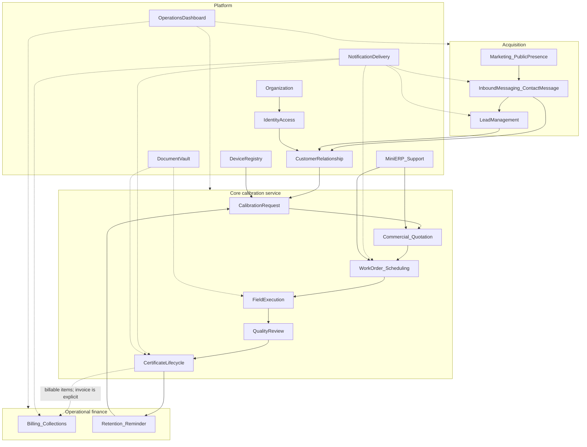

# Business Domain Document — medcal (CBMS)

**Product:** medcal — Calibration Business Management System  
**Status:** Aligned with ADR-000 + messaging bi-erp (ContactMessage / GetMessageFrom)  
**Project path:** `d:\medcal`  
**Related ADR:** [`docs/000-project-bootstrap.md`](./000-project-bootstrap.md)  
**Related catalog / ERD:** [`entity-catalog.md`](./entity-catalog.md), [`ERD/`](./ERD/)  
**Out of scope in this document:** code, Prisma schema, ERD tables detail, scaffolding

---

## 1. Product context

**medcal** is a modern web-based Calibration Business Management System (CBMS) for medical equipment calibration companies in Indonesia.

It is **not** only calibration field software. It is an integrated ecosystem:

| Surface | Role |
| ------- | ---- |
| Corporate Website | Acquisition & credibility |
| Customer Portal | Customer self-service |
| Technician PWA | Field execution |
| Dashboard | Operational control |
| Mini ERP | Light masters & operations support |
| Document Vault | Archive & document sharing |

**Technical boundary (decided, not the focus of this doc):**

- Express.js = **public edge only** (contact, lead capture, newsletter, WhatsApp, email, captcha, public/SEO endpoints)
- NestJS modular monolith = **the only business layer**
- Express MUST NOT contain business logic

**Architecture philosophy:** Modular Monolith · Mobile First · KISS · avoid overengineering · Redis / Queue / Microservice later if needed

**Organizational model (ADR-000):** **Company only** — no Branch entity, no `branchId` on business tables.

---

## 2. Domain map



**Rough dependency order (for validation, not a sprint plan):**  
Organization → IAM → Marketing → **Inbound Messaging (ContactMessage)** → Lead / CRM match → Device → Request → Commercial → WO → Field → QA → Certificate → Billing (explicit) → Reminder → Dashboard / Mini ERP / Vault.

**Default business policy (unless changed by ADR):**

```text
Website messaging (bi-erp ContactMessage.getFrom:
  CONTACTFORM | WHATSAPP | CHAT_AI | CHAT_PERSON | EMAIL)
  → ContactMessage (inbox)
  → Lead (new) OR existing Customer (admin-confirmed match)
  → Customer → CalibrationRequest
  → Quotation (wajib tercatat; boleh belakangan setelah telepon)
  → Work Order → Field Execution → QA approve
  → Certificate (issued → billable otomatis)
  → Invoice (eksplisit; M:N Certificate) → Reminder → Reorder
```

Lead generation dari website memakai **pola messaging yang sudah jalan di bi-erp** (`ContactMessage` + `GetMessageFrom`), lalu masuk pipeline CBMS sampai Certificate. WO → Certificate adalah tahap **delivery** dalam satu rantai.

**Commercial recording (LOCKED):**  
Quotation **selalu** harus tercatat di sistem. Kesepakatan lewat telepon/WA hanyalah saluran komunikasi — bukan pengganti record. Quotation boleh diinput **belakangan** setelah permintaan telepon, tetapi **sebelum** (atau paling lambat sebagai prasyarat) penerbitan WO yang sah. Tidak ada “quotation hanya di telepon / tidak masuk sistem”.

---

## 3. Domain catalog

Each domain below documents:

1. Purpose  
2. Responsibilities  
3. Main Actors  
4. Sub Domains  
5. Main Business Objects  
6. Future Dependencies  
7. Boundaries (belongs / does not belong)

---

### D01 — Organization

**Purpose**  
Represent the calibration provider as a single-level **Company** (multi-tenant-ready via `companyId`) **without** Branch and **without** a subscription module.

**Responsibilities**

- Define Company
- Provide organizational context (`companyId`) for all business transactions
- Hold business identity at company level (name, tax ID, lab address, official contacts)
- Organizational settings (timezone, document number prefixes — conceptual)

**Main Actors**

- Superadmin (initial setup)
- Company Admin

**Sub Domains**

- Company profile
- Organizational settings

**Main Business Objects**

- Company
- OrganizationProfile (concept)

**Future Dependencies**

- Almost all business domains depend on Company
- Later: SaaS tenant onboarding (out of current scope)
- Later multi-location lab needs = **new ADR + explicit migration** (do not keep idle `branchId`)

**Boundaries**

- **Belongs:** company identity, company-level settings
- **Does not belong:** Branch / multi-cabang routing, user login (IAM), service pricing (Mini ERP / Commercial), customer legal documents (CRM/Vault)
- **Removed (ADR-000):** Branch entity and `branchId` on business tables

---

### D02 — Identity & Access (IAM)

**Purpose**  
Control who can access the system and with what authority (RBAC), across portal / PWA / dashboard.

**Responsibilities**

- Authentication (session)
- Authorization via roles/permissions
- Bind users to **Company** and to Customer (for portal)
- Lifecycle of internal accounts (admin, supervisor, technician, finance) and customer accounts

**Main Actors**

- Superadmin, Admin, Supervisor, Technician, Finance, Customer user
- System (session/token)

**Sub Domains**

- Authentication
- Authorization / RBAC
- User profile
- Customer-user linkage

**Main Business Objects**

- User
- Role / Permission (concept)
- Session (technical concept owned by IAM)
- UserMembership (user ↔ **company** only)

**Future Dependencies**

- Used by almost all surfaces (Portal, PWA, Dashboard, Vault)
- Better Auth is the mechanism — implementation detail outside this domain doc

**Boundaries**

- **Belongs:** login, roles, permissions, company membership
- **Does not belong:** branch membership, commercial policy of “who may approve a quotation” as business rule (Commercial owns policy; IAM only enforces), notification content (Notification), device master data (Device)

---

### D03 — Marketing & Public Presence

**Purpose**  
Public company surface: credibility, service education, SEO, and non-transactional communication entry points that **feed** inbound messaging (does not own the inbox pipeline).

**Responsibilities**

- Corporate website content & calibration service landing
- SEO-oriented public presence / metadata concerns (product concept)
- Surface forms, WhatsApp deep-links, chat widgets, and newsletter CTAs
- Hand off visitor intent to **Inbound Messaging / Lead Management (D04)** via public edge
- Public website deployment locked to **one Company** via server-side config (ADR-000)

**Main Actors**

- Website visitor (anonymous — **no** Better Auth anonymous user)
- Marketing / Admin (content & channel management — later phase)
- Public Edge (Express) as **technical adapter** — captcha, rate limit, forward only

**Sub Domains**

- Corporate content
- SEO presence
- Public contact / chat / WA entry points (UI only)
- Newsletter subscription

**Main Business Objects**

- PublicPage / Content (concept)
- NewsletterSubscriber
- *(Inbound payloads are persisted as **ContactMessage** in D04 — not a separate LeadSubmission entity)*

**Future Dependencies**

- D04 ContactMessage + Lead pipeline
- Notification (light public confirmation email)
- Later: CMS if needed

**Boundaries**

- **Belongs:** website, SEO, newsletter, public CTA/helpers (WA link, open chat UI)
- **Does not belong:** inbox status, lead scoring, CRM match, quotation, WO, pricing, choosing `companyId` from the browser, owning `GetMessageFrom` business rules
- **Architecture note:** Express reads `COMPANY_ID` from **server env**, never from form body; forwards to Nest. Persistensi messaging & lead = Nest (D04)

---

### D04 — Inbound Messaging & Lead Management

**Purpose**  
Capture all public inbound communications using the **existing bi-erp messaging core**, then qualify them into CBMS leads/customers — without inventing a parallel “LeadSubmission channel” model.

**Messaging core (LOCKED — align `server-bi-erp`):**

```text
ContactMessage
  getFrom : GetMessageFrom = CONTACTFORM | WHATSAPP | CHAT_AI | CHAT_PERSON | EMAIL
  status  : ContactStatus  = PENDING | READ | REPLIED | CLOSED
  + name, email, phone?, organization?, subject?, message, topic?

Lead (CBMS pipeline — after / beside inbox)
  qualify → convert → Customer → CalibrationRequest
```

**Refinement policy:** field tambahan CBMS pada `ContactMessage` (mis. `matchStatus`, link Lead/Customer, `companyId` wajib) **boleh**; mengubah/mengganti enum `GetMessageFrom`, memecah inbox jadi model channel baru, atau menggabungkan chat session ke ContactMessage sebagai pengganti core bi-erp **tidak boleh** tanpa ADR.

**Responsibilities**

- Persist every inbound touch as **ContactMessage** (audit selalu ada)
- Classify origin via **`getFrom`** (bukan enum `channel` / `contact_form|chat|…` inventaran)
- Inbox workflow via **ContactStatus** (PENDING → READ → REPLIED → CLOSED)
- Before creating a new `Lead`, match email against CRM (D05): exact email preferred; corporate **email domain** only (public domains blocklisted)
- Possible existing customer → **admin manual confirmation** (no silent auto-merge), then route to `CalibrationRequest`
- No match → create/continue `Lead` pipeline (new → contacted → qualified → rejected → converted)
- Assign lead to admin/sales; convert Lead → Customer (+ optional Calibration Request)
- Optional later: port `ChatSession` / `ChatMessage` and full `Email` mailbox from bi-erp; when chat/email expresses service intent, still land or link a **ContactMessage** with the proper `getFrom`

**Main Actors**

- Admin / Sales / PIC (inbox + lead)
- Visitor (source)
- Customer (after conversion or when recognized as existing)
- System (edge forward + Nest persist)

**Sub Domains**

- ContactMessage inbox (bi-erp core)
- GetMessageFrom classification
- Existing-customer detection (email / email-domain)
- Lead qualification, assignment, conversion
- Chat realtime stack (later port)
- Email mailbox (later port; MVP: EMAIL via ContactMessage)

**Main Business Objects**

- **ContactMessage** (core intake — replaces document alias “LeadSubmission”)
- **GetMessageFrom** (enum concept — bi-erp values)
- **ContactStatus** (enum concept — bi-erp values)
- ContactTopic (optional / later)
- **Lead**
- LeadActivity / LeadNote (concept)
- ChatSession / ChatMessage (later — bi-erp)
- Email (+ contactMessageId link) (later — bi-erp)

**Future Dependencies**

- Customer Relationship (read for match; write on conversion)
- Notification (new ContactMessage / lead / “possible existing customer”)
- Calibration Request (after convert or existing-customer confirm)
- Operations Dashboard (inbox + funnel metrics)
- Organization (validate companyId)

**Boundaries**

- **Belongs:** ContactMessage inbox, getFrom/status, lead pipeline, CRM match workflow, assignment/conversion
- **Does not belong:** SEO/CMS content (D03), formal pricing (Commercial), WO/certificates, trusting `companyId` from client, rewriting bi-erp messaging core into a new abstraction
- **Not owned by Express:** persistensi, match, status/conversion (Express only forwards public payloads + env companyId)
- **D03 vs D04:** D03 = public surface & CTA; D04 = durable messaging + lead business rules

---

### D05 — Customer Relationship (CRM)

**Purpose**  
Manage hospitals, clinics, and customer organizations as the parties being served.

**Responsibilities**

- Customer master data (legal, address, contacts, PIC)
- Portal access linkage (with IAM)
- High-level relationship history (not every transaction detail)
- Provide email / email-domain identity used by ContactMessage / Lead matching (D04)

**Main Actors**

- Admin
- Finance (read)
- Customer PIC (portal)
- Sales (after lead conversion)

**Sub Domains**

- Customer master
- Customer contacts / PIC
- Customer sites / on-site service locations (concept — free address/location, **not** Branch)
- Portal entitlement (with IAM)

**Main Business Objects**

- Customer
- CustomerContact
- CustomerSite / ServiceLocation (concept)

**Future Dependencies**

- Device Registry, Request, Quotation, Invoice, Vault, Reminder
- Lead / Messaging (match source — ContactMessage.getFrom + email)
- Dashboard (customer health)

**Boundaries**

- **Belongs:** who the customer is, contacts, service locations
- **Does not belong:** provider Branch model, full measurement results (Field/QA), certificate numbers (Certificate), detailed AR posting (Billing; CRM may consume summaries only)

---

### D06 — Device Registry

**Purpose**  
Register customer-owned medical devices that are the objects of calibration.

**Responsibilities**

- Device inventory per customer (brand, model, serial, location, category)
- Import device lists (from request / portal upload)
- Act as reference for request lines, WO, certificates
- Registry-level status (active/inactive) — not in-progress calibration status

**Main Actors**

- Customer (upload/list)
- Admin
- Technician (limited field read/update)
- Supervisor (verification)

**Sub Domains**

- Device master
- Device category / type (concept)
- Device import / bulk registration
- Device location mapping

**Main Business Objects**

- Device
- DeviceCategory (concept)
- DeviceImportBatch (concept)

**Future Dependencies**

- Calibration Request (line items)
- Field Execution & Certificate (work objects)
- Reminder (which devices’ certificates are near expiry — with Certificate)
- Mini ERP: only if a shared “device type catalog” is needed — avoid overlap

**Boundaries**

- **Belongs:** identity & inventory of **customer** devices
- **Does not belong:** lab-owned standard instruments (Mini ERP / Metrology Assets), measurement results (Field), certificate files (Certificate/Vault)

---

### D07 — Calibration Request

**Purpose**  
Formalize a calibration service request from a customer (or from lead conversion / existing-customer confirmation).

**Responsibilities**

- Create & track service requests
- Service mode: on-site vs send-to-lab
- Attach / reference device lists
- Feed the commercial process (quotation)

**Main Actors**

- Customer
- Admin
- Sales

**Sub Domains**

- Request intake
- Service mode selection (on-site / lab)
- Request line items (devices)
- Request status lifecycle

**Main Business Objects**

- CalibrationRequest
- CalibrationRequestItem
- ServiceMode (enum concept)

**Future Dependencies**

- Commercial / Quotation (required next step)
- Device Registry, CRM
- Notification (status to customer)
- Document Vault (device list attachments)

**Boundaries**

- **Belongs:** what should be calibrated, where, desired timing
- **Does not belong:** formal price offer (Commercial), technician scheduling (WO), field execution (Field)

---

### D08 — Commercial / Quotation

**Purpose**  
Turn a request into a priced offer that the customer approves before work starts.

**Responsibilities**

- Build quotation from request + price catalog
- Capture commercial agreements that started on phone/WA into the system (may be entered **after** the call, never left unrecorded)
- Review & send offer
- Customer approve / reject (or internal confirm per company policy)
- Gate Work Order generation

**Main Actors**

- Admin / Sales
- Finance (optional review)
- Customer (approve/reject in portal)

**Sub Domains**

- Price application
- Quotation drafting (including late entry after phone request)
- Quotation approval workflow
- Commercial terms (VAT, offer validity — concept)
- Quotation source channel (portal / phone / WA / etc. — concept)

**Main Business Objects**

- Quotation
- QuotationItem
- QuotationApproval (concept)
- QuotationSource (concept: portal | phone | whatsapp | other)
- PriceList / ServiceTariff (may be owned by Mini ERP — see dependency)

**Future Dependencies**

- Work Order (after approve)
- Billing (amount reference for later invoices)
- Mini ERP Service Catalog (tariff source)
- Notification (new offer / approval result)
- Dashboard (conversion rate)

**Boundaries**

- **Belongs:** offer, pricing, commercial approve/reject, recording phone/WA deals into the system
- **Does not belong:** technician schedule, measurement entry, certificate issuance, invoice settlement (Billing), “verbal-only” commercial with no system record
- **Ownership note:** if long-lived price masters live in Mini ERP, Commercial **consumes** tariffs; Mini ERP **manages** tariff masters
- **LOCKED:** every priced agreement must have a Quotation record — late entry after phone is allowed; skipping the system is not

---

### D09 — Work Order & Scheduling

**Purpose**  
Turn an approved quotation into a scheduled, assigned work order.

**Responsibilities**

- Generate Work Order (WO number)
- Assign technicians
- Schedule & **work location** as free-text address / coordinates / on-site vs lab mode — **not** a Branch FK (ADR-000)
- Reference required standard instruments (coordinate with Mini ERP assets)
- WO status until ready for execution / administratively closed
- May be **linked** to an Invoice for traceability/consolidation context, but WO is **not** an independently billable SoR (ADR billable lock: Certificate-only)

**Main Actors**

- Admin / Dispatcher
- Technician
- Supervisor
- Customer (view schedule in portal)

**Sub Domains**

- WO issuance
- Technician assignment
- Scheduling & calendar
- Resource readiness (standard instruments)
- Work location capture (address / geo / lab flag)

**Main Business Objects**

- WorkOrder
- WorkOrderAssignment
- WorkOrderSchedule
- WorkLocation (concept — not Branch)
- RequiredStandardInstrument (reference concept)

**Future Dependencies**

- Field Execution
- Mini ERP Metrology Assets (availability)
- Notification (assign to PWA)
- Dashboard (open WO, schedule SLA)
- Billing (optional M:N **reference** link for audit/grouping only — WO is not billable SoR)

**Boundaries**

- **Belongs:** work command — who, when, where (as location data)
- **Does not belong:** Branch master, measurement checklist & photos (Field), quality approval (QA), certificate PDF (Certificate), creating invoices or carrying billable/invoiced commercial status (Billing / Certificate)
- **LOCKED:** WO is not a billable SoR; invoicing selects Certificates only

---

### D10 — Field Calibration Execution

**Purpose**  
Execute calibration work in the field/lab via Technician PWA.

**Responsibilities**

- Job checklist
- Measurement result entry
- Evidence photo upload
- Customer signature
- Mark technical completion for review

**Main Actors**

- Technician
- Customer PIC (signature / presence confirmation)
- Supervisor (read results before/during QA)

**Sub Domains**

- Job checklist
- Measurement entry
- Evidence capture (photo)
- Customer acknowledgment (signature)
- Offline-ready field ops (PWA product direction; technical detail later)

**Main Business Objects**

- CalibrationJob (execution per WO/device)
- MeasurementResult
- JobEvidence
- CustomerSignature

**Future Dependencies**

- Quality Review (required after submit)
- Document Vault (store evidence)
- Notification (job done → supervisor)
- Device Registry (device context)

**Boundaries**

- **Belongs:** execution & raw work results
- **Does not belong:** formal quality pass decision (QA), legal certificate issuance (Certificate), billing (Billing)
- **Not:** major rescheduling (return to WO/Scheduling)

---

### D11 — Quality Assurance & Review

**Purpose**  
Ensure calibration results are valid before a certificate is issued (internal quality control).

**Responsibilities**

- Supervisor review of results & evidence
- Verify data completeness
- Approve / Reject
- Trigger rework on reject

**Main Actors**

- Supervisor
- Technician (rework)
- Admin (monitoring)

**Sub Domains**

- Result verification
- Approval decision
- Rework loop

**Main Business Objects**

- QualityReview
- ReviewDecision (approve/reject)
- ReworkRequest (concept)

**Future Dependencies**

- Certificate Lifecycle (after approve)
- Field Execution (rework)
- Notification
- Dashboard (rework rate, cycle time)

**Boundaries**

- **Belongs:** quality decision on work results
- **Does not belong:** rewriting schedule (WO), calculating invoice, PDF template design (Certificate/Vault), marketing

---

### D12 — Certificate Lifecycle

**Purpose**  
Issue, identify, archive, and manage validity of calibration certificates — and mark them **billable** for later invoicing.

**Responsibilities**

- Generate certificate (PDF) after QA approve
- Certificate number & verification QR
- Digital archive
- Track validity / expiry dates
- Provide downloads in customer portal
- Own **system of record** for billing readiness: status such as `unbilled` / `billable` / `invoiced` (**LOCKED — Certificate-only**; WO is not billable SoR)
- Issuing a certificate does **not** automatically create an Invoice
- Visit/transport/surcharge amounts, if any, are modeled as commercial lines that land on Certificate (or Quotation→Certificate), not as separately billable WO items

**Main Actors**

- Supervisor / Admin (issue)
- Customer (download/verify)
- Limited public (QR verification — later phase)
- Finance (read billable status — does not issue certificates)

**Sub Domains**

- Certificate issuance
- Certificate identification (number, QR)
- Certificate archive
- Validity tracking
- Billable lifecycle flags

**Main Business Objects**

- Certificate
- CertificateNumberSeries (concept)
- CertificateValidity
- VerificationToken / QR payload (concept)
- CertificateBillingStatus (concept: unbilled | billable | invoiced)

**Future Dependencies**

- Billing (consumes billable certificates via explicit invoice creation; M:N)
- Retention & Reminder (based on validity)
- Document Vault (file storage)
- Notification
- Dashboard (expiring soon / unbilled certificates)

**Boundaries**

- **Belongs:** certificate artifact, validity meaning, billable/invoiced flags (SoR — **only** billable source for MVP)
- **Does not belong:** raw measurements as primary technical SoR (Field/QA), general customer folders (Vault), composing/settling invoices (Billing), auto-invoice on issue, delegating billable status to WO

---

### D13 — Billing & Collections

**Purpose**  
Invoice calibration services (optionally consolidating many certificates), record payments, and issue credit notes for financial corrections — without full accounting ERP.

**Responsibilities**

- **Explicit** invoice creation by admin/finance (ADR-000) — not an automatic side effect of one Certificate
- One `Invoice` may cover **many** `Certificate` items for the **same Customer** (many-to-many)
- Select only Certificates in **billable / unbilled** state; mark them **invoiced** after inclusion
- Work Orders may appear only as **optional reference/grouping** on an invoice for audit — they do **not** carry billable status (**LOCKED: Certificate-only SoR**)
- Record **Payment** (including partial)
- Issue **Credit Note** for corrections (wrong amount, Certificate revoked/superseded after invoiced, commercial goodwill) — does not silently delete Invoice
- Present bills & credit notes in customer portal
- **MVP locked set:** Invoice + Payment + Credit Note (Debit Note & dedicated Refund later)

**Main Actors**

- Finance
- Admin
- Customer (view & payment confirmation — per business process)

**Sub Domains**

- Invoice drafting & consolidation
- Payment recording
- Credit note / adjustments
- Accounts receivable (operational)
- Credit / settlement status

**Main Business Objects**

- Invoice
- InvoiceItem
- InvoiceCertificateLink (M:N join — **required** billable path)
- InvoiceWorkOrderRef (optional audit/grouping only — not billable SoR)
- Payment
- CreditNote
- ReceivableBalance (concept)
- DebitNote / Refund (later — not MVP)

**Future Dependencies**

- Commercial (amount reference)
- Certificate (**only** billable SoR; revoke-after-invoice → CreditNote path)
- Notification (invoice / payment / credit note)
- Mini ERP (only if a very light CoA appears later — do not become full accounting)
- Dashboard (revenue, outstanding, unbilled certificate backlog, credit notes)

**Boundaries**

- **Belongs:** invoice composition from **Certificates**, payment, credit note adjustments, paid/outstanding operational status
- **Does not belong:** full general ledger / accounting ERP, payroll, complex inventory valuation, auto-create invoice on every certificate issue, treating WO as billable line SoR, auto-void invoice on certificate revoke
- **Not full Mini ERP:** Billing owns money for calibration services; Mini ERP may hold supporting masters, not replace Billing
- **LOCKED (Opsi A):** billable SoR = Certificate only
- **LOCKED (MVP docs):** Invoice + Payment + Credit Note

---

### D14 — Retention & Reminder

**Purpose**  
Protect recurring revenue by reminding customers before certificates expire and enabling reorder.

**Responsibilities**

- Identify certificates/devices nearing expiry (e.g. H-30)
- Send reminders (push/email/WA per policy)
- Trigger reorder → new Calibration Request

**Main Actors**

- System (scheduler concept)
- Admin / Sales (follow-up)
- Customer (receive reminder, reorder)

**Sub Domains**

- Expiry detection
- Reminder campaign / rules
- Reorder conversion

**Main Business Objects**

- ReminderPolicy (concept)
- ReminderEvent
- ReorderDraft / link to CalibrationRequest

**Future Dependencies**

- Certificate Lifecycle, Device, CRM
- Notification Delivery
- Calibration Request
- Dashboard (retention metrics)

**Boundaries**

- **Belongs:** retention reminder rules & execution
- **Does not belong:** website marketing content (Marketing), cold non-expiry lead pipeline (Lead), pure overdue payment chasing (Billing — separate payment reminder if split later)

---

### D15 — Operations Dashboard & Reporting

**Purpose**  
Give managerial visibility into operational health and business funnel.

**Responsibilities**

- Operational KPIs (open WO, SLA, rework, expired certificates, unbilled billable backlog)
- Acquisition KPIs (ContactMessage volume by getFrom, lead conversion, existing-customer match rate)
- Light financial snapshots (revenue, receivables)
- Filter by **Company** only (ADR-000 — no Branch filter)

**Main Actors**

- Admin, Supervisor, Finance, Superadmin
- Not customers (unless a later limited portal summary)

**Sub Domains**

- Operational KPIs
- Commercial funnel metrics
- Financial snapshots

**Main Business Objects**

- DashboardWidget / MetricSnapshot (read concept)
- ReportDefinition (concept)

**Future Dependencies**

- Almost all core domains (read-only aggregation)
- Does not write business transactions

**Boundaries**

- **Belongs:** aggregation & decision views at Company scope
- **Does not belong:** Branch comparison dimension, system of record for transactions, separate BI warehouse (not yet), editing WO from a chart without going through WO domain

---

### D16 — Mini ERP Support

**Purpose**  
Provide operational master data and lab support inventory so calibration & commercial processes stay consistent — **not** a full accounting ERP.

**Responsibilities**

- Service catalog / service tariffs
- Inventory of lab-owned standard instruments & availability
- Supporting masters (units, simple tax rate, number-series config — concept)
- Prefer: receivables stay in Billing; Mini ERP = masters + assets

**Main Actors**

- Admin
- Finance
- Dispatcher / Technician (check standard instrument availability)

**Sub Domains**

- Service catalog & pricing master
- Metrology standard instruments inventory
- Operational masters
- Light purchasing/stock of standards (optional later)

**Main Business Objects**

- ServiceTariff / PriceListItem
- StandardInstrument
- StandardInstrumentCalibrationStatus (meta: calibration of the standard itself)
- OperationalMaster (concept)

**Future Dependencies**

- Commercial (tariffs)
- Work Order (standard instruments)
- Field (standards used as reference)
- Later: light procurement

**Boundaries**

- **Belongs:** tariff masters, lab assets, operational masters
- **Does not belong:** full GL/accounting, HR/payroll, deep CRM (CRM), customer devices (Device Registry), invoice posting (Billing)
- **KISS:** do not grow into SAP; only support CBMS

---

### D17 — Document Vault

**Purpose**  
Store and share business documents (certificates, field evidence, request attachments) with access control — internal vault, not a Google Drive competitor.

**Responsibilities**

- Folder/logical grouping per company/customer/WO
- Upload, preview, download
- Time-limited share links + permissions
- Storage backend for other domains (does not replace Certificate metadata)

**Main Actors**

- Admin, Supervisor, Technician, Finance, Customer (limited)
- System (uploads from Field/Certificate)

**Sub Domains**

- File object storage
- Folder / taxonomy
- Sharing & permissions
- File retention (concept)

**Main Business Objects**

- FileObject
- Folder
- ShareLink
- FilePermission (concept)

**Future Dependencies**

- Certificate, Field evidence, Request attachments, Billing docs
- IAM for access enforcement

**Boundaries**

- **Belongs:** file storage & sharing
- **Does not belong:** certificate number generation (Certificate), OCR/AI (not yet), desktop sync client, website CMS (Marketing)

---

### D18 — Notification Delivery (supporting domain)

**Purpose**  
Deliver multi-channel notifications as a consequence of other domain events.

**Responsibilities**

- Channels: email, push (service worker), WhatsApp, contact formatting
- Called by other domains after business decisions (including new ContactMessage / lead alerts)
- Does **not** decide business policy such as “when a lead is qualified” or replace ContactMessage inbox

**Main Actors**

- System
- All human actors as recipients

**Sub Domains**

- Email delivery
- Web Push delivery
- WhatsApp delivery
- Contact/message normalization

**Main Business Objects**

- NotificationMessage (concept)
- PushSubscription (often near IAM/user device technically)
- DeliveryReceipt (concept)

**Future Dependencies**

- Lead, WO, QA, Certificate, Billing, Reminder
- Channel adapters (`packages/notifications/*`) = HOW; Nest orchestration = WHEN

**Boundaries**

- **Belongs:** delivery & channel adapters
- **Does not belong:** H-30 retention policy (Retention), SEO content (Marketing), certificate PDF templates (Certificate)

---

## 4. Surface → domain matrix

| Surface | Primary domains served |
| ------- | ---------------------- |
| Corporate Website | D03 Marketing CTAs → D04 ContactMessage intake (env-locked companyId) |
| Customer Portal | D05 CRM, D04 inbox/lead (admin), D07 Request, D08 Commercial, D12 Certificate, D13 Billing, D14 Reminder, D17 Vault |
| Technician PWA | D09 WO (read), D10 Field, D17 Vault (evidence), D18 Notification |
| Dashboard | D15 + read models (incl. inbox/funnel from D04) |
| Mini ERP UI | D16 (+ read D13) |
| Document Vault UI | D17 |
| Public Edge (Express) | Adapter for D03/D04 capture only — **not** domain owner; injects `COMPANY_ID`; forwards ContactMessage payloads |

---

## 5. Cross-domain rules

1. **Single business layer:** all rules above live in Nest modules; Express has no domain logic.
2. **Company only:** no Branch; all business data scoped by `companyId`.
3. **Public edge company binding:** website `companyId` comes from server env, never from client payload; Nest validates it.
4. **Inbound messaging core (LOCKED):** public intake = **ContactMessage** + **GetMessageFrom** / **ContactStatus** (bi-erp). No parallel LeadSubmission-channel model. CBMS may add fields (matchStatus, Lead link) without changing that core.
5. **ContactMessage vs Lead:** every inbound touch is a ContactMessage; **Lead** is the CBMS qualification pipeline created when the prospect is new (not a confirmed existing customer).
6. **Lead / ContactMessage vs existing customer:** email-domain match (excluding public-mail blocklist) requires **admin confirmation** before treating as existing CRM customer.
7. **Certificate is not issued without QA approve** (unless an explicit later ADR).
8. **WO is not created without an approved Quotation recorded in the system.** Phone/WA may start the conversation; Quotation may be entered later after the call, but it must exist and be approved before a valid WO. No unrecorded verbal quotation. (Emergency WO without quotation remains **not** allowed unless a future ADR explicitly opens it.)
9. **Device Registry ≠ StandardInstrument** (customer asset vs lab asset).
10. **Billing ≠ Mini ERP accounting.**
11. **Vault stores files; Certificate owns business meaning** (number, validity, billable flags).
12. **Notification does not own ContactMessage/Lead/WO pipelines** (it only delivers).
13. **Invoice is explicit and M:N to Certificates:** Certificate issue ≠ auto invoice; finance consolidates billable Certificates into one Invoice per customer as needed.
14. **Billable SoR = Certificate only (LOCKED — Opsi A):** status `unbilled` / `billable` / `invoiced` lives on Certificate. WO is not independently billable; optional WO reference on invoice is audit/grouping only.
15. **Quotation always recorded (LOCKED):** kesepakatan telepon/WA wajib diinput sebagai Quotation di sistem (boleh belakangan setelah panggilan); tidak ada shadow quotation di luar sistem.
16. **MVP billing docs (LOCKED):** Invoice + Payment + Credit Note. Debit Note & dedicated Refund later.
17. **Revoke/supersede after invoiced:** may change `Certificate.status`; must **not** auto-change `billingStatus` away from `invoiced` and must **not** auto-void Invoice/Payment; financial correction via **CreditNote** (explicit).

---

## 6. Intentionally not separate domains (for now)

| Idea | Why merged / deferred |
| ---- | --------------------- |
| Branch / multi-cabang | Removed by ADR-000 until proven need |
| Full Accounting / GL | Overengineering; D13 + D16 enough |
| HR / Technician payroll | Outside CBMS MVP |
| Merchandise warehouse | Not core business model |
| Full CMS | D03 enough until needed |
| New messaging abstraction replacing ContactMessage | Use bi-erp core; refine fields only (ADR-000 §8) |
| Parallel LeadSubmission.channel enum | Superseded by GetMessageFrom |
| Multi-company SaaS subscription billing | Org readiness only; sister companies = separate web deploy + `COMPANY_ID` |
| HIS/LIS hospital integration | Future; not MVP domain |

---

## 7. Validation checklist (remaining)

No open billable-SoR question for MVP.

Closed:

- [x] Company only (no Branch)
- [x] Server-side `COMPANY_ID` for public website
- [x] Lead dedup via email domain + manual confirm (+ public domain blocklist)
- [x] Invoice M:N + explicit creation
- [x] Reminder remains its own domain (D14)
- [x] Newsletter stays under Marketing (D03)
- [x] **Inbound messaging = ContactMessage + GetMessageFrom** (bi-erp core); Lead = CBMS pipeline; LeadSubmission naming retired
- [x] Messaging refinement allowed only as additive CBMS fields — core getFrom/status/inbox unchanged
- [x] Device (customer) vs StandardInstrument (lab) split kept
- [x] **Quotation always recorded** — phone/WA OK as channel; late system entry OK; WO requires approved Quotation
- [x] **Billable SoR = Certificate only (Opsi A)** — WO not independently billable; visit/surcharge via Certificate/Quotation lines if needed
- [x] **MVP billing = Invoice + Payment + Credit Note** — Debit Note/Refund later; revoke-after-invoice → CreditNote, not silent void

---

## 8. Next step

- Entity catalog: [`entity-catalog.md`](./entity-catalog.md)  
- ERD draft: [`ERD/`](./ERD/)  
- Setelah approve ERD → Prisma → Fase 0 scaffold
