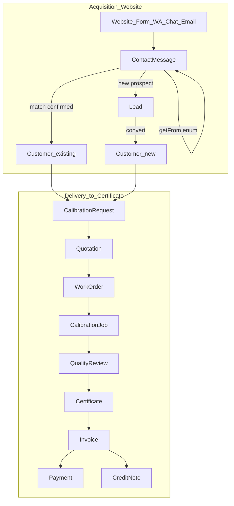
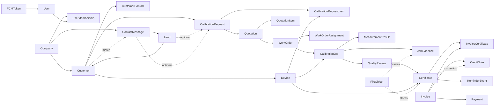

# Entity Catalog — medcal (CBMS)

**Status:** Draft for validation  
**Sources:** [`business-domain.md`](./business-domain.md), [`000-project-bootstrap.md`](./000-project-bootstrap.md)  
**Related architecture decision:** [BIPMED → MedCal Architecture Adoption Matrix](../Architecture/01-bipmed-medcal-architecture-adoption-matrix.md) — locked source for the Chat MVP status, `ChatSessionToken`, `EmailWhitelist`, and FCM-token corrections below.  
**Out of scope:** Prisma schema, SQL DDL, indexes, column types, scaffolding

This document translates locked business domains into **conceptual entities**, relationships, lifecycles, and ownership. It is the bridge before ERD / Prisma.

---

## 1. Conventions

| Rule | Meaning |
| ---- | ------- |
| `companyId` | Required on every business entity (tenant scope). No `branchId`. |
| Entity | Named business object that will likely become a persistence model |
| Concept-only | Documented for clarity; may stay embedded JSON / enum / derived — decide at ERD |
| Write owner | Nest module/domain that may create/update |
| Read consumers | Other domains that may read |
| MVP | Needed for Website → Lead → Portal → Calibration → Invoice path |
| Later | Documented but deferrable |

**IDs:** opaque string IDs (cuid/uuid) — choice deferred to Prisma phase.

**Actors (roles):** `superadmin` · `admin` · `supervisor` · `technician` · `finance` · `customer`

---

## 1b. End-to-end funnel (mengapa Lead Generation penting)

Lead generation dari **Corporate Website** adalah **pintu masuk utama** funnel bisnis — bukan fitur sampingan. Tanpa akuisisi ini, alur WO → Certificate hanya melayani customer yang sudah ada (portal / telepon), dan ekosistem B2B kehilangan sumber growth.

```text
[Website B2B — pola messaging bi-erp]
  CONTACTFORM / WHATSAPP / CHAT_* / EMAIL
        │
        ▼
ContactMessage (getFrom + status inbox)
        │
        ├── match confirmed → existing Customer → CalibrationRequest
        └── new prospect → Lead → convert → Customer → CalibrationRequest
        │
        ▼
Quotation (wajib tercatat) → WorkOrder → … → Certificate → Invoice
```

| Tahap | Surface | Domain | Entity inti |
| ----- | ------- | ------ | ----------- |
| Capture | `apps/web` + `apps/web-api` | D03 → D04 | **ContactMessage** (`GetMessageFrom`) |
| Qualify / convert | Portal admin | D04 → D05 | Lead → Customer |
| Existing customer shortcut | Admin confirm | D04 + D05 | match → Request |
| Deliver service | Portal / PWA | D07–D12 | Request → … → Certificate |
| Collect & retain | Portal / Finance | D13–D14 | Invoice, CreditNote, Reminder |

**Edge vs bisnis (locked):** website **tidak** punya business logic; Express hanya captcha/rate-limit/forward + `COMPANY_ID` env. Persistensi & pipeline lead = Nest (D04).

**Dua jalur masuk ke Request (sama-sama sah):**

1. **Website / lead gen** → LeadSubmission → Lead → Customer → Request → … → Certificate  
2. **Customer existing** (portal, telepon + quotation belakangan, reorder reminder) → Request → … → Certificate  

Jalur (1) adalah **awal berjalannya CBMS sebagai mesin akuisisi**; jalur (2) adalah operasi recurring. Entity catalog & ERD harus memodelkan keduanya — bukan hanya mulai dari WO.

---

## 2. Core relationship map (MVP spine)

Spine digambar dalam **dua lapis**: Acquisition (kiri) lalu Delivery (kanan).





---

## 3. Entities by domain

### D01 — Organization

| Entity | MVP | Purpose | Key relationships | Notes |
| ------ | --- | ------- | ----------------- | ----- |
| **Company** | Yes | Tenant / provider org | 1 → N most business entities | No Branch |
| **CompanySettings** | Later | Prefix nomor dokumen, timezone, reminder defaults | N:1 Company | May start embedded on Company |

**Lifecycle:** Company `active` \| `inactive`

**Write owner:** Organization / Superadmin  
**Does not include:** Branch

---

### D02 — Identity & Access (IAM)

| Entity | MVP | Purpose | Key relationships | Notes |
| ------ | --- | ------- | ----------------- | ----- |
| **User** | Yes | Login identity | 1 → N UserMembership; optional 1 → 1 link to CustomerContact | Better Auth tables may mirror/extend |
| **UserMembership** | Yes | User ↔ Company + role | N:1 User, N:1 Company | Role on membership (not global-only) |
| **Session** | Yes | Auth session | N:1 User | Often owned by Better Auth — treat as IAM-owned |
| **CustomerUserLink** | Yes | Portal user ↔ Customer | User ↔ Customer | Ensure customer sees only their data |
| **EmailWhitelist** | Yes | Registration gate — email must be pre-listed before sign-up succeeds | Standalone; no companyId | Normalized unique email, `active`/`revoked` status (reusable, not consumed), `createdBy`/`createdAt`/`revokedBy`/`revokedAt` audit fields. `whitelist:manage` permission → `superadmin` by default |

**Lifecycle (User):** `invited` \| `active` \| `disabled`
**Lifecycle (EmailWhitelist):** `active` \| `revoked`

**Write owner:** IAM  
**Read:** all authenticated surfaces

---

### D03 — Marketing & Public Presence (website lead generation surface)

**Role in funnel:** pintu akuisisi B2B — SEO, landing, contact, WA, newsletter intent.  
Ini **bukan** “halaman statis saja”; setiap interaksi bermakna yang meminta jasa harus berujung pada **LeadSubmission** (D04).

| Entity | MVP | Purpose | Key relationships | Notes |
| ------ | --- | ------- | ----------------- | ----- |
| **NewsletterSubscriber** | Later | Email opt-in | N:1 Company | Bukan pengganti Lead bila intent = minta kalibrasi |
| **PublicContent** | Later | CMS-like pages | N:1 Company | Defer; static site OK initially |

**Website capture channels (MVP — bi-erp `GetMessageFrom`):**

| getFrom | Becomes | Notes |
| ------- | ------- | ----- |
| `CONTACTFORM` | ContactMessage | Form kontak / penawaran |
| `WHATSAPP` | ContactMessage | WA handoff |
| `CHAT_AI` / `CHAT_PERSON` | ContactMessage (+ ChatSession, MVP) | Intent jasa dari chat |
| `EMAIL` | ContactMessage | Inbound email ringkas; full Email model later |

**No durable anonymous user** for public web.

**Write owner:** Marketing via Nest (edge forwards)  
**companyId:** from server env on public deploy  
**Hand-off:** D03 stops at “intent captured”; **D04 owns pipeline**

---

### D04 — Lead Management (pipeline setelah website capture)

**Role in funnel:** mengubah inbound messaging (pola bi-erp) menjadi Customer / CalibrationRequest — **mata rantai wajib** antara website dan WO/Certificate.

**Intake model (LOCKED — align `server-bi-erp`):**  
Gunakan pola **`ContactMessage` + `GetMessageFrom`** yang sudah jalan di BIPMED/bi-erp, bukan enum channel inventaran baru.

Dari `D:\bi-erp\server-bi-erp\prisma\schema.prisma`:

```text
ContactMessage
  getFrom: GetMessageFrom = CONTACTFORM | WHATSAPP | CHAT_AI | CHAT_PERSON | EMAIL
  status:  ContactStatus  = PENDING | READ | REPLIED | CLOSED
  + name, email, phone?, company?, subject?, message, topic_id?
```

Di medcal, **`LeadSubmission` = alias konseptual dari `ContactMessage`** (boleh namakan entity `ContactMessage` di Prisma agar familiar dengan kode existing). **Human Live Chat adalah MVP (updated — lihat Adoption Matrix)**: `ChatSession` / `ChatMessage` di-port dari bi-erp, human-responder-only (tanpa field `mode`/AI sampai ada ADR baru); WebSocket dihosting di `apps/api` (NestJS), bukan service terpisah. Staff pakai session Better Auth yang sudah ada; visitor anonim divalidasi lewat `ChatSessionToken` — cookie sempit, revocable, terikat ke satu `ChatSession`, tanpa role/permission/`userId`, dan tidak pernah auto-merge ke user account. Saat intent jadi prospek jasa, buat/tautan `ContactMessage` dengan `getFrom = CHAT_AI | CHAT_PERSON`.

| Entity | MVP | Purpose | Key relationships | Notes |
| ------ | --- | ------- | ----------------- | ----- |
| **ContactMessage** (a.k.a. LeadSubmission) | Yes | Unified inbound inbox — **same pattern as bi-erp** | N:1 Company; optional → Lead; optional → Customer (match); optional topic | `getFrom` enum di bawah |
| **ContactTopic** | Later | Topik form (bi-erp) | 1 → N ContactMessage | Boleh string topic dulu |
| **Lead** | Yes | Pipeline prospect setelah qualify | N:1 Company; optional ← ContactMessage; optional → Customer | Created only if not confirmed existing customer |
| **LeadActivity** | Later | Notes / call log | N:1 Lead | Can start as notes field on Lead |
| **ChatSession / ChatMessage** | **Yes (MVP)** | Realtime chat stack (bi-erp), human-only | Session 1 → N Message; optional → ContactMessage | No `mode`/AI field in MVP — future ADR only |
| **ChatSessionToken** | **Yes (MVP)** | Anonymous-visitor chat continuity credential | 1:1 → ChatSession | Not a Better Auth construct; not an IAM identity; not auto-merged into a User |
| **Email** (opsional) | Later | Full mailbox (bi-erp) | optional `contactMessageId` | MVP: EMAIL cukup via ContactMessage.getFrom |

**GetMessageFrom (LOCKED — copy bi-erp):**  
`CONTACTFORM` \| `WHATSAPP` \| `CHAT_AI` \| `CHAT_PERSON` \| `EMAIL`

**ContactStatus (from bi-erp):**  
`PENDING` \| `READ` \| `REPLIED` \| `CLOSED`

**ContactMessage.matchStatus (medcal extension for CRM dedup):**  
`none` \| `exact_email` \| `domain_candidate` \| `confirmed_existing` \| `dismissed`

**Lead.status:** `new` \| `contacted` \| `qualified` \| `rejected` \| `converted`

**Rules (locked):**
- Public email domains not used for domain-match
- Admin confirms before treating as existing customer
- Exact email match preferred
- Do **not** invent parallel `channel` enum (`contact_form|chat|…`); use **`getFrom`**
- Phone-only intake tanpa pesan: buat ContactMessage manual dengan `getFrom` paling dekat (mis. CONTACTFORM) + catatan, atau perluas enum nanti via ADR (`PHONE`) — jangan pecah model

**Refinement (tanpa ubah core bi-erp):** field CBMS tambahan di ContactMessage saja (`matchStatus`, link Lead/Customer). Jangan rename `GetMessageFrom` / pecah inbox jadi model channel baru.

---

### D05 — Customer Relationship (CRM)

| Entity | MVP | Purpose | Key relationships | Notes |
| ------ | --- | ------- | ----------------- | ----- |
| **Customer** | Yes | Hospital/clinic org | N:1 Company; 1 → N Contact, Device, Request, Invoice | |
| **CustomerContact** | Yes | PIC / emails | N:1 Customer | Email used for lead match |
| **CustomerSite** | Later | On-site address book | N:1 Customer | WO may use free-text location first |

**Customer.status:** `active` \| `inactive`

**Write owner:** CRM  
**Read:** Lead, Request, Commercial, Billing, Reminder, Portal

---

### D06 — Device Registry

| Entity | MVP | Purpose | Key relationships | Notes |
| ------ | --- | ------- | ----------------- | ----- |
| **Device** | Yes | Customer-owned instrument | N:1 Customer, N:1 Company | ≠ StandardInstrument |
| **DeviceCategory** | Later | Classification | optional N:1 from Device | Enum/string OK at first |
| **DeviceImportBatch** | Later | Bulk upload tracking | N:1 Customer | |

**Device.status:** `active` \| `inactive`

**Write owner:** Device Registry  
**Read:** Request, Field, Certificate, Reminder

---

### D07 — Calibration Request

| Entity | MVP | Purpose | Key relationships | Notes |
| ------ | --- | ------- | ----------------- | ----- |
| **CalibrationRequest** | Yes | Service request | N:1 Customer, Company; optional ← Lead | |
| **CalibrationRequestItem** | Yes | Device lines on request | N:1 Request; N:1 Device | |

**ServiceMode (enum):** `on_site` \| `send_to_lab`

**CalibrationRequest.status:** `draft` \| `submitted` \| `in_quotation` \| `cancelled` \| `fulfilled`

**Write owner:** Calibration Request  
**Gate out:** feeds Quotation

---

### D08 — Commercial / Quotation

| Entity | MVP | Purpose | Key relationships | Notes |
| ------ | --- | ------- | ----------------- | ----- |
| **Quotation** | Yes | Priced offer (always recorded) | N:1 Customer, Company; optional N:1 Request; 1 → N Item; 1 → N WorkOrder (after approve) | Phone/WA = source only |
| **QuotationItem** | Yes | Line pricing | N:1 Quotation; optional → Device / RequestItem | May include visit/surcharge lines that later flow to Certificate amounts |

**QuotationSource (enum):** `portal` \| `phone` \| `whatsapp` \| `other`

**Quotation.status:** `draft` \| `sent` \| `approved` \| `rejected` \| `expired` \| `cancelled`

**Rules (locked):**
- Must exist in system (late entry after phone OK)
- **Approved Quotation required before WO**

**Write owner:** Commercial  
**Read:** WO, Billing (amount reference), Dashboard

---

### D09 — Work Order & Scheduling

| Entity | MVP | Purpose | Key relationships | Notes |
| ------ | --- | ------- | ----------------- | ----- |
| **WorkOrder** | Yes | Executable job order | N:1 Quotation (required), Customer, Company | Location = fields, not Branch FK |
| **WorkOrderAssignment** | Yes | Technician assignment | N:1 WO; N:1 User (technician) | |
| **WorkOrderSchedule** | MVP (concept) | Planned date/window | May embed on WorkOrder | Separate entity only if recurring complexity appears |

**Work location (fields on WO, not entity):** `serviceMode`, `addressText`, `geoLat?`, `geoLng?`, `locationNotes?`

**WorkOrder.status:** `planned` \| `assigned` \| `in_progress` \| `technically_done` \| `closed` \| `cancelled`

**Not billable SoR (locked).** Optional later: weak reference from Invoice for audit only.

**Write owner:** Work Order  
**Read:** Field, Portal, Dashboard, PWA

---

### D10 — Field Calibration Execution

| Entity | MVP | Purpose | Key relationships | Notes |
| ------ | --- | ------- | ----------------- | ----- |
| **CalibrationJob** | Yes | Execution unit — **exactly one Device per job** under a WO | N:1 WO; N:1 Device; Company | Locked default |
| **MeasurementResult** | Yes | Recorded measurements | N:1 Job | **JSON payload + optional summary fields** for MVP |
| **JobEvidence** | Yes | Photos / attachments metadata | N:1 Job; → FileObject | |
| **CustomerSignature** | Yes | Acknowledgment | 1:1 or N:1 Job | Image/file via Vault |

**CalibrationJob.status:** `pending` \| `in_progress` \| `submitted` \| `rework` \| `accepted_by_qa`

**Write owner:** Field Execution (technician)  
**Read:** QA, Vault

---

### D11 — Quality Assurance & Review

| Entity | MVP | Purpose | Key relationships | Notes |
| ------ | --- | ------- | ----------------- | ----- |
| **QualityReview** | Yes | Supervisor decision | N:1 CalibrationJob (or 1:1); N:1 User reviewer | |
| **ReworkRequest** | Later | Explicit rework ticket | N:1 QualityReview → Job | Can start as review decision + job status `rework` |

**ReviewDecision (enum):** `approve` \| `reject`

**QualityReview.status:** `pending` \| `approved` \| `rejected`

**Rule (locked):** Certificate requires approve.

**Write owner:** QA  
**Read:** Certificate

---

### D12 — Certificate Lifecycle

| Entity | MVP | Purpose | Key relationships | Notes |
| ------ | --- | ------- | ----------------- | ----- |
| **Certificate** | Yes | Legal/business certificate + **billable SoR** | N:1 Device, Customer, Company; ← QualityReview/Job; M:N Invoice via link | PDF in Vault |
| **CertificateNumberSeries** | Later | Numbering config | N:1 Company | May be CompanySettings first |

**Certificate.status (operational):** `draft` \| `issued` \| `revoked` \| `superseded`

**Certificate.billingStatus (LOCKED SoR):** `unbilled` \| `billable` \| `invoiced`

**Validity fields:** `issuedAt`, `validUntil` (or equivalent)

**QR / verification:** token or public id — concept; implementation later

**Rules (locked):**
- Issue only after QA approve
- On **issued** → `billingStatus` becomes **`billable` automatically**
- Issue ≠ auto invoice (finance still composes Invoice explicitly)
- Only billable path into Invoice
- If later `revoked` / `superseded` while `billingStatus=invoiced`: keep `invoiced`; correct money with **CreditNote**

**Write owner:** Certificate  
**Read:** Billing, Reminder, Portal, Vault, Dashboard

---

### D13 — Billing & Collections

| Entity | MVP | Purpose | Key relationships | Notes |
| ------ | --- | ------- | ----------------- | ----- |
| **Invoice** | Yes | Consolidated bill | N:1 Customer, Company; M:N Certificate | Explicit create |
| **InvoiceCertificate** | Yes | Join billable lines | Invoice ↔ Certificate | Enforces one active invoiced membership |
| **InvoiceItem** | Yes | Snapshot line amounts/descriptions | N:1 Invoice | Freeze commercial text/amounts at invoice time |
| **Payment** | Yes | Payment record against invoice(s) | N:1 Invoice | Partial payments allowed |
| **CreditNote** | Yes (MVP locked) | Reduces amount owed / corrects invoiced value | N:1 Customer, Company; optional N:1 Invoice; optional → Certificate | Used when Certificate revoked/superseded after invoiced, price errors, etc. |
| **DebitNote** | Later | Increases amount owed after invoice | — | Out of MVP |
| **Refund** | Later | Cash return to customer | — | May start as Payment type=`refund` note until volume needs own entity |
| **InvoiceWorkOrderRef** | Later / optional | Audit grouping only | Invoice ↔ WO | **Not** billable; omit in MVP unless needed for UX |

**Invoice.status:** `draft` \| `issued` \| `partially_paid` \| `paid` \| `void`

**CreditNote.status:** `draft` \| `issued` \| `applied` \| `void`

**Payment.method (enum concept):** `transfer` \| `cash` \| `other`

**Rules (locked):**
- M:N Invoice ↔ Certificate only for billable
- Selecting certificate sets/keeps `billingStatus=invoiced`
- Same customer on all lines
- **MVP financial set = Invoice + Payment + Credit Note** (Debit Note & dedicated Refund later)
- Revoke/supersede of an **invoiced** Certificate does **not** auto-void Invoice or revert `billingStatus`; correction via **CreditNote** (and optional later Refund if already paid)

**Write owner:** Billing  
**Read:** Portal, Dashboard

---

### D14 — Retention & Reminder

| Entity | MVP | Purpose | Key relationships | Notes |
| ------ | --- | ------- | ----------------- | ----- |
| **ReminderPolicy** | Later | H-30 rules per company | N:1 Company | Defaults in settings first |
| **ReminderEvent** | Yes (light) | Fired reminder log | N:1 Certificate / Customer; Company | Prevent duplicate spam |

**ReminderEvent.status:** `scheduled` \| `sent` \| `failed` \| `cancelled`

**Write owner:** Retention (scheduler in Nest)  
**Uses:** Notification channels

---

### D15 — Operations Dashboard

| Entity | MVP | Purpose | Notes |
| ------ | --- | ------- | ----- |
| *(none required)* | — | Read models / aggregations | No transactional SoR; optional `MetricSnapshot` later |

**Filter scope:** Company only

---

### D16 — Mini ERP Support

| Entity | MVP | Purpose | Key relationships | Notes |
| ------ | --- | ------- | ----------------- | ----- |
| **ServiceTariff** | Yes (light) | Price master | N:1 Company | Consumed by Quotation |
| **StandardInstrument** | Later | Lab-owned standards | N:1 Company | ≠ Device |
| **StandardInstrumentCalibrationStatus** | Later | Meta-calibration of standards | N:1 StandardInstrument | |

**Write owner:** Mini ERP  
**Read:** Commercial, WO/Field (standards later)

---

### D17 — Document Vault

| Entity | MVP | Purpose | Key relationships | Notes |
| ------ | --- | ------- | ----------------- | ----- |
| **FileObject** | Yes | Stored blob metadata | N:1 Company; optional Customer; polymorphic `ownerType`/`ownerId` | |
| **Folder** | Later | Taxonomy | N:1 Company | Path/prefix on FileObject OK first |
| **ShareLink** | Later | Time-limited share | N:1 FileObject | |

**FileObject.ownerType (enum concept):** `certificate` \| `job_evidence` \| `signature` \| `request_attachment` \| `invoice` \| `other`

**Write owner:** Vault (called by Field/Certificate/etc.)  
**Does not own:** certificate number / validity

---

### D18 — Notification Delivery

| Entity | MVP | Purpose | Key relationships | Notes |
| ------ | --- | ------- | ----------------- | ----- |
| **FCMToken** | Yes | FCM device token (**corrects prior native-Web-Push shape — see Adoption Matrix**) | N:1 User; Company; `app` = web\|portal\|tech-pwa | Fields: `token`, `deviceType`, `isActive`, `lastUsedAt` |
| **NotificationMessage** | Later | Outbox/log | Company; optional User | Sync send OK first; log optional |
| **DeliveryReceipt** | Later | Provider result | N:1 NotificationMessage | |

**Write owner:** Notification (orchestration); adapters HOW only  
**No Better Auth anonymous** for public website push-of-lead to admin: admin users subscribe from portal after login

---

## 4. Cardinality cheat sheet (MVP)

| From | To | Cardinality | Constraint |
| ---- | -- | ----------- | ---------- |
| Company | Customer | 1:N | |
| Customer | Device | 1:N | |
| Customer | CalibrationRequest | 1:N | |
| CalibrationRequest | Quotation | 1:N | Usually 1 active; history allowed |
| Quotation | WorkOrder | 1:N | WO only if Quotation `approved`; multi-WO per quotation allowed |
| WorkOrder | CalibrationJob | 1:N | **One Device per job** |
| CalibrationJob | MeasurementResult | 1:N | JSON-centric MVP |
| CalibrationJob | QualityReview | 1:1 (or 1:N history) | Prefer latest review |
| QualityReview approve | Certificate | 1:1 per job/device outcome | On issue → `billingStatus=billable` auto |
| Certificate | Invoice | M:N | Via `InvoiceCertificate`; billingStatus SoR on Certificate |
| Invoice | Payment | 1:N | |
| User | Company | M:N | Via `UserMembership` |
| LeadSubmission | Lead | 1:0..1 | Prefer ContactMessage → Lead |
| ContactMessage | Lead | 1:0..1 | Lead optional if existing customer path |
| Certificate | FileObject | 1:N | PDF + assets |

---

## 5. Status / enum registry (MVP)

| Area | Name | Values |
| ---- | ---- | ------ |
| LeadSubmission / ContactMessage | matchStatus | none, exact_email, domain_candidate, confirmed_existing, dismissed |
| ContactMessage | getFrom | CONTACTFORM, WHATSAPP, CHAT_AI, CHAT_PERSON, EMAIL |
| ContactMessage | status | PENDING, READ, REPLIED, CLOSED |
| Lead | status | new, contacted, qualified, rejected, converted |
| Request | status | draft, submitted, in_quotation, cancelled, fulfilled |
| Request | serviceMode | on_site, send_to_lab |
| Quotation | status | draft, sent, approved, rejected, expired, cancelled |
| Quotation | source | portal, phone, whatsapp, other |
| WorkOrder | status | planned, assigned, in_progress, technically_done, closed, cancelled |
| CalibrationJob | status | pending, in_progress, submitted, rework, accepted_by_qa |
| QualityReview | decision | approve, reject |
| Certificate | status | draft, issued, revoked, superseded |
| Certificate | billingStatus | unbilled, billable, invoiced |
| Invoice | status | draft, issued, partially_paid, paid, void |
| CreditNote | status | draft, issued, applied, void |
| Certificate | status vs billing | revoke/supersede after invoiced → status may change; billingStatus stays `invoiced`; financial correction via CreditNote |

---

## 6. Ownership matrix (write)

| Entity | Write domain |
| ------ | ------------ |
| Company | Organization |
| User / Membership / Session | IAM |
| ContactMessage / Lead | Lead / Messaging |
| Customer / Contact | CRM |
| Device | Device Registry |
| CalibrationRequest (+ items) | Request |
| Quotation (+ items) | Commercial |
| WorkOrder / Assignment | Work Order |
| CalibrationJob / Measurement / Evidence / Signature | Field |
| QualityReview | QA |
| Certificate | Certificate |
| Invoice / InvoiceCertificate / Payment / CreditNote | Billing |
| ReminderEvent | Retention |
| ServiceTariff | Mini ERP |
| FileObject | Vault |
| FCMToken | Notification (+ IAM user) |
| EmailWhitelist | IAM |
| ChatSession / ChatMessage / ChatSessionToken | Lead / Messaging (Chat) |

Express **never** writes these directly except by forwarding commands to Nest.

---

## 7. Explicitly deferred / excluded

| Item | Reason |
| ---- | ------ |
| LeadSubmission | ContactMessage | Prefer bi-erp naming + GetMessageFrom |
| Parallel channel enum (contact_form\|chat\|…) | Use GetMessageFrom instead |
| WO as billable entity | Opsi A locked |
| Anonymous Better Auth user on website | Edge hardening instead |
| Full CMS entities | Static / later |
| StandardInstrument (lab) | After core calibration path |
| ShareLink / Folder tree | Path metadata first |
| GL / Chart of Accounts | Out of Mini ERP MVP |
| Subscription / SaaS billing | Out of scope |

---

## 8. MVP entity checklist (minimum to build spine)

Urutan bangun disarankan mengikuti funnel (jangan loncat ke WO dulu):

**A. Acquisition (website → CRM)**  
Company, **ContactMessage** (`GetMessageFrom`), Lead, Customer, CustomerContact, User, UserMembership, EmailWhitelist, **ChatSession / ChatMessage / ChatSessionToken** (Human Chat, human-only), FCMToken (admin notif)

**B. Delivery (request → certificate)**  
Device, CalibrationRequest, CalibrationRequestItem, Quotation, QuotationItem, ServiceTariff (light), WorkOrder, WorkOrderAssignment, CalibrationJob, MeasurementResult, JobEvidence, CustomerSignature, QualityReview, Certificate, FileObject

**C. Collect & retain**  
Invoice, InvoiceCertificate, InvoiceItem, Payment, **CreditNote**, ReminderEvent

**Can wait:**  
NewsletterSubscriber, CustomerSite, DeviceCategory, DeviceImportBatch, LeadActivity, CertificateNumberSeries, ReminderPolicy, StandardInstrument*, Folder, ShareLink, NotificationMessage, InvoiceWorkOrderRef, CompanySettings (as table)

---

## 9. Validation decisions (LOCKED — defaults accepted 2026-08-02)

| # | Topic | Decision |
| - | ----- | -------- |
| 1 | CalibrationJob granularity | **One Device per CalibrationJob** |
| 2 | MeasurementResult shape | **Flexible JSON (+ optional typed summary fields) for MVP**; structured rows later if needed |
| 3 | Quotation → WorkOrder | **1:N allowed** (e.g. multi-day / split visits from one approved quotation) |
| 4 | Certificate → billable | On **issued**, set `billingStatus = billable` **automatically**; finance still creates Invoice explicitly |
| 5 | MVP billing documents | **Invoice + Payment + Credit Note** (Debit Note & dedicated Refund later) |
| 7 | Inbound messaging | **ContactMessage + GetMessageFrom** (bi-erp pattern); LeadSubmission = alias only |

These defaults are now binding for ERD / Prisma unless a new ADR overrides them.

---

## 10. Next step

Entity catalog defaults are locked. ERD draft:

- [`ERD/README.md`](./ERD/README.md)
- [`ERD/overview.md`](./ERD/overview.md)
- [`ERD/attributes.md`](./ERD/attributes.md)

After ERD approval → Prisma draft: [`packages/db/prisma/schema.prisma`](../packages/db/prisma/schema.prisma)  
Next: **Fase 0 monorepo scaffold** → migrate.
