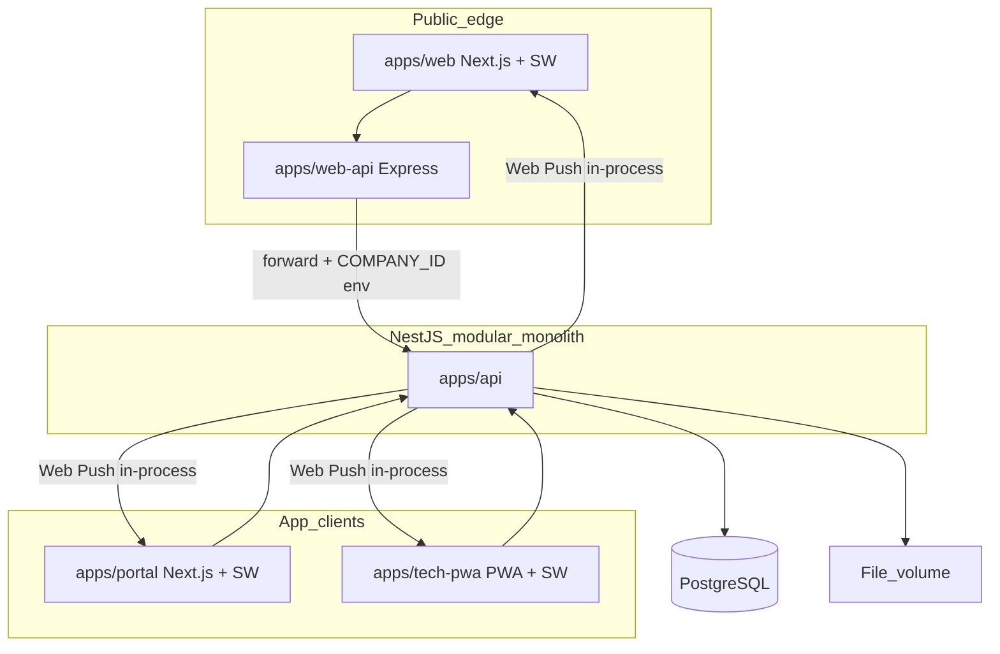
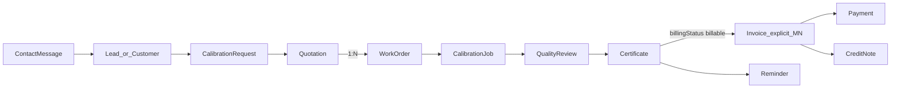
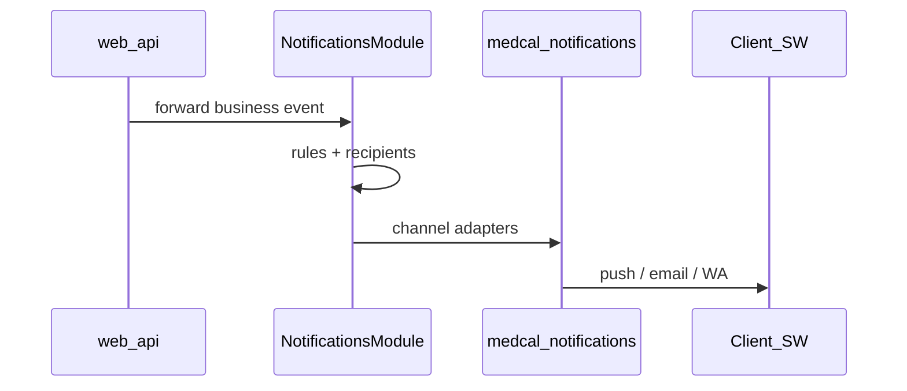

**Action Plan - Ekosistem Aplikasi Alat Kesehatan (medcal / CBMS)**

Dokumen ini adalah **roadmap eksekusi per fase** — bukan sumber kebenaran domain. Keputusan domain & data yang terkunci ada di:

- [`000-project-bootstrap.md`](./000-project-bootstrap.md) (ADR-000)
- [`business-domain.md`](./business-domain.md)
- [`entity-catalog.md`](./entity-catalog.md)
- [`ERD/README.md`](./ERD/README.md)
- [`ADR/001-nextjs-version.md`](./ADR/001-nextjs-version.md)

**Next step saat ini:** lanjut **Fase 1** (Fase 0 scaffold monorepo sudah selesai).

---

**1. Ringkasan produk**

Membangun satu ekosistem untuk perusahaan kalibrasi alat kesehatan (target rumah sakit & klinik):

Website B2B → SEO → **ContactMessage** (inbound) → Lead / Customer → Customer Portal  
→ Calibration Workflow → Dashboard → Mini ERP → Document Vault

**Saat ini:** produk internal 1 perusahaan (BIPMED), schema **multi-tenant-ready** (`companyId` saja — **tanpa** Branch / `branchId`, tanpa modul subscription).

**Alur bisnis inti:**

1. Intake publik → **ContactMessage** (`GetMessageFrom`: CONTACTFORM | WHATSAPP | CHAT_AI | CHAT_PERSON | EMAIL)
2. Match CRM (email domain + admin confirm) → existing Customer **atau** Lead → convert → Customer
3. Calibration Request (upload daftar alat, on-site / kirim lab)
4. Quotation (**wajib tercatat**; boleh belakangan setelah telepon/WA) → customer approve
5. Work Order (nomor, jadwal teknisi, lokasi bebas teks — bukan Branch FK)
6. Pelaksanaan PWA (checklist, hasil ukur, foto, TTD) → Quality Review
7. Sertifikat (PDF, nomor, QR, arsip) → `billingStatus = billable` otomatis saat issued
8. Invoice **eksplisit** (M:N Certificate) + Payment + Credit Note → Reminder H-30 → reorder

**Referensi kode existing (pola, bukan fork):**

- Better Auth RBAC → saas/ngebengkel
- Nest + Zustand + **ContactMessage / GetMessageFrom** → bi-erp (`server-bi-erp`)
- Express edge (chat, WA, contact, email+captcha) → bipmed-website

---

**2. Keputusan arsitektur yang dikunci**

| **Topik**        | **Keputusan**                                                                         |
| ---------------- | ------------------------------------------------------------------------------------- |
| Repo             | 1 monorepo **Turborepo + pnpm** (`@medcal/*`)                                         |
| Website          | Project **baru** (bukan fork penuh bipmed); adopsi pola edge + messaging bi-erp       |
| web-api          | Express.js **public edge** — bukan tempat business logic                              |
| api              | NestJS **modular monolith** — seluruh business logic                                  |
| Packages         | db, auth, shared, config, notifications, ui (tipis), eslint-config, typescript-config |
| Docs             | ADR/, Architecture/, ERD/, API/, Deployment/ + design-principles.md + business-domain / entity-catalog |
| UI               | **Tailwind CSS + shadcn/ui** saja                                                     |
| Next.js          | Pin **16.2.12** + React **19.2.8** (ADR-001)                                          |
| UX               | **Mobile-first** (produk): Mobile → Tablet → Desktop enhancement                      |
| Notifikasi       | @medcal/notifications = HOW; Nest module = WHEN/WHO/WHY; SW + Web Push                |
| Async infra      | **Tidak** Redis / BullMQ / RabbitMQ / Kafka / microservice / Kubernetes di awal       |
| Filosofi         | **Simple by default** — teknologi baru hanya jika kebutuhan terukur                   |
| Teknisi          | PWA (bukan native)                                                                    |
| Vault            | Modul di Nest, bukan produk Drive terpisah                                            |
| Hosting          | Hostinger KVM 4, Ubuntu, Docker Compose, PostgreSQL                                   |
| Scope MVP urutan | Website → ContactMessage/Lead → Portal → Kalibrasi → Dashboard → Mini ERP → Vault     |

**Domain locks (ADR-000 — ringkas)**

| **Topik**              | **Keputusan**                                                                 |
| ---------------------- | ------------------------------------------------------------------------------ |
| Organisasi             | **Company only** — Branch dihapus total                                        |
| Public company binding | `COMPANY_ID` dari **env server** per deploy web + web-api; bukan dari client   |
| Inbound messaging      | **ContactMessage** + `GetMessageFrom` / `ContactStatus` (bi-erp); Lead = pipeline CBMS |
| Lead vs CRM            | Match email domain (blocklist publik) + **admin confirm**; tidak silent merge  |
| Commercial             | Quotation **selalu tercatat**; WO butuh Quotation approved                     |
| Billable SoR           | **Certificate only** (`unbilled` / `billable` / `invoiced`); WO bukan billable |
| Invoice                | Eksplisit; M:N ke Certificate; issue Certificate ≠ auto-invoice                |
| MVP billing docs       | Invoice + Payment + **Credit Note** (Debit Note / Refund later)                |

**Batas Express vs Nest**

| **apps/web-api (edge)**                         | **apps/api (Nest)**                                      |
| ----------------------------------------------- | -------------------------------------------------------- |
| Captcha, rate limit, CORS                       | Semua domain + Prisma                                    |
| WA/contact helper publik                        | Better Auth + RBAC + **company** membership              |
| Baca `COMPANY_ID` dari env; validasi tipis      | Persist ContactMessage, match/lead, seluruh pipeline     |
| **Forward** ContactMessage payload ke Nest      | Push, email bisnis, PDF, cron reminder                   |
| Tidak persist ContactMessage / Lead / WO / Invoice | Satu-satunya business layer                           |

**Filosofi & larangan awal**

Jangan ditambahkan sampai proven need:

- Redis, BullMQ, RabbitMQ, Kafka
- Microservices, Kubernetes
- UI framework selain Tailwind + shadcn
- Premature extraction ke packages/ui
- Modul subscription SaaS, native mobile, full accounting ERP
- Branch / multi-cabang (butuh ADR baru + migrasi)

---

**3. Arsitektur target**





---

**4. Struktur monorepo (target scaffold — Fase 0 sudah ada)**

Nama workspace: **medcal** (`@medcal/*`).

```text
medcal/
├── apps/
│   ├── web/          # Next.js B2B + SEO + SW
│   ├── web-api/      # Express public edge
│   ├── portal/       # Next.js Customer + Admin + SW
│   ├── tech-pwa/     # Next.js PWA teknisi + SW
│   └── api/          # NestJS modular monolith
├── packages/
│   ├── db/
│   ├── auth/
│   ├── shared/       # types | schemas | constants | errors | utils
│   ├── config/       # env/runtime
│   ├── notifications/# contact | email | push | whatsapp
│   ├── ui/           # tipis, extract late
│   ├── eslint-config/
│   └── typescript-config/
├── docs/
│   ├── ADR/
│   ├── Architecture/
│   ├── ERD/
│   ├── API/
│   ├── Deployment/
│   ├── business-domain.md
│   ├── entity-catalog.md
│   ├── 000-project-bootstrap.md
│   ├── design-principles.md
│   └── medcal-app_Action Plan.md
├── docker/
├── scripts/
├── .github/workflows/
├── package.json
├── pnpm-workspace.yaml
├── turbo.json
├── docker-compose.yml   # postgres + apps — TANPA Redis
└── .env.example
```

**Nest modules (arah modul)**

```text
apps/api/src/modules/
  contact-messages/   # inbox ContactMessage (bi-erp core)
  leads/              # qualify / convert setelah inbox
  customers/
  devices/
  quotations/
  work-orders/
  calibration-jobs/   # field execution
  quality-reviews/
  certificates/
  invoices/           # Invoice + Payment + CreditNote
  reminders/
  notifications/      # orchestration → @medcal/notifications
  vault/
  dashboard/
```

**Disiplin packages**

**@medcal/shared** — tanpa Prisma, tanpa HTTP, tanpa side effect:

- types/ · schemas/ · constants/ · errors/ · utils/

**@medcal/notifications** — HOW saja:

- contact/ · email/ · push/ · whatsapp/
- Nest memutuskan WHEN/WHO; web-api hanya boleh contact + whatsapp untuk edge

**@medcal/config** — zod env + defaults app (bukan eslint/tsconfig)

**@medcal/ui** — Tailwind + shadcn; extract hanya jika dipakai ≥2 apps

**Aturan dependensi**

- App tidak import app lain; package tidak import app
- web-api **tidak** depend @medcal/db
- Side effect bisnis hanya lewat Nest
- Subpath exports: `@medcal/shared/schemas`, `@medcal/notifications/push`, …

---

**5. Stack per app**

| **App**  | **Stack**                                                                                          |
| -------- | -------------------------------------------------------------------------------------------------- |
| web      | Next.js **16.2.12**, React **19.2.8**, Tailwind, shadcn/ui, SW, TanStack Query, Zustand, mobile-first |
| web-api  | Express, @medcal/shared + config + subset notifications, captcha → Nest                            |
| portal   | Next.js **16.2.12**, React **19.2.8**, Tailwind, shadcn, SW, TanStack Query, Zustand, Better Auth client |
| tech-pwa | Next.js **16.2.12**, React **19.2.8**, PWA, Tailwind, shadcn, SW, TanStack Query, mobile-first     |
| api      | Nest modular monolith, Prisma, Better Auth, notifications, @nestjs/schedule, PDF                   |

**UI / UX (produk)**

- Prioritas: Mobile → Tablet → Desktop enhancement
- Desktop first-class: Dashboard, Reports, Admin, Finance
- Guidelines: tabel→card di mobile, form 1 kolom, nav touch, touch target nyaman, no horizontal scroll

**Design principles ([design-principles.md](./design-principles.md))**

Mobile First · Responsive by Default · Accessibility · Fast Loading · Minimal Clicks · Consistent Navigation · Reusable Components (when proven) · Clean Business UI · Progressive Enhancement

---

**6. Data & multi-tenant**

Setiap tabel bisnis:

```text
companyId String   # wajib — tidak ada branchId
```

**Roles:** superadmin · admin · supervisor · technician · finance · customer

**Entitas inti (MVP spine — selaras entity-catalog):**

Company, User, UserMembership, ContactMessage, Lead, Customer, CustomerContact, Device, CalibrationRequest, CalibrationRequestItem, Quotation, QuotationItem, ServiceTariff (light), WorkOrder, WorkOrderAssignment, CalibrationJob, MeasurementResult, JobEvidence, CustomerSignature, QualityReview, Certificate, Invoice, InvoiceCertificate, InvoiceItem, Payment, CreditNote, ReminderEvent, FileObject, PushSubscription

Filter **`companyId` wajib di Nest** (guards/interceptors). Tidak ada filter Branch.

---

**7. Notifikasi (tanpa queue)**



- SW di web, portal, tech-pwa
- Subscribe & send lewat Nest + `@medcal/notifications/push`
- Reminder H-30: `@nestjs/schedule` in-process
- HTTPS wajib (Hostinger Let's Encrypt)

---

**8. Action plan per fase**

**Prasyarat (sebelum coding) — DONE**

- [x] Nama repo / scope package: **medcal** / `@medcal/*`
- [x] Lokasi folder project: `d:\medcal`
- [x] Keputusan domain tertulis di [`000-project-bootstrap.md`](./000-project-bootstrap.md)
- [ ] Domain staging + DNS (HTTPS untuk SW/push) — opsional sampai deploy
- [ ] Akses Hostinger KVM 4 siap Docker — saat deploy

**Fase 0 - Foundation — DONE**

**Tujuan:** monorepo jalan lokal; docs & kontrak folder disiplin; auth stub; DB Company/User (tanpa Branch).

**Checklist (selesai):**

- [x] Init pnpm workspace + Turborepo
- [x] Scaffold 5 apps
- [x] Scaffold packages: db, auth, shared, config, notifications, ui, eslint/tsconfig
- [x] docs/ pilar + design-principles + business-domain + entity-catalog + ERD
- [x] ADR-000 domain locks; ADR-001 Next pin
- [x] Architecture overview + ERD approved (Company only)
- [x] Prisma schema draft (`packages/db`) — migrate/seed saat DATABASE_URL siap
- [x] Better Auth stub / package wiring
- [x] Docker Compose tanpa Redis
- [x] Next apps: Tailwind + pin 16.2.12

**DoD Fase 0:** monorepo + packages + apps skeleton + docs SoR + Prisma draft — **tercapai**.

---

**Fase 1 - Website B2B + Inbound ContactMessage / Lead**

**Checklist:**

- Landing + halaman layanan + SEO (metadata, sitemap, schema.org)
- Form contact di web (mobile-first) → payload ContactMessage
- web-api: captcha, rate limit, WA helpers (adaptasi bipmed); inject **`COMPANY_ID` dari env**
- Forward ke Nest **ContactMessagesModule** (persist + `getFrom` + ContactStatus)
- Match email-domain CRM + admin confirm vs create **Lead** pipeline
- Notifikasi admin: email + push (in-process) untuk ContactMessage / lead baru
- SW di web; subscribe ke Nest; permission setelah interaksi bermakna
- Docs API: kontrak edge + Nest ContactMessage
- UTM / sumber channel dasar (selaras `GetMessageFrom`, bukan enum channel paralel)

**DoD Fase 1:** ContactMessage dari website masuk DB; Lead atau existing-customer path jelas; admin terima notifikasi; SEO dasar live di staging.

---

**Fase 2 - Customer Portal**

**Checklist:**

- Login customer (Better Auth + role customer)
- Lihat permintaan, quotation approve/reject
- Status WO, unduh sertifikat (stub OK jika sertifikat belum full)
- Upload daftar alat (CSV/Excel → Device)
- Web Push setelah login
- UI mobile-first; tabel→card di HP

**DoD Fase 2:** customer bisa login, approve quotation, lihat status di HP & desktop.

---

**Fase 3 - Calibration Workflow (inti produk)**

**Checklist:**

- Request → Quotation (recorded + approved) → WO (1:N dari Quotation) → CalibrationJob (1 device) → Quality Review → Certificate (PDF+QR; `billingStatus=billable` on issued) → Invoice **eksplisit** M:N Certificate + Payment + Credit Note → Reminder H-30
- tech-pwa: checklist, input hasil (JSON fleksibel MVP), foto, TTD
- Push: WO assign, review, sertifikat, reminder
- PDF generate in-process (tanpa Bull)
- Cron reminder `@nestjs/schedule`
- RBAC supervisor / technician / finance
- Gate: **tidak ada WO tanpa Quotation approved**; WO **bukan** billable SoR

**DoD Fase 3:** 1 alur end-to-end happy path di staging dengan data uji (termasuk invoice eksplisit dari certificate billable).

---

**Fase 4 - Dashboard**

- KPI: ContactMessage volume / getFrom, lead conversion, WO terbuka, SLA, revenue, sertifikat expired, unbilled backlog
- Filter **Company only** (bukan Branch)
- Desktop-optimized + tetap usable mobile (card/stack)

**DoD:** admin melihat KPI akurat dari data Fase 3.

---

**Fase 5 - Mini ERP**

- Master harga jasa (ServiceTariff), inventaris alat standar lab
- Customer/device master tetap milik CRM / Device Registry (baca/pakai, jangan dobel SoR)
- Invoice / payment / piutang operasional = **Billing (D13)**, bukan full accounting di Mini ERP

**DoD:** harga jasa dipakai quotation; piutang terlihat di portal/admin lewat Billing.

---

**Fase 6 - Document Vault**

- Folder / path per company/customer/WO
- Upload, preview, share link berbatas waktu, RBAC
- Storage volume lokal; S3 ditunda sampai perlu

**DoD:** sertifikat & lampiran WO tersimpan & bisa di-share aman.

---

**9. Deploy Hostinger KVM 4**

| **Item**   | **Rencana**                                   |
| ---------- | --------------------------------------------- |
| OS         | Ubuntu                                        |
| Orkestrasi | Docker Compose (bukan K8s)                    |
| Services   | web, web-api, portal, tech-pwa, api, postgres |
| Proxy      | Caddy atau Nginx + Let's Encrypt              |
| File       | Docker volume                                 |
| Backup     | Postgres harian                               |
| Redis      | Tidak, sampai terukur                         |
| Website    | Satu `COMPANY_ID` per instance web + web-api  |

Mulai 1 VPS; split VPS kedua jika resource/DB tumbuh.

---

**10. Definition of Done - gate antar fase**

Sebelum naik fase:

1. Checklist fase sebelumnya centang
2. lint + typecheck + build hijau
3. DoD fase tercapai di staging (mulai Fase 1)
4. ADR baru jika ada penyimpangan dari keputusan terkunci
5. Tidak menyelinap Redis/microservice/UI framework lain / Branch tanpa ADR + approval

---

**11. Next step**

1. ~~Selesaikan Prasyarat & Fase 0~~ **done**
2. Eksekusi **Fase 1** — Website B2B + ContactMessage intake (+ Lead / CRM match)
3. Baru lanjut Fase 2+

---

**12. Lampiran cepat - yang ditunda**

Redis · BullMQ · RabbitMQ · Kafka · Microservices · Kubernetes · UI non-shadcn · Premature packages/ui · Subscription SaaS · Native mobile · Desktop file-sync · Full accounting ERP · **Branch / multi-cabang** · Debit Note · Refund entity · ChatSession / mailbox Email penuh · LeadSubmission-as-SoR / enum channel paralel · WO sebagai billable SoR
