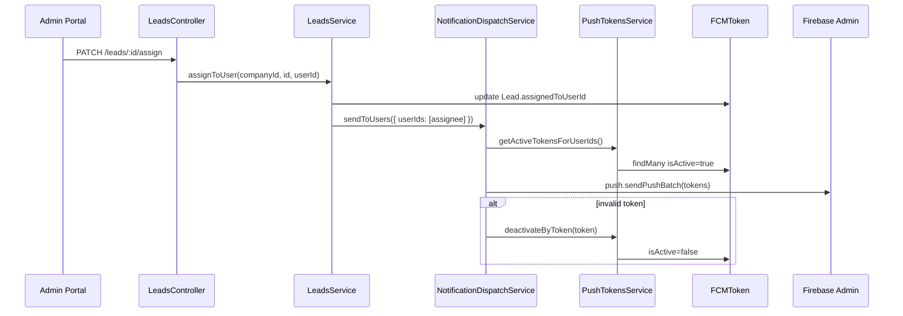
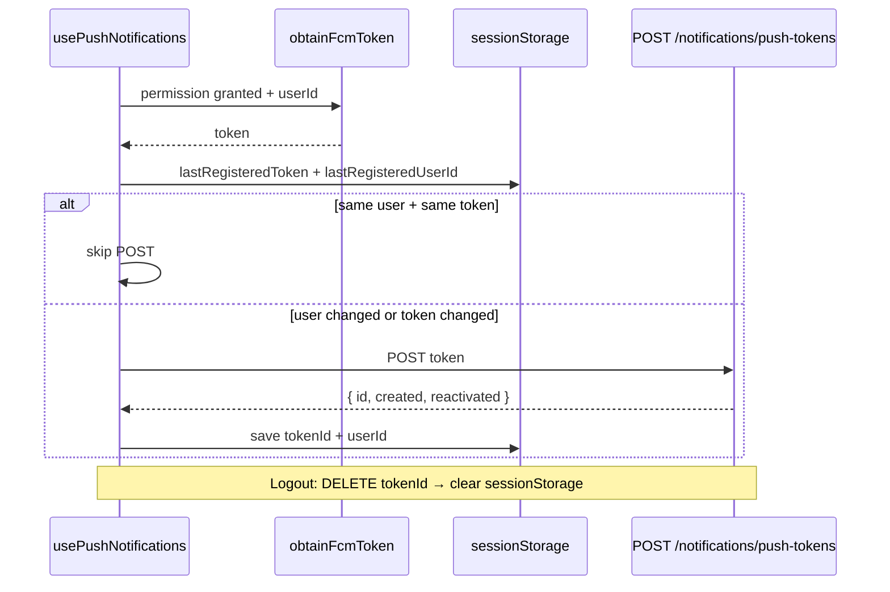

# FCM Token Registration + User Assignment — Implementation Report

**Date:** 2026-08-22  
**Status:** Complete (backend + frontend lifecycle; production dispatch trigger: lead assignment)  
**Preceded by:** Forensic audit prompt [`FCM Token Registration + User Assignment — Forensic Audit Prompt.md`](./FCM%20Token%20Registration%20+%20User%20Assignment%20%E2%80%94%20Forensic%20Audit%20Prompt.md)  
**Builds on:** Phase 1 (token registration), Phase 2 (PWA Web SDK), Phase 3 (test send)

---

## 1. Executive Summary

Implementasi ini menutup gap kritis yang teridentifikasi dalam audit forensik FCM:

| Area | Sebelum | Sesudah |
|------|---------|---------|
| Logout token lifecycle | Token tetap aktif di DB; `sessionStorage` tidak dibersihkan | Revoke via `DELETE /notifications/push-tokens/:id` + clear local state |
| Cross-user shared browser | User B bisa tampak "enabled" tanpa re-register ke backend | Dedup mempertimbangkan `userId`; selalu POST saat user berubah |
| Lead assignment | `assignedToUserId` schema-only, 0 referensi kode | `PATCH /leads/:id/assign` + permission `lead:assign` |
| Production dispatch | Hanya `POST /notifications/test` | `NotificationDispatchService.sendToUsers()` + trigger saat assign |
| Invalid token cleanup (dispatch) | Hanya di test endpoint | Otomatis saat batch send gagal dengan `invalidToken: true` |
| Tech-PWA SW parity | Tanpa `onBackgroundMessage` | Selaras dengan Portal |

**Tidak ada migrasi database baru.** Model `FCMToken` dan `Lead.assignedToUserId` yang sudah ada dipakai langsung.

---

## 2. Business Requirements Implemented

### Recipient model (locked)

```text
Lead
  ↓
Assigned User (assignedToUserId)
  ↓
User's active FCMToken rows (multi-device)
  ↓
FCM (sendPushBatch)
  ↓
User's devices
```

- Recipient ditentukan **per USER**, bukan role/permission/topic.
- Satu user boleh punya banyak token aktif (browser/device berbeda).
- Token **tidak** disimpan sebagai field tunggal di `User`.

### Token lifecycle (locked)

- Tidak ada fixed refresh interval (30/60 hari).
- Client memanggil `getToken()` saat permission granted + user authenticated.
- Token unchanged → skip POST jika user + token sama (dedup).
- Token changed / user changed → POST ulang ke backend.
- Logout → revoke token backend + clear `sessionStorage`.
- Invalid token dari FCM → soft-deactivate (`isActive = false`).

---

## 3. Architecture

### End-to-end dispatch (production)



### Token registration lifecycle (client)



---

## 4. Files Created

| Path | Purpose |
|------|---------|
| `apps/api/src/modules/push-tokens/notification-dispatch.service.ts` | Domain-neutral FCM dispatch ke user(s) by userId |
| `apps/api/src/modules/push-tokens/notification-dispatch.service.test.ts` | Unit test dispatch + invalid token deactivation |
| `apps/tech-pwa/src/lib/fcm/flow.ts` | Pure helpers dedup (parity dengan Portal) |

---

## 5. Files Modified

### Backend — API

| Path | Change |
|------|--------|
| `apps/api/src/modules/push-tokens/push-tokens.service.ts` | Tambah `getActiveTokensForUserIds(companyId, userIds[])` |
| `apps/api/src/modules/push-tokens/push-tokens.module.ts` | Register + export `NotificationDispatchService` |
| `apps/api/src/modules/push-tokens/push-tokens.service.test.ts` | Test lookup multi-user tokens |
| `apps/api/src/modules/leads/leads.service.ts` | Tambah `assignToUser()` + inject `NotificationDispatchService` |
| `apps/api/src/modules/leads/leads.controller.ts` | Tambah `PATCH :id/assign` |
| `apps/api/src/modules/leads/leads.module.ts` | Import `PushTokensModule` |
| `apps/api/src/modules/leads/leads.service.test.ts` | Test assignment + validasi assignee |

### Backend — Shared packages

| Path | Change |
|------|--------|
| `packages/auth/src/access-control.ts` | Tambah `lead:assign` ke catalog |
| `packages/auth/src/access-control.test.ts` | Update fixture + assertion `lead:assign` |
| `packages/db/prisma/seed-role-permissions.ts` | Seed `ADMIN → lead:assign` |
| `packages/shared/src/schemas/index.ts` | Tambah `leadAssignSchema`, `LeadAssignInput` |
| `packages/notifications/src/push/index.ts` | Hapus `messaging/invalid-argument` dari auto-deactivate codes |

### Frontend — Portal

| Path | Change |
|------|--------|
| `apps/portal/src/lib/fcm/flow.ts` | `shouldSkipBackendRegistration` mempertimbangkan `userId` |
| `apps/portal/src/lib/fcm/messaging.ts` | Session keys: `tokenId`, `userId`; helpers clear/get/set |
| `apps/portal/src/lib/fcm/register.ts` | `syncPushTokenIfNeeded(token, userId)`; `revokeRegisteredPushToken()` |
| `apps/portal/src/lib/fcm/use-push-notifications.ts` | Terima `userId`; dependency `[authenticated, userId]` |
| `apps/portal/src/lib/fcm/flow.test.ts` | Test cross-user dedup |
| `apps/portal/src/components/sign-out-button.tsx` | Revoke FCM sebelum `signOut()` |
| `apps/portal/src/components/management/header-controls.tsx` | Pass `userId` ke push hook |
| `apps/portal/src/components/management/header.tsx` | Pass `me.user.id` ke `UserMenu` |
| `apps/portal/src/app/sign-in/page.tsx` | `try/catch` untuk network error (API down) |

### Frontend — Tech-PWA

| Path | Change |
|------|--------|
| `apps/tech-pwa/src/lib/fcm/flow.ts` | **Created** — dedup helpers |
| `apps/tech-pwa/src/lib/fcm/messaging.ts` | Session keys + clear helpers (parity Portal) |
| `apps/tech-pwa/src/lib/fcm/register.ts` | User-scoped sync + revoke on logout |
| `apps/tech-pwa/src/lib/fcm/use-push-notifications.ts` | Terima `userId` |
| `apps/tech-pwa/src/components/sign-out-button.tsx` | Revoke FCM sebelum signOut |
| `apps/tech-pwa/src/app/page.tsx` | Pass `me.user.id` ke push control |
| `apps/tech-pwa/src/app/firebase-messaging-sw.js/route.ts` | Tambah `onBackgroundMessage` |

### Out of scope (incidental diff)

| Path | Note |
|------|------|
| `apps/portal/src/app/management/leads/leads-ui.tsx` | Label ContactStatus EN (bukan bagian FCM) |
| `apps/portal/tsconfig.tsbuildinfo`, `apps/tech-pwa/tsconfig.tsbuildinfo` | Build artifacts |

---

## 6. Database Changes

```
Migration required: NO
Schema change: NO
Seed update: YES (lead:assign permission row)
```

Model existing yang dipakai:

```prisma
model FCMToken {
  id         String    @id @default(cuid())
  companyId  String
  userId     String
  token      String    @unique   // global unique — anti hijack
  deviceType String
  app        PushApp
  isActive   Boolean   @default(true)
  lastUsedAt DateTime?
  // ...
  @@index([companyId, userId])
}

model Lead {
  assignedToUserId String?
  assignedTo       User? @relation("LeadAssignee", ...)
}
```

Relasi **User 1 → N FCMToken** sudah didukung sejak Phase 1; implementasi ini memanfaatkannya untuk dispatch multi-device.

---

## 7. API Changes

### Existing (unchanged contract)

| Method | Route | Auth | Notes |
|--------|-------|------|-------|
| `POST` | `/notifications/push-tokens` | Session | `userId`/`companyId` dari session, bukan body |
| `GET` | `/notifications/push-tokens` | Session | List token aktif user |
| `DELETE` | `/notifications/push-tokens/:tokenId` | Session | Soft-revoke; **sekarang dipanggil frontend saat logout** |
| `POST` | `/notifications/test` | Session + `notification:test` | Test send manual (SUPERADMIN default) |

### New

#### `PATCH /leads/:id/assign`

**Permission:** `lead:assign` (default: ADMIN, SUPERADMIN bypass)

**Request body:**

```json
{
  "assignedToUserId": "clxxxxxxxx" 
}
```

Atau unassign:

```json
{
  "assignedToUserId": null
}
```

**Validation (`leadAssignSchema`):**

- `assignedToUserId`: `string | null`
- Jika non-null: assignee harus `User.status = ACTIVE` dan punya `UserMembership` di `companyId` deployment

**Success:** `200` — Lead record updated

**Errors:**

| Code | HTTP | Condition |
|------|------|-----------|
| `LEAD_NOT_FOUND` | 404 | Lead tidak ada / wrong company |
| `INVALID_LEAD_ASSIGNEE` | 400 | User tidak ACTIVE atau bukan member company |
| `INVALID_LEAD_ASSIGNMENT` | 400 | Zod validation failed |
| Forbidden | 403 | No `lead:assign` permission |

**Side effect:** Jika `assignedToUserId` non-null, trigger push notification ke assignee (lihat §8).

---

## 8. Notification Dispatch Service

**File:** `apps/api/src/modules/push-tokens/notification-dispatch.service.ts`

### Public API

```typescript
sendToUsers(input: {
  companyId: string;
  userIds: string[];
  notification: { title: string; body: string };
  data?: Record<string, string>;
}): Promise<{
  tokens: number;
  sent: number;
  failed: number;
  deactivated: number;
}>
```

### Behavior

1. Dedupe `userIds`
2. `PushTokensService.getActiveTokensForUserIds()` — hanya `isActive: true`
3. `push.sendPushBatch()` dari `@medcal/notifications`
4. Per hasil gagal dengan `invalidToken: true` → `deactivateByToken()`
5. Return statistik (tidak throw jika zero tokens — graceful no-op)

### Production trigger implemented

**Event:** Lead assigned  
**Caller:** `LeadsService.assignToUser()`  
**Payload:**

```json
{
  "notification": {
    "title": "Lead assigned to you",
    "body": "<Lead.name> has been assigned to you"
  },
  "data": {
    "type": "LEAD_ASSIGNED",
    "leadId": "<lead.id>"
  }
}
```

### Invalid token codes (updated)

Auto-deactivate **hanya** untuk:

- `messaging/invalid-registration-token`
- `messaging/registration-token-not-registered`

**Dihapus:** `messaging/invalid-argument` (bisa false-positive dari payload malformed).

---

## 9. Frontend — Token Lifecycle Fixes

### SessionStorage keys

| App | Token | Token ID | User ID |
|-----|-------|----------|---------|
| Portal | `medcal:portal:fcm:lastRegisteredToken` | `medcal:portal:fcm:lastRegisteredTokenId` | `medcal:portal:fcm:lastRegisteredUserId` |
| Tech-PWA | `medcal:tech-pwa:fcm:lastRegisteredToken` | `medcal:tech-pwa:fcm:lastRegisteredTokenId` | `medcal:tech-pwa:fcm:lastRegisteredUserId` |

### Dedup logic (`shouldSkipBackendRegistration`)

Skip POST **hanya jika**:

```text
currentUserId === lastRegisteredUserId
AND
token === lastRegisteredToken
```

Jika user berbeda (shared browser scenario) → **selalu POST**, meski token FCM string sama.

### Logout flow

```typescript
await revokeRegisteredPushToken(); // DELETE + clear sessionStorage
await signOut();
```

`revokeRegisteredPushToken()` aman dipanggil meski push never enabled (no-op jika tidak ada `tokenId`).

### `usePushNotifications` contract

```typescript
usePushNotifications({ authenticated: boolean; userId?: string | null })
```

- Hydrate + enable hanya jalan jika `authenticated && userId`
- Portal: `userId` dari `me.user.id` via header
- Tech-PWA: `userId` dari `useRequireSession().me.user.id`

---

## 10. Security

### Maintained (unchanged, verified)

| Control | Implementation |
|---------|----------------|
| Session-derived identity | `@UserId()` / `@CompanyId()` decorators; Zod schema rejects client `userId` |
| Anti-hijack | `TOKEN_OWNERSHIP_CONFLICT` (409) jika token milik user lain |
| Anti-enumeration revoke | Token orang lain → 404 |
| INVITED/DISABLED blocked | `CompanyRoleGuard` |

### Fixed by this implementation

| Risk | Severity | Fix |
|------|----------|-----|
| Cross-user notification on shared browser | CRITICAL | User-scoped dedup + logout revoke |
| Push after logout | CRITICAL | `DELETE` on sign-out |
| Dispatch to wrong recipient model | HIGH | Assignment writes `assignedToUserId`; dispatch by userId |

### Authorization for assignment

- `PATCH /leads/:id/assign` gated by `lead:assign`
- Default grant: ADMIN only (via seed)
- SUPERADMIN: unconditional bypass (existing pattern)

---

## 11. RBAC / Permission Changes

**Catalog** (`packages/auth/src/access-control.ts`):

```typescript
lead: ["read", "update", "assign"]  // assign added
```

**Seed** (`packages/db/prisma/seed-role-permissions.ts`):

```typescript
{ role: "ADMIN", resource: "lead", action: "assign" }
```

**Post-deploy action required:**

```bash
pnpm --filter @medcal/db run seed:role-permissions
```

Atau grant manual via Permission Management UI.

---

## 12. Tests Added / Updated

| File | Coverage |
|------|----------|
| `apps/portal/src/lib/fcm/flow.test.ts` | Cross-user dedup; same-user skip |
| `apps/api/src/modules/push-tokens/push-tokens.service.test.ts` | `getActiveTokensForUserIds` |
| `apps/api/src/modules/push-tokens/notification-dispatch.service.test.ts` | Zero tokens; invalid token deactivation (mocked) |
| `apps/api/src/modules/leads/leads.service.test.ts` | Assign, unassign, invalid assignee, tenant isolation |
| `packages/auth/src/access-control.test.ts` | ADMIN has `lead:assign` |

### Test results (local)

| Suite | Result |
|-------|--------|
| Portal `flow.test.ts` | 10/10 passed |
| Auth `access-control.test.ts` | 16/16 passed |
| API integration tests | Require `DATABASE_URL` + Postgres running |

---

## 13. Deployment & Migration Checklist

- [ ] Deploy backend + frontend together (logout revoke requires both)
- [ ] Run `seed:role-permissions` for `lead:assign`
- [ ] Verify `FIREBASE_SERVICE_ACCOUNT_JSON` configured (untuk dispatch nyata)
- [ ] Verify `NEXT_PUBLIC_FIREBASE_*` + VAPID key di Portal/Tech-PWA
- [ ] No Prisma migrate needed

---

## 14. Manual Verification Steps

### A. Token lifecycle (CRITICAL)

1. User A login → enable notifications → verify POST `/notifications/push-tokens`
2. User A logout → verify DELETE `/notifications/push-tokens/:id` (Network tab)
3. User B login di browser yang sama → verify POST ulang (bukan skip)
4. User B enable notifications → push untuk User A **tidak** sampai ke device

### B. Lead assignment + push

1. Login sebagai ADMIN (punya `lead:assign`)
2. `PATCH /leads/:id/assign` dengan `assignedToUserId` user yang punya FCM token aktif
3. Verify push notification di device assignee
4. Verify payload data: `type=LEAD_ASSIGNED`, `leadId=<id>`

### C. Multi-device

1. Enable notifications di 2 browser berbeda (same user)
2. Assign lead → push harus ke **kedua** device (2 token rows)

### D. Invalid token cleanup

1. Deactivate token manually atau kirim ke token expired
2. Assign lead → dispatch fails gracefully; token marked inactive

---

## 15. Known Issues & Follow-ups

| Item | Priority | Notes |
|------|----------|-------|
| Portal UI untuk assign lead | MEDIUM | API ready; `leads-ui.tsx` belum wire ke `PATCH /leads/:id/assign` |
| `GET/DELETE` push-tokens management UI | LOW | API exists; no device list UI |
| `onTokenRefresh` Firebase listener | MEDIUM | Re-sync hanya saat hydrate/enable |
| Foreground `onMessage()` handler | LOW | Background only via SW |
| ContactMessage / new lead auto-notify | MEDIUM | Hanya assignment trigger saat ini |
| Assignment audit trail | LOW | No history table yet |
| One-to-many lead assignees | LOW | Schema single FK; future join table if needed |

---

## 16. Incident During Development

### API crash: `Cannot find module '@medcal/notifications/push'`

**Cause:** Intermediate import used non-existent subpath export.  
**Fix:** Use `import { push } from "@medcal/notifications"`.  
**Impact:** API process died → Portal sign-in `Failed to fetch`.  
**Resolution:** Restart `pnpm dev` after fix.

---

## 17. GO / NO-GO

| Question | Answer |
|----------|--------|
| Safe to extend existing FCM infrastructure? | **GO** |
| Blocking issues before production notifications? | Logout lifecycle — **FIXED** in this implementation |
| Reused from prior phases? | `FCMToken` model, `PushTokensService`, `sendPushBatch`, Firebase init, SW routes |
| New tables required? | **None** |
| Minimum scope delivered? | Lifecycle fix + assignment API + dispatch service + one business trigger |

---

## 18. Related Documents

| Document | Role |
|----------|------|
| [`fcm_phase1_implementation_report.md`](./fcm_phase1_implementation_report.md) | Token registration backend |
| [`fcm_phase2_pwa_web_sdk_implementation_report.md`](./fcm_phase2_pwa_web_sdk_implementation_report.md) | Firebase Web SDK + client registration |
| [`fcm_phase3_backend_sending_implementation_report.md`](./fcm_phase3_backend_sending_implementation_report.md) | Test send endpoint |
| [`FCM Token Registration + User Assignment — Forensic Audit Prompt.md`](./FCM%20Token%20Registration%20+%20User%20Assignment%20%E2%80%94%20Forensic%20Audit%20Prompt.md) | Audit requirements source |
| [`FCM_Implementation_Roadmap.md`](./FCM_Implementation_Roadmap.md) | Overall roadmap |

---

## 19. Summary Diff Stats

```
30 files changed, 497 insertions(+), 66 deletions(-)
3 new source files (+ tests)
0 migrations
1 new permission (lead:assign)
1 new API endpoint (PATCH /leads/:id/assign)
1 new service (NotificationDispatchService)
```

**Implementation complete for audit Phase 3 scope.** Next recommended step: wire Portal Lead UI to assignment endpoint and add additional business event triggers (e.g. new ContactMessage to assigned user).
