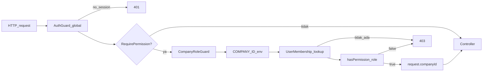

# Audit Forensik: User Management + RBAC (Better Auth)

**Tanggal:** 19 Agustus 2026  
**Repositori:** `d:\medcal`  
**Sifat:** AUDIT ONLY — tidak ada implementasi, redesign, migrasi, atau perbaikan kode.  
**Sumber kebenaran:** kode yang ada di repositori, bukan dokumen arsitektur yang stale.

Klasifikasi bukti:

| Label | Arti |
|---|---|
| **FACT** | Terverifikasi dari file di repositori |
| **INFERENCE** | Diturunkan dari perilaku kode |
| **GAP** | Fungsi yang tidak ada |
| **RISK** | Kekhawatiran keamanan / desain |
| **UNVERIFIED** | Tidak bisa dikonfirmasi dari repo saja (mis. isi database produksi) |

---

## 1. Executive Verdict

**FACT.** Authentication Better Auth (in-process di NestJS) dan authorization (`UserMembership.role` + `hasPermission` + `CompanyRoleGuard`) **sudah diimplementasikan dan konsisten**. Plugin Better Auth `admin` / `organization` **sengaja tidak terdaftar**. `companyId` **tidak** dipercaya dari klien.

**GAP.** User Management sebagai produk **belum ada**. Tidak ada API/UI list-create-edit user, assign role, activate/deactivate, atau reset password. Satu-satunya jalur kode aplikasi yang membuat membership adalah skrip bootstrap SUPERADMIN.

**RISK HIGH.** `User.status` (`INVITED` / `ACTIVE` / `DISABLED`) **tidak dibaca** di guard, `GET /me`, atau chat socket. Menonaktifkan user di kolom status **tidak memutus akses**.

Verdict operasional:

| Lapisan | Status |
|---|---|
| Better Auth session (email/password) | Ada dan konsisten |
| Registration gate (domain + whitelist) | Ada |
| RBAC per-resource / per-verb | Ada; katalog minimal |
| Tenant (`COMPANY_ID` env + membership) | Ada; tidak percaya klien |
| User Management API/UI | **Tidak ada** |
| Penegakan `User.status` | **Tidak ada** |

**Jangan mendesain ulang** Better Auth, `UserMembership.role`, `createAccessControl`, atau `CompanyRoleGuard`. Fase berikutnya adalah **melengkapi** User Management di atas fondasi ini. **Semua keputusan di bagian 15 sudah terkunci — siap implementasi.**



---

## 2. Current Architecture

### 2.1 Authentication — FACT

| Item | Lokasi | Perilaku aktual |
|---|---|---|
| Server Better Auth | `packages/auth/src/index.ts` | `betterAuth()` + `prismaAdapter`, email/password, `requireEmailVerification: false`, cookie lintas subdomain via `COOKIE_DOMAIN`, `databaseHooks: {}`. **Tidak ada `plugins`.** |
| Host Nest | `apps/api/src/app.module.ts` | `AuthModule.forRoot({ auth, isGlobal: true })` dari `@thallesp/nestjs-better-auth` → AuthGuard global; opt-out `@AllowAnonymous()`. |
| Validasi session | Guard, `GET /me`, Socket.IO | `auth.api.getSession({ headers: fromNodeHeaders(...) })` |
| Client | `packages/auth/src/client.ts` | `createAuthClient` tanpa `adminClient` / `organizationClient` |
| Sign-in / register | `apps/portal/src/app/sign-in/page.tsx`, `apps/portal/src/app/sign-in/register/page.tsx` | Self-register tetap kena gate server |
| Gate registrasi | `apps/api/src/modules/whitelist/registration-gate.hook.ts` + `registration-gate.ts` | Domain persis `kalibrasimedika.co.id` **dan** baris `EmailWhitelist` berstatus `ACTIVE` |

Komentar di `packages/auth/src/index.ts` menyatakan admin plugin **sengaja tidak** didaftarkan; otoritas role = `UserMembership.role`.

**Lapisan:** Better Auth = authentication/session. NestJS guards = authorization. Jangan digabung atau diganti.

### 2.2 User — FACT

Model `packages/db/prisma/schema.prisma` `User`:

- `id`, `email` unique (`VarChar(50)`), `name`, `status UserStatus @default(INVITED)`, `emailVerified`, `image`, timestamps
- Relasi: memberships, sessions, accounts, customer links, whitelist audit

`UserStatus`: `INVITED | ACTIVE | DISABLED`.

Siklus hidup di aplikasi: **hanya create via Better Auth sign-up**. Tidak ada disable/delete/activate API. Better Auth **tidak** set `additionalFields` untuk `status` → user baru tetap `INVITED`. Bootstrap SUPERADMIN juga **tidak** meng-update `status` ke `ACTIVE`.

Pencarian TypeScript aplikasi untuk `User.status` / `UserStatus` di luar schema dan fixture tes: **tidak ada pembacaan otorisasi**.

### 2.3 Membership — FACT

`UserMembership`: `userId` + `companyId` unique, `role MembershipRole`, `isDefault`, tanpa status membership.

Satu user **bisa** banyak company di skema. Runtime **selalu** `process.env.COMPANY_ID` (satu tenant per proses). Sign-up **tidak** membuat membership → session valid, `GET /me` 403.

`isDefault` hanya di-set `true` pada bootstrap SUPERADMIN; **tidak** dipakai untuk resolusi request.

`CustomerUserLink` ada di schema; **bukan** sumber RBAC.

### 2.4 Roles (hanya yang ada di kode)

Sumber grant: `packages/auth/src/access-control.ts`.

| Role | Permission aktual | Penegakan |
|---|---|---|
| SUPERADMIN | `contactMessage:read`, `whitelist:manage`, `lead:read`, `lead:update`, `chat:read`, `chat:reply`, `chat:close` | `hasPermission` + guard |
| ADMIN | sama minus `whitelist:manage` | sama |
| SUPERVISOR | `{}` | lolos AuthGuard+membership; 403 di endpoint ber-permission |
| TECHNICIAN | `{}` | sama |
| FINANCE | `{}` | sama |
| CUSTOMER | `{}` | sama |

**Kode mati — FACT:** `AUTH_ROLES` / `assertRole` di `packages/auth/src/index.ts` tidak diimpor di tempat lain. Bukan sumber otoritas. Duplikat semantik dari `MembershipRole`.

Tidak ada `User.role`, claim JWT role, atau role di session Better Auth.

### 2.5 Permissions — string persis (jangan dinormalisasi)

Katalog `createAccessControl`:

- `contactMessage` / `read`
- `whitelist` / `manage`  (dokumentasi/prompt: `whitelist:manage`)
- `lead` / `read`, `lead` / `update`  (tidak ada `lead:assign`)
- `chat` / `read`, `chat` / `reply`, `chat` / `close`  (tidak ada `chat:assign`)

Tidak ada `users:*` atau `membership:*`.

### 2.6 Guards — FACT

`apps/api/src/common/guards/company-role.guard.ts`:

1. Baca `@RequirePermission`; jika tidak ada → `return true` (tidak cek membership).
2. `companyId = process.env.COMPANY_ID` (bukan header/body).
3. Session Better Auth; tanpa session → 403 `Forbidden` (bukan 401; AuthGuard global biasanya sudah 401 lebih dulu).
4. `userMembership.findUnique({ userId, companyId })`.
5. `hasPermission(membership.role, resource, action)`.
6. Set `request.companyId` + `request.membershipRole`.

Decorator: `apps/api/src/common/decorators/require-permission.decorator.ts`.  
Tenant pada query: `@CompanyId()` dari request yang sudah di-set guard — `apps/api/src/common/decorators/company-id.decorator.ts`.

Internal: `apps/api/src/common/guards/internal-service.guard.ts` — header `x-internal-secret` vs `INTERNAL_API_SECRET` + `COMPANY_ID` env, **bukan** `x-company-id`.

Chat: `apps/api/src/modules/chat/chat-socket-auth.ts` mengulang lookup membership + `hasPermission` untuk `chat:*`. Tidak membaca `User.status`.

Alur aktual:

```
request → AuthGuard global (session) → CompanyRoleGuard (jika @RequirePermission)
       → COMPANY_ID env → UserMembership → hasPermission(role, resource, action)
       → request.companyId → @CompanyId() → service query scoped companyId
```

---

## 3. User Management Capability Matrix

| Capability | Status | Bukti |
|---|---|---|
| List users | NOT IMPLEMENTED | Tidak ada `UsersController` / halaman |
| Search / pagination users | NOT IMPLEMENTED | |
| View user | NOT IMPLEMENTED | `GET /me` = diri sendiri saja (`apps/api/src/modules/me/me.controller.ts`) |
| Create user (admin) | NOT IMPLEMENTED | Hanya self `signUp.email` |
| Invite | NOT IMPLEMENTED | `INVITED` tidak dipakai di logic |
| Activate / deactivate | NOT IMPLEMENTED | `User.status` tidak dicek |
| Delete user | NOT IMPLEMENTED | |
| Reset / change password | NOT IMPLEMENTED | Tidak ada `sendResetPassword` / UI forgot-password |
| Change role | NOT IMPLEMENTED | |
| Assign / remove company membership | NOT IMPLEMENTED | Hanya `apps/api/src/bootstrap-superadmin.ts` |
| Change membership status | NOT IMPLEMENTED | Tidak ada field status membership |
| Manage email whitelist | PARTIALLY IMPLEMENTED | API ada (`apps/api/src/modules/whitelist/whitelist.controller.ts`); **tanpa UI**; tidak ada un-revoke |
| Prevent duplicate users | IMPLEMENTED | `User.email` unique |
| Prevent duplicate memberships | IMPLEMENTED | `@@unique([userId, companyId])` |
| Self-register + membership | PARTIALLY IMPLEMENTED | User dibuat; membership tidak |

**INFERENCE.** Sign-up sukses tanpa membership → session valid, `GET /me` 403. Tidak bisa memakai app sampai membership di-insert manual/SQL/bootstrap.

Halaman portal yang ada: sign-in, register, dashboard management, leads, chat, dashboard client. **Tidak ada** Users / Roles / Whitelist di nav.

---

## 4. RBAC / Permission Matrix

| Endpoint | Auth | Membership | Permission | Server Guard | Tenant Safe | Status |
|---|---|---|---|---|---|---|
| `GET /health` | Tidak | — | — | `@AllowAnonymous` | — | Publik |
| `GET /contact-topics` | Tidak | — | — | `@AllowAnonymous` | Global | Publik |
| `POST /internal/contact-messages` | Secret | — | — | `InternalServiceGuard` | env | Service |
| `POST /internal/chat-sessions` | Secret | — | — | sama | env | Service |
| `GET /me` | Ya | Ya (manual) | Tidak | AuthGuard saja | env | Whoami |
| `GET /whitelist` | Ya | Ya | `whitelist:manage` | CompanyRoleGuard | N/A (tabel global) | SUPERADMIN |
| `POST /whitelist` | Ya | Ya | `whitelist:manage` | sama | N/A | SUPERADMIN |
| `POST /whitelist/:id/revoke` | Ya | Ya | `whitelist:manage` | sama | N/A | SUPERADMIN |
| `GET /leads` | Ya | Ya | `lead:read` | sama | Ya | SUPERADMIN, ADMIN |
| `GET /leads/needs-review` | Ya | Ya | `lead:read` | sama | Ya | |
| `GET /leads/:id` | Ya | Ya | `lead:read` | sama | Ya; IDOR → 404 | |
| `PATCH /leads/:id/status` | Ya | Ya | `lead:update` | sama | Ya | |
| `GET /contact-messages` (+ unread/statistics) | Ya | Ya | `contactMessage:read` | sama | Ya | |
| `PATCH /contact-messages/:id/status` | Ya | Ya | **`contactMessage:read`** | sama | Ya | Write memakai `read` |
| `PATCH /contact-messages/:id/lead` | Ya | Ya | `lead:update` | sama | Ya | |
| `GET /chat-sessions` (+ unread, `:id`) | Ya | Ya | `chat:read` | sama | Ya | |
| `PATCH /chat-sessions/:id/read` | Ya | Ya | `chat:read` | sama | Ya | Mutasi marker |
| Socket.IO staff | Session | Ya | `chat:read/reply/close` | `chat-socket-auth` | env | |
| `POST /api/auth/*` | Library | — | — | Better Auth | — | Sign-in/up/out |

Tidak ada `UsersController` / `MembershipsController`.

**RISK MEDIUM.** `PATCH /contact-messages/:id/status` memakai `contactMessage:read` sementara skema body mengizinkan status penuh (`PENDING | READ | REPLIED | CLOSED` — nilai aktual di shared schema), bukan hanya mark-as-read. Komentar kode menyatakan ini disengaja untuk unread tracking (Decision 4).

**RISK LOW.** `CompanyRoleGuard` tanpa `@RequirePermission` = pass-through. Saat ini controller yang memasang guard juga memasang decorator.

---

## 5. Menu Access Control Audit

**FACT.** Definisi: `apps/portal/src/app/management/nav-config.ts` — array hardcoded `roles: MembershipRole[]`. Filter: `filterNavByRole`. Komentar eksplisit: **UX only**.

Layout: `apps/portal/src/app/management/layout.tsx` — `useRequireSession`; tanpa session → `/sign-in`; tanpa membership → halaman Forbidden; nav difilter role. Children **tetap di-render** setelah membership valid.

Client nav: `apps/portal/src/app/client/nav-config.ts` — Dashboard untuk `CUSTOMER | SUPERADMIN | ADMIN`.

Host split `apps/portal/src/proxy.ts`: rewrite `apps.*` → `/management`, `portal.*` → `/client`. Matcher mengecualikan `sign-in`. **Bukan authz.** Tidak ada `middleware.ts`.

`tech-pwa`: session check yang sama; menampilkan email+role tanpa filter TECHNICIAN.

Temuan:

1. Visibilitas menu **berbasis role, bukan permission** — tidak 1:1 dengan katalog `hasPermission`.
2. Tidak ada item Users / Roles / Whitelist meski whitelist API ada.
3. SUPERVISOR / TECHNICIAN / FINANCE melihat Dashboard tetapi permission bisnis kosong.
4. URL `/leads`, `/chat` tetap bisa diketik; API tetap 403 — **benar** (menu ≠ security).
5. CUSTOMER dengan membership bisa membuka shell management; nav kosong; children tetap render; API 403. **INFERENCE:** kebocoran UX, bukan bypass authz.
6. Frontend tidak menyimpan authorization di localStorage.

Mismatch frontend/backend: **aman selama backend tetap otoritatif**. Jangan menambahkan authz di `proxy.ts` / localStorage.

---

## 6. Tenant Isolation Audit

**FACT — aman pada path yang ada:**

- `companyId` hanya dari `COMPANY_ID` env + membership. Tidak ada trust pada header/body/query klien.
- Lead / contact-message / chat service: `findFirst({ id, companyId })` → 404 lintas tenant.
- Internal routes tidak menerima `x-company-id` (sudah dihapus; komentar di `InternalServiceGuard` menjelaskan anti-pattern itu).
- Chat visitor: token + session harus milik company deployment ini (`apps/api/src/modules/chat/chat-socket-auth.ts`).

**RISK INFORMATIONAL.** `EmailWhitelist` tidak punya `companyId` (disengaja di komentar skema). SUPERADMIN proses ini mengelola daftar **global per database**. Jika suatu saat beberapa company berbagi satu Postgres, whitelist tidak terisolasi tenant. Saat ini arsitektur = satu tenant per proses.

**GAP.** Tidak ada endpoint user-id untuk menguji IDOR user-ke-user — karena User Management belum ada.

**UNVERIFIED.** Apakah produksi menjalankan lebih dari satu `COMPANY_ID` terhadap database yang sama.

---

## 7. Privilege Escalation Findings

Jejak aktual, bukan asumsi “aman”:

| Kasus | Hasil | Jejak |
|---|---|---|
| A. Payload role lebih tinggi | Tidak bisa eskalasi via body | Tidak ada endpoint yang menerima `role` |
| B. Ganti `company_id` | Diabaikan | Guard/internal selalu `process.env.COMPANY_ID` |
| C. ID resource company lain | 404 | Service `findFirst({ id, companyId })` |
| D. Panggil API tanpa UI | Guard server tetap jalan | `CompanyRoleGuard` di controller |
| E. localStorage / state UI | Bukan sumber authz | Session = cookie Better Auth; komentar `useRequireSession` |
| F. Session tanpa permission | 403 | `hasPermission` di guard |
| G. Membership company lain | 403 | `findUnique` pada `COMPANY_ID` |
| H. Naikkan role sendiri ke SUPERADMIN | Tidak ada API | Tidak ada Users/Memberships controller |
| I. SUPERADMIN buat SUPERADMIN lain via UM | UM tidak ada | Bootstrap menolak SUPERADMIN kedua **di script** (`findFirst`), bukan unique DB |
| J. User `DISABLED` / `INVITED` | **RISK HIGH** | Membership saja yang diotorisasi; status diabaikan; session Better Auth tidak dicabut otomatis |

Self-register tidak memberi SUPERADMIN (tidak ada membership sama sekali).

---

## 8. SUPERADMIN Audit

**FACT.**

- Dibuat **hanya** oleh `apps/api/src/bootstrap-superadmin.ts` (CLI `bootstrap:superadmin` di `apps/api/package.json`, tidak di `main.ts`).
- Alur: domain lock `kalibrasimedika.co.id` → tolak jika sudah ada membership SUPERADMIN untuk `COMPANY_ID` → upsert whitelist `createdBy: null` → `auth.api.signUpEmail` (gate F4 yang sama) → `userMembership.create role SUPERADMIN, isDefault: true`.
- Tidak ada unique constraint DB “satu SUPERADMIN per company”.
- Bukan hardcoded email di guard. Otorisasi = role + `whitelist:manage`.
- Company-scoped lewat membership + env, bukan global-bypass.
- Tidak bisa mengubah role sendiri (tidak ada API).
- Bootstrap **tidak** set `User.status = ACTIVE` (saat ini tidak masalah karena status tidak dicek). **RISK** untuk fase berikutnya jika status mulai ditegakkan tanpa memperbaiki bootstrap.

**INFERENCE.** SUPERADMIN kedua bisa dibuat lewat SQL/Prisma langsung. Script bootstrap hanya proteksi operasional, bukan invariant database.

---

## 9. EmailWhitelist Audit

**FACT.** Permission aktual adalah `whitelist` + `manage` (bukan nama lain). Hanya SUPERADMIN yang memegang grant.

| Aspek | Perilaku |
|---|---|
| Model | Email unique; `ACTIVE \| REVOKED`; `createdBy` nullable hanya bootstrap; **tidak ada `companyId`** |
| API | `GET /whitelist`, `POST /whitelist`, `POST /whitelist/:id/revoke` |
| Guard | `CompanyRoleGuard` + `@RequirePermission("whitelist", "manage")` — dipakai untuk role, bukan data scoping |
| Registrasi | Domain **dan** baris ACTIVE. Revoked = `NOT_WHITELISTED` (pesan generik, anti-enumeration) |
| Duplikat | Create → 409 |
| Un-revoke | **GAP** — unique + 409; bootstrap `upsert` bisa mengaktifkan kembali |
| UI | **GAP** |
| Inject `company_id` | Tidak mungkin (field tidak ada) |

**RISK LOW.** Revoke by `id` tanpa handling “not found” yang rapi → Prisma throw (kemungkinan 500).

---

## 10. Security Findings

| ID | Severity | File / fungsi | Apa yang terjadi | Mengapa penting |
|---|---|---|---|---|
| S1 | HIGH | `company-role.guard.ts`, `me.controller.ts`, `chat-socket-auth.ts` | `User.status` tidak pernah dibaca | Disable di kolom status tidak mematikan akses |
| S2 | MEDIUM | `contact-messages-query.controller.ts` `updateStatus` | Write status (termasuk REPLIED/CLOSED) diizinkan oleh `contactMessage:read` | Permission `read` mengotorisasi mutasi |
| S3 | MEDIUM | `whitelist.service.ts` `revoke` / `create` | Revoke tidak bisa dibalik via API | Email revoked terkunci unique constraint |
| S4 | LOW | `bootstrap-superadmin.ts` | Unik SUPERADMIN hanya `findFirst` di script | SUPERADMIN kedua bisa di-insert di luar script |
| S5 | LOW | `packages/auth/src/index.ts` | `AUTH_ROLES` / `assertRole` mati; docs ERD/matrix sebagian stale (masih menyebut admin plugin) | Dual sumber role semu; kebingungan implementasi |
| S6 | LOW | `CompanyRoleGuard`, `MeController` | 403 untuk no-session | AuthGuard biasanya 401 lebih dulu; inkonsistensi jika guard dipakai tanpa AuthGuard |
| S7 | INFORMATIONAL | `nav-config.ts` | Role non-admin punya nav Dashboard tetapi permission kosong | UX menyesatkan, bukan bypass |
| S8 | INFORMATIONAL | `proxy.ts` | Host `apps` vs `portal` tidak memblokir role | UX split, bukan security |
| S9 | INFORMATIONAL | Sign-up + membership | Akun register menggantung tanpa membership sampai insert manual | Tidak ada jalur in-app untuk staf baru kecuali whitelist + SQL/bootstrap |

Tidak di-inflate: IDOR lead/chat/contact pada path yang ada **tertutup** oleh `companyId` server-side.

---

## 11. Test Coverage

| Area | Ada? | File |
|---|---|---|
| `hasPermission` unit (lead/contactMessage/whitelist) | Ya | `packages/auth/src/access-control.test.ts` |
| `hasPermission` chat | **Tidak** | — |
| Registration gate + sign-up | Ya | `apps/api/src/modules/whitelist/registration-gate.integration.test.ts` |
| Whitelist domain/duplikat (service) | Ya | `apps/api/src/modules/whitelist/whitelist.service.test.ts` |
| Chat socket RBAC + foreign company | Ya | `apps/api/src/modules/chat/chat.gateway.security.test.ts` |
| HTTP 401 unauthenticated pada REST RBAC | **Tidak** | — |
| HTTP 403 role/permission kurang | **Tidak** | — |
| REST cross-company (HTTP guard) | **Tidak** | Ada tes **service** lead/contact |
| `User.status` DISABLED | **Tidak** | — |
| Role escalation / spoof `company_id` | **Tidak** | Tidak ada API target |
| Whitelist HTTP 401/403 | **Tidak** | — |
| IDOR user-ke-user | **Tidak** | Tidak ada endpoint |

F3/F4 di docs foundation mengklaim verifikasi HTTP 401/403 end-to-end terhadap Postgres (2026-08-14). **INFERENCE:** itu verifikasi manual/operator, bukan tes otomatis yang masih ada di repo.

Jangan menulis tes di tugas audit ini.

---

## 12. Gap Analysis

### Sudah benar — jangan didesain ulang

- Better Auth in-process, Prisma adapter, email/password, session cookie
- Role di `UserMembership`, bukan `User.role` / admin plugin
- `createAccessControl` sebagai mekanisme permission
- `CompanyRoleGuard` + `@RequirePermission`
- `companyId` dari env + membership
- Organization plugin tidak dipakai
- Menu ≠ security
- Whitelist + domain lock + bootstrap SUPERADMIN
- Internal service secret terpisah dari session RBAC

### Perlu koreksi

1. Cek `User.status` di rantai otorisasi (saat UM menambahkan disable)
2. Permission write contact-message vs `read`
3. Un-revoke whitelist
4. Bersihkan `AUTH_ROLES` mati / docs stale (opsional, bukan blocker)
5. Bootstrap harus set `User.status = ACTIVE` **jika** status mulai ditegakkan

### Missing functionality

- Permission `users:*` / `membership:*`
- API users/memberships
- Transisi `User.status`; cek di guard + socket + `/me`
- After-sign-up membership **atau** admin-only provision
- Aturan grant SUPERADMIN; unique DB opsional
- UI management: list, form, assign role; item nav
- UI whitelist
- Password reset Better Auth (terkunci di matrix, belum di kode)
- Tes HTTP 401/403/tenant/disabled

### Keputusan terkunci — lihat bagian 15

Semua gerbang (G1-G5) sudah diputuskan. Implementasi harus mengikuti keputusan tersebut. G5: lihat `docs/cursor/plan/g5-decision-impact-audit.md`.

---

## 13. Recommended Implementation Sequence

Urutan ketergantungan **untuk tugas implementasi terpisah** (bukan bagian audit ini):

1. ~~Putuskan gerbang di bagian 15~~ **DONE** — G1=B, G2=B, G3=A, G4=REVISED (self-register tanpa whitelist), G5=LOCKED (ACTIVE AND membership)
2. Tambah permission `users:read`, `users:manage`, `membership:manage`; cek `User.status` di guard/socket/`/me`
3. Users/memberships API (tanpa UI) + tes HTTP 401/403/tenant/disabled; tolak `SUPERADMIN` di API (G2)
4. Admin-only provision via `POST /users/:id/memberships` (G1=B)
5. UI management users + nav (masih UX-only)
6. Un-revoke whitelist + UI whitelist (G4 whitelist per-email)
7. Password reset Better Auth
8. Isi permission role non-admin sesuai modul bisnis
9. Koreksi `contactMessage:read` pada write status (keputusan produk: pertahankan Decision 4 atau pecah `update`)

**Jangan** menambah `betterAuth({ plugins: [organization()] })`, tabel `User.role`, atau authz di `proxy.ts`.

---

## 14. Exact Files Likely to Change (fase implementasi berikutnya)

Hampir pasti:

- `packages/auth/src/access-control.ts` (+ `access-control.test.ts`)
- `apps/api/src/common/guards/company-role.guard.ts`
- Modul Nest baru `apps/api/src/modules/users/`
- `apps/portal/src/app/management/nav-config.ts`
- Halaman portal management baru

Mungkin:

- `packages/db/prisma/schema.prisma` hanya jika field baru dibutuhkan (`User.status` sudah ada)
- `apps/api/src/modules/whitelist/whitelist.service.ts` (un-revoke)
- `packages/auth/src/index.ts` (hook after-create **atau** `sendResetPassword` — jangan admin/organization plugin)
- `apps/api/src/modules/me/me.controller.ts`
- `apps/api/src/modules/chat/chat-socket-auth.ts`
- Tes HTTP guard
- `apps/api/src/bootstrap-superadmin.ts` jika status mulai ditegakkan

Jangan disentuh untuk UM: organization plugin, `User.role` paralel, authz di frontend / `proxy.ts`.

---

## 15. Implementation Gates (G1–G5 TERKUNCI)

Gerbang G1–G5 sudah diputuskan. Detail G5: `docs/cursor/plan/g5-decision-impact-audit.md` (audit only; kode G5 belum diubah).

| ID | Keputusan | Status | Pilihan Terkunci | Implikasi Implementasi |
|---|---|---|---|---|
| G1 | Setelah sign-up | **LOCKED** | **(B) Hanya admin yang provision** | Sign-up membuat User tanpa membership. Admin assign membership via API `/users/:id/memberships`. Tidak ada hook after-create. |
| G2 | SUPERADMIN kedua | **LOCKED** | **(B) Hanya bootstrap CLI** | API users **tidak boleh** assign role `SUPERADMIN`. Tolak dengan 403 jika dicoba. Bootstrap tetap satu-satunya jalur. |
| G3 | Arti disable | **LOCKED** | **(A) Set `User.status = DISABLED`** | Cek `DISABLED` di `CompanyRoleGuard`, `MeController`, `chat-socket-auth`. Session Better Auth **tidak** di-revoke otomatis. Bootstrap harus set `status = ACTIVE`. G5 memperketat: `INVITED` juga bukan state terotorisasi. |
| G4 | Onboarding CUSTOMER | **REVISED / LOCKED** | **Self-register tanpa whitelist** | Email eksternal boleh register tanpa `EmailWhitelist`. Domain perusahaan tetap wajib whitelist ACTIVE. Registrasi **tidak** membuat membership/role. Lihat `g4-implementation-report.md`. |
| G5 | Lifecycle aktivasi | **LOCKED** | **Akses = `ACTIVE` AND membership** | `INVITED` bukan state terotorisasi, termasuk jika membership sudah ada. Provisioning konseptual: assign membership **lalu** `status = ACTIVE`. Disable = `DISABLED` (membership tetap). Re-enable = `ACTIVE`. Guard saat ini hanya menolak `DISABLED` — GAP vs G5; belum diimplementasikan. |

Keputusan terkait (boleh menyusul, tidak memblokir desain API users):

- Isi permission SUPERVISOR / TECHNICIAN / FINANCE (sekarang `{}`).
- Apakah `PATCH contact-messages/:id/status` tetap `contactMessage:read` (Decision 4) atau pecah verb `update`.
- Apakah whitelist tetap global-per-database (sesuai lock F4) saat multi-company di satu Postgres.

---

## 16. Constraint yang tidak boleh dilanggar di fase berikutnya

Jangan memperkenalkan:

- sistem authentication baru
- JWT/session kedua
- `User.role` paralel
- tabel Role/Permission baru
- mekanisme `company_id` dari klien
- RBAC paralel
- authorization yang dikontrol klien / localStorage
- plugin Better Auth `admin` atau `organization` (kecuali keputusan arsitektur baru yang eksplisit)

Bekerja dari yang sudah ada: Better Auth session + `UserMembership.role` + `createAccessControl` + Nest guards.
