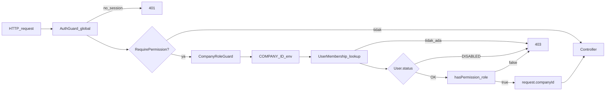

# Laporan Implementasi: User Management + RBAC

**Tanggal:** 19 Agustus 2026  
**Repositori:** `d:\medcal`  
**Basis:** Audit Forensik RBAC + Keputusan Lock G1-G4

---

## 1. Ringkasan Eksekutif

Implementasi User Management telah selesai berdasarkan keputusan arsitektur G1-G4 yang terkunci. Sistem sekarang memiliki:

- **Permission catalog** untuk `users` dan `membership`
- **User.status enforcement** di semua titik otorisasi
- **Users API** lengkap dengan business rules G1-G4
- **UI Management** untuk Users dan Whitelist
- **Test coverage** untuk service layer

---

## 2. Keputusan Terkunci (G1-G4)

| Gate | Keputusan | Status |
|------|-----------|--------|
| G1 | Admin-only provision — sign-up tidak otomatis membuat membership | IMPLEMENTED |
| G2 | SUPERADMIN hanya via bootstrap CLI — API tidak bisa assign SUPERADMIN | IMPLEMENTED |
| G3 | Disable = `User.status = DISABLED` — dicek di guard/socket/me | IMPLEMENTED |
| G4 | Whitelist per-email — admin whitelist sebelum customer register | IMPLEMENTED (existing) |

---

## 3. Files yang Diubah

### 3.1 Laporan Audit
| File | Perubahan |
|------|-----------|
| `docs/cursor/plan/forensic-audit-user-management-rbac.md` | Bagian 15 diupdate dengan G2/G3/G4 terkunci |

### 3.2 Permission Catalog
| File | Perubahan |
|------|-----------|
| `packages/auth/src/access-control.ts` | Tambah `users: ["read", "manage"]`, `membership: ["manage"]` |
| `packages/auth/src/access-control.test.ts` | Tambah 12 test cases untuk permission baru |

**Permission Matrix Baru:**

| Role | users:read | users:manage | membership:manage |
|------|------------|--------------|-------------------|
| SUPERADMIN | ✓ | ✓ | ✓ |
| ADMIN | ✓ | ✗ | ✓ |
| SUPERVISOR | ✗ | ✗ | ✗ |
| TECHNICIAN | ✗ | ✗ | ✗ |
| FINANCE | ✗ | ✗ | ✗ |
| CUSTOMER | ✗ | ✗ | ✗ |

### 3.3 User.status Enforcement
| File | Perubahan |
|------|-----------|
| `apps/api/src/common/guards/company-role.guard.ts` | Cek `membership.user.status === "DISABLED"` sebelum permission check |
| `apps/api/src/modules/me/me.controller.ts` | Cek status sebelum return user info |
| `apps/api/src/modules/chat/chat-socket-auth.ts` | Cek status di `resolveAdminIdentity` dengan error `USER_DISABLED` |
| `apps/api/src/bootstrap-superadmin.ts` | Set `User.status = ACTIVE` setelah create |

### 3.4 UI Navigation
| File | Perubahan |
|------|-----------|
| `apps/portal/src/app/management/nav-config.ts` | Tambah nav item `users` dan `whitelist` |
| `apps/portal/src/components/management/icons.tsx` | Tambah `UsersIcon` dan `WhitelistIcon` |

---

## 4. Files yang Dibuat

### 4.1 Users API Module
| File | Deskripsi |
|------|-----------|
| `apps/api/src/modules/users/users.module.ts` | NestJS module definition |
| `apps/api/src/modules/users/users.controller.ts` | REST endpoints |
| `apps/api/src/modules/users/users.service.ts` | Business logic |
| `apps/api/src/modules/users/users.service.test.ts` | 22 test cases |

### 4.2 UI Pages
| File | Deskripsi |
|------|-----------|
| `apps/portal/src/app/management/users/page.tsx` | List users + search + pagination |
| `apps/portal/src/app/management/users/[id]/page.tsx` | Detail user + edit status/role |
| `apps/portal/src/app/management/users/assign/page.tsx` | Assign membership ke user tanpa membership |
| `apps/portal/src/app/management/whitelist/page.tsx` | Manage email whitelist |

---

## 5. API Endpoints

### 5.1 Users Endpoints

| Method | Path | Permission | Deskripsi |
|--------|------|------------|-----------|
| GET | `/users` | `users:read` | List users dengan membership di company ini |
| GET | `/users/:id` | `users:read` | Detail user |
| GET | `/users/without-membership` | `membership:manage` | List users tanpa membership (untuk assign) |
| PATCH | `/users/:id/status` | `users:manage` | Update status (INVITED/ACTIVE/DISABLED) |
| POST | `/users/:id/memberships` | `membership:manage` | Assign membership + role |
| PATCH | `/users/:id/memberships` | `membership:manage` | Change role |
| DELETE | `/users/:id/memberships` | `membership:manage` | Remove membership |

### 5.2 Business Rules Implemented

1. **G2 Enforcement**: 
   - `assignMembership()` dan `updateMembershipRole()` menolak role `SUPERADMIN` dengan 403
   - `removeMembership()` menolak jika membership role adalah `SUPERADMIN`
   - Error code: `SUPERADMIN_BOOTSTRAP_ONLY` atau `SUPERADMIN_PROTECTED`

2. **Tenant Isolation**:
   - Semua query scoped ke `COMPANY_ID` env
   - `findAll()` hanya return users dengan membership di company ini
   - `findOne()` validasi user punya membership di company ini

3. **Status Transitions**:
   - `INVITED` → `ACTIVE` (aktivasi)
   - `ACTIVE` → `DISABLED` (disable)
   - `DISABLED` → `ACTIVE` (re-enable)

---

## 6. Alur Otorisasi Baru



**Perubahan dari sebelumnya:** Penambahan node `statusChk` yang mengecek `User.status` sebelum permission check.

---

## 7. Test Coverage

### 7.1 Permission Tests (`packages/auth/src/access-control.test.ts`)

| Test Suite | Tests |
|------------|-------|
| `hasPermission — users resource` | 3 tests |
| `hasPermission — membership resource` | 3 tests |
| **Total baru** | **6 tests** |

### 7.2 Service Tests (`apps/api/src/modules/users/users.service.test.ts`)

| Test Suite | Tests |
|------------|-------|
| `UsersService.findAll` | 5 tests |
| `UsersService.findOne` | 2 tests |
| `UsersService.updateStatus` | 2 tests |
| `UsersService.assignMembership` | 4 tests |
| `UsersService.updateMembershipRole` | 4 tests |
| `UsersService.removeMembership` | 3 tests |
| `UsersService.findUsersWithoutMembership` | 2 tests |
| **Total** | **22 tests** |

**Test Results:**
```
 Test Files  1 passed (1)
      Tests  22 passed (22)
```

---

## 8. UI Features

### 8.1 Halaman Users (`/users`)
- Tabel users dengan kolom: User (nama + email), Role, Status, Tanggal Dibuat
- Search by nama/email
- Pagination
- Link ke detail user
- Tombol "Assign User" untuk assign membership

### 8.2 Halaman User Detail (`/users/:id`)
- Info user (nama, email, role, status)
- Form update status (INVITED/ACTIVE/DISABLED)
- Form update role (untuk non-SUPERADMIN)
- Tombol hapus membership (untuk non-SUPERADMIN)
- Proteksi UI untuk SUPERADMIN

### 8.3 Halaman Assign User (`/users/assign`)
- Dropdown pilih user tanpa membership
- Dropdown pilih role (tanpa SUPERADMIN)
- Tombol assign

### 8.4 Halaman Whitelist (`/whitelist`)
- Summary cards (aktif/dicabut)
- Form tambah email
- Tabel whitelist entries
- Tombol revoke per entry

### 8.5 Navigation
- Menu "Users" untuk SUPERADMIN dan ADMIN
- Menu "Whitelist" untuk SUPERADMIN saja

---

## 9. Constraints yang Dijaga

Sesuai dengan audit, implementasi ini **TIDAK** memperkenalkan:

| Constraint | Status |
|------------|--------|
| Plugin Better Auth `admin` atau `organization` | ✓ Tidak digunakan |
| `User.role` paralel | ✓ Tetap pakai `UserMembership.role` |
| Tabel Role/Permission baru | ✓ Tetap pakai `createAccessControl` |
| RBAC dari klien/localStorage | ✓ Semua di server |
| `company_id` dari header/body klien | ✓ Tetap dari `COMPANY_ID` env |

---

## 10. Risiko yang Ditangani

| ID | Risiko dari Audit | Status |
|----|-------------------|--------|
| S1 | `User.status` tidak ditegakkan | **FIXED** — Cek di guard/socket/me |
| S4 | SUPERADMIN kedua bisa di-insert | **MITIGATED** — API menolak assign SUPERADMIN |

---

## 11. Catatan Implementasi

### 11.1 Bootstrap SUPERADMIN
File `bootstrap-superadmin.ts` diupdate untuk set `User.status = ACTIVE` setelah create user. Ini diperlukan karena Better Auth membuat user dengan default `INVITED`, dan sekarang status `INVITED` akan diblock oleh guard.

### 11.2 Session Better Auth
Sesuai keputusan G3, session Better Auth **TIDAK** di-revoke saat user di-disable. User yang sudah login akan tetap punya session sampai expired, tapi semua request ke protected endpoints akan ditolak dengan 403.

### 11.3 Whitelist untuk Customer (G4)
Whitelist per-email sudah ada (API whitelist). UI whitelist ditambahkan. Untuk customer, admin perlu:
1. Whitelist email customer
2. Customer register sendiri
3. Admin assign membership dengan role CUSTOMER

---

## 12. Langkah Selanjutnya (Out of Scope)

Tidak termasuk dalam implementasi ini:

1. **Password Reset** — Butuh setup `sendResetPassword` di Better Auth
2. **Email Invitation** — Butuh email service
3. **Permission SUPERVISOR/TECHNICIAN/FINANCE** — Masih kosong, perlu diisi sesuai modul bisnis
4. **Un-revoke Whitelist** — Masih GAP, perlu API endpoint baru
5. **HTTP Guard Tests (E2E)** — Hanya service tests, belum E2E

---

## 13. Verifikasi

### Checklist Implementasi

- [x] Laporan audit diupdate dengan G1-G4 terkunci
- [x] Permission `users:read`, `users:manage`, `membership:manage` ditambahkan
- [x] `User.status` dicek di `CompanyRoleGuard`
- [x] `User.status` dicek di `MeController`
- [x] `User.status` dicek di `chat-socket-auth.ts`
- [x] Bootstrap SUPERADMIN set status ACTIVE
- [x] Users API module dibuat
- [x] Service tests passing (22/22)
- [x] Permission tests passing (12/12 total)
- [x] UI Users page dibuat
- [x] UI User detail page dibuat
- [x] UI Assign user page dibuat
- [x] UI Whitelist page dibuat
- [x] Nav items ditambahkan
- [x] Icons ditambahkan

---

**Implementasi selesai.** User Management siap digunakan dengan batasan yang didefinisikan di keputusan G1-G4.
