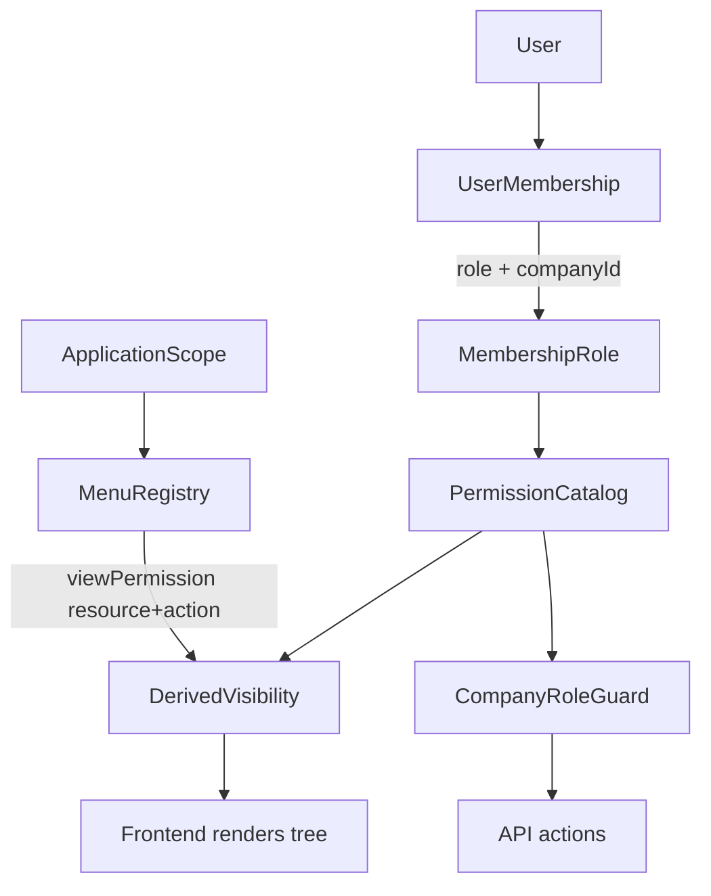

# Review Arsitektur Menu + Permission v2 (READ-ONLY)

**Tanggal:** 19 Agustus 2026  
**Sifat:** review keputusan arsitektur. Bukan implementasi.  
**Kode, Prisma, permission, nav, guard, dan tes tidak diubah.**

**Baseline current-state:** [forensic-audit-menu-permission.md](./forensic-audit-menu-permission.md)

**Keputusan produk yang dikunci untuk review ini:** admin/ops harus bisa mengubah struktur menu di UI tanpa deploy.

Label bukti: **FACT** / **INFERENCE** / **GAP** / **RISK** / **UNVERIFIED**.

Contoh pohon Management / Technician / Customer di prompt produk adalah **arah produk**, bukan fakta repo. Tidak ada menu atau permission baru yang dibuat di tugas ini.

---

## 1. Executive Verdict

- Rekomendasi audit v1 (**hardcoded menu + visibilitas permission**) **masih benar untuk kondisi repo saat ini**: pohon kecil, satu portal management, client skeleton, tech PWA tanpa nav.
- Sebagai **target jangka panjang**, hardcoded **tidak lagi berdiri sendiri**. Ada empat permukaan aplikasi yang direncanakan + kebutuhan ubah menu tanpa deploy.
- **Database-driven definisi menu justified.** Database-driven **otorisasi menu tidak justified.**
- **Hybrid adalah arsitektur yang benar:**
  - **Menu** = registry terstruktur (application-scoped, di-seed dari kode, bisa diedit ops) di database.
  - **Visibility** = turunan `hasPermission(UserMembership.role, resource, action)`.
  - **Authorization aksi** = tetap `@RequirePermission` + `CompanyRoleGuard`.
- **Jangan** membuat `Role → Menu` mapping, `sys_MenuPermission`, `UserMenuPermission`, atau RBAC kedua.

---

## 2. Current Architecture Baseline

Ringkasan temuan audit v1 yang relevan saja.

**FACT.** Nav management hardcoded di [`apps/portal/src/app/management/nav-config.ts`](../../apps/portal/src/app/management/nav-config.ts) (`managementNav` + `filterNavByRole` pada `roles[]`). Client: [`apps/portal/src/app/client/nav-config.ts`](../../apps/portal/src/app/client/nav-config.ts). Tech PWA: **tidak ada nav** ([`apps/tech-pwa/src/app/page.tsx`](../../apps/tech-pwa/src/app/page.tsx)).

**FACT.** Katalog RBAC di [`packages/auth/src/access-control.ts`](../../packages/auth/src/access-control.ts): `resource + action` (`contactMessage:read`, `whitelist:manage`, `lead:read/update`, `chat:read/reply/close`, `users:read/manage`, `membership:manage`). SUPERVISOR / TECHNICIAN / FINANCE / CUSTOMER = `{}`.

**FACT.** Otorisasi: `UserMembership.role` → `hasPermission` → `CompanyRoleGuard` + `@RequirePermission`. Tenant = `process.env.COMPANY_ID`. Schema Prisma: *No branchId (Company only)*.

**FACT.** `GET /me` mengembalikan `{ user, membership: { role, companyId } }`, **bukan** daftar permission. `ac` / `roleStatements` tidak diekspor. Frontend portal tidak memanggil `hasPermission`.

**FACT.** Tidak ada model `Menu` / `MenuPermission`. Visibilitas menu **bukan** security boundary. Layout tidak memblokir URL per-menu; API menolak dengan 403.

**GAP.** SUPERVISOR / TECHNICIAN / FINANCE / CUSTOMER tidak punya grant modul. Aplikasi Technician/Customer belum bisa menurunkan menu dari permission sampai grant nyata ditambahkan saat modul itu ada.

---

## 3. New Product Requirements

Roadmap mengubah evaluasi audit v1 (yang menilai pohon kecil saat ini) karena:

1. **Banyak pohon menu**, bukan satu sidebar management.
2. **Pohon bisa berbeda total** (Technician ≠ Customer ≠ Management).
3. **Calibration Management** akan menekan katalog permission dengan aksi bisnis (assign / submit / post / approve / print / export) — ini **bukan** alasan Role→Menu.
4. **Ops harus mengubah menu tanpa deploy.** Hardcoded-only tidak memenuhi keputusan ini.
5. Role yang sama (mis. ADMIN) mungkin melihat item berbeda di aplikasi berbeda — itu **application-scoped menu**, bukan role kedua dan bukan `User.role` paralel.

**UNVERIFIED — PRODUCT DECISION REQUIRED:** apakah Calibration Management adalah aplikasi terpisah atau modul di dalam Management.

---

## 4. Menu Architecture

**Rekomendasi: hybrid.**

| Lapisan | Bentuk | Alasan |
|---|---|---|
| Definisi pohon (label, href, icon, parent, order, enabled, application) | **Entity database** + seed dari kode | Ops edit tanpa deploy; banyak aplikasi; urutan/label berubah lebih sering daripada permission |
| Kode default / seed | **Source-controlled** | Baseline yang bisa di-review di git; recovery jika DB rusak |
| Visibilitas | **Bukan data terpisah** | `hasPermission` pada permission yang sudah ada |
| Otorisasi aksi halaman | **RBAC existing** | Menu tidak menyimpan flag CRUD |

Mengapa bukan hardcoded murni jangka panjang: empat permukaan + ops-without-deploy.

Mengapa bukan DB murni untuk authorization: akan menduplikasi `roleStatements` (temuan audit v1 S4).

**Menu harus entity independen** (struktur navigasi), **bukan** entity otorisasi.

**Menu harus application-scoped** (konsep `MANAGEMENT` | `TECHNICIAN` | `CALIBRATION` | `CUSTOMER`). Enum ini **belum ada di repo**.

**Phasing (INFERENCE):** tetap hardcoded sampai permukaan kedua yang punya nav nyata, atau sampai admin menu dijadwalkan. Jangan bangun registry “untuk berjaga-jaga” sebelum itu.

---

## 5. Permission Architecture

Model existing `resource + action` **sudah mampu** menampung capability/action.

**FACT — precedent per-verb, bukan CRUD generik:**

- `chat:reply`, `chat:close`
- `lead:read`, `lead:update` (bukan `lead:manage`; `lead:assign` sengaja tidak ada)
- `users:read` vs `users:manage` vs `membership:manage`
- `whitelist:manage` adalah blanket sempit, bukan pola yang harus digeneralisasi

Pola target untuk Calibration (konseptual, **jangan dibuat sekarang**):

```text
resource          + action
calibrationJob    read | create | update | assign | submit | post | approve
certificate       print
report            export
```

CRUD generik (`create` / `read` / `update` / `delete`) **boleh** untuk resource yang memang CRUD. Aksi bisnis (`assign`, `post`, `approve`, `export`, `print`, `reply`, `close`, `submit`) **harus verb sendiri**.

Jangan menempel `can_print` / `can_approve` pada baris menu. Itu mencampur visibilitas dengan capability.

**GAP:** grant SUPERVISOR / TECHNICIAN / FINANCE / CUSTOMER masih `{}`. Isi grant **hanya saat modul nyata** diimplementasi.

---

## 6. Menu ↔ Permission Relationship

```text
MenuItem.application
MenuItem.parent / order / href / icon / enabled
MenuItem.viewPermission = { resource, action }   // biasanya :read
```

Aturan:

1. **Satu permission visibilitas per leaf** (bukan array CRUD).
2. **Group visible jika ada child visible** (ANY pada anak) — sama seperti `filterNavByRole` yang sudah drop group kosong.
3. Jika suatu saat satu leaf perlu beberapa permission: semantik **ANY** untuk *tampil*. **ALL** terlalu ketat dan mendorong Role→Menu.
4. Tombol di halaman (Assign, Approve, Print) memakai permission **lain**, dicek backend, opsional di-hide di UI. Bukan kolom pada menu.
5. `enabled=false` (ops) menyembunyikan item untuk semua role — itu **feature flag navigasi**, bukan revoke permission. API tetap menjaga aksi.

Tidak perlu tabel `MenuPermission`. Mapping `Role → Menu` tidak diperlukan dan akan menduplikasi RBAC.

---

## 7. Role ↔ Permission ↔ Menu

Rantai yang benar:

```text
User
  → UserMembership (companyId + role)     // locked
    → Role                                 // MembershipRole enum
      → Permission                         // roleStatements / hasPermission
        → (derived) Menu visibility
Menu (application tree) ──references──► Permission key
```

**Bukan:** User → Role → MenuPermission → `can_view`.

Tolak `UserMenuPermission`, `UserRoleMenu`, `MenuRole`, `User.role` paralel, dan engine otorisasi menu terpisah.

Role tidak “punya menu”. Role punya permission. Menu merujuk permission. Visibilitas dihitung.

---

## 8. Multi-Application Model

Satu fondasi RBAC, banyak pohon:

```text
Application MANAGEMENT  → MenuTree M  → filter hasPermission
Application TECHNICIAN  → MenuTree T  → filter hasPermission
Application CALIBRATION → MenuTree C  → filter hasPermission
Application CUSTOMER    → MenuTree U  → filter hasPermission
```

**FACT.** Host split saat ini di [`apps/portal/src/proxy.ts`](../../apps/portal/src/proxy.ts) (`apps.` → management, `portal.` → client) adalah **UX routing**, bukan auth. Tech PWA adalah app terpisah dengan `useRequireSession` + `GET /me` yang sama.

**INFERENCE.** Calibration bisa berupa aplikasi sendiri atau grup di Management. **UNVERIFIED — PRODUCT DECISION REQUIRED.** Application-scoped menu mendukung keduanya: `application=CALIBRATION` atau `application=MANAGEMENT` + parent node.

Tidak boleh ada RBAC Technician terpisah. `TECHNICIAN` tetap `UserMembership.role`; grant ditambah di `access-control.ts` saat modul field ada.

Cross-application shell (CUSTOMER di host `apps.*`) tetap mungkin seperti audit S13. Host bukan authorization. API tetap 403.

---

## 9. Company / Branch / Application Scope

| Scope | Keputusan | Alasan |
|---|---|---|
| Application | **YA** | Pohon berbeda per permukaan |
| Company pada definisi menu | **TIDAK sebagai default** | Satu tenant per proses (`COMPANY_ID`). Menu = metadata aplikasi. Audit v1: `company_id` on menu NOT NEEDED |
| Branch | **TIDAK** | Schema: *No branchId (Company only)* |
| Company overlay (hide item per tenant) | **UNVERIFIED** | Ops-without-deploy pada single-tenant-per-process cukup mengedit registry global proses itu. Overlay multi-tenant hanya jika suatu hari satu DB multi-company |

Jangan menyalin `company_id` / `branch_id` legacy ke setiap baris menu.

---

## 10. Frontend Permission Delivery

Karena pohon target ada di DB, **menu API diperlukan** pada fase implementasi registry.

```text
GET /nav?application=MANAGEMENT
  → session + membership + ACTIVE (pola GET /me)
  → load tree for application
  → drop enabled=false
  → drop nodes where !hasPermission(role, viewPermission)
  → return filtered tree only
```

Frontend **hanya merender** response. Tidak menjadi security boundary.

Jangan kirim katalog permission penuh ke client kecuali ada kebutuhan tombol in-page (**UNVERIFIED — PRODUCT DECISION REQUIRED**). Untuk nav, pohon terfilter cukup.

**RISK jika client memanggil `hasPermission` sendiri:** [`packages/auth/src/index.ts`](../../packages/auth/src/index.ts) mengekspor `auth` + `hasPermission` bersama; `roleStatements` tidak diekspor. Audit v1 menandai ini sebagai GAP. API nav menghindari masalah itu.

URL bypass tetap mungkin (seperti sekarang). Backend tetap 403. Page-level UX redirect: **UNVERIFIED — PRODUCT DECISION REQUIRED**.

Interim (sebelum registry): frontend bisa tetap pakai hardcoded tree, tetapi visibilitas harus permission-derived di server atau via helper client-safe — **bukan** `roles[]` paralel. Itu perbaikan UX, bukan security.

---

## 11. Legacy Compatibility

Gunakan `sys_Menu` / `sys_MenuPermission` / `sys_UserCompanyRole` hanya sebagai referensi. Jangan mereplikasi skema.

| Konsep | Status |
|---|---|
| `id`, `parent_id`, `menu_description`, `href`, `icon`, `status` | **Reusable** sebagai field definisi Menu |
| `has_child` | **Derivable** (`children.length`) |
| `module_id` / `menu_type` | **Potentially useful with modification** → ganti `application` + group vs leaf |
| audit fields | **Optional** jika ops mengedit |
| `company_id` / `branch_id` pada menu | **Obsolete / incompatible** dengan tenant model sekarang |
| `userCompanyRole_id` + `menu_id` | **Incompatible** — duplikasi Role→Permission |
| `can_view` | **Derivable** dari `hasPermission` |
| `can_create` / `can_edit` / `can_delete` / `can_print` / `can_approve` pada menu | **Incompatible** — campur visibilitas dengan aksi; bertentangan dengan katalog per-verb |

Definisi menu ≠ otorisasi role/permission. Itu dua lapisan. Legacy menggabungkannya; MedCal tidak boleh.

---

## 12. Security Implications

Prinsip yang harus dipertahankan: **MENU VISIBILITY IS NOT THE SECURITY BOUNDARY.**

Backend tetap: `UserMembership.role` + `hasPermission` + `CompanyRoleGuard` + `@RequirePermission`.

| Risiko | Status | Safeguard |
|---|---|---|
| Hidden menu = security | RISK existing (S1) | Tetap dokumentasikan; guard API wajib |
| URL bypass | FACT existing | Layout tidak block route; API 403 |
| Client spoof permission | RISK jika nav dihitung di client | Hitung filter di server |
| Duplikasi Role→Menu | RISK arsitektur | Dilarang |
| Tenant leakage | FACT dimitigasi env `COMPANY_ID` | Jangan terima company dari klien |
| Cross-application access | FACT S13 | Host bukan auth; butuh keputusan app-area; API tetap 403 |
| Stale cached menus | RISK jika registry + cache | Cache key: application + role + menu version; invalidate on ops edit |
| Privilege escalation via menu admin | RISK baru | Mengubah menu **tidak** boleh mengubah grant; ops menu nanti `menu:manage`, terpisah dari `users:manage` — **jangan dibuat sekarang** |
| Guard tanpa `@RequirePermission` | FACT S7 | Endpoint baru wajib decorator |

Tidak memperbaiki temuan. Tidak menambah permission sekarang.

---

## 13. Performance / Caching Implications

Hanya implikasi arsitektur; tidak diimplementasi.

- Pohon menu kecil (puluhan node, bukan ribuan). Query per request atau cache in-process cukup.
- Cache server: `(application, role)` → filtered tree; TTL pendek + bust on ops edit.
- Jangan cache nav di `localStorage` sebagai sumber otorisasi (hanya UX; analog `medcal.management.sidebarCollapsed` di [`apps/portal/src/components/management/shell-state.ts`](../../apps/portal/src/components/management/shell-state.ts)).
- Filter `hasPermission` adalah lookup in-memory (O(1) per cek).

---

## 14. Conceptual Target Architecture

```text
User
  → UserMembership.role + companyId     (locked RBAC)
    → Permission catalog (resource + action)
      → derived visibility

Application
  → Menu registry (tree, href, icon, enabled, viewPermission)
    → GET /nav?application=… (server-filtered)
      → Frontend renders
```



Rantai yang ditolak: `Role → MenuPermission(can_*) → Menu`.

---

## 15. Implementation Prerequisites

Keputusan yang harus dikunci **sebelum** implementasi. **Jangan diimplementasikan dalam tugas ini.**

1. Hybrid registry dikonfirmasi vs hardcoded interim.
2. Daftar `application` keys (apakah Calibration aplikasi terpisah atau modul Management).
3. Siapa yang boleh mengedit menu (role/permission ops) — **jangan** reuse `users:manage`. Jangan membuat `menu:manage` sampai fase implementasi registry diotorisasi.
4. Semantik visibilitas: satu `viewPermission` per leaf + ANY pada children.
5. Apakah Dashboard tanpa grant tetap tampil (role `{}` hari ini).
6. Apakah CUSTOMER boleh load host `apps.*` (audit S13).
7. Nav API shape; apakah client juga butuh capability bag untuk tombol in-page.
8. Page-level 403 UX vs hide-only.
9. Isi grant SUPERVISOR / TECHNICIAN / CUSTOMER **hanya saat modul nyata** — jangan isi dummy.
10. Tidak menambah `lead:assign` / `chat:assign` / CRUD generik hanya agar menu muat.

---

## 16. Final Decision

RECOMMENDATION:
Hybrid — application-scoped menu registry (DB + seed) with visibility derived from existing resource+action RBAC; no Role→Menu table; no second RBAC.

RBAC STATUS:
Locked and unchanged — Better Auth, UserMembership.role, createAccessControl, hasPermission, CompanyRoleGuard, @RequirePermission, COMPANY_ID, G1–G5.

MENU STATUS:
Interim: keep current hardcoded nav. Target later: DB menu definitions per application; server-filtered nav API; ops-editable structure without deploy. Do not copy sys_MenuPermission.

IMPLEMENTATION STATUS:
NOT AUTHORIZED — READ-ONLY ARCHITECTURE REVIEW

NEXT STEP:
Lock the 10 prerequisites in §15 (especially application keys and whether Calibration is a separate surface), then authorize a follow-up implementation phase for the menu registry only — still without changing the permission catalog except when real modules land.
