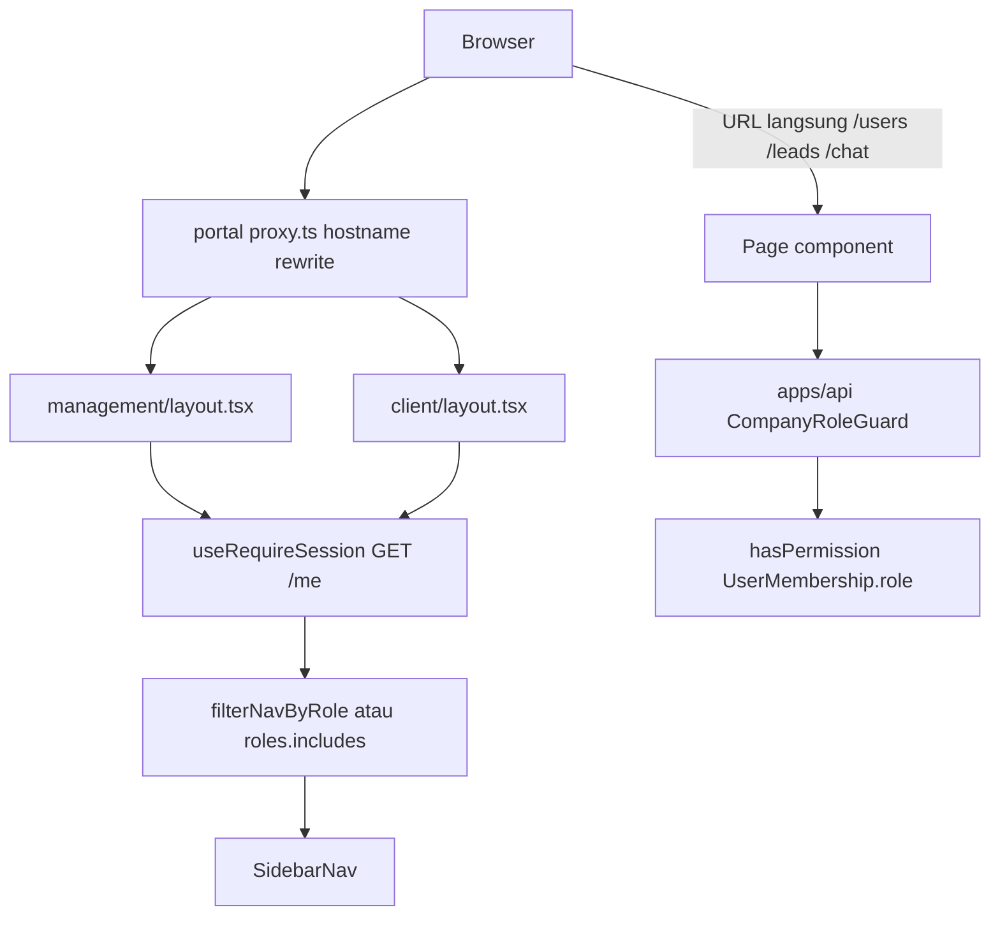

# Audit Forensik Menu Permission (READ-ONLY)

**Tanggal:** 19 Agustus 2026  
**Sifat:** READ-ONLY. Sumber kebenaran = kode repo saat ini.  
**Kode aplikasi tidak diubah dalam tugas ini.** Tidak ada migrasi, permission baru, atau refactor RBAC G1–G5.

Label bukti:

| Label | Arti |
|---|---|
| **FACT** | Terverifikasi dari file di repositori |
| **INFERENCE** | Diturunkan dari perilaku kode |
| **GAP** | Fungsi yang tidak ada |
| **RISK** | Kekhawatiran keamanan / desain |
| **UNVERIFIED** | Tidak bisa dikonfirmasi dari repo saja |

---

## 1. Executive Verdict

- **Konsistensi internal:** **sebagian.** Backend RBAC (katalog + guard) konsisten. Frontend menu **tidak** memakai katalog permission yang sama.
- **Model visibilitas:** **role-based.** `NavItem.roles` + `filterNavByRole` / `roles.includes`. Bukan permission-based. Bukan campuran role+permission di kode.
- **Keamanan backend:** **aman sebagai security boundary** untuk resource yang sudah dipasang `@RequirePermission` + `CompanyRoleGuard`. Menu yang disembunyikan **bukan** security boundary.
- **Legacy `sys_Menu`:** **tidak kompatibel** sebagai tabel DB. Konsep hierarki/label/href/icon boleh tetap di config hardcoded.
- **Legacy `sys_MenuPermission`:** **tidak kompatibel.** Kolom CRUD `can_view/create/edit/delete/print/approve` bertabrakan dengan katalog per-verb yang sudah dikunci G1–G5.
- **Apakah MedCal butuh layer Menu Permission terpisah?** **Tidak.** Visibilitas bisa diturunkan dari `menu.requiredPermission → hasPermission(UserMembership.role)`.
- **Yang harus dipertahankan:** Better Auth, `UserMembership.role`, `createAccessControl` + `hasPermission`, `CompanyRoleGuard`, `@RequirePermission`, `COMPANY_ID`, lifecycle G5.

```text
Authentication  = Better Auth session
Role            = UserMembership.role (satu-satunya)
Permission      = hasPermission(role, resource, action)
Menu            = hardcoded NavItem[] (UX)
Menu visibility = roles.includes(role)   // saat ini
Page access     = layout session + GET /me; TIDAK memblokir URL per-menu
Action auth     = CompanyRoleGuard / socket requireChatPermission
Tenant          = process.env.COMPANY_ID
```

**FACT.** Komentar di `apps/portal/src/app/management/nav-config.ts` menyatakan: *UX only — apps/api's CompanyRoleGuard is the real enforcement boundary.*

---

## 2. Current Menu Architecture

```text
hostname apps.* / portal.*
  → apps/portal/src/proxy.ts rewrite ke /management/* atau /client/*
     (bukan auth — tidak cek session/role/permission)
  → layout client-side: useRequireSession + GET /me
  → /me: session + UserMembership(COMPANY_ID) + User.status === ACTIVE
  → nav difilter oleh role (bukan permission)
  → klik menu → page → apiFetch ke apps/api
  → CompanyRoleGuard: session + membership + ACTIVE + hasPermission
```



**FACT** — `filterNavByRole` hanya dipakai di `apps/portal/src/app/management/layout.tsx` (memanggil `filterNavByRole(managementNav, me.membership.role)`). Layout **tidak** membandingkan pathname dengan nav; `children` selalu dirender jika `/me` lolos.

**FACT** — `apps/portal/src/proxy.ts` hanya rewrite hostname (`apps.` → management, `portal.` → client). Matcher mengecualikan `sign-in`. Bukan RBAC.

**FACT** — `GET /me` mengembalikan `{ user, membership: { role, companyId } }`. Tidak ada daftar permission.

**FACT** — `ac` dan `roleStatements` di `packages/auth/src/access-control.ts` **tidak diekspor**. Satu-satunya API publik adalah `hasPermission` (`packages/auth/src/index.ts`). Frontend portal **tidak** mengimpor `hasPermission`.

**GAP** — tidak ada model Prisma `Menu` / `MenuPermission` / `sys_Menu`. Tidak ada seed menu.

---

## 3. Current Menu Inventory

File navigasi yang ditemukan (exhaustive search `*nav*`):

| File | Fungsi |
|---|---|
| `apps/portal/src/app/management/nav-config.ts` | `managementNav` + `filterNavByRole` |
| `apps/portal/src/app/client/nav-config.ts` | `clientNav` |
| `apps/portal/src/components/management/sidebar-nav.tsx` | render sidebar (tidak filter) |
| `apps/web/src/data/site.ts` | `primaryNav` marketing publik |
| tech-pwa | **NONE FOUND** — header skeleton saja |

| Label | href | Parent | Area | Visibility rule | Role restriction | Permission restriction | Backend authorization | Notes |
|---|---|---|---|---|---|---|---|---|
| Dashboard | `/` | — | management | `filterNavByRole` | SUPERADMIN, ADMIN, SUPERVISOR, TECHNICIAN, FINANCE | NONE FOUND | GET `/me` saja | Halaman hardcode `ChannelLink` ke `/leads` dan `/chat` tanpa filter role |
| Leads | `""` (group) | — | management | role | SUPERADMIN, ADMIN | NONE FOUND | n/a (bukan route) | Group expand/collapse |
| Messages | `/leads` | Leads | management | role | SUPERADMIN, ADMIN | NONE FOUND | `lead:read` + `contactMessage:read` | |
| Web Chat | `/chat` | Leads | management | role | SUPERADMIN, ADMIN | NONE FOUND | `chat:read` (+ `reply`/`close` di socket) | |
| Email | `/email` | Leads | management | role + `disabled: true` | SUPERADMIN, ADMIN | NONE FOUND | NONE FOUND | Tidak ada `page.tsx` `/email` |
| Users | `/users` | — | management | role | SUPERADMIN, ADMIN | NONE FOUND | `users:read` / `users:manage` / `membership:manage` | Subroute `/users/assign`, `/users/[id]` tidak di nav |
| Whitelist | `/whitelist` | — | management | role | SUPERADMIN | NONE FOUND | `whitelist:manage` | |
| Dashboard | `/` | — | client (`portal.*`) | `item.roles.includes` | CUSTOMER, SUPERADMIN, ADMIN | NONE FOUND | GET `/me` | Skeleton |
| Beranda | `/` | — | apps/web | publik | NONE FOUND | NONE FOUND | publik | `primaryNav` |
| Layanan Kalibrasi | `/layanan` | — | apps/web | publik | NONE FOUND | NONE FOUND | publik | |
| Sertifikasi & Legalitas | `/sertifikasi-legalitas` | — | apps/web | publik | NONE FOUND | NONE FOUND | publik | |
| Kontak | `/kontak` | — | apps/web | publik | NONE FOUND | NONE FOUND | publik / web-api internal secret | |
| Technician PWA home | `/` | — | tech-pwa | session + `/me` | NONE FOUND | NONE FOUND | GET `/me` | Setiap membership ACTIVE bisa masuk shell |

Header management (`apps/portal/src/components/management/header.tsx` + `header-controls.tsx`):

- Ikon Messages/Chat hanya jika `me.membership.role === "SUPERADMIN" || me.membership.role === "ADMIN"` (`showInbound`). **Hardcoded role**, bukan `hasPermission`.
- Ikon Email **selalu dirender** (disabled) untuk semua role yang lolos layout, termasuk SUPERVISOR / TECHNICIAN / FINANCE.
- Layout management **tidak** menolak CUSTOMER: jika `/me` sukses, shell tetap tampil; sidebar kosong.
- Layout client **tidak** menolak SUPERVISOR / TECHNICIAN / FINANCE: nav kosong, shell tetap tampil.

---

## 4. Current Permission Catalog

Sumber: `packages/auth/src/access-control.ts` `createAccessControl({...} as const)`.

String persis (jangan dinormalisasi):

```text
contactMessage:read
whitelist:manage
lead:read
lead:update
chat:read
chat:reply
chat:close
users:read
users:manage
membership:manage
```

**FACT.** Tes `hasPermission("SUPERADMIN", "lead", "assign")` → `false` (`packages/auth/src/access-control.test.ts`). Tidak ada `chat:assign`.

**FACT.** Tidak ada permission generik `create` / `edit` / `delete` / `print` / `approve`.

---

## 5. Current Role → Permission Matrix

Dari `roleStatements` di `packages/auth/src/access-control.ts`:

| Role | Grants |
|---|---|
| SUPERADMIN | contactMessage:read, whitelist:manage, lead:read, lead:update, chat:read, chat:reply, chat:close, users:read, users:manage, membership:manage |
| ADMIN | contactMessage:read, lead:read, lead:update, chat:read, chat:reply, chat:close, users:read, membership:manage |
| SUPERVISOR | `{}` |
| TECHNICIAN | `{}` |
| FINANCE | `{}` |
| CUSTOMER | `{}` |

**FACT.** ADMIN **tidak** punya `whitelist:manage` dan **tidak** punya `users:manage`. ADMIN **punya** `membership:manage`.

Enum Prisma `MembershipRole` (`packages/db/prisma/schema.prisma`): `SUPERADMIN | ADMIN | SUPERVISOR | TECHNICIAN | FINANCE | CUSTOMER`. Model `User` **tidak** punya field `role`.

---

## 6. Menu → Backend Authorization Matrix

Rantai umum untuk endpoint ber-`@RequirePermission`:

1. Global AuthGuard Better Auth (session) — `AuthModule.forRoot({ auth, isGlobal: true })`
2. `CompanyRoleGuard`: `process.env.COMPANY_ID` → session → `UserMembership` → `User.status === ACTIVE` → `hasPermission`

`GET /me` **tidak** memakai `CompanyRoleGuard`; menduplikasi lookup membership + ACTIVE.

| Menu | Route | Backend resource | Auth | ACTIVE | Membership | Permission | Guard | Tenant scope | Result |
|---|---|---|---|---|---|---|---|---|---|
| Dashboard | `/` | GET `/me` | Ya | Ya | Ya | NONE | AuthGuard + logic `MeController` | `COMPANY_ID` env | Shell tampil untuk setiap role ACTIVE termasuk SUPERVISOR |
| Messages | `/leads`, `/leads/[id]` | `/leads`, `/contact-messages` | Ya | Ya | Ya | `lead:read` / `lead:update`; `contactMessage:read` (termasuk PATCH status); resolve lead = `lead:update` | `CompanyRoleGuard` | query `companyId` dari guard | API 403 jika role `{}`; **halaman tetap bisa dibuka** |
| Web Chat | `/chat`, `/chat/[sessionId]` | `/chat-sessions`; socket join/send/close | Ya | Ya | Ya | REST: `chat:read`. Socket: `chat:read` / `reply` / `close` via `requireChatPermission` | REST: `CompanyRoleGuard`. Socket: `chat-socket-auth.ts` | `identity.companyId` | URL tidak diblokir layout |
| Email | `/email` | NONE FOUND | — | — | — | NONE FOUND | — | — | Disabled; tidak ada page |
| Users | `/users` | GET `/users` | Ya | Ya | Ya | `users:read` | `CompanyRoleGuard` | membership company ini | ADMIN boleh list |
| Users assign | `/users/assign` | GET `/users/without-membership`; POST memberships | Ya | Ya | Ya | `membership:manage` | `CompanyRoleGuard` | list tanpa membership: lihat S14 | Tidak di nav; linked dari Users page |
| Users detail | `/users/[id]` | GET user; PATCH status; PATCH/DELETE membership | Ya | Ya | Ya | `users:read` + `users:manage` + `membership:manage` | `CompanyRoleGuard` | scoped | UI status **tidak** disembunyikan untuk ADMIN |
| Whitelist | `/whitelist` | `/whitelist` | Ya | Ya | Ya | `whitelist:manage` (class-level) | `CompanyRoleGuard` (role only; `EmailWhitelist` tanpa `companyId`) | n/a data | SUPERADMIN only di API |
| Client dashboard | `/` | GET `/me` | Ya | Ya | Ya | NONE | `MeController` | `COMPANY_ID` | Skeleton |
| tech-pwa | `/` | GET `/me` | Ya | Ya | Ya | NONE | `MeController` | `COMPANY_ID` | Tidak ada filter role app-level |

Internal/public (bukan menu staff): `@AllowAnonymous` + `InternalServiceGuard` (`x-internal-secret` + `COMPANY_ID` env). Health + `GET /contact-topics` publik.

**FACT yang dibuktikan:** visibilitas menu ≠ security boundary. Backend authorization = security boundary.

---

## 7. Legacy `sys_Menu` Compatibility

| Legacy field | Applicability | Recommendation | Reason |
|---|---|---|---|
| id | Config key `NavItem.id` sudah ada | NOT NEEDED as DB | Identifier hardcoded cukup |
| parent_id | `children[]` sudah ada | NOT NEEDED as DB | Hierarki di array |
| menu_description | `label` | NOT NEEDED as DB | Copy di config |
| href | `href` | NOT NEEDED as DB | Route App Router statis |
| module_id | Tidak ada modul DB | NOT NEEDED | Tidak ada evidensi module registry |
| menu_type | Group vs leaf via `children` | NOT NEEDED | Sudah dimodelkan di UI |
| has_child | Derived | NOT NEEDED | `item.children?.length` |
| icon | `ManagementNavIcon` | NOT NEEDED as DB | Union hardcoded |
| iStatus | `disabled` | NOT NEEDED as DB | Email sudah `disabled: true` |
| createdBy / createdAt / updatedBy / updatedAt | Audit trail menu | NOT NEEDED | Menu bukan data tenant |
| company_id | Tenant per proses | NOT NEEDED | `COMPANY_ID` env; menu adalah metadata aplikasi global |
| branch_id | Schema: *No branchId (Company only)* | NOT NEEDED | Tidak ada `branchId` di Prisma |

---

## 8. Legacy `sys_MenuPermission` Compatibility

| Legacy concept | Compatibility | Recommendation | Reason |
|---|---|---|---|
| userCompanyRole_id | Role sudah `UserMembership.role` | REPLACE WITH EXISTING RBAC | Jangan mapping table kedua ke role |
| menu_id | Menu bukan entity DB | NOT NEEDED | Tidak ada `menu_id` |
| can_view | Kasarnya ≈ permission read/manage item | REPLACE WITH EXISTING RBAC | Visibilitas = `hasPermission` |
| can_create / can_edit / can_delete | Tidak cocok katalog | REMOVE | Katalog per-verb: `reply`, `close`, `manage`, `update` |
| can_print | Tidak ada aksi print di repo | NOT NEEDED | NONE FOUND |
| can_approve | Tidak ada permission approve | NOT NEEDED | NONE FOUND |
| company_id / branch_id on permission | Tenant sudah di guard | NOT NEEDED | Permission adalah fungsi role, bukan baris tenant |

---

## 9. Menu vs Permission Architecture

```text
Menu          = presentasi navigasi (hardcoded NavItem[])
Role          = UserMembership.role
Permission    = statements createAccessControl
Authorization = CompanyRoleGuard / socket hasPermission
```

Saat ini **dua matriks paralel**:

1. `NavItem.roles[]` (frontend) — visibilitas
2. `roleStatements` (backend) — otorisasi

Keduanya bisa drift. Contoh **FACT:** SUPERVISOR melihat Dashboard, tetapi grant `{}`; Dashboard tetap menautkan Messages/Chat.

Aksi bisnis yang **ada** di repo (bukan hipotetik):

| Aksi | Permission aktual |
|---|---|
| membership assign / change / remove | `membership:manage` |
| lead status / resolve match (`ATTACH` / `CREATE_NEW`) | `lead:update` |
| chat reply / close | `chat:reply` / `chat:close` |
| user activate / disable | `users:manage` |
| whitelist create / revoke | `whitelist:manage` |
| contact status PATCH | **`contactMessage:read`** (verb tidak matching HTTP mutate) |
| chat mark-read | `chat:read` |

**NONE FOUND:** `export`, `submit` (selain HTML form / reCAPTCHA action), `approve`, `print`, `lead:assign`, `chat:assign`, `convert`.

Jangan menyamakan *visible menu* dengan *authorized action*, dan jangan menyamakan *hidden menu* dengan *security boundary*.

---

## 10. Tenant / Company / Branch Analysis

**FACT.** Deployment single-tenant-per-process. `companyId` selalu `process.env.COMPANY_ID`. Klien tidak memasok `company_id` pada path staf.

**FACT.** Prisma `UserMembership` punya `companyId`. `EmailWhitelist` **tidak**. Tidak ada `branchId` di schema (`packages/db/prisma/schema.prisma` catatan: *No branchId (Company only)*).

**FACT.** `@CompanyId()` hanya membaca `request.companyId` yang di-set guard (`apps/api/src/common/decorators/company-id.decorator.ts`).

**Kesimpulan:** definisi menu adalah **global application metadata**, bukan data tenant. `company_id` / `branch_id` pada menu **tidak diperlukan**.

---

## 11. Security Findings

| ID | Severity | File | Component / function | Evidence | Impact |
|---|---|---|---|---|---|
| S1 | INFORMATIONAL | `nav-config.ts`, `layout.tsx`, `proxy.ts` | `filterNavByRole` / `proxy` | Komentar + kode: nav dan proxy bukan auth | Hidden menu bukan security; by design |
| S2 | MEDIUM | `apps/portal/src/app/management/page.tsx` | `ChannelLink` | Link `/leads` `/chat` tanpa filter role | SUPERVISOR/TECHNICIAN/FINANCE (dan CUSTOMER di host `apps.*`) melihat fungsi yang API-nya 403 |
| S3 | MEDIUM | `apps/portal/src/app/management/users/[id]/page.tsx` | Update Status UI | ADMIN punya `users:read`, tidak `users:manage`; UI status tetap tampil | Mismatch frontend/backend; aksi gagal 403 |
| S4 | LOW | `nav-config.ts` vs `access-control.ts` | `roles[]` vs `roleStatements` | Dua sumber kebenaran visibilitas vs grant | Drift saat permission berubah |
| S5 | LOW | `header.tsx` | `NotificationControls` | Hardcoded SUPERADMIN \|\| ADMIN | Saat ini setara grant chat/contact read; akan drift jika grant berubah |
| S6 | LOW | `company-role.guard.ts`, `me.controller.ts`, `chat-socket-auth.ts` | Triple G5 check | Tiga implementasi session+membership+ACTIVE | Saat ini konsisten; risiko drift |
| S7 | LOW | `company-role.guard.ts` | early return jika tidak ada `@RequirePermission` | Guard skip RBAC (membership/ACTIVE/permission) jika decorator lupa | Footgun endpoint baru. Session masih bisa ditahan AuthGuard global |
| S8 | INFORMATIONAL | `shell-state.ts` | `localStorage` | Hanya `medcal.management.sidebarCollapsed` | Bukan authorization |
| S9 | INFORMATIONAL | `proxy.ts` | hostname rewrite | Matcher mengecualikan sign-in; tidak cek session | Unauth di-redirect client-side |
| S10 | INFORMATIONAL | `apps/tech-pwa/src/app/page.tsx` | no nav filter | Setiap ACTIVE membership masuk shell | App belum punya menu bisnis |
| S11 | INFORMATIONAL | `contact-messages-query.controller.ts` | PATCH status `@RequirePermission("contactMessage", "read")` | Mutasi memakai verb read | Bukan bypass tenant; quirk katalog |
| S12 | INFORMATIONAL | `chat.gateway.ts` | connect tanpa `chat:read` | Staff tanpa read tetap connect; tidak join company room | Event join/send/close tetap dicek |
| S13 | INFORMATIONAL | `management/layout.tsx`, `client/layout.tsx` | session + `/me` tanpa filter app-area | CUSTOMER bisa load shell management; SUPERVISOR/TECHNICIAN/FINANCE bisa load shell client | Nav kosong; API tetap 403. Host split bukan authorization |
| S14 | INFORMATIONAL | `users.service.ts` `findUsersWithoutMembership` | `memberships: { none: { companyId } }`, `take: 50` | Daftar user **global** yang belum punya membership di company proses ini | Bukan bypass menu. Mitigasi: satu tenant per proses + `membership:manage`. Bukan alasan menambah `company_id` pada menu |

Tidak ditemukan: localStorage auth, hardcoded email admin gate, client-controlled `company_id`, tabel Menu, spoof role di cookie sebagai sumber otorisasi (role dibaca dari DB membership).

**Tidak ada temuan CRITICAL/HIGH berupa API bypass.** Backend tetap menolak aksi tanpa permission.

Bukti per temuan penting:

```text
FACT / RISK
file: apps/portal/src/app/management/page.tsx
component: ChannelLink
actual: tautan /leads dan /chat tanpa roles[]
why it matters: menu Leads tersembunyi untuk SUPERVISOR, tetapi dashboard tetap menampilkan pintu masuk
```

```text
FACT / RISK
file: apps/api/src/common/guards/company-role.guard.ts
function: canActivate
actual: if (!required) return true
why it matters: @UseGuards(CompanyRoleGuard) tanpa @RequirePermission tidak menegakkan membership/ACTIVE/permission
```

---

## 12. Architecture Recommendation

**Pilih: A. Hardcoded menu + permission-based visibility**

Bukan B (DB menu + mapping), bukan C (hybrid) — berdasarkan evidensi, bukan preferensi.

1. **Mengapa A cocok MedCal.** Pohon menu kecil dan statis; tidak ada model Menu; tidak ada kebutuhan kustomisasi per-company/branch di kode; permission per-verb sudah ada; komentar arsitektur sudah menyatakan nav = UX.
2. **Infrastruktur yang bisa dipakai ulang.** `hasPermission`, `NavItem`, `filterNavByRole` (diganti/diperluas ke permission), hostname split, G1–G5.
3. **Yang perlu berubah nanti (jangan dikerjakan sekarang).** Tambah `permission?: { resource, action }` pada `NavItem`; filter dengan `hasPermission(me.membership.role, ...)`; samakan Dashboard `ChannelLink` dan header inbound icons; sembunyikan tombol `users:manage` vs `membership:manage` di UI.
4. **Yang tidak perlu berubah.** Better Auth, `UserMembership`, katalog permission, `CompanyRoleGuard`, `COMPANY_ID`, lifecycle G5, Prisma (tidak menambah tabel).
5. **Risiko.** Frontend harus mengimpor `hasPermission` tanpa menarik server Better Auth ke client (saat ini `packages/auth/src/index.ts` mengekspor `auth` + `hasPermission` bersama; `roleStatements` tidak diekspor; `/me` tidak mengirim daftar grant). **GAP** implementasi, bukan alasan membuat tabel.
6. **Perlu sekarang?** **Tidak.** Backend sudah aman. Ini perbaikan UX konsistensi, bisa menunggu.

Opsi B ditolak karena akan menduplikasi `roleStatements`, memaksa CRUD legacy, dan menambahkan tenant fields yang tidak ada di model MedCal.

---

## 13. What Can Be Reused

Komponen yang terkonfirmasi di repo dan harus tetap tidak diubah:

```text
Better Auth                          packages/auth/src/index.ts
UserMembership.role                  packages/db/prisma/schema.prisma
createAccessControl                  packages/auth/src/access-control.ts
hasPermission                        packages/auth/src/access-control.ts
CompanyRoleGuard                     apps/api/src/common/guards/company-role.guard.ts
@RequirePermission                   apps/api/src/common/decorators/require-permission.decorator.ts
COMPANY_ID                           process.env; @CompanyId()
G1–G5 lifecycle                      INVITED / ACTIVE / DISABLED + membership
requireChatPermission                apps/api/src/modules/chat/chat-socket-auth.ts
InternalServiceGuard                 apps/api/src/common/guards/internal-service.guard.ts
Hardcoded managementNav / clientNav  registry menu (UX)
proxy.ts hostname split              UX only
```

---

## 14. What Should NOT Be Adopted From Legacy

Jangan dibawa ke MedCal:

| Legacy | Keputusan |
|---|---|
| `company_id` pada menu | NOT NEEDED — menu metadata aplikasi global; tenant = `COMPANY_ID` env |
| `branch_id` pada menu | NOT NEEDED — tidak ada branch di Prisma |
| `company_id` pada permission mapping | NOT NEEDED — permission fungsi role, bukan baris tenant |
| `branch_id` pada permission | NOT NEEDED |
| `can_view` | REPLACE WITH EXISTING RBAC (`hasPermission` read/manage) |
| `can_create` / `can_edit` / `can_delete` | REMOVE — katalog per-verb, bukan CRUD generik |
| `can_print` | NOT NEEDED — NONE FOUND |
| `can_approve` | NOT NEEDED — NONE FOUND |
| `userCompanyRole_id` langsung pada menu permission | REPLACE WITH `UserMembership.role` |
| Tabel `sys_Menu` / `sys_MenuPermission` | Jangan dibuat |
| Hidden menu = security | Ditolak oleh desain saat ini dan harus tetap ditolak |
| Permission baru hanya agar model legacy muat (`lead:assign`, `chat:assign`, CRUD generik) | Jangan dibuat |

---

## 15. Implementation Prerequisites

Keputusan yang harus diambil **sebelum** implementasi UX Menu Permission. **Jangan diimplementasikan dalam tugas ini.**

1. Konfirmasi visibilitas menu = permission turunan, bukan tabel mapping.
2. Apakah Dashboard boleh tetap terlihat untuk role dengan `{}` (SUPERVISOR / TECHNICIAN / FINANCE) tanpa `ChannelLink` ke modul tanpa grant.
3. Apakah host `apps.*` boleh diload CUSTOMER (saat ini `/me` lolos; nav kosong; dashboard tetap render).
4. Bagaimana `hasPermission` dipakai di client tanpa mengimpor Better Auth server (`roleStatements` tidak diekspor; `/me` tidak mengirim daftar grant).
5. Apakah page-level UX guard (redirect 403) diinginkan, atau cukup hide menu + andalkan API (API tetap wajib).
6. Split UI Users: `users:read` vs `users:manage` vs `membership:manage`.
7. Jangan menambah permission untuk Email sampai modul Email ada.

---

## 16. Exact Files Likely To Change

**Almost certainly** (jika UX permission-visibility dikerjakan nanti):

- `apps/portal/src/app/management/nav-config.ts`
- `apps/portal/src/app/management/layout.tsx`
- `apps/portal/src/app/management/page.tsx`
- `apps/portal/src/components/management/header.tsx`
- `apps/portal/src/components/management/header-controls.tsx`
- `apps/portal/src/app/client/nav-config.ts`
- `apps/portal/src/app/client/layout.tsx`
- `apps/portal/src/app/management/users/[id]/page.tsx`
- `apps/portal/src/app/management/users/page.tsx`

**Possibly**

- export `hasPermission` / statements ke entry client-safe di `packages/auth`
- tech-pwa jika nanti ada nav
- tes frontend filter nav (belum ada)

**Do not touch**

- `CompanyRoleGuard`, `@RequirePermission`, katalog `access-control.ts` (kecuali modul bisnis baru yang nyata)
- Better Auth config, model `UserMembership`, bootstrap SUPERADMIN
- Prisma schema (jangan tabel Menu)
- Resolusi `COMPANY_ID`, `InternalServiceGuard`
- Lifecycle G1–G5

---

## Jawaban pertanyaan audit

> Given the already-final MedCal User Management + RBAC implementation, what is the correct Menu Permission architecture, and which parts of the old sys_Menu / sys_MenuPermission design can legitimately be reused?

**Arsitektur yang benar:** hardcoded menu tree + visibilitas diturunkan dari katalog RBAC yang ada. Security tetap di backend.

**Yang boleh di-reuse dari legacy (konsep, bukan tabel):** parent/child, label, href, icon, disabled.

**Yang tidak boleh di-reuse:** `sys_Menu` sebagai data tenant, `sys_MenuPermission`, flag CRUD, `company_id` / `branch_id` pada menu/permission.

**STOP.** Tidak ada implementasi Menu Permission pada tugas ini.
