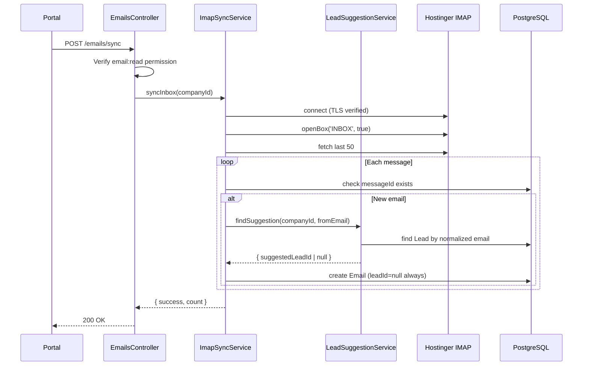
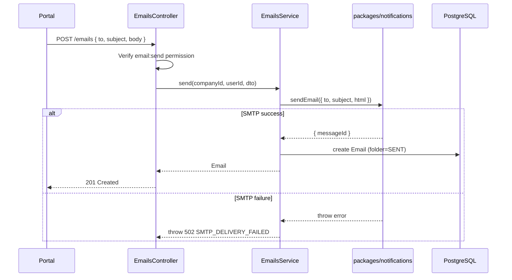

# MEDCAL — Email → Lead Management
# LOCKED — FINAL IMPLEMENTATION PLAN

**STATUS:** LOCKED — FINAL IMPLEMENTATION PLAN  
**VERSION:** FINAL  
**Tanggal:** 20 Agustus 2026  
**Supersedes:** All previous versions (v2, v2.2)

---

> **IMPLEMENTATION BASELINE**
>
> This document is the authoritative implementation baseline for the Email → Lead Management feature.
>
> After this document is locked:
> - Do not redesign the architecture during implementation
> - Do not introduce alternative models
> - Do not expand MVP scope
> - Do not create new permission concepts
> - Do not change the Lead matching semantics
> - Do not change the mailbox synchronization strategy
>
> Any newly discovered technical issue during implementation must be handled as:
> - Implementation correction within the locked architecture, OR
> - Explicit escalation for architectural review
>
> Do not silently change the architecture.

---

## Table of Contents

1. [Executive Summary](#1-executive-summary)
2. [Final Architecture](#2-final-architecture)
3. [Data Model](#3-data-model)
4. [Lead Matching — Strict Auto-Suggest Only](#4-lead-matching--strict-auto-suggest-only)
5. [Permission Model](#5-permission-model)
6. [IMAP Sync — Manual Only](#6-imap-sync--manual-only)
7. [SMTP Outbound](#7-smtp-outbound)
8. [Threading](#8-threading)
9. [Folder Strategy](#9-folder-strategy)
10. [ContactMessage Integration](#10-contactmessage-integration)
11. [Security](#11-security)
12. [API Contract](#12-api-contract)
13. [Portal UI](#13-portal-ui)
14. [Menu Registry](#14-menu-registry)
15. [Migration Strategy](#15-migration-strategy)
16. [Implementation Order](#16-implementation-order)
17. [Out of Scope](#17-out-of-scope)
18. [Files to Change](#18-files-to-change)
19. [Risks and Mitigations](#19-risks-and-mitigations)
20. [Final Consistency Audit](#20-final-consistency-audit)
21. [Final Verdict](#21-final-verdict)

---

## 1. Executive Summary

### 1.1 Feature Overview

Email → Lead Management integrates Hostinger mailbox with MedCal Lead Management:

- **Inbound:** Manual IMAP sync from Hostinger
- **Outbound:** SMTP via `packages/notifications`
- **Persistence:** Single `Email` model for all folders
- **Lead Integration:** Strict auto-suggest only — staff confirmation required
- **UI:** Gmail-like inbox/sent/drafts/trash with MedCal design system

### 1.2 Key Locked Decisions

| Decision | Status |
|----------|--------|
| Single Email model | LOCKED |
| Manual IMAP sync (no background) | LOCKED |
| Strict auto-suggest Lead matching | LOCKED |
| Four permissions only | LOCKED |
| Local-only Drafts | LOCKED |
| Local-only Trash | LOCKED |
| No attachments in MVP | LOCKED |
| TLS verification enabled by default | LOCKED |

---

## 2. Final Architecture

### 2.1 System Diagram

```
                    HOSTINGER MAILBOX
                   /                 \
                IMAP                SMTP
                  ↓                   ↓
           Manual Sync          Outbound Send
           (POST /emails/sync)  (packages/notifications)
                  ↓                   ↓
                  └─────────┬─────────┘
                            ↓
                    MEDCAL EMAIL DB
                            │
              ┌─────────────┼─────────────┐
              ↓             ↓             ↓
           INBOX          SENT      DRAFTS/TRASH
              │
              ↓
        Lead Suggestion
              │
              ↓
        Staff Confirms
              │
              ↓
           Lead
```

### 2.2 Key Boundaries

| Component | Location | Responsibility |
|-----------|----------|----------------|
| IMAP Sync | `apps/api/src/modules/emails/` | Inbound sync only |
| SMTP Send | `packages/notifications` | Single outbound boundary |
| Email Storage | PostgreSQL `Email` table | All mailbox state |
| Lead Suggestion | `LeadSuggestionService` | Suggestion only, never assign |

### 2.3 What This System Does NOT Do

- Continuous mailbox synchronization
- Automatic background sync
- Automatic Lead assignment
- Bidirectional Draft sync with Hostinger
- Bidirectional Trash sync with Hostinger
- Attachment handling

---

## 3. Data Model

### 3.1 Email Model (FINAL)

```prisma
enum EmailFolder {
  INBOX
  SENT
  DRAFTS
  TRASH
}

enum EmailStatus {
  UNREAD
  READ
}

model Email {
  id          String      @id @default(cuid())
  companyId   String

  // IMAP dedup
  messageId   String?     @unique

  // Sender/Recipients
  fromEmail   String
  fromName    String?
  toEmail     String
  toName      String?
  ccEmail     String?
  bccEmail    String?

  // Content
  subject     String
  body        String      @db.Text
  textBody    String?     @db.Text

  // Mailbox state
  folder      EmailFolder @default(INBOX)
  status      EmailStatus @default(UNREAD)
  isStarred   Boolean     @default(false)

  // Internal reply chain (MedCal cuid, NOT RFC header)
  parentEmailId String?

  // RFC metadata (for protocol behavior, NOT for internal threading)
  rfcInReplyTo  String?   @db.Text
  rfcReferences String?   @db.Text

  // Lead association - STRICT AUTO-SUGGEST
  suggestedLeadId String?   // System suggestion only
  leadId          String?   // Staff-confirmed only

  // ContactMessage link
  contactMessageId String?

  // Sender user (outbound)
  sentByUserId String?

  // Timestamps
  sentAt      DateTime?
  receivedAt  DateTime?
  readAt      DateTime?
  deletedAt   DateTime?
  createdAt   DateTime    @default(now())
  updatedAt   DateTime    @updatedAt

  // Relations
  company        Company         @relation(fields: [companyId], references: [id], onDelete: Cascade)
  suggestedLead  Lead?           @relation("EmailSuggestion", fields: [suggestedLeadId], references: [id], onDelete: SetNull)
  lead           Lead?           @relation("EmailAssociation", fields: [leadId], references: [id], onDelete: SetNull)
  contactMessage ContactMessage? @relation(fields: [contactMessageId], references: [id], onDelete: SetNull)
  sentBy         User?           @relation("EmailSender", fields: [sentByUserId], references: [id])
  parentEmail    Email?          @relation("EmailThread", fields: [parentEmailId], references: [id], onDelete: SetNull)
  replies        Email[]         @relation("EmailThread")

  @@index([companyId, folder])
  @@index([companyId, status])
  @@index([companyId, leadId])
  @@index([companyId, suggestedLeadId])
  @@index([companyId, createdAt])
  @@index([messageId])
  @@index([contactMessageId])
  @@index([parentEmailId])
}
```

### 3.2 Model Relations

```prisma
model Lead {
  // ... existing fields ...
  suggestedInEmails Email[] @relation("EmailSuggestion")
  emails            Email[] @relation("EmailAssociation")
}

model ContactMessage {
  // ... existing fields ...
  emails Email[]
}

model User {
  // ... existing fields ...
  sentEmails Email[] @relation("EmailSender")
}

model Company {
  // ... existing fields ...
  emails Email[]
}
```

### 3.3 Lead Association States

| State | `suggestedLeadId` | `leadId` | Meaning |
|-------|-------------------|----------|---------|
| No match | null | null | No candidate found |
| Suggested | `lead_abc` | null | Awaiting staff confirmation |
| Confirmed | null | `lead_abc` | Staff confirmed |
| Overridden | null | `lead_xyz` | Staff chose different Lead |
| Removed | null | null | Staff removed association |

**CRITICAL:** `leadId` is NEVER automatically set. Always null until staff action.

---

## 4. Lead Matching — Strict Auto-Suggest Only

### 4.1 Core Principle (HARD LOCK)

> The system MUST NEVER automatically assign an inbound email to a Lead.
> An email address match is only a suggestion.
> `leadId` MUST remain NULL until a staff user explicitly confirms.

### 4.2 Email Normalization

```typescript
function normalizeEmail(email: string): string {
  return email.toLowerCase().trim().replace(/\s+/g, '');
}
```

### 4.3 Matching Rules

| Condition | `suggestedLeadId` | `leadId` | Action |
|-----------|-------------------|----------|--------|
| Exactly 1 Lead matches | `lead_id` | null | Show suggestion |
| Multiple Leads match | null | null | Present candidates |
| No Lead matches | null | null | Allow manual association |

### 4.4 What Is NOT Allowed

- Auto-assign Lead
- Auto-create Lead
- Fuzzy matching
- Domain matching
- Name similarity matching
- Subject inference
- Sender name inference
- Automatic selection when multiple candidates exist

### 4.5 Confirmation Flow

```
Email synced (suggestedLeadId=ABC, leadId=null)
          ↓
Staff views: "Suggested Lead: ABC"
          ↓
Staff clicks [Confirm]
          ↓
API: PATCH /emails/:id { leadId: "ABC" }
          ↓
DB: suggestedLeadId=null, leadId=ABC
```

### 4.6 Lead Email History

Only emails with confirmed `leadId` appear in Lead email history.

Emails with only `suggestedLeadId` do NOT appear as associated.

---

## 5. Permission Model

### 5.1 Exactly Four Permissions (LOCKED)

```typescript
const ac = createAccessControl({
  // ... existing ...
  email: ["read", "send", "delete", "manage"],
} as const);
```

**DO NOT create:**
- `email:compose`
- `email:reply`
- `email:assign`
- `email:associate`
- `email:draft`
- `email:sync`
- `email:manage-mailbox`

### 5.2 Permission Semantics

| Permission | Allows |
|------------|--------|
| `email:read` | View inbox/sent/drafts/trash, email detail, read/unread, sync visibility |
| `email:send` | Compose, send, reply (outbound actions) |
| `email:delete` | Move to trash, restore, permanent delete |
| `email:manage` | Confirm/change/remove Lead association, manage Email metadata |

### 5.3 Permission → Endpoint Mapping

| Action | Permission | Endpoint |
|--------|------------|----------|
| View inbox/sent/drafts/trash | `email:read` | GET /emails |
| View email detail | `email:read` | GET /emails/:id |
| Get statistics | `email:read` | GET /emails/statistics |
| Manual sync | `email:read` | POST /emails/sync |
| Mark read/unread | `email:read` | PATCH /emails/:id |
| Star/unstar | `email:read` | PATCH /emails/:id |
| Compose/send | `email:send` | POST /emails |
| Reply | `email:send` | POST /emails |
| Save draft | `email:send` | POST /emails/draft |
| Update draft | `email:send` | PATCH /emails/:id |
| Send draft | `email:send` | POST /emails/:id/send |
| Move to trash | `email:delete` | DELETE /emails/:id |
| Restore from trash | `email:delete` | POST /emails/:id/restore |
| Permanent delete | `email:delete` | DELETE /emails/:id/permanent |
| Confirm Lead | `email:manage` | PATCH /emails/:id { leadId } |
| Change Lead | `email:manage` | PATCH /emails/:id { leadId } |
| Remove Lead | `email:manage` | PATCH /emails/:id { leadId: null } |
| Dismiss suggestion | `email:read` | PATCH /emails/:id { suggestedLeadId: null } |

**IMPORTANT:** Lead association requires `email:manage`, NOT `email:send`.

### 5.4 Role Grants

```typescript
const roleStatements = {
  SUPERADMIN: ac.newRole({
    email: ["read", "send", "delete", "manage"],
    // ... other permissions
  }),
  ADMIN: ac.newRole({
    email: ["read", "send", "delete", "manage"],
    // ... other permissions
  }),
  // Other roles: configure as needed
};
```

**DO NOT hardcode roles in Email business logic.**

---

## 6. IMAP Sync — Manual Only

### 6.1 MVP Decision (LOCKED)

**Manual sync only via `POST /emails/sync`**

**DO NOT implement:**
- node-cron
- worker
- queue
- background scheduler
- automatic polling

### 6.2 Sync Specification

| Aspect | Value |
|--------|-------|
| Trigger | `POST /emails/sync` |
| Mailbox | INBOX only |
| Limit | Last 50 messages |
| Duplicate detection | `messageId` unique constraint |
| Lead matching | Suggestion only |
| TLS | Enabled by default |

### 6.3 Sync Flow



### 6.4 Configuration

```bash
# IMAP Configuration
IMAP_HOST=imap.hostinger.com
IMAP_PORT=993
IMAP_TLS=true
IMAP_USER=info@kalibrasimedika.co.id
IMAP_PASS=

# TLS Security (production defaults)
IMAP_TLS_REJECT_UNAUTHORIZED=true
```

---

## 7. SMTP Outbound

### 7.1 Single Boundary (LOCKED)

```
EmailsService
    ↓
packages/notifications/src/email
    ↓
Nodemailer
    ↓
Hostinger SMTP
```

**DO NOT create a second SMTP implementation in EmailsModule.**

### 7.2 Send Flow



### 7.3 Configuration

```bash
# SMTP Configuration
SMTP_HOST=smtp.hostinger.com
SMTP_PORT=465
SMTP_SECURE=true
SMTP_USER=info@kalibrasimedika.co.id
SMTP_PASS=
SMTP_FROM="MedCal <info@kalibrasimedika.co.id>"

# TLS Security
SMTP_TLS_REJECT_UNAUTHORIZED=true
```

---

## 8. Threading

### 8.1 Internal vs RFC (LOCKED)

| Field | Type | Purpose | Usage |
|-------|------|---------|-------|
| `parentEmailId` | cuid | MedCal internal reply chain | UI conversation display |
| `rfcInReplyTo` | String | RFC In-Reply-To header | Outbound protocol only |
| `rfcReferences` | String | RFC References header | Outbound protocol only |

### 8.2 Rules

- `parentEmailId` is a MedCal Email cuid
- DO NOT put MedCal cuid into RFC In-Reply-To header
- DO NOT claim full RFC threading in MVP
- MVP uses `parentEmailId` for conversation display only

### 8.3 Reply Behavior

When staff replies to an email:
1. Set `parentEmailId` = original email's cuid
2. Set `rfcInReplyTo` = original email's `messageId` (RFC header)
3. Outbound email includes proper RFC headers

---

## 9. Folder Strategy

### 9.1 Folder Enum

```prisma
enum EmailFolder {
  INBOX   // IMAP sync
  SENT    // SMTP send
  DRAFTS  // Local save
  TRASH   // Soft delete
}
```

### 9.2 Folder Semantics

| Folder | Source | `deletedAt` |
|--------|--------|-------------|
| INBOX | IMAP sync | null |
| SENT | SMTP send | null |
| DRAFTS | Save draft | null |
| TRASH | Soft delete | NOT null |

### 9.3 Drafts (LOCKED)

**Local only.** NOT synced to Hostinger IMAP Drafts.

### 9.4 Trash (LOCKED)

**Local soft delete only.** Does NOT delete from Hostinger IMAP.

```
Delete email
    ↓
Set deletedAt = now()
    ↓
Email appears in Trash

Restore email
    ↓
Set deletedAt = null
    ↓
Email returns to original folder
```

---

## 10. ContactMessage Integration

### 10.1 Relationship (LOCKED)

ContactMessage remains a separate domain for inbound intake (form, chat, WhatsApp).

Email is the mailbox domain.

### 10.2 Reply from ContactMessage

```
Staff views ContactMessage
    ↓
Click "Reply via Email"
    ↓
Opens compose with contactMessageId set
    ↓
Send email
    ↓
Email created with:
  - contactMessageId = source ContactMessage
  - leadId = inherited from ContactMessage context (if confirmed)
```

### 10.3 Rules

- DO NOT replace ContactMessage with Email
- DO NOT auto-create Lead from ContactMessage email
- DO NOT change ContactMessage semantics

---

## 11. Security

### 11.1 TLS (LOCKED)

**Production default:** Certificate verification enabled.

```typescript
const imap = new Imap({
  tls: true,
  tlsOptions: {
    rejectUnauthorized: config.IMAP_TLS_REJECT_UNAUTHORIZED !== 'false',
  },
});
```

**DO NOT copy `rejectUnauthorized: false` from server-bi-erp.**

### 11.2 Credentials

| Credential | Storage | Access |
|------------|---------|--------|
| IMAP password | `.env` | Server only |
| SMTP password | `.env` | Server only |
| Session | Better Auth | HttpOnly, Secure |

**Never log credentials.**

### 11.3 HTML Sanitization

**Required for all inbound email body display.**

```typescript
// Portal display layer
import DOMPurify from 'isomorphic-dompurify';

const sanitizedHtml = DOMPurify.sanitize(email.body, {
  ALLOWED_TAGS: ['p', 'br', 'b', 'i', 'u', 'a', 'ul', 'ol', 'li', 'div', 'span'],
  ALLOWED_ATTR: ['href', 'target'],
});
```

### 11.4 Authorization

- All endpoints behind `CompanyRoleGuard`
- All queries scoped by `companyId`
- `@RequirePermission()` on each handler
- No cross-company access

---

## 12. API Contract

### 12.1 Endpoints

| Method | Path | Permission | Purpose |
|--------|------|------------|---------|
| GET | `/emails` | `email:read` | List (paginated, filtered) |
| GET | `/emails/statistics` | `email:read` | Folder counts |
| GET | `/emails/:id` | `email:read` | Email detail |
| POST | `/emails` | `email:send` | Send email |
| POST | `/emails/draft` | `email:send` | Save draft |
| POST | `/emails/:id/send` | `email:send` | Send draft |
| PATCH | `/emails/:id` | varies | Update |
| DELETE | `/emails/:id` | `email:delete` | Move to trash |
| POST | `/emails/:id/restore` | `email:delete` | Restore |
| DELETE | `/emails/:id/permanent` | `email:delete` | Hard delete |
| POST | `/emails/sync` | `email:read` | Manual IMAP sync |
| GET | `/leads/:id/emails` | `lead:read` | Lead email history (confirmed only) |

### 12.2 List Response Schema

```typescript
interface EmailListResponse {
  data: EmailListRow[];
  page: number;
  pageSize: number;
  total: number;
  totalPages: number;
}

interface EmailListRow {
  id: string;
  folder: "INBOX" | "SENT" | "DRAFTS" | "TRASH";
  status: "UNREAD" | "READ";
  isStarred: boolean;
  fromEmail: string;
  fromName: string | null;
  toEmail: string;
  subject: string;
  snippet: string;
  sentAt: string | null;
  receivedAt: string | null;
  createdAt: string;
  suggestedLead: { id: string; name: string } | null;
  lead: { id: string; name: string } | null;
}
```

### 12.3 Detail Response Schema

```typescript
interface EmailDetailResponse {
  id: string;
  folder: "INBOX" | "SENT" | "DRAFTS" | "TRASH";
  status: "UNREAD" | "READ";
  isStarred: boolean;
  fromEmail: string;
  fromName: string | null;
  toEmail: string;
  toName: string | null;
  ccEmail: string | null;
  bccEmail: string | null;
  subject: string;
  body: string;
  textBody: string | null;
  sentAt: string | null;
  receivedAt: string | null;
  readAt: string | null;
  createdAt: string;
  suggestedLead: { id: string; name: string; email: string } | null;
  lead: { id: string; name: string; email: string } | null;
  leadCandidates: Array<{ id: string; name: string; email: string }>;
  contactMessage: { id: string; subject: string | null } | null;
  sentBy: { id: string; name: string | null } | null;
  parentEmail: { id: string; subject: string } | null;
}
```

### 12.4 Pagination

Use existing MedCal pagination convention:

```typescript
interface PaginationQuery {
  page?: number;      // Default: 1
  pageSize?: number;  // Default: 20, Max: 100
}

interface PaginatedResponse<T> {
  data: T[];
  page: number;
  pageSize: number;
  total: number;
  totalPages: number;
}
```

### 12.5 Error Codes

| Code | HTTP | Condition |
|------|------|-----------|
| `INVALID_EMAIL_PAYLOAD` | 400 | Validation failed |
| `EMAIL_NOT_FOUND` | 404 | Not found or wrong tenant |
| `LEAD_NOT_FOUND` | 404 | Invalid leadId |
| `SMTP_DELIVERY_FAILED` | 502 | SMTP error |
| `IMAP_SYNC_FAILED` | 502 | IMAP error |
| `EMAIL_NOT_CONFIGURED` | 503 | Missing SMTP/IMAP config |

---

## 13. Portal UI

### 13.1 Page Structure

```
apps/portal/src/app/management/email/
├── page.tsx              # Redirect to inbox
├── inbox/page.tsx
├── sent/page.tsx
├── drafts/page.tsx
├── trash/page.tsx
├── compose/page.tsx
├── [id]/page.tsx         # Email detail
└── email-ui.tsx          # Shared components
```

### 13.2 Lead Association UI

| State | Display | Actions |
|-------|---------|---------|
| `suggestedLead` && !`lead` | "Suggested Lead: X" | [Confirm] [Choose Other] [Dismiss] |
| Multiple candidates | "Possible Leads: X, Y" | [Select Lead] |
| `lead` | "Lead: X" | [Change] [Remove] |
| No association | "No Lead" | [Associate Lead] |

**DO NOT use "Auto-matched" terminology.**

### 13.3 Compose (MVP)

- Plain textarea (no rich text editor in MVP)
- To, Cc, Subject fields
- Send button
- Save Draft button

**DO NOT implement TipTap or rich text editor in MVP.**

---

## 14. Menu Registry

### 14.1 Menu Entry

```typescript
{
  application: "MANAGEMENT",
  code: "leads.email",
  parentCode: "leads",
  label: "Email",
  href: "/email",
  icon: "email",
  order: 2,
  isActive: true,
  viewResource: "email",
  viewAction: "read",
}
```

### 14.2 Me Controller

```typescript
const capabilities = {
  emailRead: hasPermission(membership.role, "email", "read"),
  emailSend: hasPermission(membership.role, "email", "send"),
  emailDelete: hasPermission(membership.role, "email", "delete"),
  emailManage: hasPermission(membership.role, "email", "manage"),
};
```

---

## 15. Migration Strategy

### 15.1 Development

```bash
pnpm --filter @medcal/db prisma migrate dev --name add_email_system
```

### 15.2 Production (LOCKED)

**DO NOT use `prisma migrate dev` in production.**

**DO NOT claim automatic rollback.**

Production workflow:

1. Generate migration (create-only)
2. Review generated SQL
3. Test in staging
4. Deploy to production: `prisma migrate deploy`
5. Verify schema
6. Deploy application
7. Post-deployment verification

### 15.3 Rollback

There is NO automatic rollback. If needed:
1. Create explicit down migration
2. Review and test
3. Apply manually

---

## 16. Implementation Order

### Phase 1: Foundation

1. `packages/config` — SMTP + IMAP env schema
2. `packages/auth` — email:read, email:send, email:delete, email:manage
3. `packages/db` — Email model, migration
4. `packages/notifications` — enhance sendEmail
5. `packages/shared` — email Zod schemas
6. `.env.example` — all env vars

### Phase 2: Backend

1. `apps/api/src/modules/emails/emails.module.ts`
2. `imap-sync.service.ts` — manual sync
3. `lead-suggestion.service.ts` — suggestion only
4. `emails.service.ts` — CRUD
5. `emails.controller.ts` — all endpoints
6. Permission enforcement on all handlers
7. `leads.controller.ts` — GET /leads/:id/emails
8. `me.controller.ts` — capabilities
9. Tests

### Phase 3: Portal

1. `sanitize-html.ts`
2. Email pages (inbox, sent, drafts, trash, compose, detail)
3. `email-ui.tsx` — shared components
4. Suggested Lead UI
5. Lead association controls
6. Lead detail email history

### Phase 4: Validation

1. Lint, typecheck, build
2. Permission tests
3. Suggestion flow tests
4. IMAP sync tests
5. SMTP send tests
6. Security review

### Phase 5: Deployment

1. Review migration SQL
2. Deploy to staging
3. Validate in staging
4. Production migration: `prisma migrate deploy`
5. Deploy application
6. Post-deployment verification

---

## 17. Out of Scope

| Item | Reason |
|------|--------|
| Attachments | Phase 2 |
| Rich text editor | Phase 2 |
| Automatic background sync | Phase 2 |
| RFC header-based threading | Complexity |
| IMAP folder sync (Sent/Drafts/Trash) | Only INBOX |
| Fuzzy Lead matching | Exact match only |
| Automatic Lead creation | Never |
| Automatic `leadId` assignment | Never |
| Email templates | Phase 2 |
| Scheduled sending | Phase 2 |

---

## 18. Files to Change

### New Files

```
packages/db/prisma/migrations/YYYYMMDD_add_email_system/
apps/api/src/modules/emails/emails.module.ts
apps/api/src/modules/emails/emails.controller.ts
apps/api/src/modules/emails/emails.service.ts
apps/api/src/modules/emails/imap-sync.service.ts
apps/api/src/modules/emails/lead-suggestion.service.ts
apps/api/src/modules/emails/email-normalize.util.ts
apps/api/src/modules/emails/dto/
apps/api/src/modules/emails/emails.service.test.ts
apps/portal/src/app/management/email/
apps/portal/src/lib/sanitize-html.ts
```

### Modified Files

```
packages/config/src/index.ts
packages/auth/src/access-control.ts
packages/db/prisma/schema.prisma
packages/db/prisma/seed-menu.ts
packages/notifications/src/email/index.ts
packages/notifications/package.json
packages/shared/src/schemas/index.ts
apps/api/src/app.module.ts
apps/api/src/modules/me/me.controller.ts
apps/api/src/modules/leads/leads.controller.ts
apps/portal/src/components/management/header-controls.tsx
.env.example
```

---

## 19. Risks and Mitigations

| Risk | Severity | Mitigation |
|------|----------|------------|
| IMAP credentials exposed | HIGH | Env vars, never log |
| XSS in email body | HIGH | Sanitize all HTML |
| TLS disabled | HIGH | Default enabled, require explicit override |
| SMTP success + DB fail | MEDIUM | Log messageId for reconciliation |
| Large mailbox timeout | MEDIUM | Limit 50 emails |
| Cross-tenant access | HIGH | companyId scoping |
| Migration failure | MEDIUM | Manual review, no auto-rollback |
| Staff confusion | LOW | Clear "Suggested" vs "Associated" UI |

---

## 20. Final Consistency Audit

### 20.1 Verified Constraints

| Constraint | Status |
|------------|--------|
| No auto-assignment | VERIFIED |
| No automatic Lead creation | VERIFIED |
| No `leadId` before confirmation | VERIFIED |
| No automatic IMAP sync in MVP | VERIFIED |
| No node-cron in MVP | VERIFIED |
| No attachment implementation | VERIFIED |
| No second Email domain model | VERIFIED |
| No second SMTP implementation | VERIFIED |
| No `email:compose` | VERIFIED |
| No `email:reply` | VERIFIED |
| No `email:assign` | VERIFIED |
| No `email:associate` | VERIFIED |
| No `email:sync` | VERIFIED |
| No `email:manage-mailbox` | VERIFIED |
| Exactly 4 permissions | VERIFIED |
| `email:manage` for Lead association | VERIFIED |
| `email:send` for outbound | VERIFIED |
| `email:delete` for deletion | VERIFIED |
| `email:read` for viewing | VERIFIED |
| TLS enabled by default | VERIFIED |
| No automatic migration rollback | VERIFIED |
| No production `prisma migrate dev` | VERIFIED |

### 20.2 Permission Matrix Verification

| Permission | Purpose |
|------------|---------|
| `email:read` | View, read/unread, star, sync, dismiss suggestion |
| `email:send` | Compose, send, reply, draft |
| `email:delete` | Trash, restore, permanent delete |
| `email:manage` | Confirm/change/remove Lead association |

---

## 21. Final Verdict

# LOCKED — FINAL IMPLEMENTATION PLAN

# GREEN — Ready for implementation

---

**Implementation may now begin against this document.**

**No architectural expansion or permission-model expansion is permitted without explicit review and approval.**

---

*Document version: FINAL*  
*Status: LOCKED*  
*Last updated: 20 Agustus 2026*
