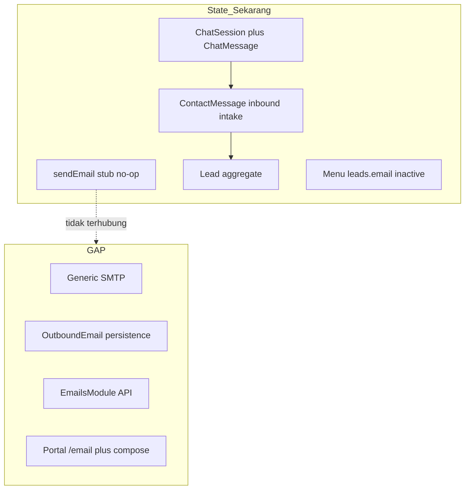
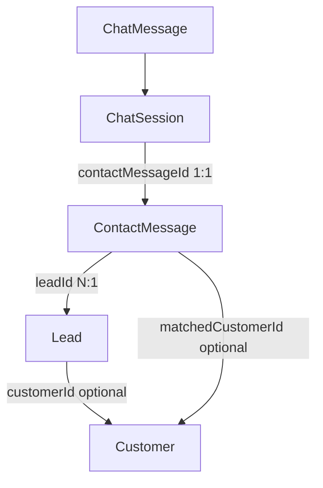
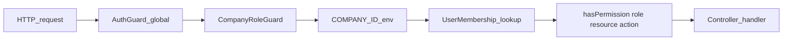
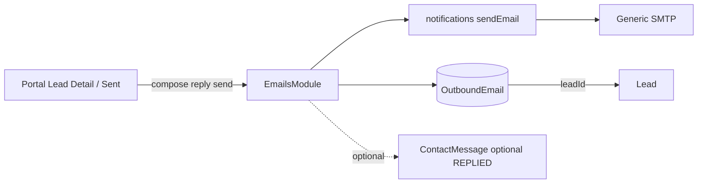

# Audit Forensik: Email → Lead Management

**Tanggal:** 20 Agustus 2026  
**Repositori:** `d:\medcal`  
**Sifat:** AUDIT ONLY — tidak ada implementasi kode pada fase audit ini.  
**Sumber kebenaran:** kode yang ada di repositori + dokumen arsitektur terkunci medcal. Repo referensi (`afrizahrp/server-bi-erp`, `afrizahrp/easy-app`) **tidak tersedia di workspace lokal** — temuan referensi diturunkan dari dokumen medcal yang merujuk pola bi-erp/easy-app.

Klasifikasi bukti:

| Label | Arti |
|---|---|
| **FACT** | Terverifikasi dari file di repositori |
| **INFERENCE** | Diturunkan dari perilaku kode |
| **GAP** | Fungsi yang tidak ada |
| **RISK** | Kekhawatiran keamanan / desain |
| **LOCKED** | Keputusan arsitektur terkunci di dokumen medcal |
| **UNVERIFIED** | Tidak bisa dikonfirmasi dari repo saja (mis. isi database produksi) |

---

## 1. Executive Verdict

**FACT.** Medcal **belum memiliki** infrastruktur email operasional — tidak ada SMTP, tidak ada inbound (IMAP/webhook), tidak ada persistensi mailbox, dan `sendEmail()` adalah stub no-op.

**FACT.** Domain Lead sudah matang: `Lead` sebagai aggregate root, `ContactMessage[]` sebagai riwayat multi-channel, matching identitas via email, Needs Review flow, dan UI Lead Management lengkap di portal.

**FACT.** Menu Registry sudah menyiapkan entry `leads.email` → `/email` tetapi **`isActive: false`** dan belum ada halaman/route email.

**LOCKED.** Dokumen arsitektur medcal men-defer **full Email mailbox** ke fase Later; MVP saat ini: `GetMessageFrom.EMAIL` via `ContactMessage` (bukan model Email terpisah). Outbound reply persistence juga di-defer (fire-and-forget).

**Keputusan scope (disepakati saat perencanaan):** implementasi **minimal outbound-only** — wire Generic SMTP, persist pesan terkirim, compose/reply dari Lead, halaman sent terbatas. **Bukan** Gmail client penuh; **bukan** inbox IMAP/inbound sync.

Verdict operasional:

| Lapisan | Status |
|---|---|
| Outbound SMTP / provider | **GAP** — stub no-op |
| Inbound IMAP / webhook | **GAP** — tidak ada |
| Persistensi email (sent/inbox) | **GAP** — tidak ada model |
| Lead domain + matching | **Ada dan matang** |
| Menu entry Email | **Ada, inactive** |
| Permission resource `email` | **GAP** — belum ada di katalog |
| Portal Email UI | **GAP** — placeholder disabled saja |
| EmailWhitelist (registrasi staff) | **Ada** — unrelated ke mailbox |



---

## 2. Jawaban Forensic Discovery (15 Pertanyaan)

| # | Pertanyaan | Jawaban |
|---|---|---|
| 1 | Apa infrastruktur email yang sudah ada? | Stub `@medcal/notifications` (`packages/notifications/src/email/index.ts`); WhatsApp deep-link (bukan email); `EmailWhitelist` untuk gate registrasi staff |
| 2 | Bisakah kirim outbound email hari ini? | **Tidak** — `sendEmail()` no-op, tidak dipanggil di `apps/api` |
| 3 | Apakah ada infrastruktur inbound? | **Tidak** — tidak ada IMAP, webhook, atau parser MIME |
| 4 | Apakah integrasi IMAP/API/provider sudah ada? | **Tidak** — tidak ada dependency nodemailer/mailgun/sendgrid/resend/imap di lockfile |
| 5 | Apakah sistem sudah persist email? | **Tidak** — hanya field `email` di entitas bisnis (`User`, `Lead`, `ContactMessage`, dll.) |
| 6 | Apakah Lead sudah punya field email/contact? | **Ya** — `Lead.email`, `Lead.phone`, `Lead.name`, `Lead.organizationName` (snapshot denormalized) |
| 7 | Apakah Lead punya activity/history/conversation? | **Sebagian** — timeline = `ContactMessage[]`; chat transcript = `ChatMessage[]`; **tidak ada** `LeadActivity`/`AuditLog` |
| 8 | Apa Menu Registry entry untuk Email? | `leads.email` → `/email`, icon `email`, `viewResource: "lead"`, `viewAction: "read"`, **`isActive: false`** |
| 9 | Permission/capability apa yang sudah ada untuk Email? | **Tidak ada resource `email`** — menu seed reuse `lead:read`; header Email hardcoded disabled |
| 10 | Permission apa yang harus mengontrol aksi email? | **Belum ada** — perlu tambah `email:*` mengikuti preceden `chat:*` (read, compose, send, reply) |
| 11 | Bagaimana permission menu ditegakkan? | Backend: `MenuService.getNavTree()` filter via `hasPermission()`; API: `CompanyRoleGuard` + `@RequirePermission`; Frontend: nav dari `/menu/nav`, capabilities dari `/me`, 403 → `AccessDenied` |
| 12 | Pola pagination apa yang dipakai? | **Page/limit** — `page`, `pageSize` (default 10); response `{ data, page, pageSize, total, totalPages }` |
| 13 | Pola query/cache invalidation? | TanStack React Query v5 (Leads list); `queryKey` per params; `placeholderData: prev => prev`; mutations invalidate related keys; unread counts via pub/sub module-level |
| 14 | Audit logging apa yang ada? | **Minimal** — status workflow (`ContactMessage.status`, `Lead.status`); whitelist/menu audit columns; **tidak ada** audit log umum |
| 15 | Komponen UI apa yang bisa direuse? | `leads-ui.tsx` (Surface, PaginationBar, badges, table/cards); `chat-workspace.tsx` (master-detail); shadcn local; `use-url-query-state`, `apiFetch`, `use-require-session` |

---

## 3. Arsitektur Email yang Ada

### 3.1 Outbound adapter — FACT

File: `packages/notifications/src/email/index.ts`

```typescript
export async function sendEmail(_input: SendEmailInput): Promise<void> {
  // Wire SMTP / provider in a later phase
  return;
}
```

- Type `SendEmailInput`: `{ to, subject, html }` saja
- Tidak ada CC/BCC, attachment, Message-ID, retry, atau return value
- **Tidak dipanggil** di mana pun di codebase runtime

### 3.2 Environment variables — GAP

**FACT.** Tidak ada env SMTP/email delivery di:
- `.env.example`
- `.env.production.example`
- `packages/config/src/index.ts` (`envSchema`)

Env terkait "email" yang ada (bukan SMTP):
- `BETTER_AUTH_*` — auth session (tanpa email verification)
- `COMPANY_ID` — tenant binding

Konstanta domain (bukan env):
- `packages/shared/src/utils/index.ts` — `COMPANY_EMAIL_DOMAIN`, `normalizeEmail()`, `isAllowedRegistrationDomain()`
- `packages/shared/src/constants/index.ts` — `PUBLIC_EMAIL_DOMAIN_BLOCKLIST`

### 3.3 Inbound email — GAP

Tidak ditemukan:
- Kode IMAP/POP3
- Webhook inbound (Mailgun/SendGrid inbound parse)
- Parser MIME / threading
- Endpoint API untuk email masuk

Enum `GetMessageFrom.EMAIL` ada di schema Prisma dan UI portal (`SourceIcon`), tetapi **tidak pernah diset** saat create `ContactMessage` dari provider email nyata. Channel aktif: `CONTACTFORM`, `WHATSAPP`, `CHAT_PERSON`.

### 3.4 Persistensi email — GAP

Tidak ada model:
- `Email`, `EmailThread`, `EmailMessage`, `Conversation`, `OutboundEmail`

Model terkait "email" yang ada:

| Model / Enum | Peran |
|---|---|
| `EmailWhitelist` | Gate registrasi staff `@kalibrasimedika.co.id` |
| `ContactMessage.email` | Alamat pengirim form/chat |
| `Lead.email` | Snapshot denormalized |
| `ChatSession.visitorEmail` | Email visitor chat |
| `User.email` | Akun Better Auth |
| `CustomerContact.email` | Kontak CRM |
| `GetMessageFrom.EMAIL` | Channel enum — metadata intake saja |
| `ReminderEvent.channel = EMAIL` | Schema only — tidak ada scheduler/sender |

**LOCKED** (Adoption Matrix): outbound reply persistence di-defer — MVP fire-and-forget, no `Email` row.

### 3.5 Modul API terkait email — FACT

Tidak ada modul `email` atau `notifications` di `apps/api`.

Modul terkait email (data/gate, bukan delivery):

| Modul | Path | Fungsi |
|---|---|---|
| Whitelist | `apps/api/src/modules/whitelist/` | CRUD `EmailWhitelist` |
| Registration gate | `registration-gate.ts`, `registration-gate.hook.ts` | Cek domain + whitelist sebelum sign-up |
| Contact messages | `contact-messages.service.ts` | Intake form; field `email`; status REPLIED **manual**, tanpa send |
| Leads | `lead-matching.ts` | Match identitas by `normalizeEmail()` |
| Better Auth | `packages/auth/src/index.ts` | `requireEmailVerification: false` |

### 3.6 Capability matrix email

| Capability | Status |
|---|---|
| Send email | **Tidak** (stub) |
| Receive email (IMAP/webhook) | **Tidak** |
| Store email messages | **Tidak** |
| Email auth/verification | **Tidak** |
| Staff registration whitelist | **Ya** |
| Lead intake via web form (email field) | **Ya** (`ContactMessage`) |
| WhatsApp deep link | **Ya** (bukan email) |

---

## 4. Arsitektur Lead yang Ada

### 4.1 Model dan relasi — FACT



**`Lead`** — aggregate root inbox:
- `companyId`, `status` (NEW/CONTACTED/QUALIFIED/REJECTED/CONVERTED)
- Snapshot: `name`, `email`, `phone`, `organizationName`
- `assignedToUserId?`, `customerId?`
- Relasi: `contactMessages[]`, `calibrationRequests[]`

**`ContactMessage`** — riwayat interaksi per channel:
- `getFrom`: CONTACTFORM | WHATSAPP | CHAT_AI | CHAT_PERSON | **EMAIL**
- `status`: PENDING | READ | REPLIED | CLOSED
- `matchStatus`: NONE | EXACT_EMAIL | DOMAIN_CANDIDATE | CONFIRMED_EXISTING | DISMISSED
- `leadId?` — pivot 1 Lead : N ContactMessage (migration `20260815173840`)

**`ChatSession` + `ChatMessage`** — domain chat terpisah, terhubung ke lead intake via `ContactMessage`.

**GAP:** tidak ada `LeadActivity`, `LeadNote`, `LeadHistory`.

### 4.2 Lead matching — FACT

File: `apps/api/src/modules/leads/lead-matching.ts`

- STRONG match (exact email) → attach ke lead existing
- POSSIBLE match (domain) → `leadId = null` (Needs Review)
- NO match → buat lead baru (via `ContactMessagesService.create()`)

**INFERENCE.** Auto-create Lead hanya dari **inbound** `ContactMessagesService.create()` — bukan dari email outbound staff.

### 4.3 API Lead surface — FACT

| Method | Path | Permission |
|---|---|---|
| GET | `/leads` | `lead:read` |
| GET | `/leads/needs-review` | `lead:read` |
| GET | `/leads/:id` | `lead:read` |
| PATCH | `/leads/:id/status` | `lead:update` |
| PATCH | `/contact-messages/:id/lead` | `lead:update` |
| POST | `/internal/contact-messages` | Internal secret |

Timeline lead detail = `ContactMessage[]` reverse-chronological. Tidak ada activity log dedicated.

### 4.4 Portal Lead UI — FACT

| Route | File | Status |
|---|---|---|
| `/leads` | `leads-page-client.tsx` + `leads-ui.tsx` | **Lengkap** — ContactMessage list, filters, pagination, Needs Review |
| `/leads/[id]` | `leads/[id]/page.tsx` | **Lengkap** — timeline, status update, **mailto: Reply via Email** (bukan client) |

Enum `GetMessageFrom.EMAIL` sudah ada di UI (`SourceIcon`, filter source).

---

## 5. Menu Registry + Permission

### 5.1 Menu Registry — FACT

Model `Menu` (`packages/db/prisma/schema.prisma`):
- `application`, `code`, `parentId`, `label`, `href`, `icon`, `order`, `isGroup`, `isActive`
- `viewResource`, `viewAction` → lookup `hasPermission()` saat runtime
- **Tidak menyimpan grant permission** — hanya navigasi/config

Seed Email entry (`packages/db/prisma/seed-menu.ts`):

```typescript
{
  code: "leads.email",
  parentCode: "leads",
  label: "Email",
  href: "/email",
  icon: "email",
  order: 2,
  isActive: false,          // ← inactive
  viewResource: "lead",     // ← reuse lead:read, bukan email:*
  viewAction: "read",
}
```

Backend filtering (`apps/api/src/modules/menu/menu.service.ts`):
- Leaf visible jika `isActive` + `hasPermission(role, viewResource, viewAction)`
- Item `isActive: false` **tidak pernah** muncul di nav

### 5.2 Permission catalog — FACT

File: `packages/auth/src/access-control.ts`

Konvensi: **`resource:action`** (camelCase resource + verb action)

Katalog saat ini — **tidak ada `email`**:

| Resource | Actions |
|---|---|
| `contactMessage` | read |
| `whitelist` | manage |
| `lead` | read, update |
| `chat` | read, reply, close |
| `users` | read, manage |
| `membership` | manage |
| `menu` | manage |
| `managementDashboard` | read |
| `customerDashboard` | read |

Role grants: `SUPERADMIN` dan `ADMIN` punya lead + chat; role lain minimal.

### 5.3 Enforcement chain — FACT



- `@RequirePermission(resource, action)` per handler
- `@CompanyId()` — tenant dari env, **bukan** header client
- 401: no session; 403: `"Forbidden"` generic

Frontend (tiga lapisan):
1. **Session gate** — `use-require-session.ts` → redirect `/sign-in`
2. **Menu visibility** — `GET /menu/nav` (server-authoritative, client tidak re-derive)
3. **Page gate** — `isForbidden(err)` → `<AccessDenied />`

Capabilities non-menu (`GET /me`):
- `leadRead`, `chatRead` saja — **tidak ada `emailRead`**

### 5.4 Email UI affordances saat ini — FACT

| Lokasi | Status |
|---|---|
| Dashboard home (`management/page.tsx`) | Email tile disabled, "Segera hadir" |
| Header (`header-controls.tsx` → `EmailControl()`) | Always disabled span |
| Nav icon registry (`icons.tsx`) | Icon `"email"` sudah didefinisi |
| Menu seed | `/email` entry, `isActive: false` |
| Lead detail | `<a href="mailto:...">Reply via Email</a>` |
| Route `/email` | **Tidak ada** `page.tsx` |

---

## 6. Pola API & Portal yang Harus Diikuti

### 6.1 Pagination — FACT

Query: `search?`, `sortBy?`, `sortDir?`, `page?` (min 1), `pageSize?` (1–100)  
Response: `{ data, page, pageSize, total, totalPages }`  
Default pageSize: **10**

### 6.2 Error conventions — FACT

- Validasi: `schema.safeParse()` → `BadRequestException({ message, code, issues })`
- 404: `{ message, code }` (mis. `LEAD_NOT_FOUND`)
- 403 authz: `"Forbidden"` tanpa detail
- Success: return entity langsung — **tanpa envelope** `{ success, data }`

### 6.3 Query/mutation patterns portal — FACT

- **Pola A (canonical):** React Query + URL state + debounce — Leads list
- **Pola B:** manual `useState` + `useEffect` + `apiFetch` — Lead detail, Chat, Users
- REST via `apiFetch` dari `@medcal/shared` — **bukan tRPC**
- Unread counts: pub/sub module-level (`use-unread-count.ts`)

### 6.4 Responsive patterns — FACT

- `lg:` — desktop sidebar vs mobile drawer
- `md:` — table vs card list (Leads)
- Chat: master-detail responsive (`chat-workspace.tsx`)
- Page padding: `px-4 py-6 md:px-6`

### 6.5 Komponen reusable untuk Email module

| Komponen | File | Kegunaan |
|---|---|---|
| Surface, PaginationBar, badges | `leads-ui.tsx` | List sent emails |
| Master-detail split | `chat-workspace.tsx` | Detail email (opsional) |
| PageHeader | `page-header.tsx` | Chrome halaman |
| Auth/403 | `use-require-session.ts`, `access-denied.tsx` | Gate |
| URL-synced filters | `use-url-query-state.ts` | Filter sent list |
| API calls | `apiFetch`, `isForbidden` | Semua fetch |
| EmailIcon | `icons.tsx` | Nav + header |

---

## 7. Referensi Eksternal

### 7.1 server-bi-erp — UNVERIFIED (repo tidak lokal)

Direferensikan di medcal untuk:
- Backend email-management architecture
- SMTP/email provider integration
- Email persistence concepts
- DTO patterns, API semantics

**INFERENCE dari dokumen medcal:** bi-erp punya outbound SMTP fire-and-forget tanpa persist `Email` row — medcal **secara eksplisit men-defer** pola ini (Adoption Matrix baris "Outbound reply persistence").

### 7.2 easy-app — UNVERIFIED (repo tidak lokal)

Direferensikan untuk:
- Gmail-like email UX (inbox, compose, reply, sent, draft, trash)
- Rich text editor, attachments, mobile behavior

**INFERENCE:** pola UX Gmail **tidak boleh** disalin buta — medcal punya design system shadcn + pola Leads/Chat sendiri.

### 7.3 Preceden internal medcal yang relevan — FACT

| Modul | Pola yang diadopsi |
|---|---|
| **Chat** | Conversation domain terpisah + link ke `ContactMessage` + per-verb RBAC (`chat:read/reply/close`) |
| **Leads** | Paginated list, Needs Review, lead matching |
| **ContactMessage** | Inbound intake audit trail — **bukan** tempat outbound staff reply |

---

## 8. Konflik Arsitektur (MEDCAL WINS)

| Sumber terkunci | Task asli (full email client) | Resolusi |
|---|---|---|
| Adoption Matrix: defer outbound persistence | Persist sent + full client | **Minimal outbound** — persist sent saja via model `OutboundEmail` |
| business-domain.md: "Full Email mailbox later port" | Inbox/sent/drafts/trash Gmail | **Sent list + compose/reply dari Lead** saja |
| entity-catalog.md: "MVP: EMAIL via ContactMessage" | Model EmailThread/Message penuh | `ContactMessage` tetap untuk inbound; outbound via model terpisah |
| Action Plan: "mailbox Email penuh" di larangan awal | Full mailbox | **Explicitly out of scope** fase ini |
| GetMessageFrom.EMAIL untuk inbound provider | Inbox nyata | Inbound sync = **follow-up terpisah** (ADR + provider) |

**Prinsip anti-hallucination:**
- Jangan fabricate IMAP/provider integration
- Jangan pretend sent-only list = real provider inbox
- Distinction harus eksplisit di UI: "Pesan Terkirim dari MedCal" vs "Inbox provider"

---

## 9. Scope Implementasi yang Disepakati

**Pilihan:** Minimal outbound-only + Generic SMTP

### 9.1 In scope

- Wire Generic SMTP (nodemailer) via env: `SMTP_HOST`, `SMTP_PORT`, `SMTP_SECURE`, `SMTP_USER`, `SMTP_PASS`, `SMTP_FROM`
- Model `OutboundEmail` — persist sent (dan FAILED untuk audit)
- `EmailsModule` NestJS: send, reply, sent list, lead email history
- Permission `email:read`, `email:compose`, `email:send`, `email:reply`
- Portal: `/email` sent list, compose/reply dari Lead detail, aktifkan menu + header
- Lead association via `leadId` FK — controlled, bukan auto-create
- HTML sanitization on display; permission server-side

### 9.2 Out of scope (fase ini)

| Item | Alasan |
|---|---|
| Inbound IMAP/webhook sync | Infrastruktur tidak ada — butuh ADR + provider |
| True Inbox (provider mailbox) | Tidak ada inbound |
| Drafts / Trash / Restore UI | Minimal scope |
| Attachments | Infra file storage belum di-wire untuk email MIME |
| Rich text editor (TipTap) | Follow-up; fase 1 textarea/HTML sederhana |
| Auto Lead creation dari unknown sender | Melanggar business rules — controlled associate/create only |
| Starred, forward, reply-all | Follow-up |
| Full-text body search | Hanya search subject/to via list pattern |

---

## 10. Arsitektur Target (Minimal Outbound)



**Send flow kritis:**
1. Validasi Zod (recipients, subject, body, leadId optional)
2. **Try SMTP first**
3. Send gagal → persist `status=FAILED` + error, return error ke client
4. Send sukses → persist `status=SENT` + headers (`messageId`, `inReplyTo`)
5. **Jangan** auto-create Lead dari outbound
6. Optional: mark `ContactMessage.status = REPLIED` jika match jelas

---

## 11. Permission Matrix (Usulan)

| Aksi | Permission | Backend | Frontend |
|---|---|---|---|
| Lihat menu Email | `email:read` | Menu seed + nav filter | Sidebar visible |
| Lihat sent list | `email:read` | `GET /emails/sent` | `/email` |
| Lihat detail | `email:read` | `GET /emails/:id` | Detail view |
| Compose baru | `email:compose` + `email:send` | `POST /emails` | Compose dialog |
| Reply dari Lead | `email:reply` | `POST /emails/:id/reply` | Lead detail button |
| History di Lead | `lead:read` | `GET /leads/:id/emails` | Lead detail section |
| Associate lead | `email:send` + UI choice | `leadId` in body | Suggestion UI |
| Create Lead | `lead:update` | existing needs-review | existing UI |

Role grants (mirror chat/lead): `SUPERADMIN`, `ADMIN` → semua `email:*`.

---

## 12. Schema Usulan

```prisma
enum OutboundEmailStatus {
  DRAFT   // reserved — UI draft follow-up
  SENT
  FAILED
}

model OutboundEmail {
  id                String              @id @default(cuid())
  companyId         String
  leadId            String?
  sentByUserId      String?
  status            OutboundEmailStatus @default(DRAFT)
  fromAddress       String
  toAddresses       String[]
  ccAddresses       String[]            @default([])
  bccAddresses      String[]            @default([])
  subject           String
  bodyHtml          String
  bodyText          String?
  inReplyTo         String?
  messageId         String?
  providerMessageId String?
  errorMessage      String?
  sentAt            DateTime?
  createdAt         DateTime            @default(now())
  updatedAt         DateTime            @updatedAt

  @@index([companyId, status, sentAt])
  @@index([companyId, leadId])
  @@index([companyId, createdAt])
}
```

**Mengapa bukan reuse `ContactMessage`:**
- Semantik berbeda: inbound intake vs outbound staff reply
- `ContactMessage` punya `getFrom`, `matchStatus`, `ContactStatus` — tidak cocok untuk sent mail
- Model terfokus = minimal, reversible, selaras scope outbound-only

---

## 13. API Endpoints Usulan

| Method | Path | Permission | Fungsi |
|---|---|---|---|
| GET | `/emails/sent` | `email:read` | List sent (paginated) |
| GET | `/emails/:id` | `email:read` | Detail |
| POST | `/emails` | `email:send` | Compose + send |
| POST | `/emails/:id/reply` | `email:reply` | Reply |
| GET | `/leads/:id/emails` | `lead:read` | History per lead |

---

## 14. Risks & Unresolved

| Item | Severity | Catatan |
|---|---|---|
| Inbound sync tidak ada | **HIGH** | UI harus eksplisit — bukan inbox provider |
| Konflik dokumen terkunci vs persist sent | **MEDIUM** | Rekomendasikan ADR singkat |
| SMTP env belum dikonfigurasi produksi | **MEDIUM** | Graceful `EMAIL_NOT_CONFIGURED` (503) |
| XSS dari HTML email body | **HIGH** | Sanitize on display wajib |
| Send sukses tapi persist gagal | **MEDIUM** | Jangan pretend saved; log + return error |
| `ContactMessage REPLIED` ambiguous | **LOW** | Skip jika tidak jelas match |
| Reference repos tidak lokal | **LOW** | Pola dari chat/leads medcal cukup |
| Attachment / rich editor demand | **LOW** | Follow-up terpisah |

---

## 15. File Index Penting

```
packages/notifications/src/email/index.ts       # sendEmail stub
packages/config/src/index.ts                    # no SMTP env
packages/auth/src/access-control.ts             # permission catalog
packages/db/prisma/schema.prisma                # Lead, ContactMessage, no Email model
packages/db/prisma/seed-menu.ts                 # leads.email inactive
packages/shared/src/schemas/index.ts            # list query schemas
packages/shared/src/utils/index.ts              # normalizeEmail, emailDomain

apps/api/src/app.module.ts                      # no EmailsModule yet
apps/api/src/modules/leads/                     # lead matching + API
apps/api/src/modules/contact-messages/          # inbound intake
apps/api/src/modules/chat/                      # preceden conversation + RBAC
apps/api/src/modules/menu/menu.service.ts       # nav permission filter
apps/api/src/modules/me/me.controller.ts        # capabilities (no emailRead)

apps/portal/src/app/management/leads/           # Lead UI (reference)
apps/portal/src/components/management/chat/     # chat-workspace (reference)
apps/portal/src/components/management/header-controls.tsx  # Email disabled
apps/portal/src/lib/use-nav.ts                  # menu nav fetch

docs/Architecture/01-bipmed-medcal-architecture-adoption-matrix.md  # defer outbound persistence
docs/cursor/business-domain.md                  # full mailbox later
docs/cursor/entity-catalog.md                   # Email entity later
docs/cursor/medcal-app_Action Plan.md           # mailbox Email penuh deferred
```

---

## 16. Langkah Berikutnya

1. Review dokumen audit ini
2. (Opsional) ADR singkat: minimal outbound persistence untuk sent-only scope
3. Implementasi sesuai plan: `docs/cursor/plan/email-managements/` + plan Cursor `email_lead_outbound`
4. Validasi: lint, typecheck, build, tests, manual verification permission/send/sanitize

---

*Dokumen ini adalah hasil audit read-only. Implementasi kode belum dimulai pada tanggal audit.*
