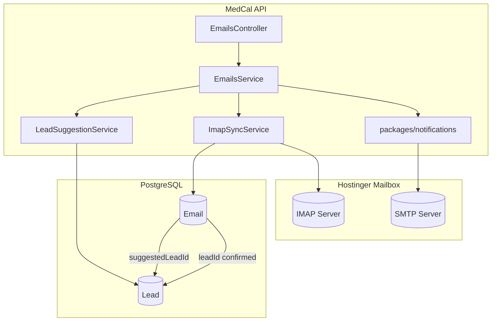
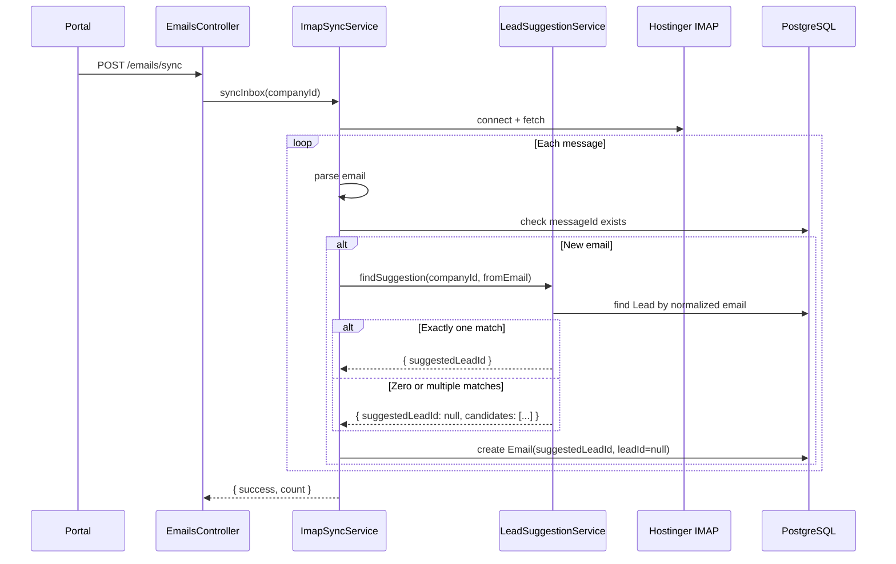
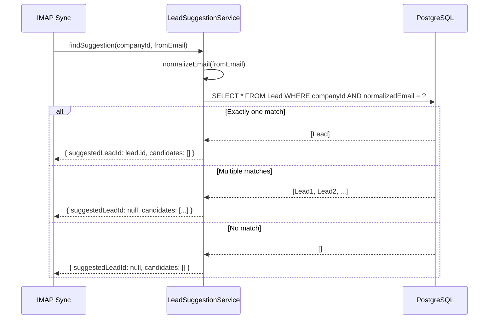
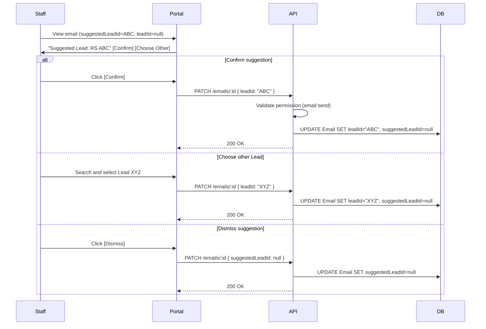
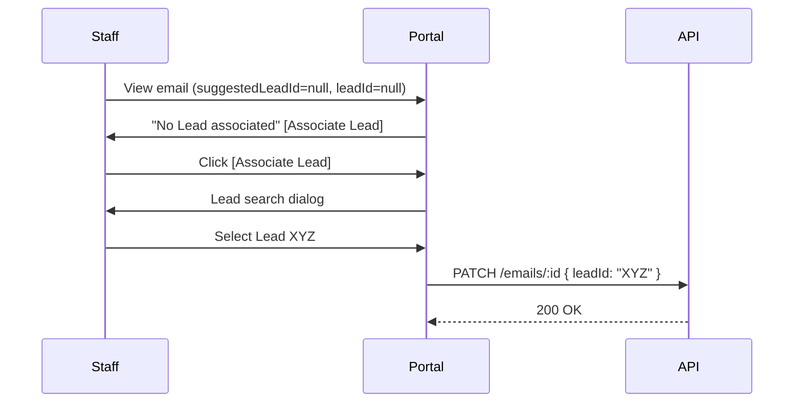
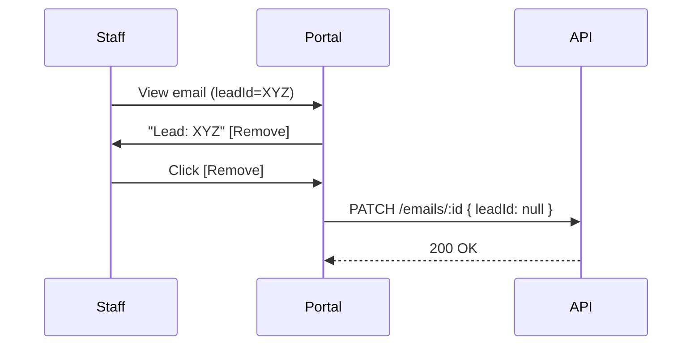

# MEDCAL — Email → Lead Management
# IMPLEMENTATION PLAN v2.2
# IMAP + SMTP Full Mailbox Integration
# STRICT AUTO-SUGGEST LEAD MATCHING

**Tanggal:** 20 Agustus 2026  
**Status:** GREEN — Ready for implementation  
**Supersedes:** `implementation-plan-email-lead-management-v2.md` (auto-set leadId, CORRECTED)

---

## CHANGELOG v2.1 → v2.2

| Section | Change | Reason |
|---------|--------|--------|
| 6. Data Model | Replace `autoMatched Boolean` with `suggestedLeadId String?` | Strict auto-suggest semantics |
| 11. Lead Matching | Remove all "auto-set leadId" language | Suggestion only until staff confirms |
| 11. Lead Matching | Add multiple-match handling | Must present candidates to staff |
| 11. Lead Matching | Add email normalization rules | Consistent comparison |
| 18. API Contract | Remove `autoMatched` from response | Replaced with `suggestedLead` object |
| 18. API Contract | Add `PATCH /emails/:id` leadId permission | Server-side enforcement |
| 19. UI Architecture | Change "Auto-matched" to "Suggested" | Clear distinction |
| 20. Security | Remove `rejectUnauthorized: false` default | Production TLS required |
| 20. Security | Add TLS override configuration | Explicit, documented |
| 23. Migration | Remove "auto-rollback" claim | Proper production workflow |
| 29. Risks | Update migration risk | No implicit rollback |

---

## 1. Executive Summary

Plan ini mendeskripsikan arsitektur email terintegrasi untuk MedCal dengan **strict auto-suggest only** Lead matching — sistem TIDAK PERNAH secara otomatis menetapkan Lead ke email tanpa konfirmasi eksplisit dari staff.

**Target architecture:**
- **Inbound:** IMAP sync dari Hostinger mailbox
- **Outbound:** SMTP via nodemailer
- **Persistence:** Single `Email` model untuk inbox + sent
- **Lead integration:** Suggestion-only matching, staff confirmation required
- **UI:** Gmail-like inbox/sent/drafts/trash dengan MedCal design system

**Key decisions (LOCKED):**
- Adopt server-bi-erp Email model structure (proven, working)
- Manual IMAP sync for MVP (no background scheduler)
- Basic internal threading via `inReplyTo` (no RFC header threading in MVP)
- **STRICT AUTO-SUGGEST ONLY** — `leadId` remains null until staff confirms
- Attachments deferred to Phase 2

---

## 2. What Was Learned from server-bi-erp Implementation

*Unchanged from v2.1 — see original document.*

### 2.1 Key Findings Summary

| Aspect | Finding |
|--------|---------|
| IMAP Library | `imap` (node-imap) + `mailparser` |
| SMTP Library | `nodemailer` |
| Sync Strategy | Manual, last 50 messages |
| Duplicate Detection | `messageId` unique constraint |
| Threading | NOT implemented (field exists, never used) |
| Background Sync | NONE — manual only |

---

## 3-5. Architecture

*Unchanged from v2.1 — see sections 3, 4, 5 in v2.md*

**Architecture diagram remains:**



---

## 6. Final Data Model

### 6.1 Email Model (UPDATED)

```prisma
enum EmailFolder {
  INBOX
  SENT
  DRAFTS
  TRASH
}

enum EmailStatus {
  UNREAD
  READ
}

model Email {
  id          String      @id @default(cuid())
  companyId   String
  messageId   String?     @unique  // IMAP Message-ID header for dedup

  fromEmail   String
  fromName    String?
  toEmail     String      // Primary recipient (comma-sep if multiple)
  toName      String?
  ccEmail     String?
  bccEmail    String?

  subject     String
  body        String      @db.Text  // HTML content
  textBody    String?     @db.Text  // Plain text

  folder      EmailFolder @default(INBOX)
  status      EmailStatus @default(UNREAD)
  isStarred   Boolean     @default(false)

  // Internal reply chain (MedCal-specific, NOT RFC header)
  inReplyTo   String?     // Parent Email.id (cuid) — NOT RFC Message-ID

  // Lead association - STRICT AUTO-SUGGEST SEMANTICS
  suggestedLeadId String? // System suggestion only — NOT confirmed
  leadId          String? // Staff-confirmed association — NULL until confirmed

  contactMessageId String? // FK to ContactMessage (optional)
  sentByUserId     String? // FK to User (who sent, null for inbound)

  sentAt      DateTime?   // When sent (outbound)
  receivedAt  DateTime?   // When received (inbound)
  readAt      DateTime?   // When marked read
  deletedAt   DateTime?   // Soft delete for trash
  createdAt   DateTime    @default(now())
  updatedAt   DateTime    @updatedAt

  // Relations
  company        Company         @relation(fields: [companyId], references: [id], onDelete: Cascade)
  suggestedLead  Lead?           @relation("EmailSuggestion", fields: [suggestedLeadId], references: [id], onDelete: SetNull)
  lead           Lead?           @relation("EmailAssociation", fields: [leadId], references: [id], onDelete: SetNull)
  contactMessage ContactMessage? @relation(fields: [contactMessageId], references: [id], onDelete: SetNull)
  sentBy         User?           @relation("EmailSender", fields: [sentByUserId], references: [id])
  parentEmail    Email?          @relation("EmailThread", fields: [inReplyTo], references: [id], onDelete: SetNull)
  replies        Email[]         @relation("EmailThread")

  @@index([companyId, folder])
  @@index([companyId, status])
  @@index([companyId, leadId])
  @@index([companyId, suggestedLeadId])
  @@index([companyId, createdAt])
  @@index([messageId])
  @@index([contactMessageId])
  @@index([inReplyTo])
}
```

### 6.2 Relations to Existing Models

```prisma
model Lead {
  // ... existing fields ...
  
  // Two separate relations for suggestion vs confirmed
  suggestedInEmails Email[] @relation("EmailSuggestion")
  emails            Email[] @relation("EmailAssociation")
}

model ContactMessage {
  // ... existing fields ...
  emails Email[]
}

model User {
  // ... existing fields ...
  sentEmails Email[] @relation("EmailSender")
}

model Company {
  // ... existing fields ...
  emails Email[]
}
```

### 6.3 Model Decisions (UPDATED)

| Decision | Rationale |
|----------|-----------|
| No EmailThread model | MVP uses `inReplyTo` cuid chain (internal, not RFC) |
| No EmailAttachment model | Deferred to Phase 2 |
| `messageId` unique | IMAP dedup — prevents duplicate sync |
| `suggestedLeadId` nullable | System suggestion, NOT confirmed |
| `leadId` nullable | Staff-confirmed association only |
| `contactMessageId` nullable | Only for replies to inbound ContactMessage |
| `sentByUserId` nullable | Null for inbound, set for outbound |
| Two Lead relations | Separate suggestion from confirmed association |

### 6.4 Lead Association Semantics

| State | `suggestedLeadId` | `leadId` | Meaning |
|-------|-------------------|----------|---------|
| No match | null | null | No Lead candidate found |
| Suggested | `lead_abc` | null | System found candidate, awaiting confirmation |
| Confirmed | null | `lead_abc` | Staff explicitly associated |
| Overridden | null | `lead_xyz` | Staff chose different Lead than suggested |
| Removed | null | null | Staff explicitly removed association |

**Critical rule:** `leadId` is NEVER automatically set. Always null until staff action.

---

## 7. Threading Strategy

### 7.1 MVP Approach — Internal Reply Chain

**Decision:** Basic reply chain via `inReplyTo` using MedCal Email cuid.

| Aspect | Implementation |
|--------|---------------|
| Thread identity | `inReplyTo` points to parent `Email.id` (cuid) |
| Reply action | Set `inReplyTo` = parent email's cuid |
| Thread display | Query `Email WHERE inReplyTo = :emailId` |

### 7.2 Distinction: Internal vs RFC Headers

| Field | Type | Purpose | Source |
|-------|------|---------|--------|
| `inReplyTo` | String (cuid) | MedCal internal reply chain | Set by MedCal when replying |
| `messageId` | String | IMAP Message-ID header | Parsed from email for dedup |

**DO NOT:**
- Use MedCal cuid as RFC `In-Reply-To` header
- Claim RFC-compliant threading in MVP
- Parse RFC `In-Reply-To`/`References` for threading

### 7.3 Conversation Example

```
Email A (INBOX, inReplyTo=null)
  ↳ Email B (SENT, inReplyTo=A.id)  ← MedCal sets this when staff replies
    ↳ Email C (INBOX, inReplyTo=null)  ← IMAP sync does NOT link this
```

**Limitation:** Inbound replies from external senders are NOT automatically linked to the thread because MedCal does not parse RFC headers for threading in MVP.

---

## 8. IMAP Sync Architecture

*Unchanged from v2.1 except Lead matching section.*

### 8.1 Sync Strategy (MVP)

| Aspect | Implementation |
|--------|---------------|
| Trigger | `POST /emails/sync` (manual) |
| Scope | INBOX folder only |
| Fetch | Last 50 messages (recent first) |
| Duplicate | Skip if `messageId` exists |
| Parsing | `mailparser.simpleParser()` |
| Lead matching | **SUGGESTION ONLY** — sets `suggestedLeadId`, NOT `leadId` |

### 8.2 Sync Flow with Lead Suggestion



**Key point:** `leadId` is ALWAYS null on create. Only `suggestedLeadId` may be set.

---

## 9-10. SMTP & Folder Strategy

*Unchanged from v2.1.*

---

## 11. Lead Matching Strategy (MAJOR UPDATE)

### 11.1 Core Principle: STRICT AUTO-SUGGEST ONLY

**LOCKED DECISION:**

> The system MUST NEVER automatically assign an inbound email to a Lead.
> An email address match is only a suggestion.
> `leadId` MUST remain NULL until a staff user explicitly confirms.

### 11.2 Email Normalization Rules

Before comparison, normalize email addresses:

```typescript
function normalizeEmail(email: string): string {
  return email
    .toLowerCase()           // case-insensitive
    .trim()                  // remove whitespace
    .replace(/\s+/g, '');    // remove internal spaces
}
```

**Comparison:** `normalizeEmail(fromEmail) === normalizeEmail(Lead.email)`

### 11.3 Matching Flow



### 11.4 Matching Rules

| Condition | `suggestedLeadId` | `leadId` | UI Behavior |
|-----------|-------------------|----------|-------------|
| Exactly 1 Lead matches | `lead_id` | null | Show "Suggested Lead: X" |
| Multiple Leads match | null | null | Show "Multiple candidates: X, Y" |
| No Lead matches | null | null | Show "No Lead suggested" |

**NOT allowed in MVP:**
- Domain-based matching (`@company.com`)
- Fuzzy matching
- Name similarity
- Partial email matching
- Automatic Lead creation
- Automatic `leadId` assignment

### 11.5 Staff Confirmation Flow



### 11.6 Manual Association (No Suggestion)



### 11.7 Remove Association



---

## 12. ContactMessage Integration

*Unchanged from v2.1.*

**Additional clarification:** When replying to a ContactMessage via email, the resulting Email may inherit the ContactMessage's Lead association, but this is still **staff-initiated** (they clicked Reply from Lead context), not automatic.

---

## 13-15. Draft, Trash, Attachments

*Unchanged from v2.1.*

---

## 16. Permission Matrix (UPDATED)

### 16.1 Permission Catalog

```typescript
const ac = createAccessControl({
  // ... existing ...
  email: ["read", "send", "delete"],
} as const);
```

### 16.2 Permission → Action Mapping (UPDATED)

| Action | Permission | Endpoint | Notes |
|--------|------------|----------|-------|
| View inbox/sent/etc | `email:read` | GET /emails | |
| View email detail | `email:read` | GET /emails/:id | |
| Compose/send | `email:send` | POST /emails | |
| Save draft | `email:send` | POST /emails/draft | |
| Reply | `email:send` | POST /emails | |
| Mark read/star | `email:read` | PATCH /emails/:id | |
| **Confirm/change Lead** | **`email:send`** | PATCH /emails/:id | **Server-enforced** |
| **Dismiss suggestion** | `email:read` | PATCH /emails/:id | Only clears suggestedLeadId |
| Move to trash | `email:delete` | DELETE /emails/:id | |
| Restore | `email:delete` | POST /emails/:id/restore | |
| Permanent delete | `email:delete` | DELETE /emails/:id/permanent | |
| Sync inbox | `email:read` | POST /emails/sync | |

**Critical:** `leadId` modification requires `email:send` permission, enforced server-side.

---

## 17. Menu Registry Changes

*Unchanged from v2.1.*

---

## 18. API Contract (UPDATED)

### 18.1 Endpoints

*Same as v2.1.*

### 18.2 Request/Response Schemas (UPDATED)

#### GET /emails

**Response:**
```typescript
{
  data: EmailListRow[];
  page: number;
  pageSize: number;
  total: number;
  totalPages: number;
}

interface EmailListRow {
  id: string;
  folder: "INBOX" | "SENT" | "DRAFTS" | "TRASH";
  status: "UNREAD" | "READ";
  isStarred: boolean;
  fromEmail: string;
  fromName: string | null;
  toEmail: string;
  subject: string;
  snippet: string;
  sentAt: string | null;
  receivedAt: string | null;
  createdAt: string;
  
  // Lead association - suggestion vs confirmed
  suggestedLead: { id: string; name: string } | null;  // Suggestion only
  lead: { id: string; name: string } | null;           // Confirmed association
  
  hasAttachments: boolean;   // Always false in MVP
}
```

#### GET /emails/:id

**Response:**
```typescript
{
  id: string;
  folder: "INBOX" | "SENT" | "DRAFTS" | "TRASH";
  status: "UNREAD" | "READ";
  isStarred: boolean;
  fromEmail: string;
  fromName: string | null;
  toEmail: string;
  toName: string | null;
  ccEmail: string | null;
  bccEmail: string | null;
  subject: string;
  body: string;
  textBody: string | null;
  sentAt: string | null;
  receivedAt: string | null;
  readAt: string | null;
  createdAt: string;
  
  // Lead association - suggestion vs confirmed
  suggestedLead: { id: string; name: string; email: string } | null;
  lead: { id: string; name: string; email: string } | null;
  
  // Multiple candidates (if no single suggestion)
  leadCandidates: Array<{ id: string; name: string; email: string }>;
  
  contactMessage: { id: string; subject: string | null } | null;
  sentBy: { id: string; name: string | null } | null;
  parentEmail: { id: string; subject: string } | null;
  attachments: [];
}
```

#### PATCH /emails/:id

**Request:**
```typescript
// Mark read/star (email:read)
{ status?: "READ" | "UNREAD"; isStarred?: boolean }

// Dismiss suggestion (email:read)
{ suggestedLeadId?: null }

// Confirm/change Lead (email:send required)
{ leadId?: string | null }
```

**Server validation:**
- If `leadId` is present in body → require `email:send` permission
- If only `status`, `isStarred`, or `suggestedLeadId=null` → require `email:read`

---

## 19. Portal UI Architecture (UPDATED)

### 19.1 UI Terminology

| Condition | Display | Badge Style |
|-----------|---------|-------------|
| `suggestedLead` && !`lead` | "Suggested Lead: X" | Dashed border, muted |
| `lead` | "Lead: X" | Solid, primary color |
| Multiple candidates | "Possible Leads: X, Y" | Warning style |
| No suggestion, no lead | "No Lead associated" | Ghost text |

**DO NOT use:**
- "Auto-matched" — implies confirmed
- "Automatically assigned" — misleading
- Any terminology suggesting the Lead is already associated

### 19.2 Email Detail Actions

| State | Actions Available |
|-------|-------------------|
| Suggested, not confirmed | [Confirm] [Choose Other] [Dismiss] |
| Multiple candidates | [Select Lead] (shows picker) |
| Confirmed | [Change] [Remove] |
| No association | [Associate Lead] |

### 19.3 Lead Detail — Email History

**Only show emails where `leadId` = this Lead.**

**DO NOT show:**
- Emails where only `suggestedLeadId` = this Lead
- Unconfirmed suggestions

---

## 20. Security Model (UPDATED)

### 20.1 TLS Configuration

**Production default:** Proper TLS certificate verification.

```typescript
// imap-sync.service.ts
const imap = new Imap({
  host: config.IMAP_HOST,
  port: config.IMAP_PORT,
  tls: config.IMAP_TLS === 'true',
  tlsOptions: {
    rejectUnauthorized: config.IMAP_TLS_REJECT_UNAUTHORIZED !== 'false',
  },
});
```

**Environment configuration:**
```bash
# .env — Production defaults
IMAP_TLS=true
IMAP_TLS_REJECT_UNAUTHORIZED=true  # Default: verify certificates

# Only set to false if:
# 1. Self-signed certificate in controlled environment
# 2. Documented justification exists
# 3. Risk accepted by security review
IMAP_TLS_REJECT_UNAUTHORIZED=false  # NOT recommended
```

### 20.2 Other Security (Unchanged)

*Same as v2.1: credentials, authorization, HTML sanitization, logging rules.*

---

## 21. Error Handling

*Unchanged from v2.1.*

---

## 22. Background Job/Scheduler Strategy

### 22.1 MVP Decision (LOCKED)

**Decision:** Manual sync only.

**DO NOT:**
- Add node-cron for MVP
- Add BullMQ/Redis for MVP
- Implement automatic background sync for MVP

This is a **LOCKED** decision. Automatic sync is documented as Phase 2 enhancement only.

---

## 23. Migration Strategy (UPDATED)

### 23.1 Development Migration

```bash
# Development only
pnpm --filter @medcal/db prisma migrate dev --name add_email_system
```

### 23.2 Production Migration Workflow

**DO NOT use `prisma migrate dev` in production.**

Production workflow:

1. **Generate migration:**
   ```bash
   pnpm --filter @medcal/db prisma migrate dev --name add_email_system --create-only
   ```

2. **Review generated SQL:**
   - Inspect `prisma/migrations/YYYYMMDD_add_email_system/migration.sql`
   - Verify no destructive operations
   - Check index creation

3. **Validate in staging:**
   ```bash
   # On staging environment
   pnpm --filter @medcal/db prisma migrate deploy
   ```

4. **Production deployment:**
   ```bash
   # On production environment
   pnpm --filter @medcal/db prisma migrate deploy
   ```

5. **Verify schema:**
   ```bash
   pnpm --filter @medcal/db prisma migrate status
   ```

6. **Deploy application** (after schema is verified)

7. **Post-deployment verification:**
   - Check Email table exists
   - Verify indexes created
   - Test email sync endpoint

### 23.3 Rollback Strategy

**There is NO automatic rollback.**

If migration fails:
1. Investigate error
2. Fix issue
3. Re-run migration

If rollback required:
1. Create explicit down migration
2. Review and test
3. Apply manually

---

## 24-26. Deployment, Testing, Observability

*Unchanged from v2.1.*

---

## 27. Files Expected to Change

### New Files

```
packages/db/prisma/migrations/YYYYMMDD_add_email_system/
apps/api/src/modules/emails/emails.module.ts
apps/api/src/modules/emails/emails.controller.ts
apps/api/src/modules/emails/emails.service.ts
apps/api/src/modules/emails/imap-sync.service.ts
apps/api/src/modules/emails/lead-suggestion.service.ts
apps/api/src/modules/emails/email-normalize.util.ts
apps/api/src/modules/emails/emails.service.test.ts
apps/portal/src/app/management/email/page.tsx
apps/portal/src/app/management/email/inbox/page.tsx
apps/portal/src/app/management/email/sent/page.tsx
apps/portal/src/app/management/email/drafts/page.tsx
apps/portal/src/app/management/email/trash/page.tsx
apps/portal/src/app/management/email/compose/page.tsx
apps/portal/src/app/management/email/[id]/page.tsx
apps/portal/src/app/management/email/email-ui.tsx
apps/portal/src/lib/sanitize-html.ts
```

### Modified Files

*Same as v2.1.*

---

## 28. Explicitly Out-of-Scope

| Item | Reason |
|------|--------|
| Attachments | Phase 2 |
| Rich text editor (TipTap/Quill) | Phase 2 |
| Automatic background sync | Phase 2 — manual only for MVP |
| RFC header-based threading | Complexity |
| IMAP folder sync (Sent, Drafts, Trash) | Only INBOX synced |
| Fuzzy Lead matching | Exact match only for accuracy |
| Domain-based Lead matching | Exact email only |
| Automatic Lead creation | Never auto-create |
| Automatic `leadId` assignment | **NEVER** — suggestion only |
| SPAM folder | Not needed for business email |
| Email templates | Phase 2 |
| Scheduled sending | Phase 2 |

---

## 29. Risks and Mitigations (UPDATED)

| Risk | Severity | Mitigation |
|------|----------|------------|
| IMAP credentials exposed | HIGH | Env vars only, never log |
| XSS in email body | HIGH | Sanitize all HTML on display |
| TLS disabled in production | HIGH | Default to `rejectUnauthorized: true`, require explicit override |
| SMTP success + DB fail | MEDIUM | Log with messageId for reconciliation |
| Large mailbox sync timeout | MEDIUM | Limit to 50 emails per sync |
| Duplicate emails | LOW | messageId unique constraint |
| Cross-tenant access | HIGH | companyId scoping on all queries |
| SMTP misconfiguration | MEDIUM | Graceful 503 error |
| Thread complexity | LOW | MVP uses simple inReplyTo chain |
| Migration failure | MEDIUM | Manual review required, no auto-rollback |
| Staff confusion about suggestions | LOW | Clear UI terminology (Suggested vs Associated) |

---

## 30. Implementation Order

### Phase 1: Foundation

1. **packages/notifications** — enhance `sendEmail` with nodemailer
2. **packages/config** — add SMTP + IMAP env schema (including TLS options)
3. **packages/db** — add Email model with `suggestedLeadId` + `leadId`
4. **packages/auth** — add email:* permissions
5. **packages/shared** — add email Zod schemas
6. **.env.example** — add env vars with secure defaults

### Phase 2: Backend

1. **emails.module.ts** — EmailsModule
2. **imap-sync.service.ts** — IMAP sync with proper TLS
3. **lead-suggestion.service.ts** — Suggestion only, never auto-assign
4. **email-normalize.util.ts** — Email normalization
5. **emails.service.ts** — CRUD with permission checks
6. **emails.controller.ts** — API endpoints
7. **leads.controller.ts** — add GET /leads/:id/emails (confirmed only)
8. **me.controller.ts** — add capabilities
9. Integration tests for suggestion flow

### Phase 3: Frontend

1. **sanitize-html.ts**
2. Email pages with suggestion UI
3. "Suggested Lead" vs "Lead" displays
4. Confirm/dismiss/change actions
5. Lead detail email history (confirmed only)

### Phase 4: Activation

1. Review migration SQL
2. Deploy to staging, validate
3. Deploy to production (migrate deploy)
4. Set production env vars
5. Manual sync test

### Phase 5: Validation

1. Lint, typecheck, build
2. Test suggestion flow end-to-end
3. Test permission enforcement
4. Test TLS certificate verification
5. Security review

---

## PLAN VERDICT

# GREEN — Ready for implementation

### Consistency Check Results

| Check | Status |
|-------|--------|
| Strict auto-suggest only | ✓ All "auto-set leadId" removed |
| Manual IMAP sync MVP | ✓ No node-cron, no background sync |
| Internal vs RFC threading | ✓ `inReplyTo` is cuid, not RFC header |
| TLS security | ✓ Default `rejectUnauthorized: true` |
| Production migration | ✓ No "auto-rollback" claim |
| UI terminology | ✓ "Suggested" vs "Associated" |

### All Critical Components Resolved

- IMAP sync architecture: Manual, last 50, suggestion-only Lead matching
- Email threading: Internal `inReplyTo` cuid (not RFC)
- Mailbox folder mapping: INBOX/SENT/DRAFTS/TRASH
- Lead matching: **STRICT AUTO-SUGGEST ONLY**
- Persistence model: `suggestedLeadId` + `leadId` separate
- Permission model: `leadId` change requires `email:send`
- TLS: Verified by default, explicit override required
- Migration: Manual review, no auto-rollback

---

*Document version: 2.2*  
*Status: GREEN — Ready for implementation*  
*Last updated: 20 Agustus 2026*
