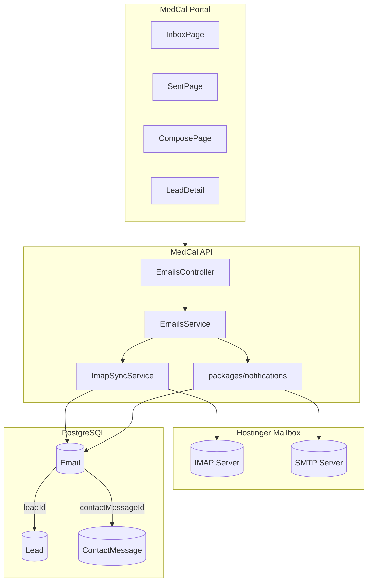
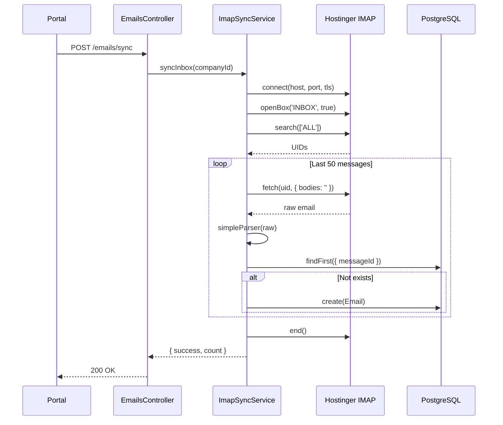
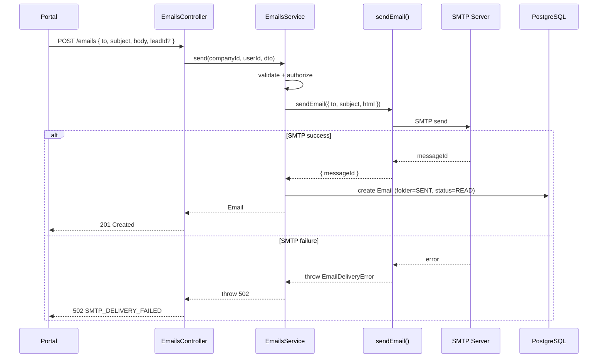
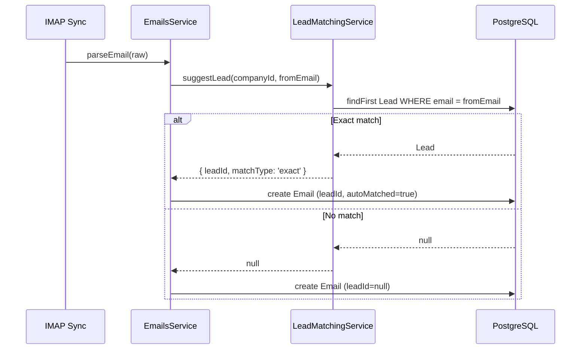
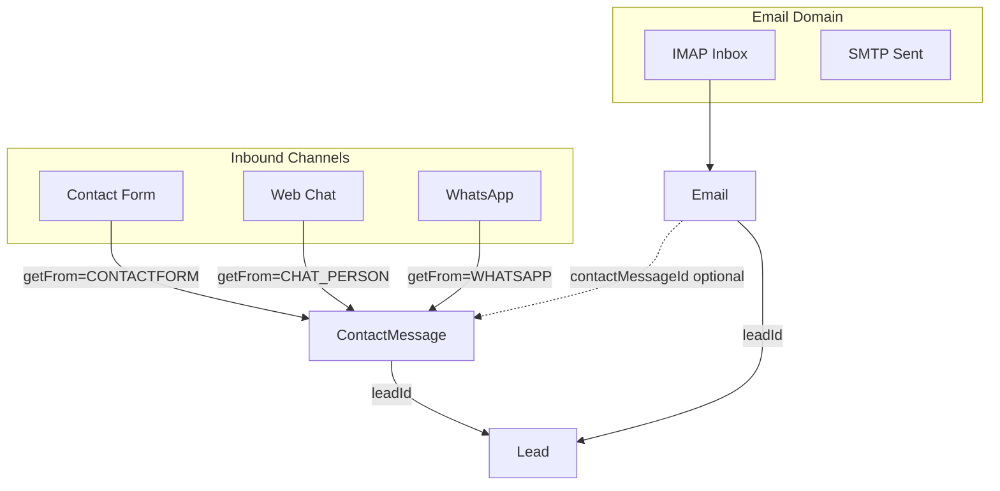

# MEDCAL — Email → Lead Management
# IMPLEMENTATION PLAN v2
# IMAP + SMTP Full Mailbox Integration

**Tanggal:** 20 Agustus 2026  
**Status:** PLAN ONLY — awaiting approval  
**Supersedes:** `implementation-plan-email-lead-management.md` (outbound-only, REJECTED)

---

## 1. Executive Summary

Plan ini mendeskripsikan arsitektur email terintegrasi untuk MedCal berdasarkan penelitian mendalam terhadap implementasi server-bi-erp yang sudah production-ready di apps.bumiindah.co.id.

**Target architecture:**
- **Inbound:** IMAP sync dari Hostinger mailbox
- **Outbound:** SMTP via nodemailer
- **Persistence:** Single `Email` model untuk inbox + sent
- **Lead integration:** Email ↔ Lead association, ContactMessage link
- **UI:** Gmail-like inbox/sent/drafts/trash dengan MedCal design system

**Key decisions:**
- Adopt server-bi-erp Email model structure (proven, working)
- Adapt sync mechanism for MedCal's scheduler requirements
- Implement basic threading via `inReplyTo` (no RFC header threading in MVP)
- Maintain ContactMessage as inbound intake; Email is mailbox domain
- Attachments deferred to Phase 2

---

## 2. What Was Learned from server-bi-erp Implementation

### 2.1 IMAP Implementation

| Aspect | server-bi-erp Implementation |
|--------|------------------------------|
| Library | `imap` (node-imap) + `mailparser` |
| Connection | Per-sync connection, not persistent |
| TLS | Configurable via `IMAP_TLS`, `tlsOptions: { rejectUnauthorized: false }` |
| Mailbox | Opens `INBOX` only, read-only mode |
| Fetch strategy | Last 50 messages, full body (`bodies: ''`) |
| Duplicate detection | `messageId` unique constraint check before insert |
| Incremental sync | **NOT IMPLEMENTED** — fetches all every time |
| UID checkpoint | **NOT IMPLEMENTED** — no UIDVALIDITY/HIGHESTMODSEQ |
| Sync trigger | Manual `POST /email-management/sync` |
| Background job | **NONE** — manual only |

**Gaps identified:**
- No incremental sync (fetches entire mailbox each time)
- No UID/checkpoint persistence
- No automatic background sync
- Performance issue for large mailboxes

### 2.2 SMTP Implementation

| Aspect | server-bi-erp Implementation |
|--------|------------------------------|
| Library | `nodemailer` |
| Transport | Dynamic per-company config |
| Message-ID | Generated by nodemailer, not explicitly stored |
| Timeouts | 10s connection, 60s socket |
| STARTTLS | Configured for port 587 |
| Persistence order | SMTP first → then DB (non-atomic) |
| Error handling | Throws on failure, logs details |

### 2.3 Database Model

```prisma
model Email {
  id        String  @id @default(uuid())
  messageId String? @unique    // IMAP message-id for dedup

  fromEmail String
  fromName  String?
  toEmail   String             // Comma-separated
  toName    String?
  ccEmail   String?
  bccEmail  String?

  subject   String
  body      String             // HTML
  textBody  String?            // Plain text

  folder    EmailFolder        // INBOX, SENT, DRAFTS, TRASH, SPAM
  status    EmailStatus        // UNREAD, READ
  isStarred Boolean
  isImportant Boolean

  threadId  String?            // NOT USED in practice
  inReplyTo String?            // Parent Email ID (UUID, not RFC header)

  contactMessageId String?     // Link to ContactMessage
  userId    Int?               // Owner (null = shared inbox)
  company_id String?           // Tenant

  sentAt     DateTime?
  receivedAt DateTime?
  readAt     DateTime?
  createdAt  DateTime
  updatedAt  DateTime
  deletedAt  DateTime?         // Soft delete for trash

  attachments EmailAttachment[]
}

enum EmailFolder { INBOX, SENT, DRAFTS, TRASH, SPAM }
enum EmailStatus { UNREAD, READ }
```

### 2.4 Threading Strategy (server-bi-erp)

**Finding:** Threading is **NOT implemented** in server-bi-erp.

- `threadId` field exists but never populated
- `inReplyTo` stores parent Email UUID (not RFC Message-ID)
- No RFC header-based threading (Message-ID, In-Reply-To, References)
- No subject-based fallback

**Implication for MedCal:** MVP can follow same approach (basic reply chain via `inReplyTo`).

### 2.5 API Surface

| Endpoint | Method | Purpose |
|----------|--------|---------|
| `/email-management` | GET | List (paginated, filtered by folder) |
| `/email-management/:id` | GET | Detail (auto marks read) |
| `/email-management/send` | POST | Send + save to SENT |
| `/email-management/draft` | POST | Save draft |
| `/email-management/:id` | PATCH | Update (read, star, folder) |
| `/email-management/:id/trash` | DELETE | Move to trash (soft) |
| `/email-management/:id/restore` | POST | Restore from trash |
| `/email-management/:id/permanent` | DELETE | Hard delete |
| `/email-management/statistics` | GET | Folder counts |
| `/email-management/sync` | POST | Manual IMAP sync |

### 2.6 UI Implementation (easy-app)

| Component | Implementation |
|-----------|---------------|
| Email list | Paginated, search, bulk actions |
| Email detail | Reply/forward/star/delete actions |
| Compose | Quill rich text editor, attachments |
| Navigation | Sidebar: Inbox/Sent/Drafts/Trash |
| Responsive | Mobile drawer, desktop split view |
| State | React Query + custom events |

---

## 3. What Can Be Reused Conceptually

| Aspect | Reuse | Adaptation Required |
|--------|-------|---------------------|
| Email model structure | Yes | Add `leadId`, MedCal tenant pattern |
| IMAP connection pattern | Yes | Same library, same TLS handling |
| SMTP via nodemailer | Yes | Use existing `packages/notifications` |
| Folder enum | Yes | Same values |
| Status enum | Yes | Same values |
| `inReplyTo` pattern | Yes | UUID reference, not RFC |
| `contactMessageId` link | Yes | Same concept |
| Soft delete for trash | Yes | Same `deletedAt` pattern |
| API pagination pattern | Adapt | MedCal uses `{ data, page, pageSize, total, totalPages }` |
| Attachment model | Defer | Phase 2 |

---

## 4. What Must Be Adapted for MedCal

| Aspect | server-bi-erp | MedCal Adaptation |
|--------|---------------|-------------------|
| ID format | UUID | cuid (MedCal standard) |
| Tenant field | `company_id` Char(5) | `companyId` String (MedCal pattern) |
| User reference | `userId` Int | `userId` String (cuid, FK to User) |
| Pagination response | Custom | `{ data, page, pageSize, total, totalPages }` |
| Validation | class-validator | Zod schemas in `@medcal/shared` |
| Auth/RBAC | Custom JWT + Passport | Better Auth + `CompanyRoleGuard` |
| Permission | `@Roles('ADMIN')` | `@RequirePermission('email', 'read')` |
| SMTP location | Inline in service | `packages/notifications` (single boundary) |
| Config | ConfigService | `packages/config` envSchema |
| Background sync | Manual only | **Evaluate:** simple cron or keep manual |

---

## 5. Final Email Architecture



**Principles:**
1. Single `Email` table for all folders (inbox, sent, drafts, trash)
2. IMAP sync populates INBOX folder
3. SMTP send populates SENT folder
4. `messageId` (IMAP header) for duplicate detection
5. `inReplyTo` (UUID) for reply chain
6. `leadId` for Lead association
7. `contactMessageId` for ContactMessage link (optional)
8. Soft delete for trash (`deletedAt`)

---

## 6. Final Data Model

### 6.1 Email Model

```prisma
enum EmailFolder {
  INBOX
  SENT
  DRAFTS
  TRASH
}

enum EmailStatus {
  UNREAD
  READ
}

model Email {
  id          String      @id @default(cuid())
  companyId   String
  messageId   String?     @unique  // IMAP Message-ID header for dedup

  fromEmail   String
  fromName    String?
  toEmail     String      // Primary recipient (comma-sep if multiple)
  toName      String?
  ccEmail     String?
  bccEmail    String?

  subject     String
  body        String      @db.Text  // HTML content
  textBody    String?     @db.Text  // Plain text

  folder      EmailFolder @default(INBOX)
  status      EmailStatus @default(UNREAD)
  isStarred   Boolean     @default(false)

  inReplyTo   String?     // Parent Email ID (cuid) for reply chain
  leadId      String?     // FK to Lead
  autoMatched Boolean     @default(false)  // True if Lead auto-matched by email
  contactMessageId String? // FK to ContactMessage (optional)
  sentByUserId String?    // FK to User (who sent, null for inbound)

  sentAt      DateTime?   // When sent (outbound)
  receivedAt  DateTime?   // When received (inbound)
  readAt      DateTime?   // When marked read
  deletedAt   DateTime?   // Soft delete for trash
  createdAt   DateTime    @default(now())
  updatedAt   DateTime    @updatedAt

  company        Company         @relation(fields: [companyId], references: [id], onDelete: Cascade)
  lead           Lead?           @relation(fields: [leadId], references: [id], onDelete: SetNull)
  contactMessage ContactMessage? @relation(fields: [contactMessageId], references: [id], onDelete: SetNull)
  sentBy         User?           @relation("EmailSender", fields: [sentByUserId], references: [id])
  parentEmail    Email?          @relation("EmailThread", fields: [inReplyTo], references: [id], onDelete: SetNull)
  replies        Email[]         @relation("EmailThread")

  @@index([companyId, folder])
  @@index([companyId, status])
  @@index([companyId, leadId])
  @@index([companyId, createdAt])
  @@index([messageId])
  @@index([contactMessageId])
  @@index([inReplyTo])
}
```

### 6.2 Relations to Existing Models

```prisma
// Add to Lead model
model Lead {
  // ... existing fields ...
  emails Email[]
}

// Add to ContactMessage model
model ContactMessage {
  // ... existing fields ...
  emails Email[]  // Replies to this inbound message
}

// Add to User model
model User {
  // ... existing fields ...
  sentEmails Email[] @relation("EmailSender")
}

// Add to Company model
model Company {
  // ... existing fields ...
  emails Email[]
}
```

### 6.3 Model Decisions

| Decision | Rationale |
|----------|-----------|
| No EmailThread model | MVP uses `inReplyTo` UUID chain (same as server-bi-erp) |
| No EmailAttachment model | Deferred to Phase 2 |
| `messageId` unique | IMAP dedup — prevents duplicate sync |
| `leadId` nullable | Email may exist without lead association |
| `autoMatched` boolean | Track if Lead was auto-matched by email address |
| `contactMessageId` nullable | Only for replies to inbound ContactMessage |
| `sentByUserId` nullable | Null for inbound, set for outbound |
| Self-relation `inReplyTo` | Enables reply chain traversal |

---

## 7. Threading Strategy

### 7.1 MVP Approach (same as server-bi-erp)

**Decision:** Basic reply chain via `inReplyTo` UUID.

| Aspect | Implementation |
|--------|---------------|
| Thread identity | `inReplyTo` points to parent Email.id |
| Reply action | Set `inReplyTo` = parent email ID |
| Thread display | Query `Email WHERE inReplyTo = :emailId` |
| No RFC headers | Message-ID, In-Reply-To, References not parsed for threading |
| No subject fallback | No "Re: ..." matching |

### 7.2 Conversation Example

```
Email A (INBOX, inReplyTo=null)
  ↳ Email B (SENT, inReplyTo=A.id)
    ↳ Email C (INBOX, inReplyTo=B.id)
      ↳ Email D (SENT, inReplyTo=C.id)
```

To display thread: recursive query or flattened with `inReplyTo` chain.

### 7.3 Future Enhancement (not MVP)

RFC-compliant threading would require:
- Parse `In-Reply-To` and `References` headers from IMAP
- Store as `rfc_in_reply_to` and `rfc_references` fields
- Build thread tree from headers
- Subject fallback for messages without headers

**NOT IMPLEMENTED IN MVP** — same limitation as server-bi-erp.

---

## 8. IMAP Sync Architecture

### 8.1 Sync Strategy (MVP)

**Decision:** Manual sync via API endpoint (same as server-bi-erp).

| Aspect | Implementation |
|--------|---------------|
| Trigger | `POST /emails/sync` (manual) |
| Scope | INBOX folder only |
| Fetch | Last 50 messages (recent first) |
| Duplicate | Skip if `messageId` exists |
| Parsing | `mailparser.simpleParser()` |
| Lead matching | **NOT automatic** — manual association |

### 8.2 Implementation Flow



### 8.3 Configuration

```bash
# .env.example additions
IMAP_HOST=imap.hostinger.com
IMAP_PORT=993
IMAP_TLS=true
IMAP_USER=info@kalibrasimedika.co.id
IMAP_PASS=
```

### 8.4 Sync Service Location

**Decision:** Create `ImapSyncService` in `apps/api/src/modules/emails/`

**NOT in `packages/notifications`** — that package is for outbound only.

### 8.5 Future Enhancement: Automatic Sync

Options for Phase 2:
- Simple setInterval in NestJS (not recommended for production)
- node-cron
- Dedicated worker process

**NOT IN MVP** — manual sync matches server-bi-erp.

---

## 9. SMTP Outbound Architecture

### 9.1 Reuse packages/notifications

**Decision:** Extend existing `packages/notifications/src/email/index.ts`

```typescript
// packages/notifications/src/email/index.ts (enhanced)

export interface SendEmailInput {
  to: string;
  cc?: string;
  bcc?: string;
  subject: string;
  html: string;
  text?: string;
  replyTo?: string;       // For Reply-To header
  inReplyTo?: string;     // For In-Reply-To header (RFC Message-ID)
  references?: string;    // For References header
}

export interface SendEmailResult {
  messageId: string;      // Generated Message-ID
  accepted: string[];
  rejected: string[];
}
```

### 9.2 Send Flow



### 9.3 Non-Atomic Transaction Handling

**Same as server-bi-erp:**
- SMTP first → DB second
- If SMTP fails → no DB row, return error
- If SMTP succeeds but DB fails → email sent, but not tracked
  - **Log ERROR with messageId for manual reconciliation**
  - Return 500 `EMAIL_PERSISTENCE_FAILED`

---

## 10. Folder/Mailbox Strategy

### 10.1 Folder Mapping

| UI Folder | EmailFolder Enum | Source |
|-----------|------------------|--------|
| Inbox | `INBOX` | IMAP sync |
| Sent | `SENT` | SMTP send |
| Drafts | `DRAFTS` | Save draft action |
| Trash | `TRASH` | Move to trash (soft delete) |

### 10.2 Folder Semantics

| Folder | `deletedAt` | Query |
|--------|-------------|-------|
| INBOX | null | `WHERE folder='INBOX' AND deletedAt IS NULL` |
| SENT | null | `WHERE folder='SENT' AND deletedAt IS NULL` |
| DRAFTS | null | `WHERE folder='DRAFTS' AND deletedAt IS NULL` |
| TRASH | NOT null | `WHERE deletedAt IS NOT NULL` |

**Note:** Trash is determined by `deletedAt IS NOT NULL`, not `folder='TRASH'`. This matches server-bi-erp pattern.

### 10.3 Folder Operations

| Action | Implementation |
|--------|---------------|
| Move to Trash | Set `deletedAt = now()`, keep original `folder` |
| Restore | Set `deletedAt = null` |
| Permanent delete | Hard delete row |

---

## 11. Lead Matching Strategy

### 11.1 MVP Approach

**Decision:** Auto-suggest Lead matching berdasarkan email address + manual association.

| Scenario | Behavior |
|----------|----------|
| Inbound email synced | Check `fromEmail` → auto-suggest Lead |
| Exact match found | `leadId` auto-set, flagged `autoMatched=true` |
| No match found | `leadId = null`, staff dapat manual associate |
| Reply from Lead context | `leadId` pre-set from Lead |
| Compose standalone | `leadId = null` unless selected |

### 11.2 Auto-Suggest Flow



### 11.3 Matching Rules

| Priority | Match Type | Condition | Action |
|----------|------------|-----------|--------|
| 1 | Exact email | `Lead.email = fromEmail` | Auto-set leadId |
| 2 | No match | No Lead with matching email | leadId = null |

**NOT included in MVP:**
- Domain-based matching (e.g., `@company.com`)
- Fuzzy matching
- Customer.email matching
- ContactMessage.email matching

### 11.4 Manual Override

Staff dapat:
1. Remove auto-matched Lead association
2. Change to different Lead
3. Manually associate email without Lead

```
PATCH /emails/:id { leadId: null | newLeadId }
```

### 11.5 UI Indicator

In email list and detail:
- Show "Auto-matched" badge if `autoMatched=true`
- Show "Associate Lead" button if `leadId=null`
- Show Lead name with link if associated

---

## 12. ContactMessage Integration

### 12.1 Relationship Model



### 12.2 ContactMessage vs Email

| Aspect | ContactMessage | Email |
|--------|----------------|-------|
| Purpose | Inbound intake audit trail | Mailbox communication |
| Channels | Form, Chat, WhatsApp, EMAIL* | IMAP/SMTP only |
| Workflow | PENDING→READ→REPLIED→CLOSED | UNREAD→READ |
| Lead creation | Auto (matching logic) | Manual association |
| Folder concept | No | Yes (INBOX/SENT/DRAFTS/TRASH) |

*`GetMessageFrom.EMAIL` in ContactMessage is for **form/intake** labeled as email source, NOT actual mailbox sync.

### 12.3 Reply from ContactMessage

When staff replies to a ContactMessage via email:

1. Open ContactMessage detail
2. Click "Reply via Email"
3. Opens compose with `contactMessageId` set
4. On send: create Email with `contactMessageId` FK
5. Optionally: update `ContactMessage.status = REPLIED`

### 12.4 Decision: ContactMessage.status = REPLIED

**Condition:** Only update if:
- Email successfully sent
- Email has `contactMessageId` set
- ContactMessage status is `PENDING` or `READ`

**Not updated if:**
- ContactMessage already `REPLIED` or `CLOSED`
- Email send failed

---

## 13. Draft Strategy

### 13.1 MVP Approach

**Decision:** Local drafts saved to database (same as server-bi-erp).

| Aspect | Implementation |
|--------|---------------|
| Save | `POST /emails/draft` → create Email with `folder=DRAFTS` |
| Edit | `PATCH /emails/:id` |
| Send | `POST /emails/:id/send` (changes to SENT + SMTP) |
| Delete | `DELETE /emails/:id/trash` or permanent |

### 13.2 NOT Synced to Hostinger

Drafts are **MedCal-local only**. Not uploaded to Hostinger IMAP Drafts folder.

Rationale:
- Simplicity
- Matches server-bi-erp
- No IMAP APPEND complexity

---

## 14. Trash Strategy

### 14.1 MVP Approach

**Decision:** Soft delete via `deletedAt` (same as server-bi-erp).

| Action | Implementation |
|--------|---------------|
| Delete | Set `deletedAt = now()` |
| Restore | Set `deletedAt = null` |
| Permanent | Hard delete row |
| List trash | `WHERE deletedAt IS NOT NULL` |

### 14.2 NOT Synced to Hostinger

Trash is **MedCal-local only**. Deleting in MedCal does not delete from Hostinger IMAP.

Rationale:
- Simplicity
- Matches server-bi-erp
- Provider mailbox remains intact

---

## 15. Attachment Decision

### 15.1 MVP: Attachments DEFERRED

**Decision:** Attachments are OUT OF SCOPE for initial implementation.

| Reason |
|--------|
| File storage infrastructure not ready |
| Adds significant complexity |
| server-bi-erp attachments require local storage |
| Cloud storage (S3) preferred for production |

### 15.2 Phase 2 Plan

When implemented:
- `EmailAttachment` model (same as server-bi-erp)
- Upload to cloud storage (S3 or similar)
- Max 25MB per file, 10 files per email
- File type whitelist
- Virus scanning (optional)

---

## 16. Permission Matrix

### 16.1 Permission Catalog Addition

```typescript
// packages/auth/src/access-control.ts

const ac = createAccessControl({
  // ... existing ...
  email: ["read", "send", "delete"],  // NEW
} as const);
```

| Permission | Actions |
|------------|---------|
| `email:read` | View inbox, sent, drafts, trash; view email detail |
| `email:send` | Compose, send, save draft, reply |
| `email:delete` | Move to trash, restore, permanent delete |

### 16.2 Role Grants

```typescript
const roleStatements = {
  SUPERADMIN: ac.newRole({
    // ... existing ...
    email: ["read", "send", "delete"],
  }),
  ADMIN: ac.newRole({
    // ... existing ...
    email: ["read", "send", "delete"],
  }),
  // Other roles: no email permissions
};
```

### 16.3 Permission → Action Mapping

| Action | Permission | Endpoint |
|--------|------------|----------|
| View inbox/sent/etc | `email:read` | GET /emails |
| View email detail | `email:read` | GET /emails/:id |
| Compose/send | `email:send` | POST /emails |
| Save draft | `email:send` | POST /emails/draft |
| Reply | `email:send` | POST /emails |
| Mark read/star | `email:read` | PATCH /emails/:id |
| Move to trash | `email:delete` | DELETE /emails/:id |
| Restore | `email:delete` | POST /emails/:id/restore |
| Permanent delete | `email:delete` | DELETE /emails/:id/permanent |
| Sync inbox | `email:read` | POST /emails/sync |
| Get statistics | `email:read` | GET /emails/statistics |
| Associate lead | `email:send` | PATCH /emails/:id |

---

## 17. Menu Registry Changes

### 17.1 Seed Update

```typescript
// packages/db/prisma/seed-menu.ts

{
  application: "MANAGEMENT",
  code: "leads.email",
  parentCode: "leads",
  label: "Email",
  href: "/email",
  icon: "email",
  order: 2,
  isActive: true,           // CHANGE: false → true
  viewResource: "email",    // CHANGE: "lead" → "email"
  viewAction: "read",
}
```

### 17.2 Me Controller Capability

```typescript
// apps/api/src/modules/me/me.controller.ts

const capabilities = {
  // ... existing ...
  emailRead: hasPermission(membership.role, "email", "read"),
  emailSend: hasPermission(membership.role, "email", "send"),
};
```

---

## 18. API Contract

### 18.1 Endpoints

| Method | Path | Permission | Purpose |
|--------|------|------------|---------|
| GET | `/emails` | `email:read` | List emails (paginated, filtered) |
| GET | `/emails/statistics` | `email:read` | Folder counts |
| GET | `/emails/:id` | `email:read` | Email detail |
| POST | `/emails` | `email:send` | Send email |
| POST | `/emails/draft` | `email:send` | Save draft |
| POST | `/emails/:id/send` | `email:send` | Send draft |
| PATCH | `/emails/:id` | varies | Update (read, star, lead) |
| DELETE | `/emails/:id` | `email:delete` | Move to trash |
| POST | `/emails/:id/restore` | `email:delete` | Restore from trash |
| DELETE | `/emails/:id/permanent` | `email:delete` | Permanent delete |
| POST | `/emails/sync` | `email:read` | Manual IMAP sync |
| GET | `/leads/:id/emails` | `lead:read` | Lead email history |

### 18.2 Request/Response Schemas

#### GET /emails

**Request:**
```
GET /emails?folder=INBOX&status=UNREAD&page=1&pageSize=20&search=keyword
```

**Response:**
```typescript
{
  data: EmailListRow[];
  page: number;
  pageSize: number;
  total: number;
  totalPages: number;
}

interface EmailListRow {
  id: string;
  folder: "INBOX" | "SENT" | "DRAFTS" | "TRASH";
  status: "UNREAD" | "READ";
  isStarred: boolean;
  fromEmail: string;
  fromName: string | null;
  toEmail: string;
  subject: string;
  snippet: string;           // First ~100 chars of textBody
  sentAt: string | null;
  receivedAt: string | null;
  createdAt: string;
  lead: { id: string; name: string } | null;
  autoMatched: boolean;      // True if Lead auto-matched
  hasAttachments: boolean;   // Always false in MVP
}
```

#### GET /emails/:id

**Response:**
```typescript
{
  id: string;
  folder: "INBOX" | "SENT" | "DRAFTS" | "TRASH";
  status: "UNREAD" | "READ";
  isStarred: boolean;
  autoMatched: boolean;      // True if Lead auto-matched
  fromEmail: string;
  fromName: string | null;
  toEmail: string;
  toName: string | null;
  ccEmail: string | null;
  bccEmail: string | null;
  subject: string;
  body: string;              // HTML (sanitized on display)
  textBody: string | null;
  sentAt: string | null;
  receivedAt: string | null;
  readAt: string | null;
  createdAt: string;
  lead: { id: string; name: string; email: string } | null;
  contactMessage: { id: string; subject: string | null } | null;
  sentBy: { id: string; name: string | null } | null;
  parentEmail: { id: string; subject: string } | null;
  attachments: [];           // Always empty in MVP
}
```

#### POST /emails

**Request:**
```typescript
{
  to: string;              // Required
  cc?: string;
  bcc?: string;
  subject: string;         // Required
  body: string;            // HTML, required
  leadId?: string;
  contactMessageId?: string;
  inReplyTo?: string;      // Parent Email ID for reply
}
```

**Response:** Same as GET /emails/:id

#### GET /emails/statistics

**Response:**
```typescript
{
  inbox: number;
  sent: number;
  drafts: number;
  trash: number;
  unread: number;
}
```

---

## 19. Portal UI Architecture

### 19.1 Page Structure

```
apps/portal/src/app/management/email/
├── page.tsx                    # Redirect to /email/inbox
├── inbox/page.tsx              # Inbox list
├── sent/page.tsx               # Sent list
├── drafts/page.tsx             # Drafts list
├── trash/page.tsx              # Trash list
├── compose/page.tsx            # Compose new
├── [id]/page.tsx               # Email detail
└── email-ui.tsx                # Shared UI components
```

### 19.2 Component Reuse

| Component | Source | Adaptation |
|-----------|--------|------------|
| List layout | leads-page-client.tsx | Folder-based filtering |
| Table/cards | leads-ui.tsx | Email-specific columns |
| Pagination | leads-ui.tsx | Same pattern |
| Page header | page-header.tsx | Same |
| Sidebar | existing management sidebar | Add email nav items |
| Detail view | New | Based on leads/[id] pattern |
| Compose | New | Form with rich text |

### 19.3 UI Features

| Feature | MVP Status |
|---------|------------|
| Inbox list | Yes |
| Sent list | Yes |
| Drafts list | Yes |
| Trash list | Yes |
| Email detail | Yes |
| Compose | Yes |
| Reply | Yes |
| Forward | Yes |
| Star | Yes |
| Delete/restore | Yes |
| Search | Yes (subject, from, to) |
| Manual sync | Yes |
| Unread count | Yes |
| Rich text editor | Defer (plain textarea MVP) |
| Attachments | Defer |

### 19.4 Navigation

```
Sidebar
├── Dashboard
├── Leads
│   ├── Messages
│   ├── Web Chat
│   └── Email ←
├── Users
├── ...
```

Email page has internal tabs/nav:
- Inbox (default)
- Sent
- Drafts
- Trash

---

## 20. Security Model

### 20.1 Credentials

| Credential | Storage | Access |
|------------|---------|--------|
| IMAP password | `.env` | Server only |
| SMTP password | `.env` | Server only |
| Session | Better Auth cookie | HttpOnly, Secure |

**Never expose credentials to client or logs.**

### 20.2 Authorization

- All endpoints behind `CompanyRoleGuard`
- All queries scoped by `companyId`
- `@RequirePermission()` on each handler
- No cross-company access

### 20.3 HTML Sanitization

**Location:** Portal display layer

**Library:** `isomorphic-dompurify` or `sanitize-html`

**Rules:**
- Strip `<script>`, `<iframe>`, `<object>`, `<embed>`, `<form>`
- Strip `on*` event handlers
- Strip `javascript:` URLs
- Allow safe HTML: `<p>`, `<br>`, `<b>`, `<i>`, `<u>`, `<a>`, `<ul>`, `<ol>`, `<li>`, `<div>`, `<span>`, ``
- Validate `` src (https only or data URI)

### 20.4 Logging Rules

| Event | Log | Do NOT Log |
|-------|-----|------------|
| Sync started | companyId, timestamp | |
| Sync completed | count, duration | |
| Email sent | emailId, to, subject[:50] | body, credentials |
| SMTP error | error code | full error, credentials |
| Auth failure | userId, resource | |

---

## 21. Error Handling

### 21.1 Error Codes

| Code | HTTP | Condition |
|------|------|-----------|
| `INVALID_EMAIL_PAYLOAD` | 400 | Validation failed |
| `INVALID_EMAIL_QUERY` | 400 | Query params invalid |
| `EMAIL_NOT_FOUND` | 404 | Email not found or wrong tenant |
| `LEAD_NOT_FOUND` | 404 | leadId invalid |
| `CONTACT_MESSAGE_NOT_FOUND` | 404 | contactMessageId invalid |
| `SMTP_DELIVERY_FAILED` | 502 | SMTP send failed |
| `EMAIL_NOT_CONFIGURED` | 503 | SMTP/IMAP env not set |
| `IMAP_SYNC_FAILED` | 502 | IMAP connection/fetch failed |
| `EMAIL_PERSISTENCE_FAILED` | 500 | DB write failed after SMTP success |

### 21.2 Error Response Format

```typescript
{
  message: string;
  code: string;
  issues?: ZodIssues;  // For validation errors
}
```

---

## 22. Background Job/Scheduler Strategy

### 22.1 MVP Decision

**Decision:** Manual sync only (same as server-bi-erp).

Rationale:
- MedCal has no existing scheduler/cron infrastructure
- Adding BullMQ/Redis is out of scope
- Manual sync is acceptable for MVP
- Matches proven server-bi-erp pattern

### 22.2 Sync Trigger

- UI button "Sync Inbox" in portal
- `POST /emails/sync` endpoint
- Returns `{ success, count, message }`

### 22.3 Future Enhancement

Options for Phase 2:
- node-cron in NestJS (simple)
- Dedicated worker with BullMQ + Redis (scalable)
- External cron job calling API endpoint

---

## 23. Migration Strategy

### 23.1 Prisma Migration

```bash
pnpm --filter @medcal/db prisma migrate dev --name add_email_system
```

**Migration includes:**
- `EmailFolder` enum
- `EmailStatus` enum
- `Email` model
- Relations to Lead, ContactMessage, User, Company
- Indexes

### 23.2 Non-Destructive

- No existing table modifications (except adding relations)
- No data migration required
- Safe to run on production

### 23.3 Seed Menu

Update `seed-menu.ts` to activate `leads.email`.

Run:
```bash
pnpm --filter @medcal/db run seed:menu
```

---

## 24. Deployment Strategy

### 24.1 Deployment Order

```
1. Deploy packages/notifications (enhanced sendEmail)
2. Deploy packages/config (SMTP + IMAP env schema)
3. Deploy packages/db (migration + seed)
4. Deploy packages/auth (email permissions)
5. Deploy packages/shared (email schemas)
6. Deploy apps/api (EmailsModule)
7. Deploy apps/portal (email UI)
8. Set SMTP + IMAP env vars in production
9. Run seed:menu
10. Manual sync to populate inbox
```

### 24.2 Environment Variables

```bash
# SMTP (outbound)
SMTP_HOST=smtp.hostinger.com
SMTP_PORT=465
SMTP_SECURE=true
SMTP_USER=info@kalibrasimedika.co.id
SMTP_PASS=
SMTP_FROM="MedCal <info@kalibrasimedika.co.id>"

# IMAP (inbound)
IMAP_HOST=imap.hostinger.com
IMAP_PORT=993
IMAP_TLS=true
IMAP_USER=info@kalibrasimedika.co.id
IMAP_PASS=
```

### 24.3 Absent-Safe Behavior

If SMTP/IMAP env not set:
- Application boots normally
- Email menu visible (if seeded)
- Send returns 503 `EMAIL_NOT_CONFIGURED`
- Sync returns 503 `EMAIL_NOT_CONFIGURED`
- Other features unaffected

---

## 25. Testing Strategy

### 25.1 Permission Tests

| Test | Expected |
|------|----------|
| GET /emails without email:read | 403 |
| POST /emails without email:send | 403 |
| DELETE /emails/:id without email:delete | 403 |
| Cross-company access | 404 |

### 25.2 IMAP Tests

| Test | Expected |
|------|----------|
| IMAP not configured | 503 |
| IMAP connection failure | 502 |
| Sync success | Emails in DB |
| Duplicate sync | No duplicates |

### 25.3 SMTP Tests

| Test | Expected |
|------|----------|
| SMTP not configured | 503 |
| SMTP send success | 201 + Email row |
| SMTP send failure | 502 + no row |
| SMTP success + DB fail | 500 + logged |

### 25.4 UI Tests

| Test | Expected |
|------|----------|
| Menu visible with email:read | Yes |
| Inbox list pagination | Works |
| Compose and send | Success toast |
| Reply from inbox | Prefilled |
| Delete and restore | Works |

---

## 26. Observability/Reconciliation Strategy

### 26.1 Sync Status

Display in UI:
- Last sync timestamp (from Email.createdAt max)
- Sync button with loading state
- Success/failure toast

### 26.2 Email Reconciliation

For "SMTP success but DB fail" scenario:
- Log ERROR with messageId
- Admin can manually create Email row if needed
- Future: reconciliation endpoint

### 26.3 Metrics (Future)

- Emails synced per day
- Emails sent per day
- SMTP failure rate
- Sync duration

---

## 27. Files Expected to Change

### New Files

```
packages/db/prisma/migrations/YYYYMMDD_add_email_system/
apps/api/src/modules/emails/emails.module.ts
apps/api/src/modules/emails/emails.controller.ts
apps/api/src/modules/emails/emails.service.ts
apps/api/src/modules/emails/imap-sync.service.ts
apps/api/src/modules/emails/lead-matching.service.ts
apps/api/src/modules/emails/emails.service.test.ts
apps/portal/src/app/management/email/page.tsx
apps/portal/src/app/management/email/inbox/page.tsx
apps/portal/src/app/management/email/sent/page.tsx
apps/portal/src/app/management/email/drafts/page.tsx
apps/portal/src/app/management/email/trash/page.tsx
apps/portal/src/app/management/email/compose/page.tsx
apps/portal/src/app/management/email/[id]/page.tsx
apps/portal/src/app/management/email/email-ui.tsx
apps/portal/src/lib/sanitize-html.ts
```

### Modified Files

```
packages/notifications/package.json            # add nodemailer, imap, mailparser
packages/notifications/src/email/index.ts      # enhance sendEmail
packages/config/src/index.ts                   # SMTP + IMAP env
packages/db/prisma/schema.prisma               # Email model
packages/auth/src/access-control.ts            # email permissions
packages/shared/src/schemas/index.ts           # email schemas
packages/db/prisma/seed-menu.ts                # activate leads.email
apps/api/src/app.module.ts                     # import EmailsModule
apps/api/src/modules/me/me.controller.ts       # emailRead, emailSend
apps/api/src/modules/leads/leads.controller.ts # GET /leads/:id/emails
apps/portal/src/components/management/header-controls.tsx
apps/portal/src/app/management/page.tsx
apps/portal/src/app/management/leads/[id]/page.tsx
.env.example
.env.production.example
```

---

## 28. Explicitly Out-of-Scope

| Item | Reason |
|------|--------|
| Attachments | Phase 2 |
| Rich text editor (TipTap/Quill) | Phase 2 |
| Automatic background sync | Phase 2 |
| RFC header-based threading | Complexity |
| IMAP folder sync (Sent, Drafts, Trash) | Only INBOX synced |
| Fuzzy Lead matching | Keep exact match for accuracy |
| Customer/Contact matching | Only Lead.email in MVP |
| SPAM folder | Not needed for business email |
| Email forwarding to external systems | Not needed |
| Email templates | Phase 2 |
| Scheduled sending | Phase 2 |
| Read receipts | Not needed |

---

## 29. Risks and Mitigations

| Risk | Severity | Mitigation |
|------|----------|------------|
| IMAP credentials exposed | HIGH | Env vars only, never log |
| XSS in email body | HIGH | Sanitize all HTML on display |
| SMTP success + DB fail | MEDIUM | Log with messageId for reconciliation |
| Large mailbox sync timeout | MEDIUM | Limit to 50 emails per sync |
| Duplicate emails | LOW | messageId unique constraint |
| Cross-tenant access | HIGH | companyId scoping on all queries |
| SMTP misconfiguration | MEDIUM | Graceful 503 error |
| Thread complexity | LOW | MVP uses simple inReplyTo chain |
| Migration failure | LOW | Additive only, auto-rollback |

---

## 30. Implementation Order

### Phase 1: Foundation

1. **packages/notifications** — enhance `sendEmail` with nodemailer
2. **packages/config** — add SMTP + IMAP env schema
3. **packages/db** — add Email model, migration
4. **packages/auth** — add email:* permissions
5. **packages/shared** — add email Zod schemas
6. **.env.example** — add env vars

### Phase 2: Backend

1. **apps/api/src/modules/emails/** — EmailsModule
2. **ImapSyncService** — IMAP sync logic
3. **LeadMatchingService** — Auto-suggest Lead by email address
4. **EmailsService** — CRUD + send
5. **EmailsController** — API endpoints
6. **apps/api/src/modules/leads/** — add /leads/:id/emails
7. **apps/api/src/modules/me/** — add capabilities
8. **apps/api/src/app.module.ts** — register module
9. Integration tests

### Phase 3: Frontend

1. **apps/portal/src/lib/sanitize-html.ts**
2. **apps/portal/src/app/management/email/** — pages
3. **email-ui.tsx** — shared components
4. Compose page (plain textarea MVP)
5. Inbox/Sent/Drafts/Trash lists
6. Email detail page
7. Header controls update
8. Dashboard tile update
9. Lead detail integration

### Phase 4: Activation

1. **seed-menu.ts** — activate leads.email
2. Run seed:menu
3. Set production env vars
4. Manual sync test

### Phase 5: Validation

1. Lint, typecheck, build
2. Run existing tests
3. Manual testing per test plan
4. Permission tests
5. Security review (XSS, credentials)

---

## PLAN VERDICT

# GREEN — Ready for implementation

### Confirmed Architectural Decisions

| Decision | Resolution | Rationale |
|----------|------------|-----------|
| IMAP dependency location | `apps/api/src/modules/emails/` | IMAP adalah sync logic, bukan notification |
| Drafts strategy | Local-only | Sama seperti server-bi-erp, lebih sederhana |
| Trash strategy | Local-only (soft delete) | Sama seperti server-bi-erp, tidak perlu IMAP sync |
| Background sync | Manual only untuk MVP | Sama seperti server-bi-erp yang sudah production |
| Lead matching | Auto-suggest by email | Auto-match jika `Lead.email = fromEmail` |

### All Critical Components Resolved

- IMAP sync architecture: Defined (manual sync, last 50 messages)
- Email threading: Defined (inReplyTo UUID chain)
- Mailbox folder mapping: Defined (INBOX/SENT/DRAFTS/TRASH enum)
- Lead matching: Defined (auto-suggest by exact email match)
- Persistence model: Defined (single Email table)
- Permission model: Defined (email:read, email:send, email:delete)
- Background synchronization: Defined (manual only)

### Implementation Ready

Plan ini siap untuk diimplementasikan. Semua keputusan arsitektur telah dikonfirmasi dan tidak ada konflik dengan infrastruktur MedCal yang ada.

---

*Document version: 2.1*  
*Status: GREEN — Ready for implementation*  
*Last updated: 20 Agustus 2026*
