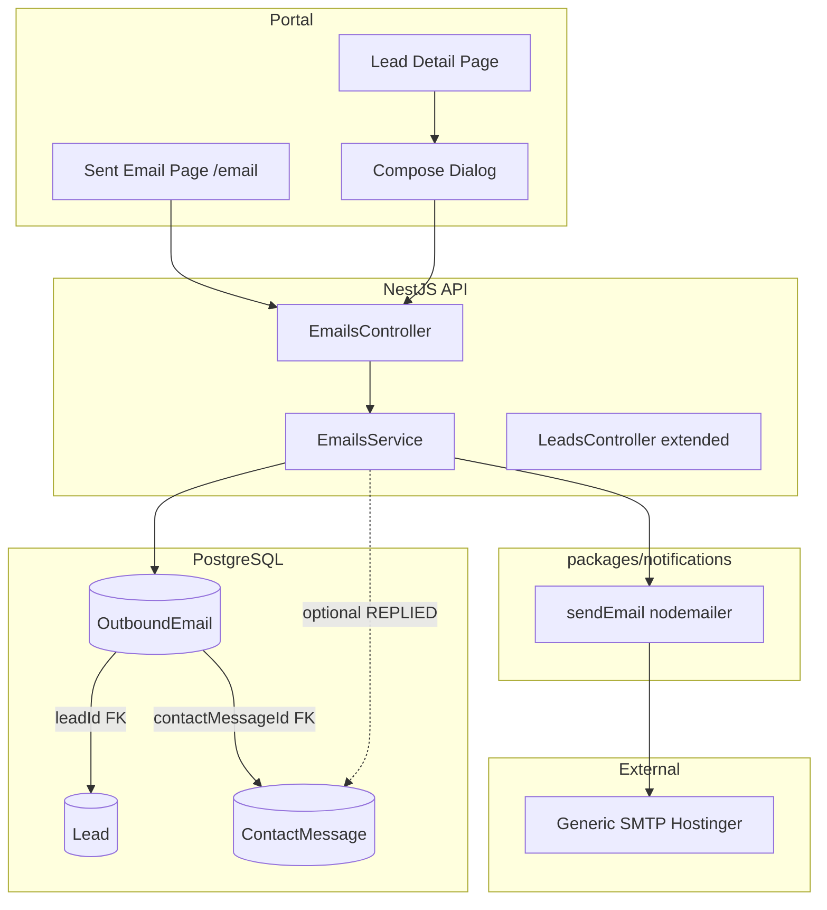
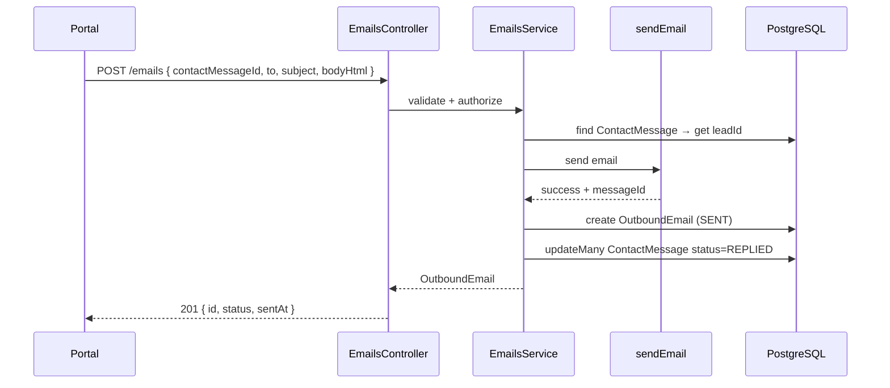
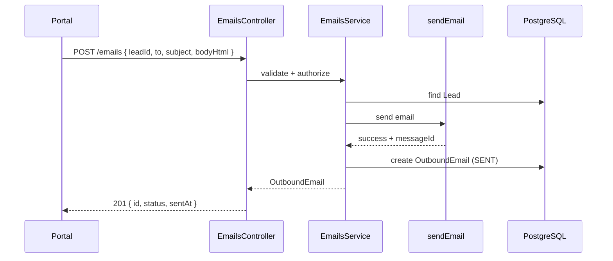

# MEDCAL — Email → Lead Management
# FINAL IMPLEMENTATION PLAN

**Tanggal:** 20 Agustus 2026  
**Status:** PLAN ONLY — belum implementasi  
**Scope:** Minimal Outbound-Only + Generic SMTP  
**Baseline:** `docs/cursor/plan/email-managements/forensic-audit-email-lead-management.md`

---

## 1. Final Architecture



**Prinsip arsitektur:**
- `OutboundEmail` = satu-satunya persistence untuk email terkirim
- `ContactMessage` = **tetap** inbound intake; tidak diubah menjadi outbound record
- `sendEmail()` di `packages/notifications` = **satu-satunya** SMTP boundary
- Tidak ada model `EmailThread`, `EmailMessage`, atau `Inbox`

---

## 2. Architecture Decisions + Rationale

### Decision A: DRAFT Status — REMOVED

**Keputusan:** Tidak menggunakan status `DRAFT` pada fase ini.

**Alasan:**
- Draft UI/mailbox eksplisit **out of scope**
- Tanpa draft UI, status DRAFT hanya menambah kompleksitas tanpa nilai
- Enum final: `SENT` | `FAILED`
- Jika draft diperlukan di masa depan, tambahkan via migration baru

**Konsekuensi:**
- `POST /emails` langsung mengirim — tidak ada "save draft"
- UI harus konfirmasi sebelum send (tidak bisa undo)

---

### Decision B: contactMessageId on OutboundEmail — INCLUDED

**Keputusan:** `OutboundEmail.contactMessageId` adalah nullable FK ke `ContactMessage`.

**Alasan:**
- Memberikan provenance: "email ini adalah respons terhadap inquiry inbound mana"
- Memungkinkan thread correlation di masa depan
- Konsisten dengan `ChatSession.contactMessageId` pattern (relasi ke inbound intake)
- **Tidak menggabungkan** domain — ContactMessage tetap inbound, OutboundEmail tetap outbound

**Constraints:**
- **Tidak** @unique — satu ContactMessage bisa memiliki multiple reply
- Indexed untuk query history per ContactMessage
- `onDelete: SetNull` — jika ContactMessage dihapus, OutboundEmail tetap ada

---

### Decision C: Reply Endpoint — Single `POST /emails`

**Keputusan:** Tidak ada endpoint terpisah untuk reply. Gunakan `POST /emails` dengan optional `contactMessageId` dan `leadId` dalam body.

**Alasan:**
- Tidak ada inbound `Email` entity untuk `POST /emails/:id/reply`
- "Reply" pada dasarnya = "compose dengan context" — endpoint sama, payload berbeda
- `POST /contact-messages/:id/reply` melanggar domain ownership — ContactMessage adalah **inbound** domain, bukan tempat untuk operasi **outbound**
- Satu endpoint lebih sederhana, konsisten dengan REST resource creation pattern

**API contract:**
```typescript
POST /emails
{
  to: string;               // required
  cc?: string[];
  bcc?: string[];
  subject: string;          // required
  bodyHtml: string;         // required
  leadId?: string;          // optional association
  contactMessageId?: string; // optional — indicates this is a reply
}
```

**Behavior:**
- Jika `contactMessageId` disediakan: resolve `leadId` dari ContactMessage jika tidak supplied, prefill context untuk reply
- Jika `leadId` saja: compose baru untuk lead tersebut
- Jika keduanya kosong: standalone email (jika diizinkan oleh business rules — see Flow C)

---

### Decision D: ContactMessage.REPLIED Semantics — Conditional Update

**Keputusan:** Update `ContactMessage.status = REPLIED` **hanya** ketika semua kondisi terpenuhi:

1. `OutboundEmail` berhasil terkirim (`status = SENT`)
2. `OutboundEmail.contactMessageId` merujuk ke ContactMessage tersebut
3. `ContactMessage.status` saat ini adalah `PENDING` atau `READ`
4. ContactMessage dan OutboundEmail memiliki `companyId` yang sama

**Alasan:**
- `REPLIED` adalah workflow state, bukan persistence email
- Hanya first successful reply yang mengubah status — subsequent replies tidak mengubah lagi
- Jika ContactMessage sudah `REPLIED` atau `CLOSED`, tidak diubah
- Ini **bukan** atomic transaction dengan SMTP — lihat Decision E

**Implementation:**
```typescript
// After SMTP success AND OutboundEmail persisted
if (outboundEmail.contactMessageId) {
  await prisma.contactMessage.updateMany({
    where: {
      id: outboundEmail.contactMessageId,
      companyId,
      status: { in: ["PENDING", "READ"] },
    },
    data: { status: "REPLIED" },
  });
}
```

---

### Decision E: Non-Atomic SMTP + Database Transaction

**Keputusan:** SMTP dan database persistence **tidak** atomic. Ini didokumentasikan secara eksplisit.

**Sequence:**
```
1. Validate request (400 if invalid)
2. Validate authorization (403 if denied)
3. Resolve Lead / ContactMessage (404 if not found)
4. Build email payload
5. Attempt SMTP delivery
   ├── SMTP fails → persist FAILED row → return 502 SMTP_DELIVERY_FAILED
   └── SMTP succeeds → continue
6. Persist SENT row
   ├── DB fails → LOG ERROR + return 500 EMAIL_PERSISTENCE_FAILED
   └── DB succeeds → continue
7. Update ContactMessage.REPLIED (best effort, non-blocking)
8. Return 201 with OutboundEmail record
```

**Edge case: SMTP succeeds but DB fails:**

| Aspect | Behavior |
|--------|----------|
| Email delivery | **Email WAS sent** — recipient received it |
| Database | **No OutboundEmail row** — lost from system view |
| Client response | **500 Internal Server Error** with `code: EMAIL_PERSISTENCE_FAILED` |
| Logging | **ERROR level log** with SMTP messageId for manual reconciliation |
| Recovery | Manual — no automatic retry |

**Rationale:**
- True two-phase commit dengan SMTP tidak praktis
- "Send first, persist second" lebih baik daripada sebaliknya (email terkirim lebih penting daripada record)
- Error harus logged dengan detail untuk operational audit
- Client mengetahui bahwa sesuatu gagal — tidak silent failure

---

### Decision F: Permission Model — Simplified

**Keputusan:** Dua permission saja untuk MVP:

| Permission | Aksi |
|------------|------|
| `email:read` | View sent list, view detail, view lead email history |
| `email:send` | Compose, send, reply |

**Alasan:**
- Tanpa draft, `email:compose` dan `email:reply` tidak berbeda dari `email:send`
- Mengikuti preceden: `chat:reply` exists karena chat memiliki read-only subscribe vs active reply distinction
- Email MVP: jika bisa send, bisa compose dan reply — satu capability
- Dua permissions sudah cukup: read vs write

**Role grants (mirror chat/lead):**

| Role | email:read | email:send |
|------|------------|------------|
| SUPERADMIN | ✓ | ✓ |
| ADMIN | ✓ | ✓ |
| SUPERVISOR | — | — |
| TECHNICIAN | — | — |
| FINANCE | — | — |
| CUSTOMER | — | — |

---

### Decision G: Lead Context Required for MVP

**Keputusan:** Untuk MVP, **email harus memiliki `leadId`**. Standalone email tanpa lead tidak diizinkan.

**Alasan:**
- Scope adalah "Email → Lead Management" — integrasi dengan lead adalah fitur utama
- Mencegah email orphan yang sulit di-track
- Jika ingin standalone email di masa depan, relax constraint via migration
- UI compose selalu dari konteks Lead — tidak ada global compose

**Consequence:**
- `OutboundEmail.leadId` adalah **required** (NOT NULL)
- `POST /emails` harus include `leadId` atau `contactMessageId` (yang di-resolve ke leadId)
- Validation error jika keduanya absent

---

## 3. Final Prisma Schema Proposal

```prisma
// packages/db/prisma/schema.prisma — addition

enum OutboundEmailStatus {
  SENT
  FAILED
}

model OutboundEmail {
  id                String              @id @default(cuid())
  companyId         String
  leadId            String              // Required — Decision G
  contactMessageId  String?             // Optional — reply context
  sentByUserId      String
  status            OutboundEmailStatus
  fromAddress       String
  toAddresses       String[]            // PostgreSQL array — simple denormalized
  ccAddresses       String[]            @default([])
  bccAddresses      String[]            @default([])
  subject           String
  bodyHtml          String              @db.Text
  bodyText          String?             @db.Text
  inReplyTo         String?             // RFC Message-ID of previous email
  messageId         String?             // Our Message-ID header
  providerMessageId String?             // SMTP response identifier
  errorMessage      String?             // Populated if status=FAILED
  sentAt            DateTime?           // Populated if status=SENT
  createdAt         DateTime            @default(now())
  updatedAt         DateTime            @updatedAt

  company        Company         @relation(fields: [companyId], references: [id], onDelete: Cascade)
  lead           Lead            @relation(fields: [leadId], references: [id], onDelete: Cascade)
  contactMessage ContactMessage? @relation(fields: [contactMessageId], references: [id], onDelete: SetNull)
  sentBy         User            @relation("OutboundEmailSender", fields: [sentByUserId], references: [id])

  @@index([companyId, status])
  @@index([companyId, leadId])
  @@index([companyId, contactMessageId])
  @@index([companyId, createdAt])
  @@index([sentByUserId])
}

// Add relation arrays to existing models:

model Lead {
  // ... existing fields ...
  outboundEmails OutboundEmail[]
}

model ContactMessage {
  // ... existing fields ...
  outboundEmails OutboundEmail[]
}

model User {
  // ... existing fields ...
  outboundEmailsSent OutboundEmail[] @relation("OutboundEmailSender")
}

model Company {
  // ... existing fields ...
  outboundEmails OutboundEmail[]
}
```

**Field decisions:**

| Field | Type | Required | Rationale |
|-------|------|----------|-----------|
| `companyId` | String | Yes | Tenant scoping — consistent with all business entities |
| `leadId` | String | Yes | Decision G — MVP requires lead context |
| `contactMessageId` | String? | No | Reply context — null for fresh compose |
| `sentByUserId` | String | Yes | Audit trail — who sent this |
| `status` | Enum | Yes | SENT or FAILED |
| `fromAddress` | String | Yes | Sender display (may differ from SMTP_FROM) |
| `toAddresses` | String[] | Yes | PostgreSQL array — simple, no join table for MVP |
| `ccAddresses` | String[] | Yes (default []) | Optional recipients |
| `bccAddresses` | String[] | Yes (default []) | Optional hidden recipients |
| `subject` | String | Yes | Email subject line |
| `bodyHtml` | String @db.Text | Yes | Full HTML body |
| `bodyText` | String? @db.Text | No | Plain text fallback (auto-generated or omitted) |
| `inReplyTo` | String? | No | Threading — Message-ID of email being replied to |
| `messageId` | String? | No | Our Message-ID (generated on send) |
| `providerMessageId` | String? | No | SMTP server response ID |
| `errorMessage` | String? | No | Error detail if FAILED |
| `sentAt` | DateTime? | No | Timestamp of successful send |

**Delete behavior:**
- `onDelete: Cascade` for `companyId` — delete company deletes all emails
- `onDelete: Cascade` for `leadId` — delete lead deletes associated emails
- `onDelete: SetNull` for `contactMessageId` — preserve email if ContactMessage deleted

---

## 4. Final API Contract

### 4.1 `GET /emails/sent`

**Purpose:** List sent emails (paginated).

**Permission:** `email:read`

**Request:**
```
GET /emails/sent?page=1&pageSize=10&leadId=xxx&search=keyword&sortBy=createdAt&sortDir=desc
```

| Param | Type | Required | Description |
|-------|------|----------|-------------|
| page | number | No (default 1) | Page number |
| pageSize | number | No (default 10, max 100) | Items per page |
| leadId | string | No | Filter by lead |
| search | string | No | Search subject/toAddresses |
| sortBy | string | No (default createdAt) | Sort field |
| sortDir | asc\|desc | No (default desc) | Sort direction |

**Response (200):**
```typescript
{
  data: OutboundEmailListRow[];
  page: number;
  pageSize: number;
  total: number;
  totalPages: number;
}

interface OutboundEmailListRow {
  id: string;
  status: "SENT" | "FAILED";
  toAddresses: string[];
  subject: string;
  sentAt: string | null;
  createdAt: string;
  lead: { id: string; name: string } | null;
  sentBy: { id: string; name: string | null };
}
```

**Errors:**
- 400 `INVALID_EMAIL_QUERY` — invalid query params
- 401 — no session
- 403 — no email:read permission

---

### 4.2 `GET /emails/:id`

**Purpose:** Get email detail.

**Permission:** `email:read`

**Response (200):**
```typescript
{
  id: string;
  status: "SENT" | "FAILED";
  fromAddress: string;
  toAddresses: string[];
  ccAddresses: string[];
  bccAddresses: string[];
  subject: string;
  bodyHtml: string;
  bodyText: string | null;
  messageId: string | null;
  inReplyTo: string | null;
  errorMessage: string | null;
  sentAt: string | null;
  createdAt: string;
  lead: { id: string; name: string; email: string };
  contactMessage: { id: string; subject: string | null } | null;
  sentBy: { id: string; name: string | null; email: string };
}
```

**Errors:**
- 401 — no session
- 403 — no email:read permission
- 404 `EMAIL_NOT_FOUND` — email not found or wrong tenant

---

### 4.3 `POST /emails`

**Purpose:** Compose and send email.

**Permission:** `email:send`

**Request:**
```typescript
{
  leadId?: string;           // Required unless contactMessageId provided
  contactMessageId?: string; // Optional — reply context
  to: string;                // Primary recipient
  cc?: string[];             // CC recipients
  bcc?: string[];            // BCC recipients
  subject: string;           // Email subject
  bodyHtml: string;          // HTML body (max 256KB)
}
```

**Validation:**
- `to`: valid email format, required
- `cc`, `bcc`: array of valid emails, optional
- `subject`: non-empty, max 500 chars
- `bodyHtml`: non-empty, max 256KB
- Either `leadId` or `contactMessageId` must be provided
- If `contactMessageId` provided without `leadId`, resolve from ContactMessage.leadId

**Response (201):**
```typescript
{
  id: string;
  status: "SENT";
  messageId: string | null;
  sentAt: string;
}
```

**Errors:**
- 400 `INVALID_EMAIL_PAYLOAD` — validation failed
- 400 `LEAD_REQUIRED` — neither leadId nor contactMessageId provided
- 401 — no session
- 403 — no email:send permission
- 404 `LEAD_NOT_FOUND` — leadId invalid or wrong tenant
- 404 `CONTACT_MESSAGE_NOT_FOUND` — contactMessageId invalid or wrong tenant
- 502 `SMTP_DELIVERY_FAILED` — SMTP error (email saved as FAILED)
- 503 `EMAIL_NOT_CONFIGURED` — SMTP env vars not set

---

### 4.4 `GET /leads/:id/emails`

**Purpose:** Get email history for a lead.

**Permission:** `lead:read` (existing)

**Controller:** Add to existing `LeadsController`

**Response (200):**
```typescript
{
  data: OutboundEmailListRow[];
  // No pagination for MVP — leads typically have few emails
}
```

**Errors:**
- 401 — no session
- 403 — no lead:read permission
- 404 `LEAD_NOT_FOUND` — lead not found or wrong tenant

---

## 5. Final Permission Matrix

### Permission Catalog Addition

```typescript
// packages/auth/src/access-control.ts

const ac = createAccessControl({
  // ... existing ...
  email: ["read", "send"],  // NEW
} as const);
```

### Role Grants

```typescript
const roleStatements = {
  SUPERADMIN: ac.newRole({
    // ... existing ...
    email: ["read", "send"],  // NEW
  }),
  ADMIN: ac.newRole({
    // ... existing ...
    email: ["read", "send"],  // NEW
  }),
  // Other roles: no email permissions
};
```

### Permission → Action Mapping

| Action | Permission | Backend | Frontend |
|--------|------------|---------|----------|
| View sent list | `email:read` | `GET /emails/sent` | `/email` page visible |
| View email detail | `email:read` | `GET /emails/:id` | Detail view accessible |
| View lead email history | `lead:read` | `GET /leads/:id/emails` | History section visible |
| Compose/send | `email:send` | `POST /emails` | Compose dialog enabled |
| Reply from lead | `email:send` | `POST /emails` | Reply button enabled |
| Menu visibility | `email:read` | Menu nav filter | Sidebar item visible |

---

## 6. Menu Registry Changes

### Seed Update

```typescript
// packages/db/prisma/seed-menu.ts

{
  application: "MANAGEMENT",
  code: "leads.email",
  parentCode: "leads",
  label: "Email",
  href: "/email",
  icon: "email",
  order: 2,
  isActive: true,           // CHANGE: false → true
  viewResource: "email",    // CHANGE: "lead" → "email"
  viewAction: "read",
}
```

### Me Controller Capability

```typescript
// apps/api/src/modules/me/me.controller.ts

const capabilities = {
  leadRead: hasPermission(membership.role, "lead", "read"),
  chatRead: hasPermission(membership.role, "chat", "read"),
  emailRead: hasPermission(membership.role, "email", "read"),  // NEW
  emailSend: hasPermission(membership.role, "email", "send"),  // NEW
};
```

---

## 7. Lead Integration Flow

### Flow A — Reply to ContactMessage



**Input derivation:**
- `leadId`: resolved from `ContactMessage.leadId`
- `to`: provided by UI (default = ContactMessage.email)
- `subject`: provided by UI (default = `Re: ${ContactMessage.subject}`)
- `inReplyTo`: if ContactMessage has associated previous OutboundEmail.messageId

**ContactMessage.REPLIED:**
- Only if ContactMessage.status is PENDING or READ
- Best effort — failure doesn't fail the send

---

### Flow B — Compose from Lead



**Input derivation:**
- `leadId`: provided explicitly
- `to`: provided by UI (default = Lead.email)
- `subject`: provided by UI (no default)
- `contactMessageId`: null (not a reply)

**ContactMessage.REPLIED:** Not applicable — no ContactMessage associated.

---

### Flow C — Unknown Recipient

**Not supported in MVP.**

`POST /emails` requires either `leadId` or `contactMessageId`.

If neither provided: 400 `LEAD_REQUIRED`.

Rationale: This is "Email → Lead Management" — lead context is required.

---

## 8. SMTP / Provider Design

### Dependency Location

```
packages/notifications/
├── package.json        # add nodemailer dependency
└── src/
    └── email/
        └── index.ts    # implement sendEmail with nodemailer
```

### Implementation

```typescript
// packages/notifications/src/email/index.ts

import nodemailer from "nodemailer";
import type { Transporter } from "nodemailer";
import type SMTPTransport from "nodemailer/lib/smtp-transport";

export interface SendEmailInput {
  to: string;
  cc?: string[];
  bcc?: string[];
  subject: string;
  html: string;
  text?: string;
  replyTo?: string;
  inReplyTo?: string;      // Message-ID header
  references?: string;     // References header
}

export interface SendEmailResult {
  messageId: string;       // Generated Message-ID
  accepted: string[];      // Recipients that accepted
  rejected: string[];      // Recipients that rejected
}

export class EmailNotConfiguredError extends Error {
  code = "EMAIL_NOT_CONFIGURED";
  constructor() {
    super("SMTP configuration is not set");
  }
}

export class EmailDeliveryError extends Error {
  code = "SMTP_DELIVERY_FAILED";
  constructor(public readonly cause: unknown) {
    super("Failed to deliver email via SMTP");
  }
}

let transporter: Transporter<SMTPTransport.SentMessageInfo> | null = null;

function getTransporter(): Transporter<SMTPTransport.SentMessageInfo> {
  if (transporter) return transporter;

  const host = process.env.SMTP_HOST;
  const port = process.env.SMTP_PORT;
  const user = process.env.SMTP_USER;
  const pass = process.env.SMTP_PASS;

  if (!host || !port || !user || !pass) {
    throw new EmailNotConfiguredError();
  }

  transporter = nodemailer.createTransport({
    host,
    port: parseInt(port, 10),
    secure: process.env.SMTP_SECURE === "true",
    auth: { user, pass },
    connectionTimeout: 10000, // 10s
    greetingTimeout: 5000,    // 5s
    socketTimeout: 30000,     // 30s
  });

  return transporter;
}

export async function sendEmail(input: SendEmailInput): Promise<SendEmailResult> {
  const transport = getTransporter();
  const from = process.env.SMTP_FROM ?? process.env.SMTP_USER;

  try {
    const result = await transport.sendMail({
      from,
      to: input.to,
      cc: input.cc?.join(", "),
      bcc: input.bcc?.join(", "),
      subject: input.subject,
      html: input.html,
      text: input.text,
      replyTo: input.replyTo,
      inReplyTo: input.inReplyTo,
      references: input.references,
    });

    return {
      messageId: result.messageId,
      accepted: (result.accepted ?? []).map(String),
      rejected: (result.rejected ?? []).map(String),
    };
  } catch (err) {
    throw new EmailDeliveryError(err);
  }
}

// For testing — verify SMTP connection without sending
export async function verifySmtpConnection(): Promise<boolean> {
  try {
    const transport = getTransporter();
    await transport.verify();
    return true;
  } catch {
    return false;
  }
}
```

### Environment Variables

```bash
# .env.example — additions

# SMTP Configuration (optional — email features disabled if not set)
SMTP_HOST=
SMTP_PORT=587
SMTP_SECURE=false
SMTP_USER=
SMTP_PASS=
SMTP_FROM="MedCal <noreply@kalibrasimedika.co.id>"
```

### Config Schema Extension

```typescript
// packages/config/src/index.ts — extend envSchema

export const envSchema = z.object({
  // ... existing fields ...

  // SMTP (optional — email disabled if not configured)
  SMTP_HOST: z.string().optional(),
  SMTP_PORT: z.coerce.number().optional(),
  SMTP_SECURE: z.enum(["true", "false"]).optional(),
  SMTP_USER: z.string().optional(),
  SMTP_PASS: z.string().optional(),
  SMTP_FROM: z.string().optional(),
});
```

### Design Decisions

| Aspect | Decision |
|--------|----------|
| Nodemailer location | `packages/notifications` — existing email boundary |
| Transport creation | Lazy singleton — created on first send |
| Message-ID | Generated by nodemailer (standard compliant) |
| Connection timeout | 10s connection, 30s socket |
| Error normalization | `EmailNotConfiguredError`, `EmailDeliveryError` — domain errors |
| Logging | Do NOT log email body in production (PII) |
| Credential handling | Via env vars only — never hardcoded |

---

## 9. Portal UI Plan

### 9.1 Sent Email Page (`/email`)

**Route:** `apps/portal/src/app/management/email/page.tsx`

**Components:**
- `email-page-client.tsx` — orchestrator with React Query
- `email-ui.tsx` — UI components (Surface, table, filters, pagination)

**UI Elements:**

| Element | Description |
|---------|-------------|
| Page title | "Email Terkirim" (NOT "Inbox") |
| Info banner | "Halaman ini menampilkan email yang dikirim dari MedCal. Inbox provider belum tersinkronisasi." |
| Filter | Search (subject/to), Lead filter (optional) |
| Table columns | Status indicator, To, Subject, Sent At, Lead link, Sender |
| Mobile view | Card list (same pattern as leads-page-client) |
| Pagination | Standard PaginationBar |
| Empty state | "Belum ada email terkirim" |
| Error state | Standard error with retry |
| Loading state | Skeleton rows |

**Interactions:**
- Click row → detail view (drawer or page TBD, prefer inline drawer for MVP)
- Click Lead link → navigate to lead detail

### 9.2 Email Detail View

**Location:** Drawer/modal from sent list, OR inline section

**Content:**
- From, To, CC (if any), BCC (if any)
- Subject
- Sent timestamp
- Status badge (SENT/FAILED)
- Error message (if FAILED)
- Body (sanitized HTML)
- Link to Lead
- Link to ContactMessage (if reply)

### 9.3 Lead Detail Integration

**File:** `apps/portal/src/app/management/leads/[id]/page.tsx`

**Changes:**

1. **Replace mailto link:**
   - Current: `<a href="mailto:${lead.email}">Reply via Email</a>`
   - New: Button that opens ComposeEmailDialog (permission-gated by `emailSend`)

2. **Add Email History section:**
   - New section after ContactMessage timeline
   - Fetch `GET /leads/:id/emails`
   - List OutboundEmails with status, subject, sentAt
   - Empty state: "Belum ada email terkirim untuk lead ini"

3. **Compose action button:**
   - "Kirim Email" button in action area
   - Permission: `emailSend` capability
   - Opens ComposeEmailDialog with lead context

### 9.4 Compose Email Dialog

**Component:** `apps/portal/src/components/management/email/compose-email-dialog.tsx`

**Props:**
```typescript
interface ComposeEmailDialogProps {
  open: boolean;
  onOpenChange: (open: boolean) => void;
  leadId: string;
  leadEmail: string;
  leadName: string;
  contactMessageId?: string;  // For reply context
  defaultSubject?: string;    // Prefilled for reply
}
```

**Fields:**
- To: input, prefilled with lead.email, editable
- Subject: input, prefilled for reply with "Re: ..."
- Body: textarea (plain HTML, no rich editor for MVP)

**Actions:**
- Send: POST /emails → success toast → close dialog → refetch history
- Cancel: close dialog, discard content

**States:**
- Loading: disable form, show spinner on Send
- Error: display inline error message
- Success: close + toast notification

**No CC/BCC UI for MVP** — backend supports it but UI hidden for simplicity.

### 9.5 Header Controls Update

**File:** `apps/portal/src/components/management/header-controls.tsx`

**Change:** `EmailControl` from disabled span to conditional Link

```typescript
function EmailControl({ emailRead }: { emailRead: boolean }) {
  if (!emailRead) {
    return (
      <span className={`${iconButton} cursor-not-allowed opacity-40`} aria-disabled="true">
        <EmailIcon className="h-5 w-5" />
      </span>
    );
  }
  return (
    <Link href="/email" className={iconButton} title="Email Terkirim">
      <EmailIcon className="h-5 w-5" />
    </Link>
  );
}
```

### 9.6 Dashboard Tile Update

**File:** `apps/portal/src/app/management/page.tsx`

**Change:** Enable Email tile (currently "Segera hadir")

- Permission-gated: show only if `emailRead`
- Link to `/email`
- Label: "Email"

---

## 10. Security Plan

### HTML Sanitization

**Location:** Portal display layer

**Library:** `isomorphic-dompurify` or `sanitize-html`

**Rules:**
- Strip all `<script>`, `<iframe>`, `<object>`, `<embed>`, `<form>`
- Strip `on*` event handlers
- Strip `javascript:` URLs
- Allow safe formatting: `<p>`, `<br>`, `<b>`, `<i>`, `<u>`, `<a>` (with href validation), `<ul>`, `<ol>`, `<li>`

**Implementation:**
```typescript
// apps/portal/src/lib/sanitize-html.ts
import DOMPurify from "isomorphic-dompurify";

export function sanitizeEmailHtml(html: string): string {
  return DOMPurify.sanitize(html, {
    ALLOWED_TAGS: ["p", "br", "b", "i", "u", "a", "ul", "ol", "li", "div", "span"],
    ALLOWED_ATTR: ["href", "target", "rel"],
    ALLOW_DATA_ATTR: false,
  });
}
```

### Input Validation

| Field | Validation |
|-------|------------|
| `to`, `cc[]`, `bcc[]` | Email format (Zod `.email()`) |
| `subject` | Max 500 chars, non-empty |
| `bodyHtml` | Max 256KB |
| `leadId` | cuid format, tenant-scoped lookup |
| `contactMessageId` | cuid format, tenant-scoped lookup |

### Authorization

- All endpoints behind `CompanyRoleGuard`
- All queries scoped by `companyId` from guard
- No cross-company access possible
- No hardcoded role checks in controllers

### Logging Rules

| Event | Log Level | Include |
|-------|-----------|---------|
| Email sent success | INFO | emailId, leadId, to, subject (first 50 chars), messageId |
| Email send failure | WARN | emailId, leadId, to, error type (NOT credentials) |
| DB persistence failure | ERROR | emailId, leadId, messageId, error message |
| Authorization denied | WARN | userId, resource, action |

**NEVER log:** bodyHtml, bodyText, SMTP credentials, full subject if sensitive

---

## 11. Error Handling

### Error Codes

| Code | HTTP | Condition |
|------|------|-----------|
| `INVALID_EMAIL_PAYLOAD` | 400 | Zod validation failed |
| `INVALID_EMAIL_QUERY` | 400 | Query params validation failed |
| `LEAD_REQUIRED` | 400 | Neither leadId nor contactMessageId provided |
| `LEAD_NOT_FOUND` | 404 | Lead doesn't exist or wrong tenant |
| `CONTACT_MESSAGE_NOT_FOUND` | 404 | ContactMessage doesn't exist or wrong tenant |
| `EMAIL_NOT_FOUND` | 404 | OutboundEmail doesn't exist or wrong tenant |
| `SMTP_DELIVERY_FAILED` | 502 | SMTP send failed (network, auth, recipient rejected) |
| `EMAIL_NOT_CONFIGURED` | 503 | SMTP env vars not set |
| `EMAIL_PERSISTENCE_FAILED` | 500 | DB write failed after SMTP success |

### Error Response Format

```typescript
// Consistent with existing medcal conventions
{
  message: string;  // Human-readable
  code: string;     // Machine-readable
  issues?: { formErrors: string[], fieldErrors: Record<string, string[]> };  // Zod errors only
}
```

### SMTP Error Handling

**Do NOT expose:**
- SMTP credentials
- Internal SMTP server errors
- Stack traces

**Return:**
```json
{
  "message": "Failed to deliver email",
  "code": "SMTP_DELIVERY_FAILED"
}
```

**Log internally:** full error for debugging

---

## 12. Test Plan

### 12.1 Permission Tests

| Test | Expected |
|------|----------|
| GET /emails/sent without email:read | 403 |
| GET /emails/sent with email:read | 200 + data |
| GET /emails/:id without email:read | 403 |
| POST /emails without email:send | 403 |
| POST /emails with email:send | 201 (if SMTP ok) |
| GET /leads/:id/emails without lead:read | 403 |
| GET /leads/:id/emails with lead:read | 200 |

### 12.2 SMTP Tests

| Test | Setup | Expected |
|------|-------|----------|
| SMTP not configured | No env vars | 503 EMAIL_NOT_CONFIGURED |
| SMTP auth failure | Invalid credentials | 502 SMTP_DELIVERY_FAILED, FAILED row |
| SMTP connection failure | Invalid host | 502 SMTP_DELIVERY_FAILED, FAILED row |
| SMTP success | Valid config | 201, SENT row, messageId |
| SMTP success + DB fail | Mock DB error | 500, log error, email WAS sent |

### 12.3 Persistence Tests

| Test | Expected |
|------|----------|
| Send success | OutboundEmail row with status=SENT, sentAt set |
| Send failure | OutboundEmail row with status=FAILED, errorMessage set |
| MessageId stored | messageId from SMTP response |
| Lead association | leadId FK correct |
| ContactMessage association | contactMessageId FK correct (for reply) |
| ContactMessage.REPLIED | Status updated if PENDING/READ |

### 12.4 Lead Integration Tests

| Test | Expected |
|------|----------|
| Reply from ContactMessage | leadId resolved, contactMessageId set |
| Compose from Lead | leadId set, contactMessageId null |
| Invalid leadId | 404 LEAD_NOT_FOUND |
| leadId from wrong company | 404 LEAD_NOT_FOUND |
| No leadId or contactMessageId | 400 LEAD_REQUIRED |
| Get lead email history | Returns OutboundEmail[] for that lead |

### 12.5 Security Tests

| Test | Expected |
|------|----------|
| Access email from other company | 404 (tenant scoped) |
| XSS in bodyHtml display | Sanitized, no script execution |
| Invalid email format | 400 validation error |
| Oversized bodyHtml | 400 validation error |

### 12.6 Frontend Tests

| Test | Expected |
|------|----------|
| Menu visible with email:read | Sidebar shows Email |
| Menu hidden without email:read | Sidebar hides Email |
| /email page without permission | AccessDenied |
| Compose dialog opens | Form displayed |
| Send success | Dialog closes, toast, list refreshes |
| Send failure | Inline error message |
| Pagination works | Page navigation, correct data |

---

## 13. Migration / Deployment Plan

### 13.1 Prisma Migration

**Command:**
```bash
pnpm --filter @medcal/db prisma migrate dev --name add_outbound_email
```

**Migration characteristics:**
- Additive only — no existing table modifications (except adding relation arrays)
- No data migration required
- Non-destructive
- Safe to run on production

### 13.2 Deployment Order

```
1. Deploy packages/notifications (with nodemailer, but SMTP env not set)
   → Application boots normally, email:send returns 503

2. Deploy packages/config (with optional SMTP schema)
   → No behavior change

3. Deploy packages/db (migration)
   → OutboundEmail table created

4. Deploy packages/auth (permission catalog)
   → email:read, email:send available

5. Deploy apps/api (EmailsModule + controller + service)
   → Endpoints available, return 503 without SMTP config

6. Deploy apps/portal (UI components)
   → Menu visible (if seeded), pages work but send returns 503

7. Run seed-menu (or admin manually activates menu)
   → Email menu appears

8. Set SMTP env vars in production
   → Email fully functional
```

### 13.3 Rollback Considerations

| Scenario | Rollback |
|----------|----------|
| Migration fails | Prisma auto-rollback |
| API deployment breaks | Revert to previous API version |
| SMTP misconfigured | Unset SMTP env → graceful 503 |
| Permission catalog error | Revert access-control.ts |

**Data safety:** OutboundEmail table is new — no existing data at risk.

### 13.4 SMTP Absent-Safe Behavior

If SMTP env vars not set:
- Application boots normally
- Email menu may be visible (if seeded)
- `POST /emails` returns 503 `EMAIL_NOT_CONFIGURED`
- `GET /emails/*` works normally (returns empty data)
- All other features unaffected

---

## 14. Files Expected to Change

### New Files

```
packages/db/prisma/migrations/YYYYMMDD_add_outbound_email/migration.sql
apps/api/src/modules/emails/emails.module.ts
apps/api/src/modules/emails/emails.controller.ts
apps/api/src/modules/emails/emails.service.ts
apps/api/src/modules/emails/emails.service.test.ts
apps/portal/src/app/management/email/page.tsx
apps/portal/src/app/management/email/email-page-client.tsx
apps/portal/src/app/management/email/email-ui.tsx
apps/portal/src/components/management/email/compose-email-dialog.tsx
apps/portal/src/lib/sanitize-html.ts
```

### Modified Files

```
packages/notifications/package.json                    # add nodemailer
packages/notifications/src/email/index.ts              # implement sendEmail
packages/config/src/index.ts                           # SMTP env schema
packages/db/prisma/schema.prisma                       # OutboundEmail model + relations
packages/auth/src/access-control.ts                    # email:read, email:send
packages/shared/src/schemas/index.ts                   # email schemas
packages/db/prisma/seed-menu.ts                        # activate leads.email
apps/api/src/app.module.ts                             # import EmailsModule
apps/api/src/modules/me/me.controller.ts               # emailRead, emailSend capabilities
apps/api/src/modules/leads/leads.controller.ts         # GET /leads/:id/emails endpoint
apps/portal/src/app/management/leads/[id]/page.tsx     # email history + compose
apps/portal/src/components/management/header-controls.tsx  # EmailControl
apps/portal/src/app/management/page.tsx                # enable email tile
.env.example                                           # SMTP vars
.env.production.example                                # SMTP vars
```

---

## 15. Explicitly Out-of-Scope

| Item | Reason |
|------|--------|
| Inbound IMAP/POP3 sync | No infrastructure |
| Inbound webhook (Mailgun/SendGrid) | No infrastructure |
| True Inbox (provider mailbox) | No inbound |
| Draft status / Draft UI | MVP — no draft workflow |
| Trash / Restore | MVP — no mailbox management |
| Attachments | File storage not wired for email |
| Rich text editor (TipTap) | MVP — textarea only |
| Starred emails | MVP — no advanced organization |
| Forward | MVP |
| Reply-all | MVP |
| Full-text body search | MVP — subject/to only |
| Auto Lead creation from outbound | Violates business rules |
| Standalone email (no lead) | MVP — lead context required |
| Email scheduling | MVP |
| Email templates | MVP |
| Read receipts | MVP |

---

## 16. Risks and Mitigations

| Risk | Severity | Mitigation |
|------|----------|------------|
| SMTP credentials exposed | HIGH | Env vars only, never log credentials |
| XSS in email body | HIGH | Sanitize all HTML on display |
| SMTP success but DB fail | MEDIUM | Log with messageId for manual reconciliation |
| SMTP not configured in prod | LOW | Graceful 503, clear error message |
| Cross-tenant email access | HIGH | All queries scoped by companyId from guard |
| Large email body abuse | LOW | 256KB limit in validation |
| Send spam/abuse | MEDIUM | Permission-gated, audit trail via sentByUserId |
| Email in FAILED status orphaned | LOW | Visible in sent list, operational audit |
| Migration failure | LOW | Additive only, auto-rollback |
| Permission misconfiguration | MEDIUM | Follow existing catalog pattern exactly |

---

## 17. Implementation Order

### Phase 1: Foundation (Backend)

1. **packages/notifications** — implement `sendEmail` with nodemailer
2. **packages/config** — add SMTP env schema
3. **packages/db** — add `OutboundEmail` model + migration
4. **packages/auth** — add `email:read`, `email:send` to catalog + role grants
5. **packages/shared** — add email Zod schemas
6. **.env.example** — add SMTP variables

### Phase 2: API

1. **apps/api/src/modules/emails/** — EmailsModule, service, controller
2. **apps/api/src/modules/leads/** — add `GET /leads/:id/emails`
3. **apps/api/src/modules/me/** — add `emailRead`, `emailSend` capabilities
4. **apps/api/src/app.module.ts** — register EmailsModule

### Phase 3: Frontend

1. **apps/portal/src/lib/sanitize-html.ts** — HTML sanitizer
2. **apps/portal/src/app/management/email/** — sent list page
3. **apps/portal/src/components/management/email/** — ComposeEmailDialog
4. **apps/portal/src/app/management/leads/[id]/** — integrate email history + compose
5. **apps/portal/src/components/management/header-controls.tsx** — enable EmailControl
6. **apps/portal/src/app/management/page.tsx** — enable email tile

### Phase 4: Activation

1. **packages/db/prisma/seed-menu.ts** — update leads.email entry
2. Run `pnpm --filter @medcal/db run seed:menu`

### Phase 5: Validation

1. `pnpm lint`
2. `pnpm typecheck`
3. `pnpm build`
4. `pnpm test`
5. Manual testing per test plan

---

## PLAN VERDICT

**GREEN — Ready for implementation**

Semua keputusan arsitektur telah direkonsiliasi:

- DRAFT status removed (Decision A)
- contactMessageId included with clear semantics (Decision B)
- Single POST /emails endpoint (Decision C)
- ContactMessage.REPLIED update conditions defined (Decision D)
- Non-atomic SMTP+DB documented explicitly (Decision E)
- Permission simplified to read/send (Decision F)
- Lead context required (Decision G)

Tidak ada konflik arsitektur yang tersisa.

Implementasi dapat dimulai setelah plan ini direview dan disetujui.

---

*Document version: 1.0*  
*Status: PLAN ONLY — awaiting approval*
