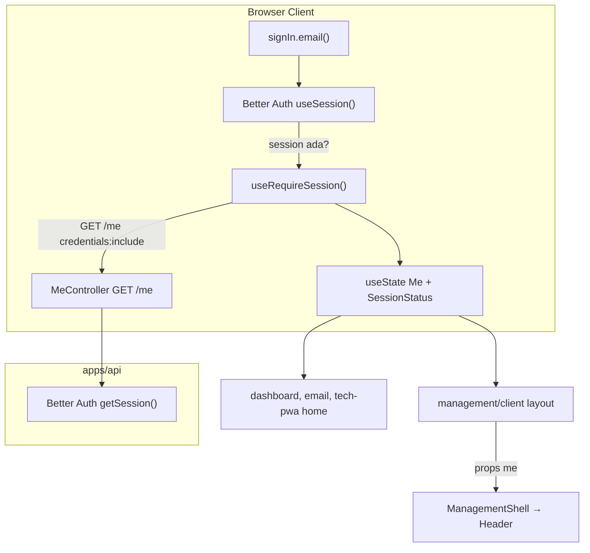
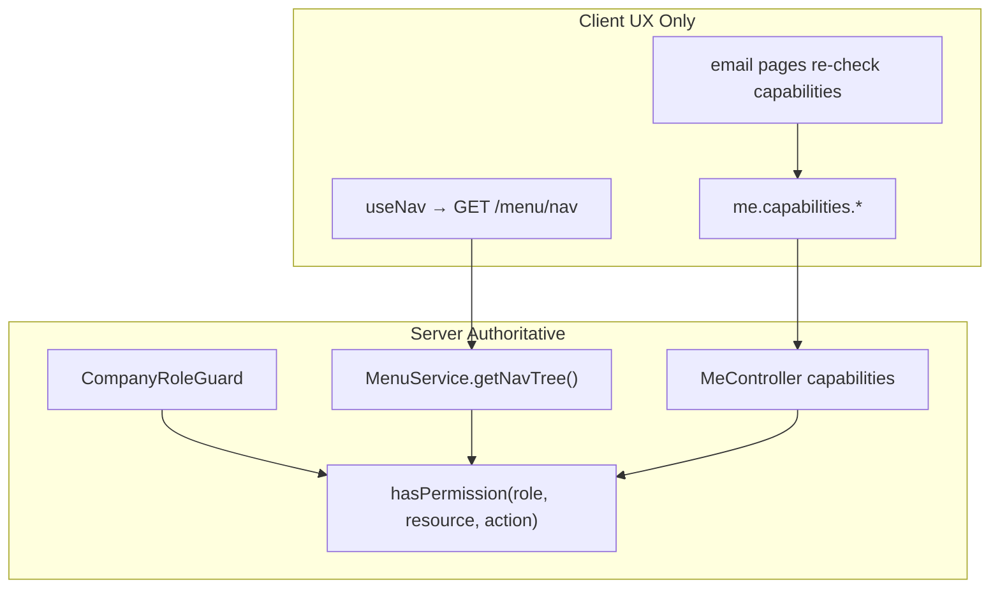
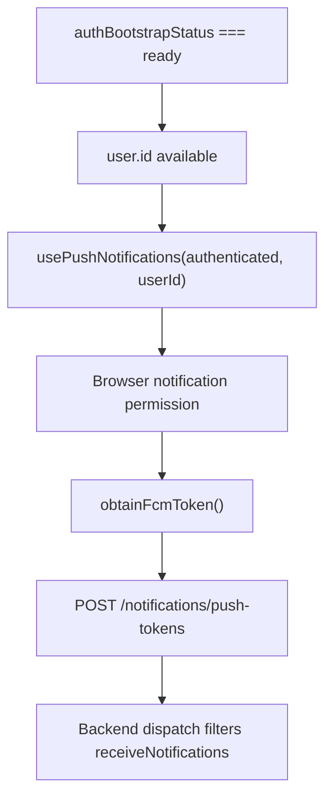

# Audit Global Auth & Authz State — Medcal

**Mode:** Audit only — tidak ada perubahan kode, dependency, schema, atau API.

**Catatan terminologi:** Dokumen prompt menyebut `isGetNotif`; di codebase field aktual adalah `UserMembership.receiveNotifications` ([`packages/db/prisma/schema.prisma`](packages/db/prisma/schema.prisma)). `isGetNotif` **tidak ditemukan** di kode produksi.

---

## A. Executive Summary

| Aspek                               | Kondisi Saat Ini                                                                                                                                                              |
| ----------------------------------- | ----------------------------------------------------------------------------------------------------------------------------------------------------------------------------- |
| **Auth**                            | Better Auth (cookie HTTP-only) + hook `useRequireSession` per-app yang fetch `GET /me`                                                                                        |
| **Authz**                           | Server-authoritative via `CompanyRoleGuard` + `hasPermission`; client hanya UX gate via `capabilities` + `/menu/nav`                                                          |
| **Global state**                    | **Tidak ada** — Zustand/Redux/Context auth kustom tidak dipakai                                                                                                               |
| **Masalah utama**                   | Fetch `/me` duplikat (layout + page), hook duplikat portal/tech-pwa, dua source of truth (`useSession` vs `Me` state)                                                         |
| **Apakah global state diperlukan?** | **Ya, minimal** — untuk bootstrap auth sekali + share `me`/status lintas komponen; bukan untuk menyimpan permissions penuh atau token                                         |
| **Rekomendasi arsitektur**          | Satu auth bootstrap layer shared (Context atau Zustand — lihat §11) di atas Better Auth; authz UX tetap lean (`capabilities` + nav server-filtered); enforcement tetap di API |

---

## B. Current Auth Architecture



**Flow aktual:**

1. **Login** — [`apps/portal/src/app/sign-in/page.tsx`](apps/portal/src/app/sign-in/page.tsx): `signIn.email()` → Better Auth set cookie → `useSession` trigger redirect.
2. **Session detection** — [`packages/auth/src/client.ts`](packages/auth/src/client.ts): `useSession()` dari Better Auth internal client store (bukan Context kustom).
3. **Bootstrap** — [`apps/portal/src/lib/use-require-session.ts`](apps/portal/src/lib/use-require-session.ts):
   - `isPending` dari Better Auth → tunggu
   - `!session` → redirect `/sign-in`
   - `GET /me` → set `me` + `status: ready`
   - `401` → redirect sign-in
   - `403 + code ACCOUNT_PENDING` → `status: pending` (portal only)
   - `403` lainnya → `status: forbidden`
4. **Logout** — [`apps/portal/src/components/sign-out-button.tsx`](apps/portal/src/components/sign-out-button.tsx): revoke FCM token → `signOut()` → redirect.
5. **Cookie** — [`packages/auth/src/index.ts`](packages/auth/src/index.ts): prod cross-subdomain (`.kalibrasimedika.co.id`); dev host-scoped ke API origin → auth gate **sengaja client-side** (komentar di hook).
6. **Tidak ada middleware auth** — [`apps/portal/src/proxy.ts`](apps/portal/src/proxy.ts) hanya hostname rewrite.

**Apps yang memakai Better Auth session:**

| App             | Auth hook                                                                                                                           | Catatan                    |
| --------------- | ----------------------------------------------------------------------------------------------------------------------------------- | -------------------------- |
| `apps/portal`   | `useRequireSession` + `capabilities` + `pending`                                                                                    | Layout management + client |
| `apps/tech-pwa` | `useRequireSession` (duplikat, tanpa capabilities/pending)                                                                          | Home page inline gate      |
| `apps/web`      | **Tidak** — visitor chat via signed cookie [`packages/shared/src/chat-session-token.ts`](packages/shared/src/chat-session-token.ts) | Di luar scope auth staff   |

---

## C. Current Authz Architecture



**Layer enforcement:**

| Layer              | File                                                                                                   | Mekanisme                                                   |
| ------------------ | ------------------------------------------------------------------------------------------------------ | ----------------------------------------------------------- |
| API guard          | [`apps/api/src/common/guards/company-role.guard.ts`](apps/api/src/common/guards/company-role.guard.ts) | Session + ACTIVE membership + optional `@RequirePermission` |
| Permission catalog | [`packages/auth/src/access-control.ts`](packages/auth/src/access-control.ts)                           | DB `RolePermission` cache in-memory                         |
| Nav visibility     | [`apps/api/src/modules/menu/menu.service.ts`](apps/api/src/modules/menu/menu.service.ts)               | Filter tree via `hasPermission`                             |
| Non-menu UX        | [`apps/api/src/modules/me/me.controller.ts`](apps/api/src/modules/me/me.controller.ts)                 | 6 boolean `capabilities`                                    |
| Client nav         | [`apps/portal/src/lib/use-nav.ts`](apps/portal/src/lib/use-nav.ts)                                     | Fetch server-filtered tree; **tidak re-derive**             |

**Tidak ada** helper client `can(resource, action)` atau `hasPermission` di frontend.

**Consumer authz client-side:**

- **Nav/sidebar** — layout → `useNav(app, ready)` → [`management/layout.tsx`](apps/portal/src/app/management/layout.tsx), [`client/layout.tsx`](apps/portal/src/app/client/layout.tsx)
- **Header shortcuts** — [`header.tsx`](apps/portal/src/components/management/header.tsx): `capabilities.leadRead/chatRead/emailRead`
- **Dashboard shortcuts** — [`management/page.tsx`](apps/portal/src/app/management/page.tsx)
- **Email module** — 3 halaman: [`email-page-client.tsx`](apps/portal/src/app/management/email/email-page-client.tsx), `[id]/page.tsx`, `compose-page-client.tsx` — gate `emailRead/Send/Delete/Manage`
- **User admin** — [`users/[id]/page.tsx`](apps/portal/src/app/management/users/[id]/page.tsx): role + `receiveNotifications` via `/users/:id` API (bukan `/me`)

---

## D. UserMembership Analysis

**Schema** ([`packages/db/prisma/schema.prisma`](packages/db/prisma/schema.prisma)):

```prisma
model UserMembership {
  userId, companyId, role, isDefault, receiveNotifications
  @@unique([userId, companyId])
}
```

| Pertanyaan                             | Temuan                                                                                                                                                              |
| -------------------------------------- | ------------------------------------------------------------------------------------------------------------------------------------------------------------------- |
| Bagaimana diperoleh?                   | `GET /me` return `{ role, companyId }`; admin detail via `GET /users/:id`                                                                                           |
| Multi-membership?                      | Schema mendukung; deployment bound ke `COMPANY_ID` env → **satu membership efektif per user per deployment**                                                        |
| Active membership?                     | Guard lookup `userId_companyId` dengan `COMPANY_ID` env — bukan `isDefault`                                                                                         |
| Role → permission?                     | Server: `hasPermission(membership.role, resource, action)`                                                                                                          |
| `receiveNotifications`                 | **Bukan permission** — business setting eligibility FCM ([`notification-recipient.service.ts`](apps/api/src/modules/push-tokens/notification-recipient.service.ts)) |
| Frontend pakai `receiveNotifications`? | Hanya halaman admin user detail; **tidak** di `/me`, **tidak** di FCM registration hook                                                                             |
| `isDefault`                            | Hanya admin user listing/detail; tidak dipakai auth bootstrap                                                                                                       |

**Kesimpulan:** Jangan promote seluruh `UserMembership` ke global state. Cukup `{ role, companyId }` dari `/me` untuk authz UX.

---

## E. Property Inventory

| Property                         | Source                  | Readers                        | Writers                      |  Mutable   | Server-auth |     Sensitive     | Cross-page  | Reactive | Kategori                              |
| -------------------------------- | ----------------------- | ------------------------------ | ---------------------------- | :--------: | :---------: | :---------------: | :---------: | :------: | ------------------------------------- |
| `session` (Better Auth)          | Cookie + BA store       | `useRequireSession`, sign-in   | Better Auth signIn/signOut   |     Ya     |     Ya      | Cookie HTTP-only  |     Ya      |    Ya    | **Auth (Better Auth internal)**       |
| `isPending` (BA)                 | Better Auth             | `useRequireSession`            | Better Auth                  |     Ya     |     Ya      |       Tidak       |     Ya      |    Ya    | **Derived / BA internal**             |
| `me.user.{id,email,name}`        | `GET /me`               | layout, header, FCM, pages     | `useRequireSession` useState | Ya (cache) |     Ya      |    PII ringan     |     Ya      |    Ya    | **Global Auth candidate**             |
| `me.membership.{role,companyId}` | `GET /me`               | layout, header, pages          | `useRequireSession`          | Ya (cache) |     Ya      |       Tidak       |     Ya      |    Ya    | **Global Authz candidate**            |
| `me.capabilities.*` (6 bool)     | Computed server `/me`   | header, dashboard, email pages | `useRequireSession`          | Ya (cache) |     Ya      |       Tidak       |     Ya      |    Ya    | **Global Authz candidate**            |
| `SessionStatus`                  | Hook logic              | layouts, email pages           | `useRequireSession`          |     Ya     |   Partial   |       Tidak       |     Ya      |    Ya    | **Global Auth candidate**             |
| `nav[]`                          | `GET /menu/nav`         | layouts, shell, sidebar        | `useNav` useState            | Ya (cache) |     Ya      |       Tidak       |     Ya      |    Ya    | **Server state (React Query)**        |
| `accessToken` / `refreshToken`   | —                       | —                              | —                            |     —      |      —      |         —         |      —      |    —     | **Tidak ada di client** (cookie only) |
| `receiveNotifications`           | `GET /users/:id`        | user admin page only           | admin PATCH                  |     Ya     |     Ya      |       Tidak       |    Tidak    |  Tidak   | **Server state / local page**         |
| `membership.isDefault`           | users API               | user admin                     | admin                        |     Ya     |     Ya      |       Tidak       |    Tidak    |  Tidak   | **Server state**                      |
| Full permissions[]               | DB RolePermission       | API only                       | Permission mgmt API          |     —      |     Ya      |       Tidak       |    Tidak    |    —     | **Server only — NEVER global**        |
| FCM token                        | Firebase + localStorage | FCM module                     | `syncPushTokenIfNeeded`      |     Ya     |   Partial   | Ya (device token) |    Tidak    |    Ya    | **FCM local state**                   |
| `PushNotificationStatus`         | `usePushNotifications`  | header menu, tech-pwa          | hook                         |     Ya     |    Tidak    |       Tidak       |    Tidak    |    Ya    | **FCM local state**                   |
| Unread counts                    | API endpoints           | header                         | pub/sub module               |     Ya     |     Ya      |       Tidak       | Header only |    Ya    | **Server state (existing pub/sub)**   |

---

## F. Global State Recommendation

| Property                                                     | Category       |       Global?        | Reason                                                              |
| ------------------------------------------------------------ | -------------- | :------------------: | ------------------------------------------------------------------- |
| `authBootstrapStatus` (`loading\|ready\|forbidden\|pending`) | Auth           |       **YES**        | Satu gate UX lintas layout + pages; hilangkan double-fetch          |
| `user` `{id, email, name}`                                   | Auth           |       **YES**        | Dipakai header, FCM, shell — saat ini di-fetch ulang per hook mount |
| `membership` `{role, companyId}`                             | Authz          |       **YES**        | Role display + basis derived selectors                              |
| `capabilities` (6 bool)                                      | Authz          |       **YES**        | Non-menu UX gates; sudah intentionally minimal dari server          |
| `isAuthenticated`                                            | Auth           |   **NO (derived)**   | `session && status === 'ready'`                                     |
| `nav` per application                                        | Authz UX       | **NO (React Query)** | Server-filtered; stale 15s acceptable; jangan duplicate di Zustand  |
| `receiveNotifications`                                       | Authz-adjacent |        **NO**        | Bukan permission; hanya admin edit; FCM dispatch server-side        |
| Session cookie / tokens                                      | Auth           |        **NO**        | Better Auth + HTTP-only — jangan expose ke global store             |
| Full permissions                                             | Authz          |        **NO**        | Server authoritative; nav + capabilities sudah cukup untuk UX       |
| FCM token/status                                             | FCM            |        **NO**        | Terpisah; jangan campur dengan auth store                           |

---

## G. Keep Out of Global State

> **KEEP LOCAL / SERVER STATE — DO NOT PROMOTE TO GLOBAL STATE**

- **`receiveNotifications`** — eligibility dispatch; backend filter di `NotificationRecipientService`; frontend FCM registration tidak memeriksanya
- **`nav[]`** — gunakan React Query (sudah ada `QueryClientProvider` di [`providers.tsx`](apps/portal/src/app/providers.tsx)) dengan key `['nav', application]`
- **Unread counts** — pertahankan pub/sub module ([`use-unread-count.ts`](apps/portal/src/lib/use-unread-count.ts)); sudah intentionally non-global
- **User admin detail** (full user + membership + receiveNotifications) — page-scoped fetch
- **Permission catalog / RolePermission rows** — admin permission-management page only
- **FCM registration state** — tetap di [`use-push-notifications.ts`](apps/portal/src/lib/fcm/use-push-notifications.ts) + localStorage helpers
- **Chat socket context** — [`management-chat-socket.tsx`](apps/portal/src/lib/management-chat-socket.tsx) — domain terpisah, bukan auth

---

## H. Derived State (Selectors)

| Property                            | Stored?                 | Derivation                                                                                           |
| ----------------------------------- | ----------------------- | ---------------------------------------------------------------------------------------------------- |
| `isAuthenticated`                   | **Derived**             | `betterAuthSession != null && authBootstrapStatus === 'ready'`                                       |
| `isAuthLoading`                     | **Derived**             | `isPending \|\| authBootstrapStatus === 'loading'`                                                   |
| `needsSignIn`                       | **Derived**             | `!isPending && !session`                                                                             |
| `isPendingAuthorization`            | **Derived**             | `authBootstrapStatus === 'pending'`                                                                  |
| `isAccessDenied`                    | **Derived**             | `authBootstrapStatus === 'forbidden'`                                                                |
| `showLeadShortcut`                  | **Derived**             | `capabilities.leadRead`                                                                              |
| `showChatShortcut`                  | **Derived**             | `capabilities.chatRead`                                                                              |
| `showEmailShortcut`                 | **Derived**             | `capabilities.emailRead`                                                                             |
| `canReceiveNotification` (dispatch) | **NOT on client**       | Backend: `receiveNotifications && ACTIVE`; frontend tidak perlu unless UX "you won't receive pushes" |
| `isAdmin` / `isSuperAdmin`          | **Derived (if needed)** | `membership.role === 'ADMIN'` etc. — **hindari** hardcode role checks; prefer capabilities           |

---

## I. FCM Dependency (Auth → Authz → FCM)



| State                  | Classification                                                                          |
| ---------------------- | --------------------------------------------------------------------------------------- |
| Authenticated + userId | **Auth** (dari global bootstrap)                                                        |
| `receiveNotifications` | **Server business rule** — tidak di `/me`; dispatch backend only                        |
| Browser permission     | **FCM local**                                                                           |
| FCM token              | **FCM local** (localStorage via [`messaging.ts`](apps/portal/src/lib/fcm/messaging.ts)) |
| Registration status    | **FCM local** (`PushNotificationStatus`)                                                |

**Gap saat ini:** FCM registration **tidak** menunggu/mengecek `receiveNotifications`. User bisa register token meski opted-out; backend simply won't dispatch. Acceptable unless UX wants opt-in messaging — then add `receiveNotifications` ke `/me` (API change, out of audit scope).

---

## J. Recommended Global State Shape (Conceptual)

```ts
// AUTH — cross-cutting bootstrap
type AuthState = {
  bootstrapStatus: "idle" | "loading" | "ready" | "forbidden" | "pending";
  user: { id: string; email: string; name: string } | null;
};

// AUTHZ — minimal UX signals (server-computed, cached once per session)
type AuthzState = {
  membership: { role: MembershipRole; companyId: string } | null;
  capabilities: {
    leadRead: boolean;
    chatRead: boolean;
    emailRead: boolean;
    emailSend: boolean;
    emailDelete: boolean;
    emailManage: boolean;
  } | null;
};

// SELECTORS (not stored)
// isAuthenticated, isAuthLoading, canEmailSend, etc.

// SESSION — tidak perlu slice terpisah
// Better Auth owns session cookie lifecycle; bootstrapStatus covers client UX
```

**RECOMMENDED GLOBAL AUTH STATE:**

- `bootstrapStatus`
- `user`

**RECOMMENDED GLOBAL AUTHZ STATE:**

- `membership`
- `capabilities`

---

## K. Migration / Implementation Plan (Post-Audit)

Urutan aman setelah audit disetujui:

1. **Extract shared auth bootstrap** — pindahkan [`use-require-session.ts`](apps/portal/src/lib/use-require-session.ts) ke `packages/` (mis. `packages/auth/src/use-auth-bootstrap.ts`) dengan type `Me` unified (capabilities + pending status)
2. **Establish global auth provider** — satu `AuthProvider` di [`apps/portal/src/app/providers.tsx`](apps/portal/src/app/providers.tsx) yang:
   - subscribe `useSession()` Better Auth
   - fetch `/me` **sekali** per session
   - expose `AuthState` + `AuthzState` via Context **atau** Zustand (lihat §11)
3. **Add selectors** — `useAuth()`, `useAuthz()`, derived helpers; ganti direct `useRequireSession()` calls
4. **Migrate portal consumers** — layouts dulu, lalu email pages, dashboard, header (7 call sites)
5. **Migrate tech-pwa** — reuse shared package; tambah `pending` status parity
6. **Convert `useNav` to React Query** — hindari duplicate nav state; invalidate on permission change (future)
7. **Integrate FCM** — pass `user.id` dari global auth selector ke `usePushNotifications`; jangan merge FCM state
8. **Remove duplicate state** — delete per-component `/me` fetch; consolidate `SignOutButton`
9. **Optional:** expose `receiveNotifications` di `/me` hanya jika UX membutuhkan opt-in indicator

---

## 11. Existing Architecture & Library Choice

| Aspek            | Temuan                                                                                                      |
| ---------------- | ----------------------------------------------------------------------------------------------------------- |
| Framework        | Next.js App Router (portal, tech-pwa, web)                                                                  |
| Auth library     | Better Auth ([`packages/auth`](packages/auth))                                                              |
| Data fetching    | TanStack React Query (portal, **not used for auth**)                                                        |
| State management | **Tidak ada Zustand** — grep `zustand` = 0 di `package.json`                                                |
| Providers        | `QueryClientProvider` only                                                                                  |
| API client       | [`packages/shared/src/http/api-fetch.ts`](packages/shared/src/http/api-fetch.ts) — `credentials: "include"` |

**Rekomendasi mechanism (bukan spekulatif):**

- Folder plan bernama `global-state-with-zustand`, tetapi audit menemukan **Zustand belum dipakai**.
- Pola existing yang paling dekat: Better Auth internal store + React Context (`ManagementChatSocketProvider`).
- **Opsi A (minimal diff):** React Context + hook selectors di shared package — konsisten dengan provider pattern existing.
- **Opsi B:** Tambah Zustand jika ingin selector ergonomics + devtools — **requires new dependency**, justify dengan cross-app sharing (portal + tech-pwa).

Audit **tidak** merekomendasikan Redux atau duplicate React Query cache untuk auth bootstrap.

---

## 12. Anti-Overengineering Check

| Risk                       | Status                                                                                            |
| -------------------------- | ------------------------------------------------------------------------------------------------- |
| Duplicate `/me` fetch      | **Confirmed** — layout + child pages each mount own hook                                          |
| Duplicate user object      | **Confirmed** — independent `useState` per hook instance                                          |
| Duplicate membership       | Same                                                                                              |
| Full permissions in global | **Avoid** — capabilities + nav sufficient                                                         |
| Token in global state      | **Avoid** — cookies only                                                                          |
| FCM mixed with auth        | **Avoid** — keep separate module                                                                  |
| Prop drilling              | **Moderate** — `me` passed layout → shell → header (2 levels); main pain is re-fetch not drilling |

---

## Consumer Trace (Key Paths)

```
useRequireSession (portal)
├── management/layout.tsx → ManagementShell → Header (capabilities, user)
├── client/layout.tsx
├── management/page.tsx (capabilities shortcuts)
├── email/email-page-client.tsx (+ own useRequireSession = 2nd fetch)
├── email/[id]/page.tsx (+ 2nd fetch)
└── email/compose/compose-page-client.tsx (+ 2nd fetch)

useRequireSession (tech-pwa)
└── app/page.tsx (+ PushNotificationsControl)
```

**Duplicate fetch confirmed:** Email pages call `useRequireSession` while already inside `management/layout.tsx` which also calls it — **2× GET /me** per navigation.

---

## Explicit Conclusions

> **RECOMMENDED GLOBAL AUTH STATE:** `bootstrapStatus`, `user`

> **RECOMMENDED GLOBAL AUTHZ STATE:** `membership`, `capabilities`

> **SESSION slice:** Tidak perlu — Better Auth owns cookie session; `bootstrapStatus` covers client lifecycle.

> **NEEDS VERIFICATION:** Apakah rencana multi-company/multi-tenant frontend akan melampaui single `COMPANY_ID` deployment — saat ini architecture assumes one company per deployment.
