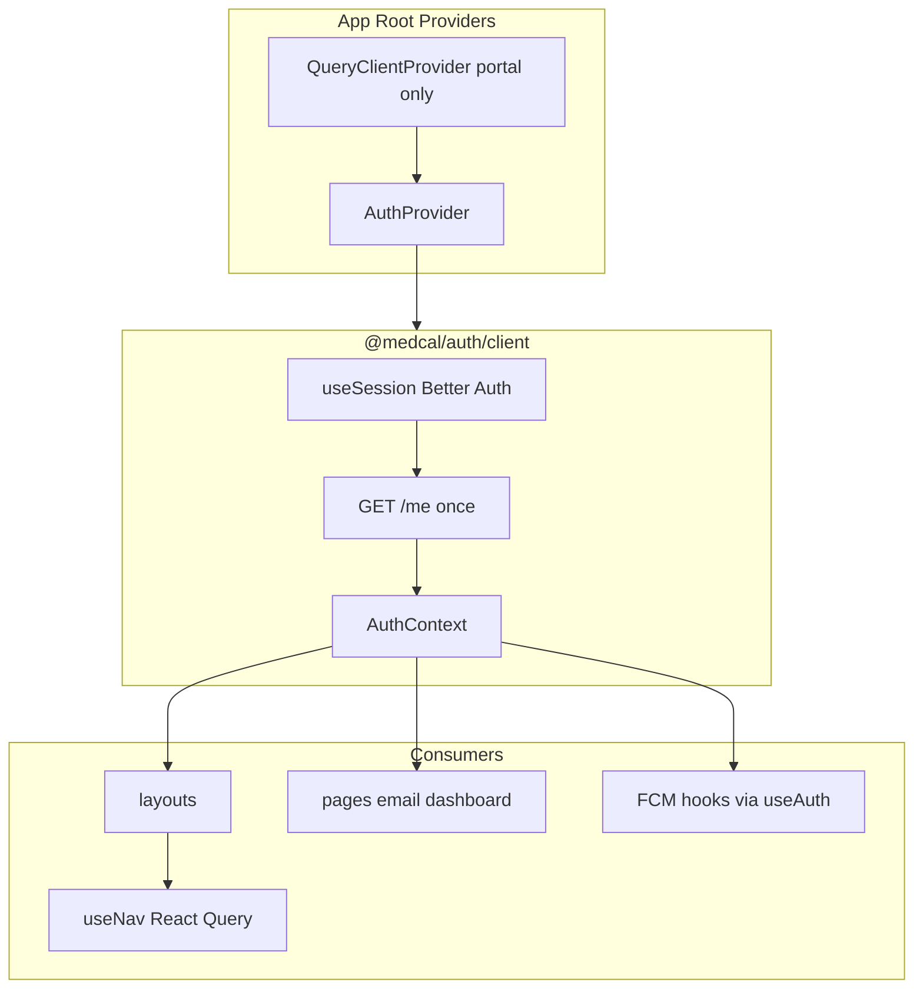

# Implementation Report: Global Auth & Authz State

**Tanggal:** 2026-08-23  
**Status:** Selesai  
**Referensi audit:** [Cursor Prompt — Audit Global Auth & Authz State.md](./Cursor%20Prompt%20—%20Audit%20Global%20Auth%20&%20Authz%20State.md)

---

## 1. Ringkasan

Implementasi global auth/authz state untuk medcal telah diselesaikan berdasarkan rekomendasi audit. Perubahan inti:

- **Satu bootstrap auth** (`GET /me` sekali per session) via `AuthProvider` di root setiap app
- **React Context** (bukan Zustand) — mengikuti pola provider existing, tanpa dependency baru
- **Shared package** `@medcal/auth/client` — hook dan type unified untuk portal + tech-pwa
- **Nav cache** via React Query di portal
- **FCM** tetap state lokal; hanya `user.id` diambil dari global auth selector

Enforcement keamanan tetap di backend (`CompanyRoleGuard` + `hasPermission`). Frontend global state hanya untuk UX/navigation.

---

## 2. Keputusan Arsitektur

| Keputusan | Pilihan | Alasan |
|---|---|---|
| State mechanism | React Context | Konsisten dengan `ManagementChatSocketProvider`; Zustand belum dipakai di codebase |
| Lokasi shared logic | `packages/auth` | Sudah menjadi home Better Auth client; diekspor via `@medcal/auth/client` |
| Session slice terpisah | Tidak | Better Auth owns cookie lifecycle; `bootstrapStatus` cukup untuk UX client |
| Nav state | React Query | Sudah ada `QueryClientProvider` di portal; hindari duplicate cache di Context |
| FCM state | Tetap lokal | Plan audit: jangan campur FCM dengan auth store |

---

## 3. File Baru

| File | Peran |
|---|---|
| [`packages/auth/src/me-types.ts`](../../../../packages/auth/src/me-types.ts) | Type `Me`, `MeCapabilities`, `MeMembership`, `MeUser`, `AuthBootstrapStatus` |
| [`packages/auth/src/auth-client.ts`](../../../../packages/auth/src/auth-client.ts) | Better Auth client instance (pisah dari provider untuk hindari circular import) |
| [`packages/auth/src/auth-provider.tsx`](../../../../packages/auth/src/auth-provider.tsx) | `AuthProvider` + hooks global |
| [`apps/tech-pwa/src/app/providers.tsx`](../../../../apps/tech-pwa/src/app/providers.tsx) | Root provider tech-pwa dengan auth redirect |

---

## 4. File Dihapus

| File | Digantikan oleh |
|---|---|
| `apps/portal/src/lib/use-require-session.ts` | `@medcal/auth/client` → `useRequireSession()` |
| `apps/tech-pwa/src/lib/use-require-session.ts` | `@medcal/auth/client` → `useRequireSession()` |

---

## 5. API Global State

Diekspor dari `@medcal/auth/client`:

### Provider

```ts
<AuthProvider onNeedsSignIn?: () => void>
```

- Subscribe `useSession()` Better Auth
- Fetch `GET /me` sekali saat session tersedia
- Set `bootstrapStatus`: `loading` | `ready` | `forbidden` | `pending`
- `onNeedsSignIn` opsional — dipakai app untuk redirect ke sign-in (dilewati di route publik)

### Hooks

| Hook | Return | Catatan |
|---|---|---|
| `useAuth()` | `{ bootstrapStatus, user, isAuthenticated, isAuthLoading }` | Auth slice |
| `useAuthz()` | `{ membership, capabilities }` | Authz slice |
| `useMe()` | `{ me, status }` | Gabungan payload `/me` |
| `useRequireSession()` | `{ me, status }` | Alias backward-compatible; **tidak fetch**, hanya baca context |

### Derived state (tidak disimpan)

- `isAuthenticated` = `bootstrapStatus === 'ready' && session != null`
- `isAuthLoading` = `isPending || bootstrapStatus === 'loading'`
- Capability gates (`showLeadShortcut`, dll.) = baca `capabilities.*` langsung

### Shape state (actual)

```ts
type AuthBootstrapStatus = "loading" | "ready" | "forbidden" | "pending";

type MeUser = { id: string; email: string; name: string };
type MeMembership = { role: MembershipRole; companyId: string };
type MeCapabilities = {
  leadRead: boolean;
  chatRead: boolean;
  emailRead: boolean;
  emailSend: boolean;
  emailDelete: boolean;
  emailManage: boolean;
};

type Me = {
  user: MeUser;
  membership: MeMembership;
  capabilities: MeCapabilities;
};
```

---

## 6. Integrasi per App

### Portal (`apps/portal`)

**Provider tree** — [`apps/portal/src/app/providers.tsx`](../../../../apps/portal/src/app/providers.tsx):

```
QueryClientProvider
  └── PortalAuthProvider (AuthProvider + redirect conditional)
        └── {children}
```

Redirect ke `/sign-in` hanya jika pathname **bukan** `/sign-in` atau `/sign-in/*`.

**Consumer yang dimigrasi** (import dari `@medcal/auth/client`):

| File | Hook |
|---|---|
| `app/management/layout.tsx` | `useRequireSession` |
| `app/client/layout.tsx` | `useRequireSession` |
| `app/management/page.tsx` | `useRequireSession` |
| `app/management/email/email-page-client.tsx` | `useRequireSession` |
| `app/management/email/[id]/page.tsx` | `useRequireSession` |
| `app/management/email/compose/compose-page-client.tsx` | `useRequireSession` |
| `components/management/header.tsx` | type `Me` |
| `components/management/management-shell.tsx` | type `Me` |
| `components/management/header-controls.tsx` | `useAuth` (FCM) |

**Nav** — [`apps/portal/src/lib/use-nav.ts`](../../../../apps/portal/src/lib/use-nav.ts):

- Dikonversi ke `useQuery({ queryKey: ['nav', application], enabled: ready })`
- Cache 15s via default `QueryClient` staleTime

### Tech PWA (`apps/tech-pwa`)

**Provider tree** — [`apps/tech-pwa/src/app/providers.tsx`](../../../../apps/tech-pwa/src/app/providers.tsx) + update [`layout.tsx`](../../../../apps/tech-pwa/src/app/layout.tsx).

**Home page** — [`apps/tech-pwa/src/app/page.tsx`](../../../../apps/tech-pwa/src/app/page.tsx):

- `useRequireSession()` untuk gate layout
- `useAuth()` untuk FCM (`user.id`, `isAuthenticated`)
- Status `pending` ditambahkan (parity dengan portal)

---

## 7. FCM Integration

FCM state **tidak** dimasukkan auth store.

| Komponen | Sebelum | Sesudah |
|---|---|---|
| Portal `PushNotificationsMenuItem` | `userId` via props dari header | `useAuth()` → `user?.id`, `isAuthenticated` |
| Tech PWA `PushNotificationsControl` | Props `authenticated`, `userId` | `useAuth()` internal |

Hook `usePushNotifications` tetap di app-level (`apps/portal/src/lib/fcm/`, `apps/tech-pwa/src/lib/fcm/`). Hanya input auth yang diwire ke global selector.

`receiveNotifications` **tidak** ditambahkan ke `/me` — dispatch eligibility tetap server-side.

---

## 8. Masalah yang Diselesaikan

| Masalah (audit) | Solusi |
|---|---|
| Fetch `/me` duplikat (layout + page) | Satu `AuthProvider` di root; consumer baca context |
| Hook `useRequireSession` duplikat portal/tech-pwa | Shared di `packages/auth` |
| Dua source of truth (`useSession` vs local `Me`) | `AuthProvider` orchestrate keduanya; expose unified hooks |
| Nav fetch tanpa cache lintas remount | React Query dengan key `['nav', application]` |
| Type `Me` berbeda antar app | Unified type dengan `capabilities` + status `pending` |

---

## 9. Yang Sengaja Tidak Diimplementasikan

Sesuai rekomendasi audit — **KEEP LOCAL / SERVER STATE**:

- Zustand / Redux
- Full permissions array di client global state
- `receiveNotifications` di global authz state
- FCM token / `PushNotificationStatus` di auth store
- SSR auth / middleware redirect
- Perubahan API `/me` atau schema database
- Helper client `can(resource, action)` generik

---

## 10. Perubahan Pendukung

| File | Perubahan |
|---|---|
| [`packages/auth/package.json`](../../../../packages/auth/package.json) | `peerDependencies.react`; devDep `react`, `@types/react` |
| [`packages/auth/tsconfig.json`](../../../../packages/auth/tsconfig.json) | `"jsx": "react-jsx"` |
| [`packages/shared/src/http/api-fetch.ts`](../../../../packages/shared/src/http/api-fetch.ts) | Perbaikan typing error response JSON (unblock auth package typecheck) |

---

## 11. Verifikasi

Perintah yang dijalankan saat implementasi:

```bash
pnpm --filter @medcal/auth typecheck    # pass
pnpm --filter @medcal/portal typecheck  # pass
pnpm --filter @medcal/tech-pwa typecheck # pass
pnpm --filter @medcal/portal test       # 14 tests pass
```

---

## 12. Alur Setelah Implementasi



---

## 13. Rekomendasi Lanjutan (Belum Dikerjakan)

1. **Invalidate nav query** setelah permission management save — `queryClient.invalidateQueries(['nav'])`
2. **Expose `receiveNotifications` di `/me`** jika UX ingin menampilkan status opt-in push ke user saat ini
3. **Consolidate `SignOutButton`** portal + tech-pwa ke shared component
4. **Tech PWA sign-in** — pre-subscribe `useSession()` seperti portal untuk robustness post-login
5. **Multi-company frontend** — jika deployment melampaui single `COMPANY_ID`, perlu redesign membership selection (NEEDS VERIFICATION dari audit)

---

## 14. Kesimpulan

> **GLOBAL AUTH STATE (implemented):** `bootstrapStatus`, `user`

> **GLOBAL AUTHZ STATE (implemented):** `membership`, `capabilities`

> **MECHANISM:** React Context via `AuthProvider` in `@medcal/auth/client`

> **SECURITY BOUNDARY:** Tetap `CompanyRoleGuard` + `hasPermission` di API — frontend global state hanya UX.
