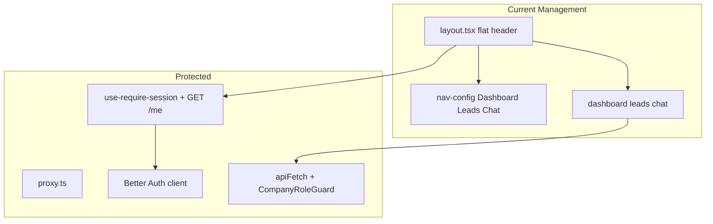

# MedCal Management Shell — Implementation Plan

**Status:** Implementation-ready plan (documentation only)  
**Date:** 2026-08-17  
**Phase:** SPECIFICATION → INSPECT CURRENT CODE → MAP FILES → PLAN → VERIFY  
**Coding:** Not authorized by this document alone — review this plan before writing application code  

**Scope:** MedCal **Management** shell only (`apps/portal` management surface via `apps.*` host)  
**Out of scope:** Customer/client portal (`app/client/**`), Better Auth redesign, `proxy.ts`, RBAC, API contracts, database, dependency installs, Zustand/TanStack Query migrations  

**Specification source:** [`medcal-target-shell.md`](./medcal-target-shell.md)  
**Codebase inspected:** `D:\medcal\apps\portal` (and related packages) as of this plan  

---

## Locked product decisions

| Topic | Decision |
|-------|----------|
| Email header control | **Disabled affordance** matching dashboard tile “Segera hadir” — no new email API |
| Contact Messages header | Reuse `GET /leads/needs-review` (same as Lead Inbox) |
| Web Chat header | Navigate to `/chat`; optional **activity** badge = count of `OPEN` sessions from `GET /chat-sessions` — **not** a new unread backend |
| Pin placement | **Beside logo inside sidebar** (spec), not in header (differs from Bumi Indah production) |
| State for shell UI | React `useState` + optional `localStorage` preference — **no Zustand** |
| Server data | Existing `apiFetch` / page hooks — **no TanStack Query** |
| Navigation v1 | Hard-coded Messages → Chat → Email — **no** `sys_menu` / permission-menu API |

---

# 1. Current Architecture

## 1.1 What exists today

| Area | Path / reality |
|------|----------------|
| Portal app | `D:\medcal\apps\portal` — Next.js 16, port 3003 |
| Host rewrite | `src/proxy.ts` — `apps.*` → `/management/...`, `portal.*` → `/client/...` |
| Management layout | `src/app/management/layout.tsx` — flat header only |
| Nav config | `src/app/management/nav-config.ts` — Dashboard `/`, Leads `/leads`, Chat `/chat` (role-filtered UX only) |
| Dashboard | `src/app/management/page.tsx` — tiles: Messages→`/leads`, Chat→`/chat`, Email disabled |
| Leads | `src/app/management/leads/page.tsx`, `leads/[id]/page.tsx` — Lead Inbox + Needs Review |
| Chat | `src/app/management/chat/page.tsx`, `chat/[sessionId]/page.tsx` — Chat Inbox (no unread tracking) |
| Session gate | `src/lib/use-require-session.ts` — `useSession()` + `apiFetch("/me")` |
| Sign out | `src/components/sign-out-button.tsx` — `signOut()` from `@medcal/auth/client` → `/sign-in` |
| Chat socket | `src/lib/use-chat-socket.ts` — Socket.IO with credentials |
| Data pattern | Page-local `useState` + `useEffect` + `apiFetch` |
| Zustand / TanStack Query | **Absent** |
| Header notifications | **Absent** (no bell UI in shell) |
| Sidebar | **Absent** |
| UI package | `@medcal/ui` exports only `cx()`; portal does not use a design-system component set |
| Portal Tailwind | `tailwind.config.js` has empty `theme.extend`; `brand-*` classes used in pages but **tokens not defined** in portal |
| Client portal | `src/app/client/**` — separate layout; **out of scope** |

## 1.2 Current management chrome (verbatim behavior)

`management/layout.tsx` today:

1. `useRequireSession()` → loading / forbidden / ready  
2. Filter `managementNav` by `me.membership.role`  
3. Render horizontal `<header>` with brand text, `<a>` nav links, email·role, `SignOutButton`  
4. Render `<main>{children}</main>`  

No collapse, pin, drawer, notification cluster, or avatar dropdown.

## 1.3 Existing notification-related data (reusable, not shell UI)

| Concern | Existing behavior | Location |
|---------|-------------------|----------|
| Contact / Needs Review | `GET /leads/needs-review` loaded alongside leads list | `management/leads/page.tsx` |
| Contact messages on lead | Lead detail statuses (`PENDING`, etc.) | `management/leads/[id]/page.tsx` |
| Chat sessions | `GET /chat-sessions` — list only; comment states no unread tracking | `management/chat/page.tsx` |
| Email channel | Dashboard tile disabled “Segera hadir” | `management/page.tsx` |

**Conclusion:** There is **no** existing header notification component to “preserve.” The shell must **reuse existing API/page data patterns**, not invent new backends.

## 1.4 Current architecture diagram



---

# 2. Target Architecture

## 2.1 Shell composition

Presentation layer only — wraps existing management pages without owning Lead/Chat business logic:

```text
ManagementLayout
  ├── useRequireSession (UNCHANGED)
  ├── loading / forbidden (UNCHANGED semantics)
  └── ManagementShell(me, nav, children)
        ├── Desktop: ManagementSidebar (logo + pin + SidebarNav)
        ├── Mobile: hamburger → MobileDrawer (same SidebarNav)
        ├── ManagementHeader
        │     ├── ContactMessages control
        │     ├── WebChat control
        │     ├── Email control (disabled)
        │     └── UserMenu → SignOutButton
        └── <main>{children}</main>
```

## 2.2 Desktop states

**Expanded (~248px sidebar)**

```text
┌────────────────┬───────────────────────────┐
│ Logo       📌  │ Header (Contact Chat Email User) │
│ Messages       ├───────────────────────────┤
│ Chat           │ Main Content              │
│ Email (dim)    │                           │
└────────────────┴───────────────────────────┘
```

**Collapsed (~72px)**

```text
┌──────┬────────────────────────────────────┐
│ Logo │ Header                             │
│  📌  ├────────────────────────────────────┤
│  💬  │ Main Content                       │
│  ◯   │                                    │
│  ✉   │                                    │
└──────┴────────────────────────────────────┘
```

## 2.3 Mobile (first-class)

```text
┌──────────────────────────────────┐
│ ☰   MedCal    Contact Chat Email 👤 │
├──────────────────────────────────┤
│ Main Content                     │
└──────────────────────────────────┘
☰ → drawer + overlay with same nav order
```

## 2.4 What stays the same

- Better Auth session cookies  
- `proxy.ts` dual-host rewrite  
- `GET /me` + role membership  
- Lead Inbox and Chat Inbox routes and APIs  
- Server-side RBAC  

---

# 3. File Change Map

## 3.1 Spec → codebase mapping (summary)

| Spec area | Existing file | Existing behavior | Reuse | Modify | New | Safe? | Risk |
|-----------|---------------|-------------------|-------|--------|-----|-------|------|
| Session gate | `use-require-session.ts` | Session + `/me` | Yes | No | — | Yes | — |
| Layout chrome | `management/layout.tsx` | Flat header | Gate only | Yes — swap chrome for shell | Shell comps | Yes | Low |
| Nav | `nav-config.ts` | Dashboard/Leads/Chat | Role filter pattern | Yes — Messages/Chat/Email | — | Yes | Low |
| Sign out | `sign-out-button.tsx` | Better Auth `signOut` | Yes | ClassName only | UserMenu wraps it | Yes | Low |
| Contact notify | leads `needs-review` fetch | Page-only | API + pattern | — | Header control | Yes | Medium |
| Chat notify | `/chat-sessions` | List, no unread | API | — | Header control | Yes | Medium |
| Email notify | Dashboard disabled tile | Disabled UX | Semantics | — | Disabled header ctrl | Yes | Low |
| Sidebar / pin / drawer | — | None | BI interaction ideas only | — | New components | Yes | Low |
| Tokens | `tailwind.config.js`, `globals.css` | Bare | Copy brand from `apps/web` | Yes | — | Yes | Low |
| Auth / proxy / RBAC | packages + `proxy.ts` | Protected | Continue import client | **No** | — | — | High if touched |

## 3.2 MODIFY

| Path | Current responsibility | Proposed change | Reason | Risk |
|------|------------------------|-----------------|--------|------|
| `apps/portal/src/app/management/layout.tsx` | Session gate + flat header chrome | Keep gate + loading/forbidden; render `ManagementShell` instead of inline header | Single entry for shell | Low |
| `apps/portal/src/app/management/nav-config.ts` | Dashboard / Leads / Chat | Hard-coded v1: Messages `/leads`, Chat `/chat`, Email disabled; extend type (`iconKey`, `disabled`, optional `children`) | Spec nav order | Low |
| `apps/portal/src/app/management/page.tsx` | Channel selector tiles | Light visual polish only; **keep** Messages/Chat/Email semantics and Lead≠Chat split | Spec §22 | Low |
| `apps/portal/src/components/sign-out-button.tsx` | Standalone Sign out control | Reuse inside `UserMenu`; optional style props/`className` only — **same** `signOut()` flow | Spec §17 | Low |
| `apps/portal/tailwind.config.js` | Empty extend | Add `brand` (from `apps/web`), canvas/sidebar-related tokens as needed | Fix undefined `brand-*`; BI-like density | Low |
| `apps/portal/src/app/globals.css` | Tailwind layers only | Shell CSS variables (sidebar widths, canvas `#EEF1F9`, radius) | Visual baseline | Low |
| `apps/portal/src/app/management/leads/page.tsx` | Lead Inbox | Optional padding trim if shell already pads — **no behavior change** | Avoid double padding | Low |
| `apps/portal/src/app/management/chat/page.tsx` | Chat Inbox | Same optional padding trim | Density | Low |
| `apps/portal/src/app/management/chat/[sessionId]/page.tsx` | Thread | Same optional padding trim | Density | Low |
| `apps/portal/src/app/management/leads/[id]/page.tsx` | Lead detail | Same optional padding trim | Density | Low |

## 3.3 CREATE

| Path | Responsibility | Risk |
|------|----------------|------|
| `apps/portal/src/components/management/management-shell.tsx` | Compose sidebar/drawer/header/main; mobile open state; content offset for collapsed width | Low |
| `apps/portal/src/components/management/sidebar.tsx` | Desktop rail; logo + pin row; hosts nav | Low |
| `apps/portal/src/components/management/sidebar-nav.tsx` | Render hard-coded nav; active/hover/focus/disabled | Low |
| `apps/portal/src/components/management/mobile-drawer.tsx` | Off-canvas nav + overlay; Escape / backdrop close | Low |
| `apps/portal/src/components/management/header.tsx` | Sticky header; hamburger (`lg` hidden); notification cluster; user menu | Low |
| `apps/portal/src/components/management/notifications.tsx` | Contact → Chat → Email controls; reuse APIs | Medium |
| `apps/portal/src/components/management/user-menu.tsx` | Avatar dropdown; identity from `me`; embeds `SignOutButton` | Low |
| `apps/portal/src/components/management/shell-state.ts` | Read/write `medcal.management.sidebarCollapsed`; helpers — **no Zustand** | Low |
| `apps/portal/src/components/management/icons.tsx` | Inline SVG icons (menu, pin, messages, chat, email, user) — **no new deps** | Low |

Optional later (not required for v1 shell): `apps/portal/public/` logo asset if not already present.

## 3.4 DO NOT TOUCH

| Path / surface | Why |
|----------------|-----|
| `apps/portal/src/proxy.ts` | Locked dual-host Option A |
| `packages/auth/src/index.ts` | Better Auth server config |
| `packages/auth/src/client.ts` | Import only; do not change contract |
| `packages/auth/src/access-control.ts` | RBAC catalog |
| `apps/portal/src/lib/use-require-session.ts` | Session gate contract |
| `packages/shared/src/http/api-fetch.ts` | Credentials / base URL contract |
| `apps/api/**` (guards, leads, chat, whitelist, me) | Server enforcement & domain APIs |
| `apps/portal/src/lib/use-chat-socket.ts` identity rules | Chat security |
| `apps/portal/src/app/client/**` | Out of scope |
| `apps/portal/package.json` dependencies | No Zustand, RQ, Radix, lucide installs for this shell |
| Lead/Chat **business** logic inside pages | Preserve domain behavior |

---

# 4. Component Plan

Create only what the empty shell requires. Do not mirror Bumi Indah’s full `components/partials` tree.

| Component | Responsibility | Notes |
|-----------|----------------|-------|
| `ManagementShell` | Owns `mobileOpen` state; wires sidebar / drawer / header / main; applies left offset for desktop collapsed/expanded | Receives `me`, filtered `nav`, `children` |
| `ManagementSidebar` | Desktop-only (`lg+`); logo link to `/`; pin control beside logo; hosts `SidebarNav` | Widths ~248 / ~72 |
| `SidebarNav` | Maps `managementNav`; `Link` + active via `usePathname`; disabled Email item | Future: optional nested `children` unused in v1 |
| `MobileDrawer` | Same nav; overlay; close on navigate / Escape / backdrop | Not a collapsed desktop rail |
| `ManagementHeader` | Sticky; hamburger on `<lg`; right cluster notifications + user | **No** pin in header |
| `NotificationControls` | Exact order: Contact Messages → Web Chat → Email | See §7 |
| `UserMenu` | Avatar + dropdown (not drawer); name, email, role from `me` | Embeds existing `SignOutButton` |
| Icons module | Inline SVG | Avoid dependency installs |

**Explicitly not created:** theme customizer, multi-layout switcher, FCM manager, company switcher, DashTail starter-kit clones.

---

# 5. State Plan

| State | Where it lives | Persistence | Notes |
|-------|----------------|-------------|-------|
| Session / `me` | Existing `useRequireSession` | Better Auth cookies | Do not duplicate |
| Sidebar collapsed | `useState` hydrated from `shell-state.ts` | `localStorage` key `medcal.management.sidebarCollapsed` | Preference only — not auth |
| Mobile drawer open | `useState` in `ManagementShell` | Memory | Reset on route change recommended |
| Notification popover open | Local `useState` per control | Memory | Click-outside / Escape |
| User menu open | Local `useState` in `UserMenu` | Memory | Dropdown, not drawer |
| Needs-review count | Local state in Contact control via `apiFetch("/leads/needs-review")` | Server | Same endpoint as leads page |
| Chat activity count | Local state via `apiFetch("/chat-sessions")` → filter `status === "OPEN"` | Server | Not “unread” |
| Page list/detail data | Existing page hooks | Unchanged | Do not lift into shell |

**Forbidden for shell v1:** Zustand platform, TanStack Query migration, sessionStorage auth tokens, second session store.

---

# 6. Navigation Plan

## 6.1 Hard-coded v1 order

Update `nav-config.ts` to:

```text
1. Messages  → href "/leads"   roles: SUPERADMIN, ADMIN  (same as current Leads)
2. Chat      → href "/chat"    roles: SUPERADMIN, ADMIN
3. Email     → disabled        visible; not navigable; label/tooltip “Segera hadir”
```

- **Remove** “Dashboard” and “Leads” labels from the sidebar.  
- **Dashboard landing** remains at `/` via **logo / brand** click (not a sidebar item).  
- Role filtering remains **UX only**; `CompanyRoleGuard` remains enforcement.

## 6.2 Active route matching

| Pathname | Active item |
|----------|-------------|
| `/` | None (or logo only) |
| `/leads`, `/leads/[id]` | Messages |
| `/chat`, `/chat/[id]` | Chat |
| Email | Never “active” via navigation |

Use `usePathname()`; prefer `Link` over raw `<a>` for client navigation.

## 6.3 Future nested capability

Extend `NavItem` with optional `children?: NavItem[]` (or equivalent) **without** rendering nested menus in v1. Do not invent hierarchy for its own sake.

## 6.4 Non-goals

- No `sys_menu`  
- No permission-menu API  
- No dynamic menu fetching  

---

# 7. Notification Plan

## 7.1 Reality check

There is **no** existing management header notification UI. “Preserve functionality” means **reuse existing data endpoints and product semantics**, not preserve a missing component.

## 7.2 Controls (exact order)

| # | Control | Data reuse | Interaction | Loading / empty / error |
|---|---------|------------|-------------|-------------------------|
| 1 | Contact Messages | `GET /leads/needs-review` | Badge = array length; primary action → `/leads`; optional compact popover summarizing count | Show loading; empty = no badge / “Tidak ada yang perlu ditinjau”; error = non-blocking message |
| 2 | Web Chat | `GET /chat-sessions` | Navigate to `/chat`; badge = OPEN session count labeled as **activity**, not unread | Same pattern; if fetch fails, icon still navigates |
| 3 | Email | None (product not ready) | **Disabled** control; `aria-disabled`; accessible name includes “Segera hadir” | No fetch |

## 7.3 What not to do

- Do not create email/notification APIs  
- Do not add FCM  
- Do not invent unread fields on chat sessions  
- Do not merge Contact Messages into Chat or vice versa  
- Do not move authorization into the client  

## 7.4 Fetch cadence

Default: fetch on mount of header controls (when user has role access). Optional: refetch when opening a popover. Avoid heavy polling unless product later requires it (leads page does not poll needs-review today).

---

# 8. Authentication / Logout Plan

## 8.1 Unchanged flow

```text
Avatar → User dropdown → Sign Out
  → existing SignOutButton
  → signOut() from @medcal/auth/client
  → router.push("/sign-in")
  → router.refresh()
```

## 8.2 Rules

- Do not add a second logout endpoint  
- Do not manually clear Better Auth cookies  
- Do not introduce another session store  
- Do not change `proxy.ts` or `use-require-session`  
- Sidebar `localStorage` preference may survive logout (harmless UI preference)  

## 8.3 Identity display

Use `me` from `useRequireSession` already loaded in layout:

- `me.user.name`  
- `me.user.email`  
- `me.membership.role`  

Do not re-fetch `/me` solely for the dropdown unless layout does not pass `me` down.

---

# 9. Responsive Plan

Mobile is a **first-class acceptance criterion**, not final polish.

| Viewport | Sidebar | Header | Notes |
|----------|---------|--------|-------|
| `lg+` (≥1024px) | Persistent expanded/collapsed; pin visible | No hamburger; notifications + user | Content `margin-left` tracks width |
| `< lg` (tablet + mobile) | Hidden; drawer on demand | Hamburger + notifications + user | Overlay dims content |
| Landscape mobile | Same drawer pattern | Keep controls tappable | Avoid horizontal overflow |

## 9.1 Drawer behavior

- Open: hamburger  
- Close: backdrop, Escape, nav item click, optional close button  
- Same nav order as desktop  
- Active item visible  
- Focus management: move focus into drawer on open; restore on close  

## 9.2 Overflow / layout constraints

- Shell root: `overflow-x-hidden` (or equivalent)  
- Main: `min-w-0` so tables don’t blow the grid  
- Existing tables may keep internal `overflow-x-auto`  
- User dropdown must fit viewport (right-align; flip if needed)  
- Notification hit targets ≥ accessible size on touch  

## 9.3 Pin / collapse on mobile

Pin/collapse applies to **desktop rail only**. Mobile uses drawer; do not force collapsed 72px rail as the mobile pattern.

---

# 10. Visual Implementation Plan

## 10.1 Priority

1. MedCal product/security semantics  
2. Bumi Indah admin density / shell language  
3. DashTail as secondary inspiration only  

## 10.2 Tokens

Define in portal Tailwind / CSS (align brand with `apps/web` PKM blue scale):

- App canvas ≈ `#EEF1F9`  
- White sidebar + sticky header surfaces  
- `brand.*` primary actions / active nav  
- Radius ≈ `0.5rem`  
- Subtle borders (`slate-200`); restrained shadows  
- Compact nav typography (`text-sm` / `text-xs`)  

## 10.3 Avoid

- DashTail violet default theme  
- Multi-theme packs / customizer  
- Decorative KPI walls  
- Blind Inter mandate if MedCal brand specifies otherwise — `antialiased` system stack is acceptable for shell v1  

## 10.4 Content area

Shell provides consistent padding (`px-4 md:px-6 py-4`). Pages keep their internal structure; optional trim of duplicate outer padding after shell lands.

---

# 11. Protected Architecture

The shell is a **presentation layer**. The following must remain unchanged during implementation:

| Asset | Path / surface |
|-------|----------------|
| Dual-host proxy | `apps/portal/src/proxy.ts` |
| Better Auth server | `packages/auth/src/index.ts` |
| Auth client | `@medcal/auth/client` usage pattern |
| Session UX gate | `apps/portal/src/lib/use-require-session.ts` |
| `GET /me` contract | `apps/api` me module |
| `apiFetch` + credentials | `packages/shared/src/http/api-fetch.ts` |
| Permission catalog | `packages/auth/src/access-control.ts` |
| API RBAC | `CompanyRoleGuard` + `@RequirePermission` |
| Tenant isolation | Server `COMPANY_ID` / membership — never trust client company headers |
| Registration whitelist | API registration gate |
| Chat identity | Socket auth / gateway rules; `use-chat-socket.ts` payload rules |
| Lead ≠ Chat domain split | Dashboard + inbox semantics |
| Client portal | `apps/portal/src/app/client/**` |

**Explicit confirmation:** The Management Shell can be implemented **without modifying** any of the above. Only portal presentation files listed in §3.2–§3.3 need to change.

---

# 12. Implementation Sequence

Safe order. Each step is portal UI only.

### Step 1 — Design tokens

- **Files:** `tailwind.config.js`, `globals.css`  
- **Change:** Add `brand` colors (from `apps/web`), canvas, sidebar width CSS variables  
- **Verify:** Existing `brand-*` classes in chat/leads resolve; no dependency changes  

### Step 2 — Navigation config

- **Files:** `nav-config.ts`  
- **Change:** Messages / Chat / Email shape + roles + `disabled`  
- **Verify:** Typecheck; role filter still UX-only  

### Step 3 — Shell state + icons

- **Files:** `shell-state.ts`, `icons.tsx`  
- **Change:** localStorage helpers; inline SVGs  
- **Verify:** No new packages in `package.json`  

### Step 4 — Desktop sidebar

- **Files:** `sidebar.tsx`, `sidebar-nav.tsx`  
- **Change:** Expanded/collapsed, pin beside logo, active/hover/focus  
- **Verify:** Desktop layout widths; logo → `/`  

### Step 5 — Mobile drawer

- **Files:** `mobile-drawer.tsx`  
- **Change:** Overlay, open/close, same nav  
- **Verify:** Tablet/mobile drawer; Escape/backdrop  

### Step 6 — Header + user menu

- **Files:** `header.tsx`, `user-menu.tsx`, minor `sign-out-button.tsx` styles  
- **Change:** Sticky header; avatar dropdown; existing sign-out  
- **Verify:** Sign out still hits Better Auth and `/sign-in`  

### Step 7 — Notifications

- **Files:** `notifications.tsx`  
- **Change:** Contact / Chat / Email wiring per §7  
- **Verify:** Badges; Email disabled; no API/server file changes  

### Step 8 — Shell composition + layout swap

- **Files:** `management-shell.tsx`, `management/layout.tsx`  
- **Change:** Replace flat header; keep session gate  
- **Verify:** All management routes render inside shell  

### Step 9 — Dashboard visual polish

- **Files:** `management/page.tsx`  
- **Change:** Presentation only; preserve channel split  
- **Verify:** Messages→leads, Chat→chat, Email disabled  

### Step 10 — Responsive + overflow pass

- **Files:** shell components as needed  
- **Change:** `min-w-0`, overflow, touch targets  
- **Verify:** §13 mobile criteria  

### Step 11 — Regression

- **Files:** none required if green  
- **Verify:** Leads Needs Review flow; Chat thread + socket; forbidden; refresh session; client portal untouched  

---

# 13. Verification / Acceptance Criteria

## 13.1 Auth & session

- [ ] Sign-in with Better Auth still works  
- [ ] Authenticated user sees Management Shell  
- [ ] Unauthenticated redirect to `/sign-in` unchanged  
- [ ] Forbidden state still shown when `/me` fails non-401  
- [ ] Refresh keeps session (cookies)  

## 13.2 Sidebar (desktop)

- [ ] Expanded width approximately 248px  
- [ ] Collapsed width approximately 72px  
- [ ] Pin control beside logo (not in header)  
- [ ] Collapse preference survives refresh (`localStorage`)  
- [ ] Hover does not fight deliberate collapsed state (no surprise auto-expand unless explicitly designed)  
- [ ] Main content expands when sidebar collapses  

## 13.3 Navigation

- [ ] Order: Messages → Chat → Email  
- [ ] Messages → `/leads`  
- [ ] Chat → `/chat`  
- [ ] Email not navigable / disabled  
- [ ] Active state on `/leads/*` and `/chat/*`  
- [ ] Hover and focus visible  
- [ ] Logo → `/` dashboard  

## 13.4 Notifications

- [ ] Order: Contact Messages → Web Chat → Email  
- [ ] Contact badge reflects needs-review length; navigates to `/leads`  
- [ ] Chat control navigates to `/chat`; OPEN activity badge without claiming unread API  
- [ ] Email control disabled and accessible  

## 13.5 User menu & sign-out

- [ ] Avatar opens **dropdown** (not drawer)  
- [ ] Shows name, email, role from `me`  
- [ ] Sign out uses existing `signOut()` → `/sign-in`  

## 13.6 Mobile / responsive

- [ ] Hamburger opens drawer  
- [ ] Overlay + Escape close drawer  
- [ ] Same nav order and active states in drawer  
- [ ] Notifications and user menu remain usable  
- [ ] No horizontal page overflow on phone/tablet  
- [ ] Dropdowns fit viewport  

## 13.7 Protected / regression

- [ ] `proxy.ts` unchanged  
- [ ] Auth packages unchanged  
- [ ] Lead Inbox behavior unchanged  
- [ ] Chat Inbox / thread / socket behavior unchanged  
- [ ] `app/client/**` unchanged  
- [ ] No new dependencies added for shell  

---

# 14. Risks / Open Questions

1. **Email “functional” vs reality** — Locked as disabled affordance matching dashboard. Reopen only when an email API exists.  
2. **Chat badge semantics** — OPEN count ≠ unread; UI copy must not say “unread” until the API supports it.  
3. **Logo asset** — Confirm which MedCal/BIP file to place under `apps/portal/public` (no DashTail branding).  
4. **Recon file on disk** — `ui-ux-recon-bumiindah-dashtail-jobs.md` was missing at planning time; this plan is self-contained from live code inspection + `medcal-target-shell.md`.  
5. **Double padding** — After shell lands, leads/chat pages may need padding-only trims.  
6. **Popover vs navigate-only** — Contact control may be icon→`/leads` first; popover is optional enhancement using the same fetch.  

---

## Final principle

> Build the MedCal Management Shell **on top of** the existing architecture — do not rebuild authentication, proxying, RBAC, or domain APIs to obtain the shell.

**Next phase after plan review:** coding per §12 sequence.  
**This document does not authorize coding by itself** if stakeholders still require explicit go-ahead.
