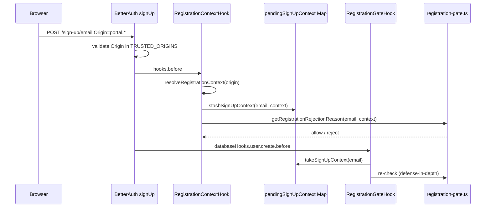

# Laporan Implementasi: Memisahkan Aturan Registrasi Staff dan Customer Portal

**Tanggal:** 24 Agustus 2026  
**Repositori:** `d:\medcal`  
**Basis:** [Prompt Cursor — Memisahkan Aturan Registrasi Staff dan Customer Portal](./Prompt%20Cursor%20—%20Memisahkan%20Aturan%20Registrasi%20Staff%20dan%20Customer%20Portal.md)

---

## 1. Ringkasan Eksekutif

Implementasi selesai. Sistem registrasi sekarang membedakan **Internal Staff** dan **Customer Portal** berdasarkan **Origin header** yang sudah divalidasi Better Auth terhadap `TRUSTED_ORIGINS`, bukan hanya domain email secara global.

Hasil utama:

- **`INTERNAL_STAFF`** (`apps.*`): hanya `@kalibrasimedika.co.id` + `EmailWhitelist` ACTIVE; domain lain ditolak saat sign-up.
- **`CUSTOMER_PORTAL`** (`portal.*`): semua domain email valid diizinkan; whitelist **tidak** dipakai.
- Origin tidak dikenali / missing → **`REGISTRATION_ORIGIN_NOT_ALLOWED`** (fail-closed).
- `EmailWhitelist` tetap hanya pre-authorization staff; tidak memblokir customer portal.
- Guard role pasca-registrasi (`INTERNAL_STAFF_DOMAIN_REQUIRED`) tetap sebagai defense-in-depth.

---

## 2. Masalah Sebelum Implementasi

Gate G4 lama di [`registration-gate.ts`](../../../apps/api/src/modules/whitelist/registration-gate.ts) menerapkan aturan **hanya dari domain email**, tanpa konteks aplikasi:

| Skenario | Perilaku lama | Requirement bisnis |
|----------|---------------|-------------------|
| Staff `@kalibrasimedika.co.id` tanpa whitelist | REJECT | REJECT (benar) |
| Staff `staff@gmail.com` sign-up | **ALLOW** | **REJECT** saat registrasi internal |
| Customer `customer@gmail.com` | ALLOW | ALLOW (benar) |
| Customer `user@kalibrasimedika.co.id` | **REJECT** (butuh whitelist) | **ALLOW** via customer portal |

Gap: satu endpoint Better Auth (`POST /api/auth/sign-up/email`), satu halaman register, tidak ada discriminator server-trusted.

---

## 3. Desain yang Diimplementasikan

### 3.1 Discriminator: Origin → Registration Context

| Origin | Context |
|--------|---------|
| `https://apps.kalibrasimedika.co.id`, `http://apps.localhost:*` | `INTERNAL_STAFF` |
| `https://portal.kalibrasimedika.co.id`, `http://portal.localhost:*` | `CUSTOMER_PORTAL` |
| `http://localhost:3003` (dev) | `DEV_DEFAULT_HOST_GROUP` (`management` → staff, `client` → customer) |
| Origin lain / missing (`technician.*`, marketing site, port dev lain) | **REJECT** |

Implementasi: [`packages/shared/src/utils/registration-context.ts`](../../../packages/shared/src/utils/registration-context.ts) — fungsi `resolveRegistrationContext()`.

**Alasan memilih Origin:**

- Selaras dengan arsitektur terkunci **Option A** di [`apps/portal/src/proxy.ts`](../../../apps/portal/src/proxy.ts) (`apps.*` vs `portal.*`).
- Better Auth sudah menolak Origin di luar `TRUSTED_ORIGINS` sebelum sign-up diproses.
- Tidak memakai field body / hidden input yang bisa dimanipulasi user.

### 3.2 Aturan Enforcement per Context

```text
INTERNAL_STAFF:
  domain != kalibrasimedika.co.id  → REJECT (REGISTRATION_INVALID_DOMAIN)
  domain = kalibrasimedika.co.id   → require EmailWhitelist ACTIVE
                                     → else REJECT (REGISTRATION_NOT_WHITELISTED)

CUSTOMER_PORTAL:
  any valid email domain           → ALLOW (skip whitelist)
```

### 3.3 Alur Runtime



**Catatan teknis:** AsyncLocalStorage awalnya direncanakan, tetapi Better Auth `runWithTransaction` memutus propagasi ALS. Solusi final: **stash context per email** di [`registration-context.store.ts`](../../../apps/api/src/modules/whitelist/registration-context.store.ts), dibaca ulang di `@BeforeCreate("user")`.

---

## 4. File yang Dibuat

| File | Deskripsi |
|------|-----------|
| [`packages/shared/src/utils/registration-context.ts`](../../../packages/shared/src/utils/registration-context.ts) | Type `RegistrationContext`, `resolveRegistrationContext()` |
| [`packages/shared/src/utils/registration-context.test.ts`](../../../packages/shared/src/utils/registration-context.test.ts) | Unit test resolver Origin → context |
| [`apps/api/src/modules/whitelist/registration-context.store.ts`](../../../apps/api/src/modules/whitelist/registration-context.store.ts) | Stash/take context per email (survive transaction) |
| [`apps/api/src/modules/whitelist/registration-context.hook.ts`](../../../apps/api/src/modules/whitelist/registration-context.hook.ts) | `@BeforeHook()` — resolve Origin + validasi email |

---

## 5. File yang Diubah

| File | Perubahan |
|------|-----------|
| [`packages/shared/src/utils/index.ts`](../../../packages/shared/src/utils/index.ts) | Re-export registration context utils |
| [`packages/auth/src/index.ts`](../../../packages/auth/src/index.ts) | Tambah `hooks: {}` (wajib agar `@BeforeHook` ter-wire) |
| [`apps/api/src/modules/whitelist/registration-gate.ts`](../../../apps/api/src/modules/whitelist/registration-gate.ts) | Context-aware: `isRegistrationAllowed(email, context)` |
| [`apps/api/src/modules/whitelist/registration-gate.hook.ts`](../../../apps/api/src/modules/whitelist/registration-gate.hook.ts) | Baca stashed context; error `REGISTRATION_ORIGIN_NOT_ALLOWED` |
| [`apps/api/src/modules/whitelist/whitelist.module.ts`](../../../apps/api/src/modules/whitelist/whitelist.module.ts) | Register `RegistrationContextHook` |
| [`apps/api/src/modules/whitelist/registration-gate.integration.test.ts`](../../../apps/api/src/modules/whitelist/registration-gate.integration.test.ts) | Test matrix lengkap + Origin header |
| [`apps/api/src/bootstrap-superadmin.ts`](../../../apps/api/src/bootstrap-superadmin.ts) | Pass `Origin: http://apps.localhost:3003` pada `signUpEmail` |
| [`apps/api/src/modules/chat/chat.gateway.security.test.ts`](../../../apps/api/src/modules/chat/chat.gateway.security.test.ts) | Pass staff Origin pada helper sign-up |
| [`apps/api/src/modules/chat/chat-socket-auth.precedence.test.ts`](../../../apps/api/src/modules/chat/chat-socket-auth.precedence.test.ts) | Pass staff Origin pada helper sign-up |
| [`apps/portal/src/app/sign-in/register/page.tsx`](../../../apps/portal/src/app/sign-in/register/page.tsx) | Copy berbeda per hostname (`portal.*` vs lainnya) |

### Tidak diubah (sengaja)

| File | Alasan |
|------|--------|
| [`apps/api/src/modules/users/users.service.ts`](../../../apps/api/src/modules/users/users.service.ts) | Guard `INTERNAL_STAFF_DOMAIN_REQUIRED` tetap defense-in-depth |
| [`apps/api/src/modules/whitelist/whitelist.service.ts`](../../../apps/api/src/modules/whitelist/whitelist.service.ts) | Whitelist admin tetap company-domain only |
| Endpoint Better Auth | Tetap satu path `/api/auth/sign-up/email` |

---

## 6. Kode Error Registrasi

| Code | Kapan |
|------|-------|
| `REGISTRATION_ORIGIN_NOT_ALLOWED` | Origin missing, tidak dikenali, atau stash context hilang |
| `REGISTRATION_INVALID_DOMAIN` | Staff sign-up dengan domain non-perusahaan |
| `REGISTRATION_NOT_WHITELISTED` | Staff sign-up company domain tanpa whitelist ACTIVE |

Field body seperti `registrationContext` **diabaikan** — context hanya dari Origin server-side.

---

## 7. Analisis Keamanan

| Edge case | Mitigasi |
|-----------|----------|
| Staff bypass via customer portal (gmail dari `portal.*`) | Sign-up lolos; tidak bisa dapat role internal (`INTERNAL_STAFF_DOMAIN_REQUIRED` saat assign membership) |
| Customer pakai `@kalibrasimedika.co.id` | ALLOW dari `portal.*` tanpa whitelist — sesuai requirement |
| Manipulasi body `context` | Tidak dipakai |
| Direct API call spoof Origin | Origin bukan secret; curl bisa set `Origin: portal.*`. Residual risk diterima; mitigasi: role guards + whitelist staff |
| Hostname reliability (prod) | `apps.*` vs `portal.*` DNS terpisah + `TRUSTED_ORIGINS` |
| Bootstrap / test tanpa Origin | Wajib pass header Origin; tidak ada silent bypass |
| EmailWhitelist | Tetap layer authorization staff only |

---

## 8. Test Matrix — Hasil

| Context | Origin (test) | Email | Expected | Status |
|---------|---------------|-------|----------|--------|
| Internal Staff | `http://apps.localhost:3003` | `@kalibrasimedika.co.id` + whitelist | ALLOW | PASS |
| Internal Staff | `http://apps.localhost:3003` | `staff@gmail.com` | `REGISTRATION_INVALID_DOMAIN` | PASS |
| Internal Staff | `http://apps.localhost:3003` | `@othercompany.com` | `REGISTRATION_INVALID_DOMAIN` | PASS |
| Internal Staff | `http://apps.localhost:3003` | company domain, no whitelist | `REGISTRATION_NOT_WHITELISTED` | PASS |
| Customer Portal | `http://portal.localhost:3003` | `customer@gmail.com` | ALLOW | PASS |
| Customer Portal | `http://portal.localhost:3003` | `@othercompany.com` | ALLOW | PASS |
| Customer Portal | `http://portal.localhost:3003` | `@kalibrasimedika.co.id` (no whitelist) | ALLOW | PASS |
| Unknown origin | `https://kalibrasimedika.co.id` | any | `REGISTRATION_ORIGIN_NOT_ALLOWED` | PASS |
| Missing origin | (no header) | any | `REGISTRATION_ORIGIN_NOT_ALLOWED` | PASS |
| Spoof body | staff Origin + `registrationContext` di body | gmail | `REGISTRATION_INVALID_DOMAIN` (body diabaikan) | PASS |

**Hasil test otomatis:**

| Suite | Hasil |
|-------|-------|
| `@medcal/shared` (termasuk `registration-context.test.ts`) | 26 passed |
| `registration-gate.integration.test.ts` | 25 passed |
| Typecheck (`shared`, `api`, `auth`) | OK |

---

## 9. Verifikasi Manual

1. **Staff:** buka `http://apps.localhost:3003/sign-in/register`
   - Coba gmail → harus ditolak (`REGISTRATION_INVALID_DOMAIN`)
   - Coba `@kalibrasimedika.co.id` tanpa whitelist → ditolak (`REGISTRATION_NOT_WHITELISTED`)
   - Coba `@kalibrasimedika.co.id` yang sudah di-whitelist → sukses

2. **Customer:** buka `http://portal.localhost:3003/sign-in/register`
   - Coba gmail → sukses
   - Coba `@kalibrasimedika.co.id` tanpa whitelist → sukses

3. UI register page menampilkan hint berbeda:
   - `apps.*` → pesan domain perusahaan + pre-approval
   - `portal.*` → pesan email bebas

---

## 10. Out of Scope / Follow-up

| Item | Status |
|------|--------|
| Email change / account linking | **Belum** — hanya sign-up v1 |
| Invite token signed untuk staff-only registration | Future hardening (mitigasi spoof Origin) |
| Endpoint registrasi terpisah | Tidak diperlukan — arsitektur existing dipertahankan |
| Auto-assignment membership saat sign-up | Tetap tidak ada (G1) |

---

## 11. Kesimpulan

Requirement bisnis terpenuhi:

- Staff internal: domain perusahaan wajib + whitelist, enforced server-side berdasarkan Origin `apps.*`.
- Customer portal: domain bebas, termasuk company email, enforced server-side berdasarkan Origin `portal.*`.
- Tidak ada global `endsWith("@kalibrasimedika.co.id")` yang memblokir customer portal.
- Arsitektur Better Auth + EmailWhitelist + role guards existing dipertahankan dengan perubahan minimal dan terfokus.
